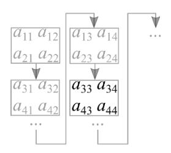
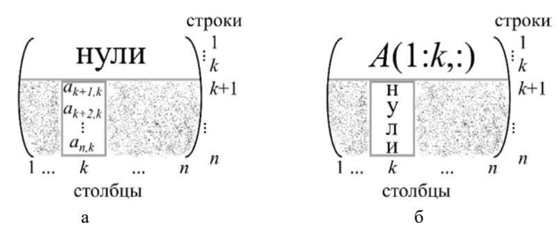
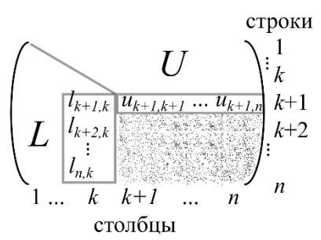
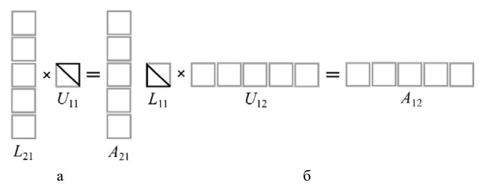
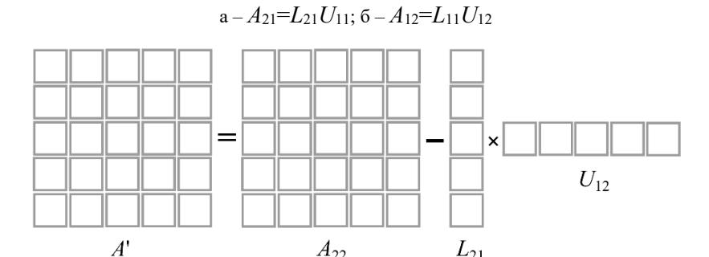
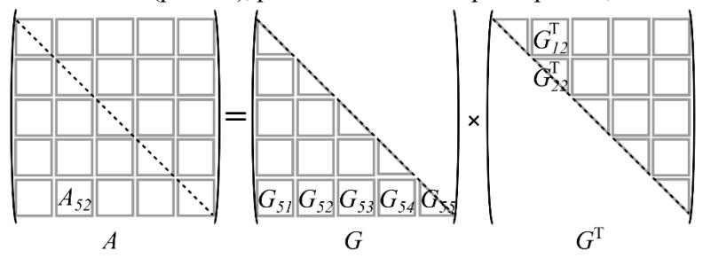

#### МИНИСТЕРСТВО НАУКИ И ВЫСШЕГО ОБРАЗОВАНИЯ РОССИЙСКОЙ ФЕДЕРАЦИИ

ФЕДЕРАЛЬНОЕ ГОСУДАРСТВЕННОЕ АВТОНОМНОЕ ОБРАЗОВАТЕЛЬНОЕ УЧРЕЖДЕНИЕ ВЫСШЕГО ОБРАЗОВАНИЯ «САМАРСКИЙ НАЦИОНАЛЬНЫЙ ИССЛЕДОВАТЕЛЬСКИЙ УНИВЕРСИТЕТ ИМЕНИ АКАДЕМИКА С.П. КОРОЛЕВА» (САМАРСКИЙ УНИВЕРСИТЕТ)

# *Д.Л. ГОЛОВАШКИН*

# ВЕКТОРНЫЕ АЛГОРИТМЫ ВЫЧИСЛИТЕЛЬНОЙ ЛИНЕЙНОЙ АЛГЕБРЫ

Рекомендовано редакционно-издательским советом федерального государственного автономного образовательного учреждения высшего образования «Самарский национальный исследовательский университет имени академика С.П. Королева» в качестве учебного пособия для обучающихся по основной образовательной программе высшего образования по направлению подготовки 01.03.02 Прикладная математика и информатика

> САМАРА Издательство Самарского университета 2019

УДК 519.6(075) ББК 32.97 Г 61

> Рецензенты: д-р техн. наук, доц. С. В. С м и р н о в, д-р техн. наук, доц. С. В. В о с т о к и н

#### *Головашкин, Димитрий Львович*

Г 61 **Векторные алгоритмы вычислительной линейной алгебры**: учеб. пособие / *Д.Л. Головашкин*. – Самара: Изд-во Самарского университета, 2019. – 76 с.: ил.

# **ISBN 978-5-7883-1448-8**

В пособии представлены сведения, необходимые для знакомства с предметной областью матричных вычислений. В частности: векторные и блочные алгоритмы умножения матриц, LU-разложения и разложения Холецкого. Основное внимание уделяется учету архитектурных особенностей современных ЭВМ при разработке перечисленных алгоритмов. На многочисленных примерах формируются навыки решения различных задач вычислительной линейной алгебры.

Предназначено для студентов, обучающихся по направлению подготовки 01.03.02 Прикладная математика и информатика.

Подготовлено на кафедре технической кибернетики.

УДК 519.6(075) ББК 32.97

# **ОГЛАВЛЕНИЕ**

| Предисловие                                      | 4  |
|--------------------------------------------------|----|
| 1 Умножение матриц                               | 7  |
| 1.1<br>Основные операции с векторами и матрицами | 9  |
| 1.2 Векторные и блочные алгоритмы умножения      |    |
| матриц                                           | 18 |
| 1.3 Векторные алгоритмы метода Винограда         | 28 |
| 2 LU-разложение                                  | 36 |
| 2.1 Треугольные системы                          | 36 |
| 2.2 LU-разложение через модификацию матрицы      |    |
| внешним произведением                            | 41 |
| 2.3 LU-разложение через gaxpy                    | 50 |
| 2.4 Блочные алгоритмы LU-разложения              | 57 |
| 3 Разложение Холецкого                           | 63 |
| 3.1 Разложение Холецкого через gaxpy             | 63 |
| 3.2 Разложение Холецкого через модификацию мат   |    |
| рицы внешним произведением                       | 66 |
| 3.3 Блочные алгоритмы разложения Холецкого       | 69 |
| Список литературы                                | 75 |

#### ПРЕДИСЛОВИЕ

Вычислительная математика на протяжении длительного времени не рассматривались как самостоятельная отрасль науки. Вплоть до Первой мировой войны обращение к численному решению связывалось в первую очередь с неудачей в разработке аналитического и отношение к создателям численных методов было соответствующим. Свидетельством тому является биография немецкого ученого, одного из основателей вычислительной математики, Карла Рунге, получившего признание лишь на склоне лет.

Необходимость решения задач баллистики, аэро- и гидродинамики, ставших особенно актуальными в ходе Первой мировой войны, обусловила признание вычислительной математики как отдельной дисциплины. Применение первых электронных вычислительных машин в инженерной практике и криптографии во время Второй мировой войны придало импульс развитию численных методов, без которых использование вычислительных машин попросту невозможно.

Последние сомнения в значимости обсуждаемой предметной области развеялись в ходе реализации ядерного и космического проектов, успешность развития которых во много обусловлена разработкой и реализацией на ЭВМ новых численных методов.

Говоря о тенденциях развития вычислительной математики с тех пор, необходимо выделить три основных направления. Первое связано с решением конкретных задач естественных наук, при котором инженерная практика зачастую приводит к интересным находкам в области численных методов. Например, теория интерполяции сплайнами, бурно развивавшаяся до 70-х годов прошлого века, или метод Писмена-Рекфорда разностного решения дифференциальных уравнений в частных производных.

С закреплением полученных на практике результатов и разработкой теоретических основ связано второе направление развития

вычислительной математики. В нем главное внимание уделяется формализации правил построения численных методов, их неразрывной связи с фундаментальными областями математики, строгим исследованием свойств методов и решений. Здесь уместно привести в качестве примера многочисленные работы в области теории разностных схем академика Александра Андреевича Самарского и его учеников.

Существование третьего направления развития вычислительной математики обусловлено совершенствованием вычислительной техники — главного инструмента современного исследователя. Даже когда речь идет о постановке не вычислительного, а натурного эксперимента, обработка его результатов неизменно связана с производством расчетов на ЭВМ. Да и физические приборы все больше напоминают вычислительные машины, пусть и специализированые в какой-то области. Наиболее ясно выразил смысл обсуждаемого направления академик Гурий Иванович Марчук, поставив задачу отображения численных методов на архитектуру вычислительных систем.

Действительно, процессорная архитектура непрерывно совершенствуется. Достижение кремниевого тупика –предела миниатюризации процессора, положенного физическими ограничениями, обусловило увеличение производительности ЭВМ за счет усложнения архитектурных решений. В частности, создания специализированных векторных процессоров, предназначенных для организации векторных вычислений. И если ранее такие процессоры выпускались штучно (машины Сеймура Крэйя), находились в распоряжении крупных компаний и являлись объектом санкций (первый векторный суперкомпьютер оказался в СССР усилиями разведки), то теперь векторизация вычислений поддерживается любыми современными центральными процессорами и видеокартами.

Тем более уместно именно сейчас говорить о векторизации в различных курсах вычислительной математики: «численных методах», «теории разностных схем», «вычислительной физики» и т.п. По мнению автора предлагаемого пособия наибольшее влияние векторизация вычислений оказала на развитие вычислительной линейной алгебры; науки, для которой действия с векторами и матрицами являются наиболее естественными. Этим обстоятельством объясняется выбор освещенных в пособии тем.

Автор пособия ни коим образом не рассчитывает затмить признанных в области методического обеспечения векторных вычислений авторитетов: Джина Голуба [2], Джеймса Деммеля [3], Джеймса Ортегу [5] и других. Он лишь расставил акценты, выделяя наиболее актуальные темы; установил глубину изложения, детально поясняя моменты, обычно вызывающие затруднения аудитории. На многочисленные опечатки в фундаментальной работе [2], зачастую исключающие освоение материала, указывал сам ее автор. Это особенно неприятно в силу того, что аналогичного труда на русском языке до сих пор не издано. Предлагаемое пособие в известной степени направлено на исправление указанного недоразумения.

Автор сердечно благодарит своих студентов за многолетнюю помощь в выборе материала и методических приемов его изложении, без которой предлагаемое пособие никогда не было бы подготовлено. И рассчитывает на полезность нестоящего текста в будущем.

Включенные в пособие вопросы и задачи, завершающие каждый параграф, зачастую выходят за рамки изложенного материала, что по мнению автора полезно для обучающихся, стимулируя их расширять свои знания самостоятельно.

Внимательный читатель может счесть пособие не свободным от недостатков, автор будет благодарен ему за указание на них по электронной почте golovashkin2010@yandex.ru.

#### 1 УМНОЖЕНИЕ МАТРИЦ

выражение

Операция умножения матриц хорошо известна из теории матриц [1], где для ее определения принято рассматривать две линейных зависимости векторов: y от x и z от y; переходя от подробной (скалярной) нотации таких зависимостей:

$$y_{1} = b_{11}x_{1} + b_{12}x_{2} + \dots + b_{1m}x_{m} \qquad z_{1} = a_{11}y_{1} + a_{12}y_{2} + \dots + a_{1q}y_{q}$$

$$y_{2} = b_{21}x_{1} + b_{22}x_{2} + \dots + b_{2m}x_{m} \qquad z_{2} = a_{21}x_{1} + a_{22}x_{2} + \dots + a_{2q}y_{q}$$
(1)

$$y_q = b_{q1}x_1 + b_{q2}x_2 + \dots + b_{qm}x_m$$
  $z_n = a_{n1}x_1 + a_{n2}x_2 + \dots + a_{nq}y_q$ 

к сокращенной (матричной): y=Bx и z=Ay. Указывая на содержание (действительные числа) и размер, для векторов пишут:  $x \in \mathbb{R}^{m \times 1}$ ,  $y \in \mathbb{R}^{q \times 1}$ ,  $z \in \mathbb{R}^{n \times 1}$ ; для матриц:  $B \in \mathbb{R}^{q \times m}$  и  $A \in \mathbb{R}^{n \times q}$ .

Тогда, при необходимости выразить зависимость z от x, подстановкой получают: z=Ay=ABx=Cx, где C=AB,  $C\in\mathbb{R}^{n\times m}$  — определяемое произведение. Согласно (1)  $z_i=\sum\limits_{k=1}^q a_{ik}y_k$  и  $y_k=\sum\limits_{j=1}^m b_{kj}x_j$  при i=1,...,n и k=1,...,q. Тогда обсуждаемая подстановка в скалярном виде запишется как:  $z_i=\sum\limits_{k=1}^q a_{ik}\left(\sum\limits_{j=1}^m b_{kj}x_j\right)=\sum\limits_{j=1}^m \left(\sum\limits_{k=1}^q a_{ik}b_{kj}\right)x_j=\sum\limits_{j=1}^m c_{ij}x_j$ , где

$$c_{ij} = \sum_{k=1}^{q} a_{ik} b_{kj} \tag{2}$$

и задает матрицу C. Очевидно, оно представляет собой скалярное произведение i-ой строки матрицы A и j-ого столбца матрицы B.

В нотации Джина Голуба [2], почти совпадающей с синтаксисом языка МАТLAB, (2) перепишется в векторном виде  $c(i,j)=A(i,1:q)\cdot B(1:q,j)$ , где первый аргумент в скобке указывает на строку (или набор строк), второй — на столбец (набор столбцов). Например, обозначению A(i,1:q) соответствуют элементы i-ой

строки матрицы A, с первого по q-ый, а B(1:q,j) — элементы j-ого столбца матрицы B, с первого по q-ый. Учитывая, что выбираются все элементы указанных строки и столбца, для лаконичности допустимо писать:  $c(i,j)=A(i,:)\cdot B(:,j)$ .

Далее записывая алгоритмы будем различать три вида их представления: скалярный вид, когда все операции производятся над скалярами; векторный вид, в котором скалярные операции сведены в векторные и матричный, где фигурируют операции над матрицами. Известна аналогичная классификация самих операций: на первом уровне число арифметических действий при производстве операции пропорционально n, на втором  $-n^2$ , на третьем  $-n^3$ . Тогда говорят об алгоритме, содержащем операции такого-то уровня. Обе классификации имеют свои недостатки. Непонятно, например, как согласно второй классифицировать скалярные алгоритмы. Или как в первой различать алгоритмы, в одном из которых матрицы складываются, а в другом умножаются. Далее будем различать алгоритмы согласно первой классификации, операции — согласно второй, дополнительно оговаривая перенос второй классификации на алгоритмы там, где это необходимо.

Использование операции умножения матриц не ограничивается выражением одной линейной зависимости через другую. Интересующийся читатель знает, что большинство применяемых на практике алгоритмов вычислительной линейной алгебры - блочные. Это связано с возможностью при их реализации на конкретной вычислительной системе управлять коммуникациями между различными иерархическими уровнями ее памяти (рис. 1), значительно (в разы) сокращая длительность расчетов на той же программно-аппаратной базе при неизменном количестве арифметических операций [3]. В части случаев (коммуникации между оперативной памятью и кэшпамятью процессора) такое управление имеет косвенный характер, в другой части (коммуникации между оперативной памятью и нижними уровнями иерархии) – прямой.


Рис. 1. Иерархическая структура памяти ЭВМ

При определении области применения операции умножения матриц важно понимать неразрывную связь блочности и обсуждаемого умножения. Так, Джин Голуб в монографии [2] пишет: «Здесь под блочными алгоритмами мы подразумеваем по-существу такие алгоритмы, которые содержат много операций умножения матрицы на матрицу». Следовательно, ускорение расчетов по основным алгоритмам вычислительной линейной алгебры, будь то реализация методов решения систем линейных алгебраических уравнений (СЛАУ) или решения проблемы собственных значений, достигается через переход к блочным алгоритмам, связанный с интенсивным использованием умножения матриц. Классические формулировки части упомянутых методов не предусматривают в явном виде такого умножения. В этом случае специалисты меняют формулировки, модифицируя методы и вводя в них операции умножения матриц.

# 1.1 Основные операции с векторами и матрицами

Из курса линейной алгебры читатель хорошо знаком с операциями над векторами и матрицами. Здесь же мы обратим внимание на особенности их производства, выделив из совокупности операций реализуемые аппаратно и выразив остальные через выделенные.

Все современные центральные процессоры поддерживают набор инструкций SSE (Streaming SIMD Extensions, потоковое SIMD-расширение процессора), допускающий одновременное (параллельное) производство операций над разными компонентами вектора — векторизацию вычислений. Эта же одновременность возможна при организации GPGPU (General-purpose computing on graphics processing units, неспециализированные вычисления на графических процессорах) вычислений на графических процессорах. Очевидно упомянутая векторизация весьма ценное качество, умелое использование которого позволит значительно сократить длительность расчетов.

Не углубляясь в специфику различных архитектурных решений перечислим операции над векторами (операции первого уровня), производство которых почти везде реализовано аппаратно:

- 1. z=x+y сложение векторов;
- 2.  $z=\alpha x$  умножение вектора на скаляр;
- 3.  $\alpha = x^{T}y$  скалярное умножение векторов;
- 4. z=x.\*y покомпонентное умножение векторов;
- 5.  $z=\alpha x+y-\text{saxpy}$ ,

где  $x,y,z\in\mathbb{R}^{n\times 1}$  и  $\alpha\in\mathbb{R}$ . Две последних операции необычны для теории матриц [1], однако широко используются в матричных вычислениях [2,3], тесно связанных с практикой.

Правило производства покомпонентного произведения векторов задается названием данной операции. Это же касается и  $\underline{\text{saxpy}} - \underline{\text{sca-}}$  lar  $\underline{\text{alpha}} \ \underline{\text{x}} \ \underline{\text{plus}} \ \underline{\text{y}}$ . Укажем количество скалярных операций, необходимых для производства перечисленных векторных: 1-n, 2-n, 3-2n-1, 4-n, 5-2n. Наиболее «нагруженными» оказались saxpy и скалярное произведение.

Говоря о вычислительной сложности в рамках настоящего изложения будем выделять две составные части таковой: количество арифметических операций (арифметическую) и число операций по

пересылке данных между различными иерархическими уровнями памяти ЭВМ (коммуникационную). Иногда, оценивая вычислительную сложность алгоритма, вместо количества коммуникационных операций учитывают объем пересылаемых данных. Читатели, имеющие практику программирования на языке ассемблера или программной реализации блочных алгоритмов на языках высокого уровня, знают о высоком удельном весе коммуникационных издержек алгоритма в общей длительности расчетов. Зачастую, с учетом одновременности производства арифметических и коммуникационных операций, именно количество последних и определяет общую длительность вычислений. Использование в алгоритме более «нагруженных» векторных операций позволяет сократить объем пересылок с организацией большего количество арифметических действий «на месте».

Для примера произведем сравнение коммуникационных составляющих вычислительной сложности для операции saxpy с одной стороны и двух последовательно произведенных операций: умножения вектора на скаляр (первая) и сложения векторов (вторая), с другой. Для последней пары объем пересылаемых данных между кэшпамятью процессора и векторными регистрами на рис. 1 (и между оперативной памятью и кэшпамятью процессора на рис.1, если матрицы, из которых извлекаются вектора, не умещаются в кэшпамяти) оценим следующим образом: из памяти в векторные регистры отправляются три вектора (один для первой операции, два для второй) и возвращаются два (по одному для каждой). Исполнение saxpy сопровождается отправкой двух векторов и возвратом одного.

Обращаясь к сравнению векторных операций saxpy и скалярного произведения отметим, что производство скалярного произведения зачастую характеризуется смешанным доступом к памяти ЭВМ (первый сомножитель – строка, второй – столбец), что замедляет вы-

числения, если обе матрицы, из которых извлекаются данные вектора, хранятся одинаковым образом: либо по столбцам (как на фортране) либо по строкам (как в языке си). Тогда например, для извлечения строки из матрицы, хранящейся по столбцам (рис. 2а), необходим неединичный шаг выборки элементов. Вектор приходится «собирать» из разных областей памяти. Указанное обстоятельство обуславливает стремление специалистов к записи того или иного алгоритма на векторном уровне через набор операций захру. В этом случае при одинаковой арифметической составляющей вычислительной сложности коммуникационная окажется меньше — извлечение из памяти данных с единичным шагом выборки производится значительно быстрее (рис. 2б). Вектора не нуждается в «сборке», их элементы в памяти уже находятся рядом, надо лишь учесть структуру хранения матрицы.


Рис. 2. Извлечение векторов из матрицы, хранящейся по столбцам: а — строкu матрицы с шагом выборки n; б — столбца матрицы с единичным шагом выборки

Следующий критерий сравнения векторных операций связан с длиной участвующих в них векторов. Среди прочих равных, предпочтение отдается операциям над векторами наибольшей длины. Так, в примере на рис. 2. при n > q считаются более уместными операции со столбцами матрицы, иначе — со строками. В последнем случае необходимо сменить схему хранения матрицы со столбцовой на строчную.

Каково обоснование этого критерия и когда его применение обязательно? При реализации векторных операций на центральном процессоре с небольшой емкостью векторных регистров и малым их количеством для получения максимально возможного ускорения за счет перехода к векторным вычислениям довольно векторов скромной длины (4,8,16 элементов). В случае использования специализированных мощных векторных процессоров (GPU, Intel Xeon Phi) для их полноценной загрузки желательны операции с векторами в тысячи и десятки тысяч элементов. Когда количество элементов в строках или столбцах матрицы, над которой производятся вычисления, недостаточно для обеспечения такой загрузки, специалистам приходится значительно модифицировать алгоритм для работы с матрицей, как с одним вектором, предварительно «развернув» ее в вектор по строкам, столбцам, диагоналям или каким-либо другим образом. Например, на рис. 2 матрица «развернута» в вектор длины  $n \cdot q$  по столбцам; мало того, в упомянутом модифицированном алгоритме с ней следует обращаться как с вектором, а не матрицей, используя исключительно векторные операции. Такие вычислительные процедуры называют алгоритмами с «длинными» векторами, отличая от традиционных алгоритмов с «короткими» векторами, где из матрицы извлекаются строки либо столбцы [5].

Начинающий исследователь зачастую связывает векторизацию вычислений с непременным использованием языков программирования низкого уровня (например, ассемблера) и в силу этого относится к ней несколько настороженно, считая уделом опытных программистов. Это распространенное заблуждение. Все инструменты высокого уровня, предназначенные для работы с матрицами: пакет MATLAB, система GNU Octave, язык Yorick и др. генерируют код со встроенными инструкциями SSE; а использование расширения MATLAB'а Parallel Computing Toolbox позволяет без труда задей-

ствовать вычислительные ресурсы видеопроцессора. То же относится к языкам программирования фортран и си; известны расширения для работы с видеопроцессорами CUDA Fortran и CUDA С. К важным достоинствам фортрана следует также отнести возможность записи векторных операций в естественной нотации (почти как на MATLAB'e), когда, например, для сложения двух векторов нет необходимости организовывать цикл, как на си. Вместе с тем следует помнить, что для эффективного использования возможностей аппаратной базы необходимо понимание изложенных ранее особенностей производства векторных вычислений. Самый совершенный компилятор не сможет исправить неудачно составленный векторный алгоритм.

Переходя к представлению основных операций второго уровня с матрицами, отнесем к ним две следующие:

1.  $A = A + xy^{T}$  — модификация матрицы внешним произведением где  $x \in \mathbb{R}^{n \times 1}$ ,  $y \in \mathbb{R}^{m \times 1}$ ,  $A \in \mathbb{R}^{n \times m}$ ;

2. 
$$z=Ax+y$$
 – gaxpy, где  $z, y \in \mathbb{R}^{n \times 1}$ ,  $x \in \mathbb{R}^{m \times 1}$ ,  $A \in \mathbb{R}^{n \times m}$ .

Рассматривая первую операцию (иногда для лаконичности будем обозначать ее сокращением мм.) обратим внимание на ее связь с векторной операцией внешнее произведение  $-xy^{\rm T}$ , результатом которой очевидно является матрица. Название второй операции расшифровывается как general  $\underline{A} \times \underline{plus} \ \underline{y}$ . Как будет показано далее, все рассмотренные в настоящем тексте алгоритмы вычислительной линейной алгебры на матричном уровне с равным успехом можно представить как набор либо модификаций матриц внешним произведением, либо gaxpy. В связи с этим особый интерес представляет сравнение данных операций.

Обе они допускают выражение через saxpy, наиболее удачную векторную операцию в плане задействования аппаратных возможностей ЭВМ. В нотации Голуба [2] запись такого выражения для мм. произведется представленным в Алгоритмах 1 и 2 образом.

Внимательный читатель заметил различение двух вариантов векторной операции saxpy: столбцового, описанного ранее, и строчного, имеющего ту же нотацию при условии, что все участвующие в ней вектора — строки. Действительно, устанавливая соответствие между операцией saxpy  $z=\alpha x+y$  и телом цикла в Алгоритме 1 укажем, что z и y есть столбцы A(:,j) в левой и правой частях оператора присваивания соответственно,  $\alpha-y(j)$ , а столбец x обозначает сам себя. В Алгоритме 2 z и y есть строки A(i,:) в левой и правой частях оператора присваивания соответственно,  $\alpha-x(i)$ , а строка  $x-y^T$ . Цикл в первом алгоритме необходим для перебора столбцов матрицы A, во втором — строк.

**Алгоритм 1** Выражение мм. **Алгоритм 2** Выражение мм. через столбцовое saxpy через строчное saxpy 
$$for \ j = l : m$$
  $for \ i = l : n$   $A(i, j) = A(i, j) + x \cdot y(j)$   $A(i, j) = A(i, j) + x(i) \cdot y^T$  end for end for

Переходя к выражению gaxpy через saxpy также будем различать столбцовую операцию gaxpy, ранее введенную, и строчную — z=xA+y, где  $z,y\in\mathbb{R}^{1\times m}$ ,  $x\in\mathbb{R}^{1\times n}$ ,  $A\in\mathbb{R}^{n\times m}$ . Тогда столбцовое gaxpy выразится через столбцовое saxpy (Алгоритм 3), а строчная — через строчную (Алгоритм 4).

**Алгоритм 3** Выражение столбцового дахру через saxpy 
$$for j = 1:m$$
  $y = y + A(:,j)x(j)$   $y = y + for for$  **Алгоритм 4** Выражение строчного дахру через saxpy  $for i = 1:n$   $y = y + x(i)A(i,:)$   $y = y + x(i)A(i,:)$   $y = y + x(i)A(i,:)$   $y = y + x(i)A(i,:)$ 

Оба алгоритма записаны с замещением вектора z вектором y. Прием замещения, когда результат пишется поверх начальных данных, широко практикуется в матричных вычислениях и позволяет сократить затраты памяти ЭВМ.

Обратим внимание на схожесть операций дахру (в столбцовом варианте) и умножения матрицы на столбец. Согласно определению умножения матриц и формуле (2), умножение матрицы на столбец должно выражаться через набор скалярных произведений, каждое из которых необходимо для отыскания одной компоненты результирующего вектора-столбца. Очевидно, аналогичным образом можно выразить и дахру, чего не было сделано из ранее полученных при сравнении операций скалярного произведения и захру соображений. Вместо этого предлагается представлять дахру как набор операций захру, или, говоря языком линейной алгебры, выразить умножение матрицы на столбец (строки на матрицу) через линейную комбинацию столбцов (строк) матрицы в Алгоритме 3 (Алгоритме 4).

Также внимательный читатель заметит сходство операции дахру и ряда простых итерационных методов решения СЛАУ, что обуславливает интерес к дахру самой по себе. Возможно еще и поэтому данная матричная операция неоднократно реализовывалась аппаратно в матричных процессорах. Например, в гибридном опто-электронном процессоре EnLight256 компании Lenslet за один такт умножается на вектор матрица размером 256×256 элементов.

Продолжая сравнение операций дахру и модификации матрицы внешним произведением отметим совпадение арифметических составляющих вычислительной сложности (2nm операций с плавающей точкой в обоих случаях) и оценим коммуникационные составляющие. Пренебрегая пересылками векторов, как содержащих значительно меньшее количество элементов, чем матрицы, остановимся на отслеживании движения внутри иерархических уровней

памяти ЭВМ собственно матриц. В случае реализации дахру необходимо переслать матрицу A с нижних уровней, где она хранится, в верхние, где над ее элементами производятся операции. Такая пересылка производится порциями и отчасти совмещена во времени с арифметическими операциями, что сейчас не существенно. При реализации модификации матрицы внешним произведением, кроме отправки A с нижних уровней на верхние, необходим ее возврат, как результата данной операции, обратно. Значит коммуникационные издержки возрастают по сравнению с дахру вдвое [2]. На практике длительность исполнения обеих операций может отличаться не столь драматично, однако по этому критерию дахру неизменно выигрывает.

Известны и более экзотические матричные операции (например, ssyr2 из библиотеки LAPACK:  $A=A+\alpha xy^T+\alpha yx^T$  [6]) однако, следуя [2], ограничимся здесь двумя представленными.

## Вопросы и задачи к параграфу 1.1

- 1.1.1 Что такое матричный процессор и чем он отличается от векторного?
  - 1.1.2 Как связаны конвейеризация и векторизация вычислений?
- 1.1.3 Перечислите процессоры, реализующие аппаратно операцию дахру и (отдельно) операцию модификации матрицы внешним произведением. Каких процессоров больше и почему?
- 1.1.4 Докажите, что результат производства матричной операции дахру (отдельно для столбцового варианта, отдельно для строчного) не зависит от используемой для ее выражения векторной операции, будь то скалярное произведение или saxpy.
- 1.1.5 Запишите алгоритмы для вычисления gaxpy (обоих вариантов) и модификации матрицы внешним произведением через скалярное произведение векторов.

- 1.1.6 Сравните объем коммуникаций между различными иерархическими уровнями памяти ЭВМ для векторных операций захру и скалярного произведения.
- 1.1.7 Запишите алгоритмы для вычисления матричной операции  $A = A + \alpha x y^{\mathrm{T}} + \alpha y x^{\mathrm{T}}$  через векторные операции дахру и (отдельно) скалярное произведение.
- 1.1.8 Запишите алгоритмы для вычисления матричной операции  $A = A + \alpha x y^{\mathrm{T}} + \alpha y x^{\mathrm{T}}$  через векторные операции дахру и (вместе) скалярное произведение.

# 1.2 Векторные и блочные алгоритмы умножения матриц

Переходя к матричным операциям третьего уровня, выделим умножение матриц, как наиболее употребимую. И запишем алгоритм, реализующий такое умножение, в трех видах: скалярном (Алгоритм 5), векторном (Алгоритм 6) и матричном (Алгоритм 7).

```
Алгоритм 5 іјк-алгоритм умноже- Алгоритм 6 іјк-алгоритм
 ния матриц, скалярный вид
                                       умножения матриц, век-
 for i=1:n
                                       торный вид
   for j=1:m
                                      for i=1:n
      for k=1:q
                                         for i=1:m
          C(i,i)=C(i,i)+A(i,k)B(k,i)
                                            C(i,j)=A(i,:)B(:,j)
       end for
                                         end for
    end for
                                       end for
 end for
Алгоритм 7 і і k-алгоритм умножения матриц, матричный вид
for i=1:n
   C(i,:)=A(i,:)B
end for
```

В Алгоритме 5 все операции, согласно ф. (2), действительно производятся со скалярами; в Алгоритме 6 фигурирует скалярное умножение векторов; основой Алгоритма 7 является операция строчное дахру. Известны две классификации алгоритмов умножения матриц (и не только): на основе матричной и если необходимо векторной операции [2], и по порядку следования циклов во вложенной конструкции [5]. В последнем случае цикл по *i* всегда связан с перебором строк матрицы, по *j* – столбцов. Тогда, согласно классификации Голуба, в представленных примерах речь идет об алгоритме умножения матриц на основе строчного дахру, выраженной через скалярное произведение. Согласно Ортеге, говорим об іјк-алгоритме умножения матриц. Автору настоящего текста нравятся обе классификации: первая своей информативностью, ее уместно использовать при желании указать на свойства алгоритма; вторая — лаконичностью, применяется при необходимости просто назвать алгоритм.

Переход от скалярной формы (Алгоритма 5) к векторной (Алгоритму 6) можно объяснить «сворачиванием» внутреннего цикла по k с заменой в скалярном выражении параметра «свернутого» цикла на двоеточие, обозначающее проход по всем элементам получившегося вектора. Первое слагаемое скалярного выражения — C(i,j) при переходе к векторному упраздняется; для производства скалярного произведения в векторном виде оно не требуется, да и текущее сочетание значений индексов i,j более не повторится.

Возвращаясь к выводу  $\phi$ . (2) обратим внимание на перемену местами знаков суммирования по k и j. То есть в начальном варианте умножение матриц производилось по алгоритму ікј. Следовательно, меняя порядок циклов во вложенной конструкции можно получить шесть алгоритмов умножения матриц с разными свойствами.

Внутренний цикл задает векторную операцию и способ доступа к памяти: если он по k – речь идет о скалярном произведении и смешанном доступе к памяти (по строкам и столбцам одновременно),

по i — о столбцовом saxpy и доступе по столбцам (уместно столбцовое хранение матриц), по j — о строчном saxpy и доступе по строкам (уместно строчное хранение матриц).

Матричную операцию задает внешний цикл: по i — получим строчное дахру, по j — столбцовое дахру, по k — модификацию матрицы внешним произведением. Выбор двух указанных циклов, внешнего и внутреннего, однозначно определяет выбор среднего. Отметим, что не смотря на название матричных операций, способ доступа к памяти всегда задается векторной.

Допускается сначала выбрать алгоритм, задающий схему хранения матрицы (по срокам либо столбцам), потом язык программирования для реализации этого алгоритма. Например, фортран для строчных алгоритмов, си —для столбцовых. Алгоритмы со смешанными схемами хранения не годятся для программной реализации. Можно наоборот — определившись с языком программирования выбрать соответствующий ему алгоритм реализации операции умножения матриц.

Рассмотрим для примера еще два способа умножения матриц, оставив вывод трех других в качестве упражнения.

```
Алгоритм 8 ікі-алгоритм умно- Алгоритм 9 ікі-алгоритм
 жения матриц, скалярный вид
                                  умножения матриц, вектор-
 for i=1:m
                                   ный вид
   for k=1:q
                                  for j=1:m
      for i=1:n
                                     for k=1:q
                                      C(:,j)=C(:,j)+A(:,k)B(k,i)
         C(i,j)=C(i,j)+A(i,k)B(k,j)
                                    end for
      end for
                                   end for
    end for
 end for
Алгоритм 10 ікі-алгоритм умножения матриц, матричный вид
for j=1:m
   C(:,j)=AB(:,j)
end for
```

При переходе от скалярной формы (Алгоритм 8) јкі-алгоритма к векторной не произошло упразднения первого слагаемого, как в случае іјк-алгоритма, что связано с многократным обращением к *ј*ому столбцу матрицы внутри тела вложенной циклической конструкции в Алгоритме 9. Данное слагаемое исчезает при переходе к матричной форме (Алгоритм 10), где на каждой итерации единственного цикла определяется один столбец результирующей матрицы. Как и ожидалось, векторная операция јкі-алгоритма – столбцовое saxpy, матричная – столбцовое gaxpy.

```
Алгоритм 11 кіј-алгоритм умно-
                                  Алгоритм 12 кіј-алгоритм
 жения матриц, скалярный вид
                                   умножения матриц, вектор-
for k=1:q
                                   ный вил
   for i=1:n
                                   for k=1:q
      for i=1:m
                                     for i=1:n
         C(i,j)=C(i,j)+A(i,k)B(k,j)
                                        C(i,:)=C(i,:)+A(i,k)B(k,:)
      end for
                                     end for
    end for
                                   end for
 end for
Алгоритм 13 кії-алгоритм умножения матриц, матричный вид
for k=1:q
   C=C+A(:,k)B(k,:)
end for
```

В kij-алгоритме первое слагаемое благополучно проходит через векторную форму (строчное saxpy) и доходит до матричной (модификация матрицы внешним произведением).

Имея перед глазами такое изобилие алгоритмов одного метода неизбежно придется выбирать наилучший. Для этого в предыдущем параграфе формулировались и обосновывались критерии сравнения

операций первого и второго уровней. Сразу исключим из рассмотрения ijk и jik алгоритмы, содержащие скалярное произведение, как характеризующиеся смешанным доступом к памяти. Далее отсеем основанные на модификации матрицы внешним произведением kij и kji; указанная операция уступает дахру по критерию, связанному с объемом коммуникаций между различными иерархическими уровнями памяти ЭВМ. Остаются jki и ikj алгоритмы; первый оптимален при хранении матриц по столбцам, второй – по строкам.

Объединяя сведения о рассмотренных алгоритмах приступим к составлению следующей таблицы.

Таблица 1. Классификация алгоритмов умножения матриц

| название  | векторная    | матричная  | способ      |
|-----------|--------------|------------|-------------|
| алгоритма | операция     | операция   | доступа     |
| ijk       | скалярное    | строчное   | смешанный   |
| IJĸ       | произведение | gaxpy      | смешанный   |
| jki       | столбцовое   | столбцовое | по столбцам |
|           | saxpy        | gaxpy      | по столоцам |
| kij       | строчное     | MM.        | по строкам  |
|           | saxpy        | IVIIVI.    | по строкам  |

Однако самыми лучшими признаются блочные алгоритмы. Возвращаясь к общему определению блочных алгоритмов, данному Джином Голубом, процитируем его [2] далее: «Следует ожидать, что эти алгоритмы будут более эффективны по сравнению с теми, которые работают на скалярном уровне, поскольку на каждый обмен данными будет приходится большее количество вычислений. К примеру, умножение  $k \times k$  матриц занимает  $2k^3$  флопов, вовлекая лишь  $2k^2$  элементов данных». Под флопами (floating point operation) понимаются операции с плавающей точкой — единица измерения арифметической составляющей вычислительной сложности алгоритма.

Приступая к изучению блочных алгоритмов упростим представление об иерархическом устройстве памяти ЭВМ по сравнению с изложенным на рис. 1. Пусть далее речь идет лишь о кэш-памяти процессора — «быстрой» памяти и оперативной памяти — «медленной». Матрицы расположены целиком в «медленной» и не умещаются полностью в «быстрой». В силу того, что путь данных от «медленной» памяти к исполнительному устройству лежит через «быструю», неизбежны коммуникации между обоими видами памяти. И коммуникации многочисленные, ведь объем «быстрой» памяти невелик.

Каково условие их минимизации? Очевидно оно связано с наиболее интенсивным использованием «быстрой» памяти. Наилучшим, при одинаковом общем количестве арифметических операций для всех сравниваемых алгоритмов, признаем тот алгоритм некоторого численного метода, по которому над однажды загруженными в «быструю» память данными производится наибольшее количество арифметических операций до их выгрузки. То есть основанный на матричной операции третьего уровня (умножении матриц), а не второго, как ранее рассмотренные. Такой алгоритм будет характеризоваться среди прочих наименьшими коммуникационными издержками.

Сказанное выше относится ко всем алгоритмам вычислительной линейной алгебры, характеризующимся количеством арифметических операций  $O(n^3)$ , в том числе и к алгоритмам умножения матриц. И пусть читателя не смущает необходимость выражать умножение матриц через умножение матриц. При блочном представлении матриц упомянутая операция вполне допустима и естественна.

Например, как в Алгоритме 14, где для простоты рассмотрено умножение квадратных матриц размером  $n \times n$ . Блоки A(i,k), B(k,j) и C(i,j) размером  $\alpha \times \alpha$  задаются векторами i,j и k, где  $\alpha = n/N$ , N- блочный размер матриц,  $N^2-$  общее количество блоков в одной матрице.

Действительно, переходя к математической записи цикла по  $k_b$  из Алгоритма 14 и принимая  $A_{i_b,k_b} = A(i,k)$ ,  $B_{k_b,j_b} = B(k,j)$  и  $C_{i_b,j_b} = C(i,j)$ , получим  $C_{i_b,j_b} = \sum_{k_b=1}^N A_{i_b,k_b} B_{k_b,j_b}$  — аналог ф. (2) для блочных матриц.

#### Алгоритм 14 Блочный алгоритм умножения матриц

```
for i_b=1:N
i=(i_b-1)\alpha+1: i_b\alpha
for j_b=1:N
j=(j_b-1)\alpha+1: j_b\alpha
блок C(i,j) инициализируется нулями
for k_b=1:N
k=(k_b-1)\alpha+1: k_b\alpha
\{cчитать блок A(i,k) из «медленной» памяти в «быструю»}
\{cчитать блок B(k,j) из «медленной» памяти в «быструю»}
C(i,j)=C(i,j)+A(i,k)B(k,j)\nend for
\{записать блок C(i,j) в «медленную» память из «быстрой»}\nend for
```

Коммуникационные операции заключены в фигурные скобки. В рассматриваемом случае (когда «быстрая» память — это кэшпамять процессора, а «медленная» — оперативная память) они не прописы-ваются явно в тексте алгоритма или программы, а их автоматиче-ским исполнением управляет контроллер кэш-памяти. Если речь идет о коммуникациях между оперативной и видеопамятью, или SSD-диском и оперативной памятью (тогда последняя считается «быстрой»), то коммуникационные операции прописываются в яв-ном виде, даже на языке MATLAB.

Отметим несколько важных отличий Алгоритма 14 от ранее представленных. Его практическое применение рекомендуется сопровождать использованием собственной схемы хранения матриц в памяти ЭВМ - по блокам (рис. 3).



Рис. 3. Извлечение элементов из матрицы по блокам, выделен блок  $A_{22}$ 

Так, на рис. З элементы одного блока ( $\alpha$ =2) расположены в памяти рядом и извлекаются с единичным шагом выборки. Внутри блока используется одна из традиционных схем хранения: по строкам или столбцам. Вместе с тем, по мнению автора настоящего текста, основанному на его практике организации блочных вычислений, сокращение длительности расчетов при переходе к блочности обеспечивается и с традиционными схемами хранения.

Другим интересным новшеством в Алгоритме 14 является появление параметра — блочного размера N. Варьирование параметра не влияет на арифметическую составляющую вычислительной сложности, оказывая значительное воздействие на коммуникационную. Общий объем коммуникаций Алгоритма 14 (размер пересылаемых данных) составляет ( $N\cdot 2\alpha^2 + \alpha^2$ ) $N^2$ , где последний сомножитель — количество итераций двух внешних циклов; первое слагаемое в скобках — количество итераций внутреннего цикла, умноженное на объем двух блоков матриц A и B; второе слагаемое — объем блока C, коммуникационная операция с которым предусмотрена после внутреннего цикла. Учитывая, что  $\alpha\cdot N=n$ , получим общий объем коммуникаций равный  $n^2(2N+1)$ . При N=1 (блок совпадает с матрицей) коммуникационные издержки окажутся минимальными, однако это противоречит ограничению на

размер кэш-памяти процессора: матрицы целиком в него не помещаются. Пусть объем кэш-памяти в элементах матрицы — M, тогда для размещения в ней одновременно трех блоков необходимо соблюдение условия:  $3(n/N)^2 \le M$ , или  $N \ge n\sqrt{3/M}$ . Учитывая, что согласно ранее приведенным расчетам чем меньше N, тем меньше объем коммуникаций, окончательно  $N_{opt.} \approx n\sqrt{3/M}$ ; не удивительно — при полном заполнении кэш-памяти она используется наиболее интенсивно и объем коммуникаций при этом наименьший. Возможность учета размера кэш-памяти конкретного процессора при производстве вычислений — ценное преимущество блочного алгоритма.

Следующее отличие блочного алгоритма от вычислительных процедур из табл. 1 связано с перестановкой циклов. В блочном алгоритме циклы не «сворачивают» и основная матричная операция (умножение блоков) не меняется, способ доступа к элементам матриц в памяти тоже. Рассмотрим на примере Алгоритма 15 новое распределение коммуникационных операций.

**Алгоритм 15** Другой блочный алгоритм умножения матриц матрица С инициализируется нулями

```
for j_b=1:N
j=(j_b-1)\alpha+1: j_b\alpha
for k_b=1:N
k=(k_b-1)\alpha+1: k_b\alpha
\{cчитать блок B(k,j) из «медленной» памяти в «быструю»}
for i_b=1:N
i=(i_b-1)\alpha+1: i_b\alpha
\{cчитать блок A(i,k) из «медленной» памяти в «быструю»}
\{cчитать блок C(i,j) из «медленной» памяти в «быструю»}
C(i,j)=C(i,j)+A(i,k)B(k,j)
\{записать блок C(i,j) в «медленную» память из «быстрой»}
\{end \{or
\{end \{or
```

Избегая лишних коммуникаций будем загружать блок в «быструю» память, как только установится характеризующее его сочетание индексов; и выгружать, как только завершатся все возможные при текущем сочетании индексов операции с ним. Последнее замечание относится исключительно к матрице C, блоки остальных матриц не модифицируются.

Так в Алгоритме 15, блок B(k,j) пересылается реже (чем в Алгоритме 14), его параметры не меняются при итерациях третьего цикла; пересылки блока A(i,k) останутся прежними; а блок C(i,j) будет загружаться и выгружаться из «быстрой» памяти на каждой итерации внутреннего цикла, в котором меняется номер его блочной строки. Вместе это на треть увеличит коммуникационную составляющую вычислительной сложности по сравнению с Алгоритмом 14. Оптимальный размер блочного параметра остается прежним и не зависит от порядка расположения циклов.

В целом, по рассматриваемому критерию наиболее удачными окажутся алгоритмы с третьим циклом по  $k_b$ , для остальных коммуникационные издержки вырастут на треть. Естественно недоумение читателя: зачем так долго обсуждались алгоритмы из табл. 1, если лучше оказались блочные? Использование блочных алгоритмов не исключает, а обуславливает необходимость не блочных. Блоки ведь тоже матрицы и в блочных алгоритмах предписывается их умножение.

# Вопросы и задачи к параграфу 1.2

- 1.2.1 Дополните табл. 1 алгоритмами ікі, јік и кіі.
- 1.2.2 Составьте аналогичную классификацию для блочных алгоритмов, сравнивая в таблице коммуникационные издержки.
- 1.2.3 Докажите, что блочные матрицы можно складывать и умножать по правилам, верным для обычных матриц, при условии

соблюдения ограничений на размеры блоков. Подсказка: часть доказательства приведена в монографии [2].

- 1.2.4 При каком условии имеет смысл дальнейшее разбиение на блоки в блочном алгоритме с организацией шести циклов вместо трех? Каков предел вложенной блочности?
- 1.2.5 Составьте векторный алгоритм умножения ленточной матрицы на столбец.
- 1.2.6 Составьте векторные алгоритмы умножения треугольных (верхней и нижней) матрицы на столбец.
- 1.2.7 Составьте векторный алгоритм умножения двух ленточных матриц.
- 1.2.8 Составьте четыре векторных алгоритма умножения двух треугольных матриц, комбинируя в парах верхние и нижние треугольные.
- 1.2.9 Появилась ли необходимость в новых схемах хранения матриц при решении задач 1.2.5-1.2.8?

# 1.3 Векторные алгоритмы метода Винограда

Несмотря на почтенную историю предметной области, разработка алгоритмов умножения матриц не теряет актуальности и по сей день. Среди методов вычислительной линейной алгебры, умножение матриц не только самый используемый, но характеризующийся самой высокой вычислительной сложностью. Задача по ее снижению давно привлекала исследователей, однако считалась нерешаемой.

Пока в начале 60-х годов прошлого века Шнуэль Виноград не предложил метод, в котором количество скалярных операций умножения снижено вдвое, правда за счет полуторакратного роста числа сложений. Общий объем арифметических операций даже немного подрос по сравнению с классическим методом, однако умножение матриц по методу Винограда действительно несколько ускорилось.

Прорыв произошел в конце 60-х годов с появлением метода Фолькера Штрассена, характеризующегося арифметической составляющей вычислительной сложности в  $O(n^{2,807})$  операций.

В 1987 году Дон Копперсмит и Виноград опубликовали метод, содержащий  $O(n^{2,376})$  операций и улучшили его в 2011 до  $O(n^{2,373})$ . К сожалению, метод Копперсмита-Винограда представляет лишь теоретическую ценность в силу гигантской константы перед  $n^{2,373}$ . Матрицы, для которых ускорение вычислений при использовании данного метода станет заметным, не помещаются в память современных компьютеров.

Известна гипотеза Штрассена, согласно которой при достаточно большом n существует метод умножения матриц со сложностью  $O(n^{2+\varepsilon})$ , где  $\varepsilon$  – сколь угодно малое положительное число. Возможно среди читателей находится будущий автор доказательства этого утверждения.

Среди всего многообразия «быстрых» процедур умножения матриц выберем метод Виногда [4], векторизация которого представляет наибольший методический интерес.

Возвращаясь к истокам еще раз свяжем классический метод умножения матриц по  $\phi$ . (2) со скалярным произведением строки матрицы A на столбец B. Пусть матрицы A, B и C прямоугольные, ранее определенных размеров. Упомянутое скалярное произведение, по замыслу Винограда, можно произвести иначе:

$$c_{ij} = \sum_{k=1}^{q/2} \left( a_{i,2k-1} + b_{2k,j} \right) \left( a_{i,2k} + b_{2k-1,j} \right) - \sum_{k=1}^{q/2} a_{i,2k-1} a_{i,2k} - \sum_{k=1}^{q/2} b_{2k-1,j} b_{2k,j}.$$
 (3)

Казалось бы, это только увеличит количество арифметических операций по сравнению с классическим методом, однако Виноград предложил находить второе и третье слагаемые в (3) на предварительном этапе вычислений, заранее для каждой строки матрицы A и столбца B соответственно. Так, вычислив единожды для строки i

матрицы A значение выражения  $\sum_{k=1}^{q/2} a_{i,2k-1} a_{i,2k}$  его можно далее использовать m раз при нахождении элементов i-ой строчки матрицы C. Ведь данное выражение участвует в определении  $c_{ij}$  по  $\phi$ . (3) для выбранного i и  $1 \le j \le m$ . Аналогично, вычислив единожды для столбца j матрицы B значение выражения  $\sum_{k=1}^{q/2} b_{2k-1,j} b_{2k,j}$  его можно далее использовать n раз при нахождении элементов j-ого столбца матрицы C. Ведь данное выражение участвует в определении  $c_{ij}$  по  $\phi$ . (3) для выбранного j и  $1 \le i \le n$ .

В соответствии с этим разделим скалярный алгоритм метода Винограда на два подготовительных фрагмента (Алгоритмы 16 и 17) и один основной (Алгоритм 18).

```
Алгоритм 16 Подготовка мат- Алгоритм 17 Подготовка мат-
 рицы A в методе Винограда
                                   рицы В в методе Винограда
                                   for j=1:m
 for i=1:n
  row(i)=A(i,1)A(i,2)
                                     col(i)=B(1,i)B(2,i)
  for k=2:a/2
                                    for k=2:a/2
   row(i)=row(i)+A(i,2k-1)A(i,2k)
                                      col(j)=col(j)+B(2k-1,j)B(2k,j)
  end for
                                     end for
 end for
                                    end for
   Алгоритм 18 Умножение матриц по методу Винограда
for i=1:n
  for i=1:m
      C(i,j) = -row(i) - col(j)
     for k=1:a/2
         C(i,j)=C(i,j)+(A(i,2k-1)+B(2k,j))\cdot(A(i,2k)+B(2k-1,j))
      end for
   end for
end for
```

По сравнению с алгоритмами классического метода, в представленном фигурируют два дополнительных вектора: row(1:n) и col(1:m), хранящих значения второго и третьего слагаемых в ф. (3) для каждых строки матрицы A и столбца B соответственно. Результатом вычислений по Алгоритму 16 является сформированный вектор row, по Алгоритму 17 – col, в Алгоритме 18 они используются для инициализации элементов матрицы C. Инициализация элементов самих векторов производится во вторых строках Алгоритмов 16 и 17 первыми слагаемыми соответствующих рядов. Поэтому следующие циклы (третьи строки алгоритмов) начинаются с перебора вторых слагаемых.

Анализируя Алгоритмы 16,17 и 18 несложно убедиться в значительном сокращении количества скалярных операций умножения чисел с плавающей точкой по сравнению с классическим методом:  $n \cdot q/2$  (в Алгоритме 16)  $+ m \cdot q/2$  (в Алгоритме 17)  $+ n \cdot m \cdot q/2$  (в Алгоритме 18)  $= q(n/2 + m/2 + n \cdot m/2) - в$  методе Винограда и  $q \cdot n \cdot m$  при вычислениях по ф. (3). Переходя к квадратным матрицам и отбрасывая слагаемые с младшими степенями получим двукратный выигрыш.

Следуя тематике настоящего текста обратимся к синтезу векторных алгоритмов метода Винограда. Как и в случае классического метода, сначала произведем переход от скалярных операций к векторным сведением первых в скалярное произведение векторов.

Допуская при этом, что два вектора, перемножаемых таким образом, можно составить из элементов одного вектора (в Алгоритмах 16 и 17 их иначе взять неоткуда) и не забывая о существовании операции транспонирования. Последняя необходима для математической корректности записи алгоритма и опускается при кодировании программы по алгоритму в случае, когда транспонируется отдельный вектор, а не вся матрица. В памяти компьютера вектора представляются одномерными массивами и не различаются на строки и

столбцы, как в линейной алгебре. Хотя в некоторых пакетах (например, в MATLAB'e) такое различение введено для соответствия математическому формализму.

Алгоритм 19 Подготовка матрицы A в методе Винограда с использованием скалярного произведения векторов изведения векторов  $for \ i=1:n$   $row(i)=A(i,1:2:q)\cdot A(i,2:2:q)^T$   $col(j)=B(1:2:q,j)^T\cdot B(2:2:q,j)$   $end \ for$ 

**Алгоритм 21** Умножение матриц по методу Винограда с использованием скалярного произведения векторов

```
for i=1:n

for j=1:m

C(i,j)=(A(i,1:2:q)+B(2:2:q,j)^T)\cdot(A(i,2:2:q)^T+B(1:2:q,j)) ...

-row(i)-col(j)
\nend for
\nend for
```

В Алгоритме 16 все нечетные элементы i-ой строки матрицы A умножались на все четные, произведения складывались. Упомянутая операция в Алгоритме 19 «свернута» в скалярное произведение двух векторов: A(i,1:2:q) и A(i,1:2:q), составленных из нечетных и четных элементов i-ой строки матрицы A соответственно. Для соблюдения математических приличий второй вектор транспонируется — нехорошо скалярно умножать строку на строку. Нотация 1:2:q обозначает набор индексов от 1 до q (не включается в набор, если q — четное) с шагом 2 и принята в языке MATLAB и работах [2, 3]. Аналогично, нотация 2:2:q обозначает набор индексов от 2 до q (не включается в набор, если q — нечетное) с шагом 2.

То же в Алгоритме 20 предписывается произвести над столбцами матрицы B. В Алгоритме 21 вектора, составленные из четных и нечетных элементов строк матрицы A и столбцов матрицы B, сначала складываются в порядке, определенном ф. (3), затем результирующие вектора скалярно умножаются. Троеточие, как и в МАТLAB'е, обозначает перенос инструкции на другую строку.

Характеризуя Алгоритмы 19-20 вместе, отметим смешанный доступ к памяти, сопровождающий операцию скалярного произведения и ранее, при синтезе векторных алгоритмов традиционного метода. Как и там, из матрицы A извлекаются элементы строк, из B – столбцов, что существенно замедляет вычисления.

Перестановка циклов в Алгоритмах 16-18 обусловит переход к другим векторным операциям: покомпонентному умножению векторов и их сложению.

**Алгоритм 22** Подготовка матрицы A в методе Винограда с использованием покомпонентного произведения векторов

**Алгоритм 23** Подготовка матрицы B в методе Винограда с использованием покомпонентного произведения векторов

$$col=B(1,:).*B(2,:)$$
  
for  $k=2:q/2$   
 $col=col+B(2k-1,:).*B(2k,:)$   
\nend for

**Алгоритм 24** Умножение матриц по методу Винограда с использованием покомпонентного произведения векторов, ikj-вариант

```
for i=1:n
C(i,:)=-row(i)\cdot w_m^T-col
for k=1:q/2
C(i,:)=C(i,:)+(A(i,2k-1)\ w_m^T+B(2k,:)).\ *(A(i,2k)\ w_m^T+B(2k-1,:))\nend for\nend for
```

**Алгоритм 25** Умножение матриц по методу Винограда с использованием покомпонентного произведения векторов, jki-вариант

```
for j=1:m

C(:,j)=-row-col(j)\cdot w_n

for k=1:q/2

C(:,j)=C(:,j)+(A(:,2k-1)+B(2k,j)\cdot w_n).*(A(:,2k)+B(2k-1,j)\cdot w_n)
\nend for
\nend for
```

Если в Алгоритме 19 подготовка матрицы A была связана с выборкой элементов из матрицы (при составлении векторов) по строкам, то в Алгоритме 22 уже по столбцам. И наоборот для матрицы B в Алгоритмах 20 и 23. Сами вектора при переходе от Алгоритмов 19 и 20 к 22 и 23 оказываются разной длины: q/2 в 19 и 20, n и m в 22 и 23 соответственно.

В Алгоритмах 24, 25 пришлось ввести вектор-столбец  $w_l$  длины l, состоящий из единиц, для корректного производства операций сложения векторов. Обсуждаемые алгоритмы суть разные векторные варианты метода Винограда с использованием операций покомпонентного произведения векторов и их сложения. В первом работа происходит исключительно со строками длины m, во втором — со столбцами длины n. Отметим, что ранее в Алгоритмах 19-21 ориентация векторов row и col не имела значения, теперь в Алгоритмах 22-25 уместно считать row столбцом а col строкой.

Теперь при реализации метода Винограда возможен выбор между различными способами доступа к матрицам: по столбцам либо строкам. Ориентируясь на строчный способ доступа следует производить вычисления по Алгоритмам 19, 23 и 24; на столбцовый – по Алгоритмам 22, 20, 25.

Если определяющим будет другой критерий выбора алгоритмов – наибольшая длина вектора, то и тогда не возникнет затруднений с

составлением общей вычислительной процедуры. Например, при n>m>q/2 уместно использовать Алгоритмы 22, 23, 25; для m>n>q/2 – Алгоритмы 22, 23, 24.

#### Вопросы и задачи к параграфу 1.3

- 1.3.1 Найдите полное количество арифметических операций (включая сложения) с плавающей точкой в методе Винограда, анализируя Алгоритмы 16–18.
- 1.3.2 Составьте дополнение к методу Винограда на случай нечетных значений q, для которых использование  $\phi$ . (3) затруднительно.
- 1.3.3 Докажите эквивалентность выражения скалярного произведения векторов по формулам (2) и (3).
- 1.3.4 Попытайтесь «свернуть» циклы в векторных алгоритмах метода Винограда. Приведет ли это к выражению его через операции второго уровня, как произошло в результате применения указанной процедуры к векторным алгоритмам традиционного метода умножения матриц?
- 1.3.5 Укажите варианты представления метода Винограда тройками векторных алгоритмов при:  $q/2>m>n,\ q/2>m>n,\ n>q/2>m$  и m>q/2>n, в случае, когда критерием выбора алгоритма является наибольшая длина вектора.
- 1.3.6 Произведите сортировку векторных алгоритмов из параграфа 1.2 в соответствии с тем же критерием. Сравните их с векторными алгоритмами из 1.3.
- 1.3.7 Составьте блочные алгоритмы метода Винограда. Подсказка: основывайтесь на блочном аналоге ф. (3).
- 1.3.8 Укажите на условие, при котором выбор оптимального векторного (не блочного) алгоритма умножения матриц уместно производить в соответствии с критерием минимизации коммуникационных издержек, а при его несоблюдении в соответствии с критерием наибольшей длины вектора.

#### **2** LU-РАЗЛОЖЕНИЕ

Матричные разложения широко используются для решения сиалгебраических линейных **уравнений** проблемы стем И собственных значений – двух основных задач вычислительной линейной алгебры. Наибольшей методической пенностью безусловно обладает LU-разложение, как известным образом связанное с решением СЛАУ методом исключения Карла Фридриха Гаусса, знакомым читателю еще со школьной скамьи. Рассматривая классическое LU-разложение, МЫ не будем останавливаться на вариантах с выбором ведущего элемента и свойства сосредоточив-шись анализировать метола, исключительно на представлении векторных и блочных алгоритмов, в которых учитываются особенности архитектуры вычиспительной системы.

#### 2.1 Треугольные системы

Решение треугольных систем необходимо не только для решения СЛАУ общего вида, когда оно следует за производством LU-разложения. Иногда, как будет показано далее в настоящей Главе, отыскание самого LU-разложения сопровождается решением треугольных систем. К тому же, на выбранном несложном примере удачно иллюстрируются некоторые приемы составления векторных алгоритмов.

Пусть необходимо решить систему вида Lx=b, где  $x,b \in \mathbb{R}^{n \times 1}$ , матрица  $L \in \mathbb{R}^{n \times n}$  — нижняя треугольная [2]. В развернутом виде:

$$\begin{pmatrix}
l_{11} & 0 & 0 & \dots & 0 \\
l_{21} & l_{22} & 0 & \dots & 0 \\
l_{31} & l_{32} & l_{33} & \dots & 0 \\
\dots & \dots & \dots & \dots & 0 \\
l_{n1} & l_{n2} & l_{n3} & \dots & l_{nn}
\end{pmatrix}
\begin{pmatrix}
x_1 \\ x_2 \\ x_3 \\ \dots \\ x_n
\end{pmatrix} = \begin{pmatrix}
b_1 \\ b_2 \\ b_3 \\ \dots \\ b_n
\end{pmatrix}.$$
(4)

Решение (4) чаще всего связывают с принятием  $x_1=b_1/l_{11}$  и  $x_i=\left(b_i-\sum\limits_{k=1}^{i-1}l_{ik}x_k\right)/l_{ii}$  для i=2,...,n. Несложно узнать в последней сумме скалярное произведение векторов  $L(i,1:i-1)\cdot x(1:i-1)$  и составить следующий векторный алгоритм.

**Алгоритм 26** Решение треугольной системы прямой подстановкой на основе скалярного произведения

$$b(1)=b(1)/L(1,1)$$
  
for  $i=2:n$   
 $b(i)=(b(i)-L(i,1:i-1)\cdot b(1:i-1))/L(i,i)$   
\nend for

В Алгоритме 26 элементы вектора x записываются поверх элементов вектора b (алгоритм с замещением), к этому моменту уже не используемых. Словосочетание «прямая подстановка» в названии алгоритма обусловлено увеличением значения индекса i в ходе расчетов.

Характеризуя Алгоритм 26 в целом, отметим, что выбор элементов из матрицы L производится по строкам. Разработка алгоритма с выбором элементов по столбцам, уместного при соответствующем хранении L в памяти ЭВМ, будет сопровождаться несколько другими рассуждениями.

Пусть  $x_1$  находится по-прежнему, однако, в отличие от предыдущего случая, сразу подставляется в систему (4), которая после этого редуцируется до (5):

$$\begin{pmatrix}
l_{22} & 0 & \dots & 0 \\
l_{32} & l_{33} & \dots & 0 \\
\dots & \dots & \dots & 0 \\
l_{n1} & l_{n2} & \dots & l_{nn}
\end{pmatrix}
\begin{pmatrix}
x_2 \\
x_3 \\
\dots \\
x_n
\end{pmatrix} =
\begin{pmatrix}
b_2 \\
b_3 \\
\dots \\
b_n
\end{pmatrix} -
\begin{pmatrix}
l_{12} \\
l_{13} \\
\dots \\
l_{1n}
\end{pmatrix} x_1 .$$
(5)

Действительно, после нахождения  $x_1$  он уже не может оставаться в левой части от знака равенства, оказавшись известной величиной. Вместе с ним в правую часть переносятся и элементы первого столбца матрицы L, расположенные под главной диагональю и являющиеся коэффициентами при  $x_1$  в системе. Там они, собранные в вектор, умножаются на  $x_1$ . Читатель конечно же узнал векторную операцию saxpy в правой части (5). Оставшаяся в левой части (5) матрица сохранила нижний треугольный вид, следовательно можно повторить приведенную процедуру исключения неизвестной с учетом обновления правой части редуцированной системы. Получившийся таким образом Алгоритм 27 характеризуется выбором элементов из матрицы L по столбцам и векторной операцией saxpy.

**Алгоритм 27** Решение треугольной системы прямой подстановкой на основе saxpy

$$for j=1:n-1$$
  
 $b(j)=b(j)/L(j,j)$   
 $b(j+1:n)=b(j+1:n)-L(j+1:n,j)b(j)$   
\nend for  
 $b(n)=b(n)/L(n,n)$ 

В вычислительной практике встречаются [2] системы вида  $LX\!\!=\!\!B,$  где  $X,B\in\mathbb{R}^{n\times q}$ , матрица  $L\in\mathbb{R}^{n\times n}$  по-прежнему нижняя треугольная. В развернутом виде:

$$\begin{pmatrix}
l_{11} & 0 & 0 & \dots & 0 \\
l_{21} & l_{22} & 0 & \dots & 0 \\
l_{31} & l_{32} & l_{33} & \dots & 0 \\
\dots & \dots & \dots & \dots & 0 \\
l_{n1} & l_{n2} & l_{n3} & \dots & l_{nn}
\end{pmatrix}
\begin{pmatrix}
x_{11} & \dots & x_{1q} \\
x_{21} & \dots & x_{2q} \\
x_{31} & \dots & x_{3q} \\
\dots & \dots & \dots \\
x_{n1} & \dots & x_{nq}
\end{pmatrix} =
\begin{pmatrix}
b_{11} & \dots & b_{1q} \\
b_{21} & \dots & b_{2q} \\
b_{31} & \dots & b_{3q} \\
\dots & \dots & \dots \\
b_{n1} & \dots & b_{nq}
\end{pmatrix}.$$
(6)

Такие системы принято рассматривать как набор из q СЛАУ вида (5), с одинаковой матрицей L и разными правыми частями — соответственно, разными решениями. Из векторов-столбцов таких правых частей и решений составляются матрицы B и X. Иногда, как будет показано далее в настоящей Главе, системы обсуждаемого вида появляются в ходе производства матричных разложений.

Решение системы (6) можно связать с повторением действий по Алгоритмам 26 или 27 q раз для различных правых частей. При этом следует признать использование Алгоритма 26 менее удачным, как характеризующееся смешанным доступом к данным: из матрицы L будут извлекаться строки, а из B — столбцы.

Однако лучшим выбором будет организация решения (6) по блочному алгоритму. Предваряя его описание представим систему в блочном виде:

$$\begin{pmatrix} L_{11} & \dots & \dots \\ L_{21} & L_{22} & \dots & \\ \dots & \dots & \dots & \dots \\ L_{N1} & L_{N2} & \dots & L_{NN} \end{pmatrix} \begin{pmatrix} X_1 \\ X_2 \\ \dots \\ X_N \end{pmatrix} = \begin{pmatrix} B_1 \\ B_2 \\ \dots \\ B_N \end{pmatrix}, \tag{7}$$

где блоки  $X_i, B_i \in \mathbb{R}^{\alpha \times q}$ ,  $L_{ij} \in \mathbb{R}^{\alpha \times \alpha}$  при  $\alpha = n/N$ ,  $1 \le i \le N$  и  $i \ge j$ . Отметим, что блоки на главной диагонали матрицы системы —  $L_{ii}$  сохраняют структуру L, являясь нижними треугольными матрицами; остальные блоки (i > j) матрицы L — плотные.

Записывая Алгоритм 28 — блочный алгоритм решения (7), будем основываться на Алгоритме 27, заменяя операции со скалярами и векторами действиями над блоками. Вместо деления скаляра на элемент главной диагонали, в Алгоритме 28 предлагается решение треугольной системы  $L_{j,j}X_j=B_j$  с q правыми частями по ранее оговоренной процедуре, основанной на q-кратном применении Алгоритма 27. Не отличаясь от (6) по виду такая система (матрицы  $L_{i,j}$  и  $B_i$ ) ха-

рактеризуется значительно меньшим размером, за счет чего полностью помещается в «быструю» память ЭВМ. Операция saxpy здесь заменяется циклом по i, в ходе итераций которого модифицируется правая часть (7) в соответствии с найденным блоком матрицы неизвестных.

```
Алгоритм 28 Блочный алгоритм решения треугольной системы (7) for j=1:N-1 peшить систему L_{j,j}X_j=B_j, peзультат записать поверх B_j for i=j+1:N B_i=B_i-L_{ij}B_j end for end for peuumь систему L_{NN}X_N=B_N, peзультат записать поверх B_N
```

Как отмечалось Джином Голубом, важное свойство блочных алгоритмов — обилие операций умножения матриц (здесь они присутствуют в теле цикла по i), в ходе производства которых реализуется подавляющее количество всех арифметических операций с плавающей точкой в Алгоритме 28.

Выгоды от такого представления подробно обсуждались в параграфе 1.2 настоящей работы. Здесь лишь напомним о необходимости правильного подбора блочного размера N, обеспечивающего наиболее интенсивное использование «быстрой» памяти ЭВМ.

#### Вопросы и задачи к параграфу 2.1

Автор обращает внимание читателя на необходимость тщательного решения следующих задач. Некоторые полученные в качестве ответов алгоритмы будут использоваться далее при изложении нового материала.

2.1.1 Рассмотрите случай унитреугольной матрицы L, упростив Алгоритмы 26 и 27.

- 2.1.2 Составьте векторные алгоритмы, с выборкой элементов матрицы по строкам и столбцам, для случая системы Ux=b с матрицей U верхней треугольной и верхней унитреугольной. Для названия таких алгоритмов используйте именование векторной операции и словосочетание «обратная подстановка», если шаги циклов окажутся отрицательными.
- 2.1.3 Представьте векторные алгоритмы решения треугольных систем xL=b и xU=b , где x и b строки.
- 2.1.4 Составьте векторный (не блочный) алгоритм решения системы (6), в котором выборка элементов из матриц производится исключительно по столбцам.
- 2.1.5 Можно ли составить векторный (не блочный) алгоритм решения системы (6), в котором выборка элементов из матриц производится исключительно по строкам? Как следует модифицировать (6) в случае отрицательного ответа на предыдущий вопрос? Подсказка: обратитесь к условию и решению задачи 2.1.3.
- 2.1.6 Составьте блочный алгоритм решения системы (7) на основе блочного скалярного произведения и ориентируясь на Алгоритм 26.
- 2.1.7 Для обоих блочный алгоритмов (28 и составленного при решении предыдущей задачи) оцените оптимальное значение блочного размера. Будет ли оно отличаться от аналогичного параметра из параграфа 1.2 и почему?
- 2.1.8 Рассмотрите случай системы (6), при котором n не делится без остатка на N. Составьте для решения такой системы блочный алгоритм.

# 2.2 LU-разложение через модификацию матрицы внешним произведением

Производство LU-разложения через модификацию матрицы внешним произведением тесно связано с методом исключения

Гаусса решения СЛАУ, по сему широко представлено в учебной литературе [1-3, 5], хоть и под разными названиями. В силу упомянутой связи приступим к изложению разложения A=LU (где матрица A — плотная, L — нижняя унитреугольная, U — верхняя треугольная,  $A, L, U \in \mathbb{R}^{n \times n}$ ), используя идею исключения и сводя матрицу A (точнее то, что будет от нее оставаться) к верхнему треугольному виду в ходе такого исключения.

Пусть, необходимо найти значение элемента матрицы, обозначенного знаком вопроса, при котором исполнится следующее равен-

ство: 
$$\begin{pmatrix} 1 & 0 \\ ? & 1 \end{pmatrix} \begin{pmatrix} x_1 \\ x_2 \end{pmatrix} = \begin{pmatrix} x_1 \\ 0 \end{pmatrix}$$
. Он будет равен -x<sub>2</sub>/x<sub>1</sub> и называется множи-

телем Гаусса, а сама матрица – матрицей преобразования Гаусса.

Переходя к произвольному размеру n вектора x и задумывая исключение из него всех элементов  $x_i$  с индексами больше k ( $1 \le k \le n-1$ ), сформируем следующую матрицу преобразования Гаусса  $M_k$  с вектором множителей Гаусса  $\tau^{(k)}$ :

$$M_k = \begin{pmatrix} 1 & & & & & \\ & \ddots & & & & \\ & & 1 & & & \\ & & -\tau_{k+1}^{(k)} & 1 & & \\ & & -\tau_{k+2}^{(k)} & 1 & & \\ & \vdots & & & \ddots & \\ & & -\tau_n^{(k)} & & & 1 \end{pmatrix}; \; \tau^{(k)} = \begin{pmatrix} 0 \\ \vdots \\ 0 \\ \tau_{k+1}^{(k)} \\ \tau_{k+2}^{(k)} \\ \vdots \\ \tau_n^{(k)} \end{pmatrix},$$

где  $\tau_i^{(k)} = x_i / x_k$  для  $k+1 \le i \le n$ . В сокращенном виде:  $M_k = E - \tau^{(k)} e_k^T$ , где  $e_k$  — канонический вектор-столбец размера n, почти весь заполненный нулями и с единицей на k-ой позиции, а  $E=(e_1,e_2,e_3,...,e_n)$  — единичная матрица.

Далее представим воздействие матрицы преобразования  $\Gamma$ аусса не на столбец, а на другую матрицу, пусть A:

$$M_k A = \left(E - \tau^{(k)} e_k^T\right) A = A - \tau^{(k)} e_k^T A = A - \tau^{(k)} A(k,:),$$
 (8)

понимая, что произведение строки на матрицу дает строку —  $e_k^T A = A(k,:)$ . Произведение столбца на строку,  $\tau^{(k)} A(k,:)$  в (8), ранее мы называли внешним произведением. Матрица, результат рассматриваемого произведения, сформированная при условии  $\tau_i^{(k)} = a_{ik} \ / \ a_{kk}$  для  $k+1 \le i \le n$ , представлена на рис. 4, а.



Рис. 4. Матрицы из выражения (8):

а – результат внешнего произведения  $\tau^{(k)}A(k,:)$ ; б – результат произведения  $M_kA$ 

Ее первые k строк заполнены нулями, ведь фрагмент вектора множителей Гаусса  $\tau^{(k)}(1:k)$  содержит только нули. В k-ом столбце под главной диагональю дублируются соответствующие элементы матрицы A — результат произведения отличных от нуля элементов вектора множителей Гаусса на  $a_{kk}$ . Оставшиеся элементы результирующей матрицы (на рис. 4а закрашены) в общем случае отличны от нуля.

Результат вычитания матрицы, изображенной на рис. 4а, из матрицы A представлен на рис. 4б. Это же и произведение матриц  $M_kA$ , согласно выражению (8). В k-ом столбце итоговой матрицы на рис. 4б под главной диагональю сформированы нули, а первые k строк

совпадают с соответствующими строками матрицы A. Оба перечисленных свойства скоро пригодятся. Сейчас же отметим, что при записи результата выражения A- $\tau^{(k)}A(k,:)$  поверх матрицы A, мы фактически производим ее модификацию внешним произведением. Операцию, давшую название будущему алгоритму.

Усложним задачу, умножая на матрицу A слева последовательно следующие матрицы преобразования Гаусса:  $M_1, M_2, M_3, ..., M_{n-1}$ ; записывая каждый раз результат поверх A и формируя перед следующим умножением вектор множителей Гаусса по правилу:  $\tau_i^{(k)} = a_{ik} / a_{kk}$ для  $1 \le k \le n-1$  и  $k+1 \le i \le n$ , где элементы берутся из модифицированной матрицы A.

Тогда, после первого умножения  $M_1A=A-\tau^{(1)}A(1,:)$  обнулятся все элементы первого столбца A под главной диагональю; первая строка матрицы останется неизменной; а все остальные элементы — A(2:n,2:n) модифицируются. После второго умножения (помним, что A изменилась)  $M_2A=A-\tau^{(2)}A(2,:)$  нули в первом столбце под главной диагональю останутся, ведь вторая строка A начинается с нуля; появятся нули во втором столбце под главной диагональю; две первых строки матрицы останутся неизменными; а все остальные элементы — A(3:n,3:n) модифицируются. После k-ого умножения  $M_kA=A-\tau^{(k)}A(k,:)$  нули будут заполнять первые k столбцов под главной диагональю; первые k строк матрицы останутся неизменными; а все остальные элементы — A(k+1:n,k+1:n) модифицируются.

Таким образом, умножение за умножением, под главной диагональю в матрице A окажутся одни нули, а сама матрица — верхней треугольной (рис. 5).

Очевидно это и есть искомая верхняя треугольная матрица U:

$$M_{n-1}...M_3M_2M_1A=U.$$
 (9)

Оформим процедуру ее нахождения в виде алгоритма.

$$\begin{pmatrix} - & - & - & - \\ 0 & + & + & + \\ 0 & + & + & + \\ 0 & + & + & + \end{pmatrix} \quad \begin{pmatrix} - & - & - & - \\ 0 & - & - & - \\ 0 & 0 & + & + \\ 0 & 0 & + & + \end{pmatrix} \quad \begin{pmatrix} - & - & - & - \\ 0 & - & - & - \\ 0 & 0 & - & - \\ 0 & 0 & 0 & + \end{pmatrix}$$
a
$$\qquad \qquad \qquad \qquad \qquad \qquad \qquad \qquad \qquad \qquad \qquad \qquad \qquad \qquad \qquad \qquad \qquad \qquad \qquad$$

Рис. 5. Пример последовательного умножения матрицы A, размера  $4\times4$ , на матрицы преобразования Гаусса: а — результат произведения  $M_1A$ ; 6 — результат произведения  $M_2(M_1A)$ ; в — результат произведения  $M_3(M_2M_1A)$ . Знаком «-» обозначены не изменившиеся в ходе произведения элементы, «+» — модифицированные

**Алгоритм 29** Отыскание матрицы U через мм. по ф. (9)

for 
$$k=1:n-1$$
  
 $\tau^{(k)}(k+1:n)=A(k+1:n,k)/A(k,k)$   
 $A(k+1:n,k+1:n)=A(k+1:n,k+1:n)-\tau^{(k)}(k+1:n)A(k,k+1:n)$   
\nend for

В одной итерации цикла из Алгоритма 29 производится умножение матрицы A слева на k-ую матрицу преобразования Гаусса. При этом в первой строке тела цикла предписывается отыскание k-ого вектора множителей Гаусса, во второй — модификация матрицы A внешним произведением упомянутого вектора и k-ой строки матрицы A. Из последней выбираются элементы с индексами больше k для исключения операций с нулями: A(k,1:k-1) — нули и результат A(k+1:n,k)- $\tau^{(k)}(k+1:n)A(k,k)$  — столбец нулей.

В результате вычислений по Алгоритму 29 на главной диагонали матрицы A и выше нее будут сформированы элементы верхней треугольной матрицы U, осталось отыскать нижнюю унитреугольную L. Для этого обратимся к выражению (9), домножая слева последовательно его левую и правую части на следующие обратные матрицы преобразования  $\Gamma$ аусса —  $M_{n-1}^{-1}$ ,  $M_{n-2}^{-1}$ ,  $M_{n-3}^{-1}$ , ...,  $M_1^{-1}$  и получая в итоге  $A = M_1^{-1} \dots M_{n-3}^{-1} M_{n-2}^{-1} M_{n-1}^{-1} U$ . Тогда, с учетом того, что A = LU, примем  $L = M_1^{-1} \dots M_{n-3}^{-1} M_{n-2}^{-1} M_{n-1}^{-1}$ .

Отыскание произведения n-1 обратных матриц с вычислительной точки зрения неприятная задача. Посмотрим, удастся ли ее упростить. Известно замечательное свойство матрицы преобразования Гаусса:  $M_k^{-1} = E + \tau^{(k)} e_k^T$ , значит обращать матрицы не составит большого труда. Теперь рассмотрим на примере произведение двух матриц размера  $5 \times 5$ , образованных внешними произведениями  $\tau^{(2)} e_2^T$  и  $\tau^{(3)} e_3^T$ :

$$\begin{pmatrix} 0 & 0 & 0 & 0 & 0 \\ 0 & 0 & 0 & 0 & 0 \\ 0 & \tau_{3}^{(2)} & 0 & 0 & 0 \\ 0 & \tau_{5}^{(2)} & 0 & 0 & 0 \\ 0 & \tau_{5}^{(2)} & 0 & 0 & 0 \end{pmatrix} \begin{pmatrix} 0 & 0 & 0 & 0 & 0 \\ 0 & 0 & 0 & 0 & 0 \\ 0 & 0 &$$

Значит для матриц преобразования Гаусса произвольного размера —  $M_k^{-1}M_{k+1}^{-1}=\left(E+\tau^{(k)}e_k^T\right)\!\left(E+\tau^{(k+1)}e_{k+1}^T\right)\!=E+\tau^{(k)}e_k^T+\tau^{(k+1)}e_{k+1}^T.$  Произведение всех матриц:

$$L = M_1^{-1} ... M_{n-3}^{-1} M_{n-2}^{-1} M_{n-1}^{-1} = E + \sum_{k=1}^{n-1} \tau^{(k)} e_k^T .$$
 (10)

Продолжая пример с матицами 5×5 запишем результат –

$$L = \begin{pmatrix} 1 & 0 & 0 & 0 & 0 \\ \tau_2^{(1)} & 1 & 0 & 0 & 0 \\ \tau_3^{(1)} & \tau_3^{(2)} & 1 & 0 & 0 \\ \tau_4^{(1)} & \tau_4^{(2)} & \tau_4^{(3)} & 1 & 0 \\ \tau_5^{(1)} & \tau_5^{(2)} & \tau_5^{(3)} & \tau_5^{(4)} & 1 \end{pmatrix}.$$

Матрица L действительно имеет нижний унитреугольный вид, а главное — нет необходимости в производстве дополнительных действий при ее формировании, ведь все вектора множителей Гаусса

уже были найдены при отыскании U по ф. (9). Осталось лишь записать их в нижний треугольник матрицы A, внеся соответствующие изменения в Алгоритм 29.

Таким образом, в результате действий по Алгоритму 30 в соответствии с ф. (9) и (10) ниже главной диагонали в A будут сформированы элементы матрицы L, на главной диагонали и выше — матрицы U. Содержание главной диагонали L в силу унитреугольности данной матрицы известно заранее и в хранении не нуждается.

```
Алгоритм 30 LU-разложение через мм., матричный вид for k=1:n-1 A(k+1:n,k)=A(k+1:n,k)/A(k,k) A(k+1:n,k+1:n)=A(k+1:n,k+1:n)-A(k+1:n,k)A(k,k+1:n) end for
```

Из двух представлений модификации матрицы внешним произведением: через столбцовое (Алгоритм 1) и строчное (Алгоритм 2) saxpy, выберем первое, определяя тем самым векторный (Алгоритм 31) и скалярный (Алгоритм 32) виды kji-алгоритма LU-разложения. Матричный совпадает с Алгоритмом 30.

```
Алгоритм 31 kji-алгоритм LU- Алгоритм 32 kji-алгоритм LU-
разложения, векторный вид
                                 разложения, скалярный вид
for k=1:n-1
                                 for k=1:n-1
 A(k+1:n,k)=A(k+1:n,k)/A(k.k)
                                  for i=k+1:n
                                    A(i,k)=A(i,k)/A(k,k)
 for i=k+1:n
  A(k+1:n,j)=A(k+1:n,j)-...
                                  end for
                A(k+1:n,k)A(k,j) for j=k+1:n
 end do
                                   for i=k+1:n
                                     A(i,j)=A(i,j)-A(i,k)A(k,j)
end do
                                    end for
                                   end do
                                 end do
```

Характеризуя kji-алгоритм LU-разложения (в трех видах), отметим: способ доступ к элементам матрицы A (исключительно по столбцам); операцию модификацию матрицы внешним произведением, как матричную операцию алгоритма; операцию столбцовое saxpy, как основную векторную операцию алгоритма. Помимо нее используется еще умножение вектора на скаляр для отыскания вектора множителей Гаусса, но таких операций предусмотрено значительно меньше.



Рис. 6 Формирование матрицL и U из матрицы A на  $\emph{k}\text{-}\textsc{om}$  шаге Алгоритма 30

Завершая обсуждение LU-разложения через модификацию матрицы внешним произведением укажем, что на k-ой итерации цикла из Алгоритма 30 отыскиваются (рис. 6): k-ый столбец матрицы L (k-1 столбцов L к этому моменту уже найдено) и k+1-ая строка матрицы U(k строк U уже найдено). В подматрице A(k+2:n,k+1:n) после k-ой итерации расположены элементы (на рис. 6 закрашены), которые уже не относятся к содержанию изначальной матрицы A и нуждаются в дальнейшей модификации перед тем, как стать элементами L и U. Используя кухонную терминологию их можно назвать «недоваренными».

Автор просит читателя, ожидавшего при выводе LU-разложения восхождения от скалярных форм к матричным, как это было в предыдущей Главе с алгоритмами умножения матриц, и увидевшего обратное, задуматься о следующем. Векторизацию действительно

допускается проводить уже имея в распоряжении готовый скалярный алгоритм. Однако значительно больше возможностей для векторизации открывает подход, связанный с выражением алгоритмов вычислительной линейной алгебры через матричные и векторные операции сразу, на стадии разработки.

#### Вопросы и задачи к параграфу 2.2

- 2.2.1. Запишите kij-алгоритм LU-разложения в векторном и скалярном видах.
- 2.2.2 Приступите к заполнению следующей таблицы, пока для указанных в ней алгоритмов.

Таблица 2. Классификация векторных алгоритмов LU-разложения

| название  | векторная | матричная | способ  |
|-----------|-----------|-----------|---------|
| алгоритма | операция  | операция  | доступа |
| kji       |           |           |         |
| kij       |           |           |         |

- 2.2.3 Перенесите в алгоритме 32 операцию присваивания, связанную с поиском элементов вектора множителей Гаусса, в тело второго цикла по i и упраздните первый цикл по этому параметру. Тогда операторы циклов по k,j и i будут непосредственно следовать друг за другом. Останется ли пригоден получившийся алгоритм для производства LU-разложения? Каковы его достоинства и недостатки по сравнению с Алгоритмом 32? Можно ли меняя местами циклы получить из него еще 5 векторных алгоритмов LU-разложения, как это сделано в параграфе 1.2 при выводе алгоритмов умножения матриц?
- 2.2.4 На какой итерации цикла из Алгоритма 30 рассчитываются элементы первой строки матрицы U? Последнего столбца матрицы L? (при обдумывании решения задачи можно смеяться)
- 2.2.5 Составьте векторный алгоритм решения СЛАУ вида Ax=b на основе Алгоритма 30.

- 2.2.6 Составьте векторный алгоритм обращения матрицы A на основе Алгоритма 30.
- 2.2.7 Составьте векторный алгоритм нахождения собственных значений матрицы A на основе Алгоритма 30.
- 2.2.8 Составьте векторный алгоритм нахождения определителя матрицы A на основе Алгоритма 30.

# 2.3 LU-разложение через дахру

В параграфе 1.1 при сравнении основных матричных операций указывалось на преимущество операции дахру, характеризующейся вдвое меньшими коммуникационными издержками по сравнению с модификацией матрицы внешним произведением. В силу этого обстоятельства несомненный интерес представляет алгоритм LU-разложения через дахру.

В отличие от предыдущего случая, при нахождении новых элементов L и U оставшаяся часть матрицы A не участвует в вычислениях, а в операции вовлекаются уже найденные элементы матриц L и U (рис. 7, a).

$$\begin{pmatrix} U & u_{1,j} & & & & & \\ u_{2,j} & & & & & \\ \vdots & & & & \\ u_{j,j} & & & & \\ L & & & & \\ I_{j+1,j} & & & & \\ I_{j+2,j} & & & & \\ \vdots & & & & \\ I_{n,j} & & & & \\ & & & & & \\ & & & & & \\ & & & & & \\ & & & & & \\ & & & & & \\ & & & & & \\ & & & & & \\ & & & & & \\ & & & & & \\ & & & & & \\ & & & & & \\ & & & & & \\ & & & & & \\ & & & & & \\ & & & & & \\ & & & & & \\ & & & & & \\ & & & & & \\ & & & & & \\ & & & & & \\ & & & & & \\ & & & & & \\ & & & & & \\ & & & & & \\ & & & & & \\ & & & & & \\ & & & & & \\ & & & & & \\ & & & & & \\ & & & & & \\ & & & & & \\ & & & & & \\ & & & & & \\ & & & & & \\ & & & & & \\ & & & & & \\ & & & & & \\ & & & & & \\ & & & & & \\ & & & & & \\ & & & & & \\ & & & & & \\ & & & & & \\ & & & & & \\ & & & & & \\ & & & & & \\ & & & & & \\ & & & & & \\ & & & & & \\ & & & & & \\ & & & & & \\ & & & & & \\ & & & & & \\ & & & & & \\ & & & & & \\ & & & & & \\ & & & & & \\ & & & & & \\ & & & & & \\ & & & & & \\ & & & & & \\ & & & & \\ & & & & & \\ & & & & \\ & & & & & \\ & & & & \\ & & & & & \\ & & & & & \\ & & & & & \\ & & & & \\ & & & & \\ & & & & \\ & & & & \\ & & & & \\ & & & & \\ & & & & \\ & & & & \\ & & & & \\ & & & & \\ & & & & \\ & & & & \\ & & & & \\ & & & & \\ & & & & \\ & & & & \\ & & & & \\ & & & & \\ & & & & \\ & & & & \\ & & & & \\ & & & & \\ & & & & \\ & & & & \\ & & & & \\ & & & & \\ & & & & \\ & & & & \\ & & & & \\ & & & & \\ & & & & \\ & & & & \\ & & & & \\ & & & & \\ & & & & \\ & & & & \\ & & & & \\ & & & & \\ & & & & \\ & & & & \\ & & & & \\ & & & & \\ & & & & \\ & & & & \\ & & & & \\ & & & & \\ & & & & \\ & & & & \\ & & & & \\ & & & & \\ & & & & \\ & & & & \\ & & & & \\ & & & & \\ & & & & \\ & & & & \\ & & & & \\ & & & & \\ & & & & \\ & & & & \\ & & & & \\ & & & & \\ & & & & \\ & & & & \\ & & & & \\ & & & & \\ & & & & \\ & & & & \\ & & & & \\ & & & & \\ & & & & \\ & & & & \\ & & & & \\ & & & & \\ & & & & \\ & & & & \\ & & & & \\ & & & & \\ & & & & \\ & & & & \\ & & & & \\ & & & & \\ & & & & \\ & & & & \\ & & & & \\ & & & & \\ & & & & \\ & & & \\ & & & & \\ & & & & \\ & & & & \\ & & & & \\ & & & & \\ & & & & \\ & & & & \\ & & & & \\ & & & & \\ & & & & \\ & & & & \\ & & & & \\ & & & \\ & & & & \\ & & & & \\ & & & & \\ & & & & \\ & & & & \\ & & & &$$

Рис. 7. Работа с матрицами при производстве LU-разложения через gaxpy: а — формирование матриц L и U из матрицы A на j-ом шаге алгоритма; 6 — деление матриц на фрагменты при выводе алгоритма

Положим, что к j-ому шагу искомого алгоритма уже определены элементы первых j-1 столбцов матриц L и U (рис. 7, a). На указанном шаге необходимо найти элементы j-ых столбцов обеих матриц.

Выразим для этого 
$$j$$
-ый столбец матрицы  $A$  (рис. 7, б) –  $A(:,j)=LU(:,j)$  (11)

и рассмотрим сначала его верхнюю часть, вплоть до элемента  $a_{j-1,j}$  включительно —

$$A(1:j-1,j)=L(1:j-1,:)U(:,j).$$
(12)

Читатель разумеется помнит, что при умножении двух матриц (столбец — частный случай матрицы) вторая размерность первой матрицы и первая размерность второй матрицы должны совпадать. Первая размерность результирующей матрицы совпадает с первой размерностью первого сомножителя, вторая — со второй размерностью второго сомножителя. Этому правилу соответствуют предыдущие и следующие выражения.

Всмотревшись в ф. (12) и рис. 7, б обнаружим, что часть элементов первого сомножителя в правой части (12) нули — блок L(1:j-1,j:n) расположен целиком выше главной диагонали нижней треугольной матрицы L. Следовательно его можно исключить из ф. (12), переписав ее в виде:

$$A(1:j-1,j)=L(1:j-1,1:j-1)U(1:j-1,j).$$
(13)

Читатель несомненно знаком с двумя основными инструментами исследователя: методами научного тыка и пристального вглядывания. Применяя последний к (13) замечаем СЛАУ с матрицей нижнего унитреугольного вида. Действительно, столбец A(1:j-1,j) есть правая часть такой системы (разумеется, все его элементы известны, иначе что же мы разлагаем?), квадратный блок L(1:j-1,1:j-1) — матрица системы (наследующая унитреугольность от L, рис. 76, и к настоящему шагу алгоритма известная, как содержащая элементы первых j-1 столбцов), а U(1:j-1,j) — вектор неизвестных. Его элементы следует найти на данном шаге, для чего необходимо решить

обсуждаемую СЛАУ по Алгоритму 27, в котором извлечение элементов из матриц производится по столбцам.

Возвращаясь к ф. (11) рассмотрим теперь нижнюю часть j-ого столбца матрицы A, начиная с элемента  $a_{i,j}$  включительно —

$$A(j:n,j)=L(j:n,:)U(:,j).$$
 (14)

Вид матрицы L учитывался при выводе ф. (13), теперь обратим внимание на вид U. В (14) участвуют все элементы j-ого столбца U, между тем нижняя его часть U(j+1:n,j) заполнена нулями в силу верхнего треугольного вида U (рис. 76). Разумно переписать (14) с использованием лишь отличных от нуля элементов j-ого столбца U-A(j:n,j)=L(j:n,1:j)U(1:j,j), после чего представить произведение матрицы на столбец в правой части последнего выражения через линейную комбинацию столбцов матрицы, как сделано в Алгоритме 3. То-

гда  $A(j:n,j) = \sum\limits_{k=1}^{j} L(j:n,k) U(k,j)$ , или после вынесения из-под

знака суммы последнего слагаемого

$$A(j:n,j) = \sum_{k=1}^{j-1} L(j:n,k)U(k,j) + L(j:n,j)U(j,j)$$
 . Если произведе-

ние матрицы на столбец допустимо представить в виде линейной комбинации столбцов матрицы, то верно и обратное, значит сумму в последнем выражении можно привести к виду L(j:n,1:j-1)U(1:j-1,j). Тогда речь пойдет о формуле

$$A(j:n,j)=L(j:n,1:j-1)U(1:j-1,j)+L(j:n,j)U(j,j).$$
(15)

Применяя к ней метод пристального вглядывания обратим внимание на известные и неизвестные: столбец A(j:n,j) известен как часть разлагаемой матрицы A; элементы блока L(j:n,1:j-1) найдены на предыдущих шагах алгоритма (первые j-1 столбцов L); столбец U(1:j-1,j) известен после решения (13) на текущем шаге; L(j:n,j) и U(j,j) — неизвестные. Сведем неизвестные в вектор

$$v(j:n)=L(j:n,j)U(j,j)$$
(16)

и расположим его слева от знака равенства, известные перенесем вправо, тогда (15) перепишется в виде

$$v(j:n) = A(j:n,j) - L(j:n,1:j-1)U(1:j-1,j).$$
(17)

Перед нами не что иное, как операция дахру, давшая название искомому алгоритму. Произведя её и определив вектор v обратим внимание на выражение первого его элемента из (16) – v(j)=L(j,j)U(j,j), где L(j,j)=1 в силу унитреугольности матрицы L (теперь использована вся информация о виде матриц L и U). Следовательно, U(j,j)=v(j) и все элементы j-ого столбца матрицы U найдены. Работая с оставшейся частью вектора v из (16) получим: L(j+1:n,j)=v(j+1:n)/U(j,j), определив все элементы j-ого столбца матрицы L с учетом ее нижнего унитреугольного вида.

Оформим изложенное в виде Алгоритма 33.

# **Алгоритм 33** LU-разложение через gaxpy без замещения

```
for j=1:n % за одну итерацию цикла находятся j-ые столбцы L и U % решение СЛАУ (13) по Алгоритму 27 для отыскания U(1:j-1,j) for k=1:j-2 U(k,j)=A(k,j)/L(k,k) A(k+1:j-1,j)=A(k+1:j-1,j)-L(k+1:j-1,k)U(k,j) end for U(j-1,j)=A(j-1,j)/L(j-1,j-1) v(j:n)=A(j:n,j)-L(j:n,1:j-1)U(1:j-1,j) % производство дахру по (17) U(j,j)=v(j) % последний не нулевой элемент j-ого столбца U L(j+1:n,j)=v(j+1:n)/U(j,j) % j-ый столбец L найден end for
```

Поясним подробнее решение СЛАУ в Алгоритме 33, сопоставив данный фрагмент алгоритма с Алгоритмом 27. Размерность СЛАУ (13) составляет j-1, что соответствует n в Алгоритме 27. Поэтому в цикле по k из Алгоритма 33 параметр цикла меняется до j-2. В 27 это

цикл по j, но в 33 данный параметр уже занят и заменяется на k. Правая часть системы в 33 есть A(1:j-1,j), в 27-b(1:n); матрица L в обоих алгоритмах является матрицей системы, отличия лишь в ее размерности; в 33 неизвестные составляют элементы вектора U(1:j-1,j), в 27 записываются поверх правой части b(1:n).

Говоря о замещении данных и планируя запись матриц L и U поверх A (L — ниже главной диагонали, U — в верхний треугольник), условимся временно хранить элементы столбца v поверх A(j:n,j), замещая их потом соответствующими элементами L и U. Кроме того, учтем унитреугольный вид L, приняв при решении (13) L(k,k) и L(j-1,j-1) за единицы. Тогда Алгоритм 33 запишется в следующем виде.

**Алгоритм 34** LU-разложение через gaxpy с замещением

```
 \begin{aligned} & \textit{for } j \! = \! 1 \! : \! n \\ & \textit{for } k \! = \! 1 \! : \! j \! - \! 2 \\ & A(k \! + \! 1 \! : \! j \! - \! 1, \! j) \! = \! A(k \! + \! 1 \! : \! j \! - \! 1, \! k) \! A(k \! + \! 1 \! : \! j \! - \! 1, \! k) \! A(k \! , \! j) \\ & \textit{end for} \\ & A(j \! : \! n, \! j) \! = \! A(j \! : \! n, \! j) \! - \! A(j \! : \! n, \! 1 \! : \! j \! - \! 1) \! A(1 \! : \! j \! - \! 1, \! j) \\ & A(j \! + \! 1 \! : \! n, \! j) \! = \! A(j \! + \! 1 \! : \! n, \! j) \! / \! A(j \! , \! j) \\ & \textit{end for} \end{aligned}
```

Сравнивая Алгоритмы 33 и 34 отметим, что использование замещения влечет не только трехкратное сокращение затрат памяти ЭВМ (вместо трех хранится одна матрица, рис. 7а), но и значительное сокращение текста самого алгоритма.

Переходя к рассмотрению LU-разложения через дахру в векторном и скалярном видах (Алгоритмы 35, 36) условимся всегда извлекать элементы из матрицы по столбцам, задавая тем самым jki-алгоритм LU-разложения. Его основной векторной операцией является столбцовое saxpy, которое уже присутствовало в матричной форме jki-алгоритма (Алгоритм 34) при описании решения СЛАУ

(13) и дополнительно появилось в векторной (Алгоритм 35) при выражении дахру через saxpy (с использованием Алгоритма 3). Операция умножения вектора на скаляр, расположенная в конце тела внешнего цикла из Алгоритма 35, производится значительно реже, чем saxpy, в силу чего ее не следует упоминать среди характеристик jki-алгоритма при заполнении табл. 2.

```
Алгоритм 35 ікі-алгоритм LU- Алгоритм 36 ікі-алгоритм LU-
разложения, векторный вид
                                    разложения, скалярный вид
                                   for i=1:n
for i=1:n
for k=1:i-2
                                    for k=1:i-2
  A(k+1:j-1,j)=A(k+1:j-1,j)-...
                                     for i = k+1:j-1
               A(k+1:i-1.k)A(k,i)
                                       A(i,j)=A(i,j)-A(i,k)A(k,j)
 end for
                                      end for
for k=1:j-1
                                     end for
  A(j:n,j)=A(j:n,j)-A(j:n,k)A(k,j)
                                    for k=1:j-1
 end for
                                     for i=j:n
 A(j+1:n,j)=A(j+1:n,j)/A(i,j)
                                       A(i,j)=A(i,j)-A(i,k)A(k,j)
end for
                                      end for
                                     end for
                                    for i=j+1:n
                                      A(i,j)=A(i,j)/A(j,j)
                                     end for
                                    end for
```

Выражение операции gaxpy через скалярное произведение векторов обусловит формирование jik-алгоритма LU-разложения.

#### Вопросы и задачи к параграфу 2.3

2.3.1. Запишите jik-алгоритм LU-разложения в векторном и скалярном видах. Его матричный вид совпадет с нотацией Алгоритма 34.

- 2.3.2 Составьте ікј и іјк алгоритмы LU-разложения. Начните вывод предположив, что к *i*-ому шагу уже определены элементы первых *i*-1 строк матриц L и U, а на указанном шаге необходимо найти элементы *i*-ых строк обеих матриц. Оперируйте со строками аналогично тому, как рассматривались действия со столбцами в настоящем параграфе.
- 2.3.3 Завершите заполнение таблицы 2, внеся в нее характеристики всех ранее составленных векторных алгоритмов LU-разложения, включая разработанных при решении задач 2.3.1 и 2.3.2. Укажите на лучшие алгоритмы.
- 2.3.4 Попробуйте в Алгоритме 36 объединить циклы по k, диапазоны изменения параметра k в которых почти не отличаются. При этом следует объединять и вложенные в них циклы по i, характеризующиеся одинаковыми телами. Сравните получившийся вид алгоритма с результатом решения задачи 2.2.3
- 2.3.5 Как именно на первой итерации внешнего цикла из Алгоритма 34 рассчитываются элементы первого столбца матрицы U, какой вид при этом имеет система (13)?
- $2.3.6\,$  Составьте алгоритмы LU-разложения, основанные на столбцовом и строчном дахру, при условии, что унитеругольной является матрица U, а не L. Сравните их с уже разработанными алгоритмами.
- 2.3.7 Составьте три алгоритма (основанных на модификации матрицы внешним произведением, строчной и столбцовой операциях gaxpy) разложения матрицы  $A\!\!=\!\!UL$ , где  $U\!\!-\!\!$ верхняя треугольная матрица, а  $L\!\!-\!\!$  нижняя унитреугольная
- 2.3.8 С помощью алгоритмов (можно любого из них), разработанных при решении предыдущей задачи, решите задачи 2.2.5-2.2.8.

#### 2.4 Блочные алгоритмы LU-разложения

Как неоднократно отмечалось ранее, наиболее эффективно применение блочных алгоритмов. В силу этого произведем разбиение матриц A, L и U на блоки, чтобы далее учесть емкость «быстрой» памяти ЭВМ в ходе производства LU-разложения:

$$\begin{pmatrix} A_{11} & A_{12} \\ A_{21} & A_{22} \end{pmatrix} = \begin{pmatrix} L_{11} \\ L_{21} & E_{n-\alpha} \end{pmatrix} \begin{pmatrix} E_{\alpha} \\ A' \end{pmatrix} \begin{pmatrix} U_{11} & U_{12} \\ E_{n-\alpha} \end{pmatrix}, \tag{18}$$

где 
$$A_{11}, L_{11}, U_{11}, E_{\alpha} \in \mathbb{R}^{\alpha \times \alpha}$$
,  $A_{21}, L_{21} \in \mathbb{R}^{(n-\alpha) \times \alpha}$ ,  $A_{12}, U_{12} \in \mathbb{R}^{\alpha \times (n-\alpha)}$ ,

 $A_{22},A',E_{n-\alpha}\in\mathbb{R}^{(n-\alpha)\times(n-\alpha)}$  и блоки E – единичные матрицы. Как и ранее при синтезе блочных алгоритмов, все матрицы поделены на  $N^2$  небольших блоков размерности  $\alpha$ =n/N. Подматрицы  $A_{11}, L_{11}$  и  $U_{11}$  в (18) составлены из одного такого блока каждая. Дополнительно к указанному разбиению N-1 блоков размера  $\alpha \times \alpha$  объединены в блочные столбцы  $A_{21}, L_{21}$  и блочные строки  $A_{12}, U_{12}$ . Крупные блоки  $A_{22}$  и A' составлены из (N-1)×(N-1) небольших.

$$\begin{pmatrix} U_{11} & U_{11} & U_{11} \ L_{21} & A' \ \end{pmatrix} \qquad \begin{pmatrix} U_{11} & A_{12} \ L_{21} & A_{22} \ \end{pmatrix} \qquad \begin{pmatrix} U_{11} & U_{11} \ L_{21} & A_{22} \ \end{pmatrix}$$
 a  $\qquad \qquad \qquad \qquad \qquad \qquad \qquad \qquad \qquad \qquad \qquad \qquad \qquad \qquad \qquad \qquad \qquad \qquad$ 

Рис. 8 Хранение блоков в ходе расчетов по блочным алгоритмам LU-разложения: а – общая схема хранения после одной итерации; б – после первого шага второго блочного алгоритма; в – после первого шага третьего блочного алгоритма

Первый блочный столбец первого сомножителя из правой части (18) очевидно есть первый блочный столбец матрицы L (рис. 86), первая блочная строка третьего сомножителя — соответствующая блочная строка U (рис. 8в). С помощью разложения (18) несложно сформулировать правила их нахождения, для чего перемножим три матрицы в правой части

$$\begin{pmatrix} A_{11} & A_{12} \\ A_{21} & A_{22} \end{pmatrix} = \begin{pmatrix} L_{11}U_{11} & L_{11}U_{12} \\ L_{21}U_{11} & L_{21}U_{12} + A' \end{pmatrix}$$

и запишем соответствия:  $A_{11}=L_{11}U_{11}$ ,  $A_{21}=L_{21}U_{11}$ ,  $A_{12}=L_{11}U_{12}$ ,  $A_{22}=A'+L_{21}U_{12}$ . Тогда искомый блочный алгоритм LU-разложения предварительно сформулируем в виде следующих четырех шагов.

Первым шагом алгоритма идет разложение блока  $A_{11}$  на множители  $L_{11}$  и  $U_{11}$  (и не надо их перемножать,  $L_{11}$  и  $U_{11}$  до упомянутого разложения неизвестны). Для чего следует использовать один из ранее сформулированных векторных алгоритмов LU-разложения, заменив в нем n на  $\alpha$ .

На втором шаге необходимо решить СЛАУ  $A_{21}$ = $L_{21}U_{11}$  с верхней треугольной матрицей системы  $U_{11}$ , матрицей правой части  $A_{21}$  (читателя не должно смущать, что в обсуждаемом выражении она слева) и матрицей неизвестных  $L_{21}$  (рис. 9, a). Формулируя алгоритм решения следует взять за основу метод из задачи 2.1.3 для системы xU=b и не поддаваться искушению синтезировать его блочный вариант, аналогичный Алгоритму 28. Матрицы  $A_{21}$  и  $L_{21}$  действительно блочные столбцы, состоящие из малых блоков, однако  $U_{11}$ бессмысленно разбивать на еще меньшие. Вместо этого рекомендуется решать набор СЛАУ с одинаковыми матрицами систем –  $U_{11}$  и разными малыми блоками в качестве неизвестных и правых частей (на рис. 9, а таких СЛАУ будет 5). Последние выбираются по одному из блочных столбцов  $A_{21}$ ,  $L_{21}$ , пока столбцы не будут исчерпаны. Решение производится по упомянутому векторному алгоритму (из задачи 2.1.3) отдельно для каждой системы из набора и сопровождается применением такого алгоритма а раз (число строк в малом блоке) при решении одной системы.

Третий шаг блочного алгоритма связан с решением системы  $A_{12}$ = $L_{11}U_{12}$ , где нижняя унитреугольная  $L_{11}$  – матрица системы,  $A_{12}$  и  $U_{12}$  – правая часть и матрица неизвестных соответственно (рис. 9, б). Как и на предыдущем шаге СЛАУ разбивается на набор систем (на

рис. 9, б систем 5) с тремя квадратными матрицами размера  $\alpha \times \alpha$  каждая:  $L_{11}$  — одинаковые матрицы систем, из блочной строки  $A_{12}$  выбираются малые блоки в качестве правых частей, из  $U_{12}$  — в качестве неизвестных. Решение одной системы из набора сопровождается применением Алгоритма 27  $\alpha$  раз, по количеству столбцов в малом блоке.



Рис. 9. СЛАУ, решение которых предусматривается в блочном алгоритме:



Рис. 10. Блочная модификация матрицы внешним произведением  $A'=A_{22}-L_{21}U_{12}$ 

Основная операция блочного алгоритма, на которую приходится подавляющая часть всех арифметических действий с числами при производстве LU-разложения, предусматривается на заключительном четвертом шаге. Ее можно назвать блочной модификацией матрицы внешним произведением:  $A'=A_{22}-L_{21}U_{12}$  (рис. 10). Умножение блочного столбца  $L_{21}$  на блочную строку  $U_{12}$  в последнем выражении организуется через произведение малых блоков, их составляющих. Ради сведения большей части операций к такому умножению матриц и составлялся блочный алгоритм.

Действия по алгоритму сопровождаются замещением данных и по завершению перечисленных шагов матрица *A* примет вид, изображенный на рис. 9, а. Далее за матрицу *A* принимается *A*' и шаги алгоритма повторяются.

```
Алгоритм 37 Блочный алгоритм LU-разложения
for k=1:N-1
  a=(k-1)α+1: kα; % границы малого блока
  1. Производство LU-разложения блока A(a,a) на L(a,a) и U(a,a)
  2. Решение верхней треугольной системы
  for i=k+1:N % разбиение системы на набор СЛАУ
     b=(i-1)α+1:iα % малый блок внутри блочного столбца
     решается СЛАУ L(b,a)U(a,a)=A(b,a) 
  end for
  3. Решение нижней треугольной системы
  for j=k+1:N % разбиение системы на набор СЛАУ
     c=(j-1)α+1:jα % малый блок внутри блочной строки
     решается СЛАУ L(a,a)U(a,c)=A(a,c) 
  end for
  4. Производство блочной мм.
  for i=k+1:N % проход по блочному столбцу
     b=(i-1)α+1:iα % малый блок внутри блочного столбца
     for j=k+1:N % проход по блочной строке
        c=(j-1)α+1:jα % малый блок внутри блочной строки
        A'(b,c)=A(b,c)-L(b,a)U(a,c) % основная операция алгоритма
     end for
  end for
  A=A' % на следующей итерации принимаем A' за A
end for
a=(N-1)α+1: Nα; % границы последнего малого блока
Производство LU-разложения блока A(a,a) на L(a,a) и U(a,a)
```

Перед новой k-ой итерацией с учетом редуцирования всех скалярных размеров на  $\alpha$  и блочных размеров на единицу в новой матрице A окажутся  $(N-k+1)\times(N-k+1)$  малых блоков, в  $A_{22}$  и  $A'-(N-k)\times(N-k)$ , в  $A_{21}$  и  $L_{21}-(N-k)\times1$  и  $1\times(N-k)$  в  $A_{12}$  и  $U_{12}$ . После N-1 итераций блочного алгоритма останется выполнить LU-разложение малого блока, расположенного в нижнем правом углу матрицы.

В Алгоритме 37 для простоты понимания не упоминается замещение, которое производится сразу после нахождения новых элементов L, U и A'. Так, операция  $\underline{A} = A'$  на практике не производится, найденные внутри двойного цикла по i,j блоки сразу записываются поверх блоков A. Более того, замещение производится поэлементно, еще в ходе формирования новых блоков. Искомые на каждом шаге Алгоритма 37 неизвестные подчеркнуты.

Известны упрощенные варианты Алгоритма 37 [2]. Так, при нежелании решать систему  $A_{21}$ = $L_{21}U_{11}$  вместо первого и второго шагов производятся  $\alpha$  итераций внешнего цикла из Алгоритма 34 (LU-разложение через gaxpy), в результате которых становятся известными блоки  $U_{11}$ ,  $L_{11}$  и  $L_{21}$ , расположенные на первых  $\alpha$  столбцах матрицы A (рис. 8б). Более радикальное упрощение связано с исключением из блочного алгоритма решения систем  $A_{21}$ = $L_{21}U_{11}$  и  $A_{12}$ = $L_{11}U_{12}$ . Вместо трех первых шагов Алгоритма 36 предлагается произвести  $\alpha$  итераций цикла из Алгоритма 30 (LU-разложение через мм.), в результате которых становятся известными блоки  $U_{11}$ ,  $L_{11}$ ,  $L_{21}$  и  $U_{12}$ , расположенные на первых  $\alpha$  столбцах и  $\alpha$  строках матрицы A (рис. 8в). При этом модификацию матрицы внешним произведение в Алгоритме 30 следует производить не затрагивая блок  $A_{22}$ .

Новые алгоритмы безусловно останутся блочными, как содержащие основную операцию с блоками (четвертый этап), однако платой за упрощение станет некоторый рост длительности расчетов в силу увеличения коммуникационных издержек. Впрочем, незначительный при достаточно больших N.

Кроме оптимизации коммуникаций между оперативной памятью и кэш-памятью процессора блочные алгоритмы LU-разложения

применяются для организации вычислений на графических процессорах, когда разлагаемая матрица не помещается в видеопамять целиком. Тогда в Алгоритм 37 добавляются в явном виде инструкции, связанные с организацией коммуникаций. Исторически блочные алгоритмы возникли для сокращения длительности коммуникаций между магнитными барабанами (лентами) и оперативной памятью ЭВМ при производстве LU-разложения. В оперативной памяти компьютеров первых поколений не умещались даже относительно небольшие матрицы. За счет перехода к блочности время расчетов в этих условиях снижалось на два-три порядка.

#### Вопросы и задачи к параграфу 2.4

- 2.4.1 Запишите второй вариант блочного алгоритма LU-разложения, не связанный с решением системы  $A_{21}$ = $L_{21}U_{11}$ .
- 2.4.2 Запишите третий вариант блочного алгоритма LU-разложения, не связанный с решением систем  $A_{21}=L_{21}U_{11}$  и  $A_{12}=L_{11}U_{12}$ .
- 2.4.3 Оцените долю арифметических операций, приходящуюся на каждый этап Алгоритма 37.
- 2.4.4 Предложите модификацию Алгоритма 37 для случая, когда n не делится на N нацело.
- 2.4.5 Укажите на оптимальное значение блочного параметра N для Алгоритма 37 при условии, что в кэш-память процессора помещается ровно M чисел с плавающей точкой. На какой из этапов обсуждаемого алгоритма следует ориентироваться при решении задачи?
- 2.4.6 Сформулируйте векторные (с доступом по строкам или столбцам) алгоритмы решения СЛАУ вида XL=B и XU=B, где все матрицы квадратные, а L и U нижняя и верхняя треугольные соответственно.
- 2.4.7 Предложите блочные алгоритмы разложения вида A=UL, где U-верхняя треугольная матрица, а L нижняя унитреугольная.

#### 3 РАЗЛОЖЕНИЕ ХОЛЕЦКОГО

Метод LU-разложения предназначен для матриц общего вида и не связан с учетом каких-либо особенностей последних. Между тем, такой учет иногда позволяет значительно снизить вычислительную сложность разложения матрицы. Так, в настоящей Главе рассматриваются векторные алгоритмы разложения Холецкого  $A=GG^{\mathsf{T}}$ , где матрица A — симметричная положительно определенная, а G — нижняя треугольная с положительными элементами на главной диагонали [2]. Переход от LU-разложения матрицы A к разложению Холецкого позволяет вдвое сократить количество арифметических операций за счет учета особенностей матрицы.

Автор позволит себе далее более лаконичный стиль изложения, рассчитывая на полное усвоение читателем представленных ранее приемов составления векторных алгоритмов.

## 3.1 Разложение Холецкого через дахру

Положим, что в ходе разложения Холецкого матрицы A на предыдущих шагах искомого алгоритма уже найдены первые j-1 столбцов матрицы G. Зададимся целью отыскать на текущем j-ом шаге соответствующий столбец G. Для этого рассмотрим выражение

$$A(:,j)=GG^{\mathsf{T}}(:,j),\tag{19}$$

представив его правую часть в виде линейной комбинации столбцов матрицы G:  $A(:,j) = \sum_{k=1}^n G(:,k)G^{\mathsf{T}}(k,j)$ . В силу верхнего треуголь-

ного вида матрицы  $G^{\mathrm{T}}$  с учетом нулей в ее j-ом столбце ниже главной диагонали и выделяя последнее отличное от нуля слагаемое:

$$A(:,j) = \sum_{k=1}^{j} G(:,k)G^{T}(k,j) = \sum_{k=1}^{j-1} G(:,k)G^{T}(k,j) - G(:,j)G^{T}(j,j).$$

Учтем и верхний треугольный вид матрицы G, обуславливающий

заполнение нулями компонент ее j-ого столбца выше главной диагонали. Сознавая, что нас интересует содержание ненулевых элементов этого столбца, обратимся от (19) к рассмотрению выражения

$$A(j:n,j) = G(j:n,1:j-1)G^{T}(1:j-1,j) + G(j:n,j)G^{T}(j,j).$$
(20)

В нем известна левая часть и оба сомножителя из первого слагаемого в правой. В частности, столбец  $G^{T}(1:j-1,j)=[G(j,1:j-1)]^{T}$ , а значит все его элементы найдены на предыдущих шагах алгоритма. Вводя в рассмотрение вектор

$$v(j:n) = G(j:n,j)G^{\mathsf{T}}(j,j) \tag{21}$$

и перенося в выражении (20) неизвестные в левую часть, а известные в правую, получим:

$$v(j:n) = A(j:n,j) - G(j:n,1:j-1)G^{T}(1:j-1,j).$$
(22)

Очевидно (22) и есть операция дахру, давшая название искомому алгоритму. Определив в результате ее производства содержание вектора v(j:n) несложно из (21) далее выразить

$$G(j,j) = \sqrt{v(j)} \text{ M } G(j+1:n,j) = v(j+1:n)/G(j,j).$$
 (23)

Операции (22) и (23) составляют содержание одной итерации цикла из следующего алгоритма, в котором вектор v(j:n), а потом и столбец G(j:n,j) записываются поверх столбца A(j:n,j). Таким образом матрица G формируется в нижнем треугольнике A.

**Алгоритм 38** Разложение Холецкого через дахру, матричный вид **for** j=l:n % проход по столбцам матрицы

$$A(j:n,j)=A(j:n,j)-A(j:n,1:j-1)A^{T}(1:j-1,j)$$
 % по ф. (22)  
 $A(j:n,j)=A(j:n,j)/\sqrt{A(j,j)}$  % по ф. (23)

end for

Для лучшей векторизации вычисление элемента главной диагонали совмещено с определением остальных элементов j-ого столбца G. Действительно,  $G(j,j) = v(j)/\sqrt{v(j)} = \sqrt{v(j)}$ .

Сравним алгоритмы LU-разложения и Холецкого, записанные через gaxpy: Алгоритмы 34 и 38. Нельзя не отметить сходство алгоритмов, содержащих операцию gaxpy, и отличие, связанное с решением в первом алгоритме треугольной системы, ведь во втором никаких систем не решается. Отмеченное отличие и обуславливает ожидаемое сокращение вычислительной сложности при переходе от LU-разложения к разложению Холецкого.

Реализуя столбцовое gaxpy в Алгоритме 38 через столбцовое saxpy зададим jki-алгоритм разложения Холецкого (Алгоритмы 39 и 40).

```
Алгоритм 39 јкі-алгоритм раз- Алгоритм 40 јкі-алгоритм раз-
ложения Холецкого, векторный
                                    ложения Холецкого, скаляр-
                                    ный вил
вид
for i=1:n
                                   for i=1:n
 for k=1:j-1
                                    for k=1:j-1
  A(j:n,j)=A(j:n,j)-A(j:n,k)A(j,k)
                                     for i=j:n
                                       A(i,j)=A(i,j)-A(i,k)A(j,k)
 end for
 A(j:n,j)=A(j:n,j)/\sqrt{A(j,j)}
                                      end for
                                     end for
end for
                                    for i=j:n
                                      A(i,j)=A(i,j)/\sqrt{A(j,j)}
                                     end for
                                    end for
```

Аналогичным образом можно построить ijk и ikj алгоритмы, полагая для начала, что в ходе разложения Холецкого матрицы A на предыдущих шагах искомых алгоритмов уже найдены первые i-1 строк матрицы G и задаваясь целью отыскать на текущем i-ом шаге соответствующую строку. Однако операции gaxpy в них не будет.

#### Вопросы и задачи к параграфу 3.1

- 3.1.1 Сформулируйте jik-алгоритм разложения Холецкого в векторном и скалярном видах, основываясь на Алгоритме 38.
- 3.1.2 Постройте ікі и іјк алгоритмы разложения Холецкого. Сформулируйте их в матричном, векторном и скалярном видах.
- 3.1.3 Заполните таблицу 3, указав на свойства перечисленных алгоритмов метода Холецкого.

Таблица 3. Классификация векторных алгоритмов разложения Холецкого

| название  | векторная | матричная | способ  |
|-----------|-----------|-----------|---------|
| алгоритма | операция  | операция  | доступа |
| jki       |           |           |         |
| jik       |           |           |         |
| ikj       |           |           |         |
| ijk       |           |           |         |

- 3.1.4 Укажите на особенности производства операции дахру в Алгоритме 38 при нахождении первого и последнего столбца матрицы G.
- 3.1.5 Составьте алгоритм метода Холецкого (например, jki) для разложения симметричной положительно определенной матрицы в виде  $A = GG^{\mathsf{T}}$ , где G верхняя (а не нижняя) треугольная.
- 3.1.6 Сравните количество арифметических операций с плавающей точкой для Алгоритмов 34 и 38; подтвердились ли теоретические предложения, высказанные в связи с таким сравнением в параграфе 3.1?

# 3.2 Разложение Холецкого через модификацию матрицы внешним произведением

Используя прием из параграфа 2.4 представим симметричную положительно определенную матрицу A в следующем квазиблочном виде с разложением на три сомножителя:

$$\begin{pmatrix} \gamma & v^{\mathsf{T}} \\ v & B \end{pmatrix} = \begin{pmatrix} \beta \\ v/\beta & E_{n-1} \end{pmatrix} \begin{pmatrix} 1 \\ B - \frac{v \cdot v^{\mathsf{T}}}{\gamma} \end{pmatrix} \begin{pmatrix} \beta & v^{\mathsf{T}}/\beta \\ E_{n-1} \end{pmatrix},$$
(24)

где ү и  $\beta = \sqrt{\gamma}$  — скаляры, вектор  $v \in \mathbb{R}^{(n-1)\times 1}$ , E — по-прежнему единичная матрица,  $B, E_{n-1} \in \mathbb{R}^{(n-1)\times (n-1)}$ .

Рассмотрим подматрицу  $B - \frac{v \cdot v^{\mathrm{T}}}{\gamma}$  из (24), которая так же как и

G будет симметричной и положительно определенной, а значит допускать разложение Холецкого:

$$B - \frac{v \cdot v^{\mathrm{T}}}{\gamma} = G_{\mathrm{l}} G_{\mathrm{l}}^{\mathrm{T}} , \qquad (25)$$

где  $G_1 \in \mathbb{R}^{(n-1)\times (n-1)}$  — нижняя треугольная матрица с положительными элементами главной диагонали. Сопоставляя (24) и (25) нетрудно догадаться, что искомая матрица

$$G = \begin{pmatrix} \beta \\ \nu / \beta & G_1 \end{pmatrix}. \tag{26}$$

Выделяя матричную операцию будущего алгоритма обратим внимание на левую часть выражения (25), в которой задается модификация матрицы внешним произведением. В Алгоритме 41 указанная операция будет следовать за нахождением первого столбца матрицы G из  $\Phi$ . (26).

**Алгоритм 41** Разложение Холецкого через мм., матричный вид *for* k=1:n

$$A(k:n,k)=A(k:n,k)/\sqrt{A(k,k)}$$
  
 $A(k+1:n,k+1:n)=A(k+1:n,k+1:n)-A(k+1:n,k)[A(k+1:n,k)]^T$   
\nend for

Сравнивая алгоритмы LU-разложения и разложения Холецкого (Алгоритмы 30 и 41), записанные через модификацию матрицы внешним произведением, отметим их сходство, в том числе и по количеству арифметических операций. Действительно, производя мм. в Алгоритме 41 мы вовлекли в вычисления элементы A, расположенные выше главной диагонали, хотя матрица G туда не распространяется.

```
Алгоритм 42 кјі-алгоритм раз-
                                  Алгоритм 43 кјі-алгоритм раз-
ложения Холецкого, векторный
                                  ложения Холецкого, скалярный
вил
                                  вил
for k=1:n
                                  for k=1:n
 A(k:n,k) = A(k:n,k) / \sqrt{A(k,k)}
                                   for i=k:n
                                    A(i,k)=A(i,k)/\sqrt{A(k,k)}
for j=k+1:n
  A(i:n,i)=A(i:n,i)-A(i:n,k)A(i,k)
                                  end for
 end for
                                   for j=k+1:n
end for
                                    for i=j:n
                                      A(i,j)=A(i,j)-A(i,k)A(j,k)
                                     end for
                                    end for
                                  end for
```

Переписывая мм. через столбцовое saxpy для представления алгоритма в векторном виде (Алгоритм 42), несложно предотвратить выход за главную диагональ A варьированием длины векторов в saxpy.

# Вопросы и задачи к параграфу 3.2

3.2.1 Сформулируйте kij-алгоритм разложения Холецкого в векторном и скалярном видах, основываясь на Алгоритме 41.

- 3.2.2 Завершите заполнение таблицы 3, перечислив свойства kij и kji алгоритмов метода Холецкого.
- 3.2.3 Укажите на особенности производства операции модификации матрицы внешним произведением в Алгоритме 41 при нахождении последнего столбца матрицы G.
- 3.2.4 Составьте векторный алгоритм решения СЛАУ вида Ax=b на основе Алгоритма 42, полагая A симметричной и положительно определенной.
- 3.2.5 Составьте векторный алгоритм обращения матрицы A на основе Алгоритма 42, полагая A симметричной и положительно определенной.
- 3.2.6 Составьте векторный алгоритм нахождения собственных значений матрицы A на основе Алгоритма 42, полагая A симметричной и положительно определенной.
- 3.2.7 Составьте векторный алгоритм нахождения определителя матрицы A на основе Алгоритма 42, полагая A симметричной и положительно определенной.

# 3.3 Блочные алгоритмы разложения Холецкого

Представим все участвующие в разложении Холецкого матрицы в блочном виде (рис. 11), разбив их на блоки размера  $\alpha \times \alpha$ , где  $\alpha = N/n$ .



Рис. 11. Представление участвующих в разложении Холецкого матриц в блочном виде для случая N=5

Тогда, основываясь на блочном варианте ф. (2), блок матрицы A из нижнего треугольника можно выразить как  $A_{ij} = \sum\limits_{k=1}^{N} G_{ik} G_{kj}^{\mathsf{T}}$ . С учетом нижнего треугольного вида G, верхнего треугольного вида  $G^{\mathsf{T}}$  и того обстоятельства из этого следующего, что при  $i \ge j$  в j-ом блочном столбце матрицы  $G^{\mathsf{T}}$  блоков, полностью заполненных нулями, не меньше, чем в i-ой блочной строке матрицы G (рис. 11), последнее выражение можно переписать в виде  $A_{ij} = \sum\limits_{k=1}^{j} G_{ik} G_{kj}^{\mathsf{T}}$ . При конструировании блочного алгоритма нам будет полезна такая его форма:

$$S_{ij} = A_{ij} - \sum_{k=1}^{j-1} G_{ik} G_{kj}^{\mathrm{T}} , \qquad (27)$$

где

$$S_{ij} = G_{ij}G_{ij}^{\mathrm{T}}. (28)$$

Напомним читателю, что в отличие от элементов матриц G и  $G^{\rm T}$ , для которых верно равенство  $g_{ij}=g_{ji}^{\rm T}$ , относительно их блоков следует быть осторожней:  $G_{ij}\neq G_{ji}^{\rm T}$ , что хорошо видно на примере блоков с главной блочной диагонали обеих матриц. При необходимости обратиться к блоку матрицы  $G^{\rm T}$ , которая не хранится, но фигурирует в будущем алгоритме, следует кроме перестановки блочных индексов провести дополнительное транспонирование:  $G_{kj}^{\rm T}=\left\lceil G_{jk}\right\rceil^{\rm T}$ .

В искомом алгоритме организуем обход нижнего треугольника матрицы A по блочным столбцам (первый цикл по j) сверху вниз внутри выбранного столбца (второй цикл по i) с записью найденных блоков матрицы G поверх A. В теле второго цикла сначала формируем значение  $S_{ij}$  по ф. (27). Затем, если i=j (искомый блок матрицы G расположен на главной блочной диагонали), производим согласно (28) разложение Холецкого для  $S_{jj}$ , получая в результате блок  $G_{jj}$ .

Иначе, при i > j (искомый блок G — плотная матрица), решаем систему вида XU=B (задача 2.4.6), где согласно (28) X есть  $G_{ij}$ , верхняя треугольная матрица системы —  $G_{jj}^{\mathrm{T}}$ , правой частью СЛАУ окажется  $S_{ij}$ .

**Алгоритм 44** Блочный алгоритм разложения Холецкого, основанный на блочном скалярном произведении

```
for j=1:N\% проход по блочным столбцам
   b = (j-1)\alpha + 1: j\alpha % координаты искомого блока по столбцу
   for i=j:N % перебор блоков внутри j-ого столбца
      a=(i-1)\alpha+1:i\alpha % координаты искомого блока по строке
      for k=1:j-1 % организация вычислений по ф. (27)
         c=(k-1)\alpha+1:k\alpha
         A(a,b)=A(a,b)-A(a,c)[A(b,c)]^T% S_{ii} формируется на месте A_{ii}
      end for
      if i=j then
         разложение Холецкого блока А(b,b) согласно ф. (28)
         % результат пишется в нижний треугольник A(b,b)
      olso
         решение верхней треугольной системы (28)
         \underline{A(a,b)}[A(b,b)]^T = A(a,b) \% [A(b,b)]^T - матрица СЛАУ
      end if
   end for
end for
```

Основной инструкцией Алгоритма 44, с исполнением которой связано большинство операций с плавающей точкой, следует признать умножение блоков при организации вычислений по ф. (27). Подчеркнем, что при вычислении произведения  $G_{ik}$  и  $G_{kj}^{\mathrm{T}}$  действия производятся исключительно с элементами матрицы G, а блок  $G_{ki}^{\mathrm{T}}$ 

формируется из компонент  $G_{jk}$  с учетом ранее упомянутого соотношения  $G_{kj}^{\mathsf{T}} = \left[ G_{jk} \right]^{\mathsf{T}}$ . Транспонирование следует учитывать при использовании выбранного алгоритма умножения обсуждаемых блоков, производя замену способа доступа к элементам матрицы  $G_{jk}$  с оговоренного в данном алгоритме на противоположный. Например, при умножении упомянутых блоков по Алгоритму 6 следует извлекать из  $G_{jk}$  элементы не по столбцам, как предусмотрено для второго сомножителя правилом «строка на столбец», а по строкам. Или организуя умножение по Алгоритму 12 необходимо извлекать из матрицы  $G_{jk}$  элементы не по строкам, как предписывается в этом алгоритме, а по столбцам. Аналогично следует поступать и при решении верхней треугольной системы (28), матрица которой  $G_{jj}^{\mathsf{T}} = \left[ G_{jj} \right]^{\mathsf{T}}$ .

Операцией блочного скалярного произведения (27), давшей название Алгоритму 44, не ограничивается инструментарий разработчика блочных алгоритмов. Следуя идее, изложенной в параграфе 2.4, представим матрицу A через укрупненные блоки и три сомножителя, начиная этим разработку блочного алгоритма ее разложения Холецкого:

$$\begin{pmatrix} A_{11} & A_{21}^{\mathrm{T}} \\ A_{21} & A_{22} \end{pmatrix} = \begin{pmatrix} G_{11} \\ G_{21} & E_{n-\alpha} \end{pmatrix} \begin{pmatrix} E_{\alpha} \\ A' \end{pmatrix} \begin{pmatrix} [G_{11}]^{\mathrm{T}} & [G_{21}]^{\mathrm{T}} \\ E_{n-\alpha} \end{pmatrix}, \quad (29)$$

где  $A_{11},G_{11},E_{\alpha}\in\mathbb{R}^{\alpha\times\alpha}$  ,  $A_{21},G_{21}\in\mathbb{R}^{(n-\alpha)\times\alpha}$  и  $A_{22},A',E_{n-\alpha}\in\mathbb{R}^{(n-\alpha)\times(n-\alpha)}$  .

Как и ранее при синтезе блочных алгоритмов, все матрицы поделены на  $N^2$  небольших блоков размерности  $\alpha=n/N$ . Подматрицы  $A_{11}$  и  $G_{11}$  в (29) составлены из одного такого блока каждая. Дополнительно к указанному разбиению N-1 блоков размера  $\alpha \times \alpha$  объединены в блочные столбцы  $A_{21}$  и  $G_{21}$ . Крупные блоки  $A_{22}$  и A' составлены из (N-1) $\times$ (N-1) небольших.

С помощью разложения (29) несложно сформулировать правила нахождения блоков матрицы G, для чего перемножим три матрицы

в правой части

$$\begin{pmatrix} A_{11} & A_{21}^{\mathsf{T}} \\ A_{21} & A_{22} \end{pmatrix} = \begin{pmatrix} G_{11} [G_{11}]^{\mathsf{T}} & G_{11} [G_{21}]^{\mathsf{T}} \\ G_{21} [G_{11}]^{\mathsf{T}} & G_{21} [G_{21}]^{\mathsf{T}} + A' \end{pmatrix}$$

и запишем соответствия:  $A_{11} = G_{11} \begin{bmatrix} G_{11} \end{bmatrix}^{\mathrm{T}}$ ,  $A_{21} = G_{21} \begin{bmatrix} G_{11} \end{bmatrix}^{\mathrm{T}}$ ,

 $A_{22} = G_{21} \big[ G_{21} \big]^{\mathrm{T}} + A'$ . Выражение  $A_{21}^{\mathrm{T}} = G_{11} \big[ G_{21} \big]^{\mathrm{T}}$ , как не содержащее новых неизвестных, ценности не представляет.

Основной операцией искомого таким образом блочного алгоритма будет преобразование:

$$A' = A_{22} - G_{21}[G_{21}]^{\mathrm{T}}, \tag{30}$$

ранее нами именованное блочной модификацией матрицы внешним произведением (рис. 10).

В блочном алгоритме этому преобразованию должны предшествовать операции по отысканию  $G_{11}$  и  $G_{21}$ , что можно сделать разными способами:

- 1) найти  $G_{11}$  разложением Холецкого блока  $A_{11}$ , решив затем систему  $A_{21} = G_{21} \begin{bmatrix} G_{11} \end{bmatrix}^{\text{T}}$  относительно  $G_{21}$ ;
- 2) произведя α шагов разложения Холецкого по Алгоритму 38 (разложение Холецкого через gaxpy);
- 3) произведя  $\alpha$  шагов разложения Холецкого по Алгоритму 42 (разложение Холецкого через модификацию матрицы внешним произведением), сохраняя при этом блок  $A_{22}$  от модификации.

Очевидно, новые блочные алгоритмы разложения Холецкого (как видим, кроме Алгоритма 44 возможны еще три варианта) весьма похожи на аналогичные алгоритмы LU-разложения, в которых кроме перечисленного производятся действия над правым верхним блоком A.

Двукратное снижение вычислительной сложности по сравнению с блочным LU-разложением обусловлено симметричностью подматрицы A', для поблочного нахождения элементов которой по ф.

(30) довольно модификации малых блоков из нижнего треугольника крупного блока  $A_{22}$ .

## Вопросы и задачи к параграфу 3.3

- 3.3.1. Продемонстрируйте, что при отыскании блока  $S_{ij}$  по ф. (27) в Алгоритме 44 все необходимые к этому моменту блоки матрицы G уже определены.
- 3.3.2 Возможен ли алгоритм LU-разложения, основанный, аналогично Алгоритму 44, на операции блочного скалярного произведения?
- 3.3.3 Сформулируйте в нотации Джина Голуба векторный алгоритм умножения блоков  $G_{ik}$  и  $G_{ki}^{\mathrm{T}}$  .
- 3.3.4 Представьте в нотации Джина Голуба три блочных алгоритма разложения Холецкого, основанных на операции блочной модификации матрицы внешним произведением. Сравните их друг с другом, выберете наилучший.
- 3.3.5 Произведите сравнение наилучшего алгоритма из предыдущей задачи с Алгоритмом 44.
- 3.3.6 Составьте блочные алгоритма метода Холецкого (на основе операций блочного скалярного произведения и блочной модификации матрицы внешним произведением) для разложения симметричной положительно определенной матрицы в виде  $A=GG^{\rm T}$ , где G верхняя (а не нижняя) треугольная.

#### СПИСОК ЛИТЕРАТУРЫ

- 1. Гантмахер Ф.Р. Теория матриц. М.: Физматлит, 2004. 560 с.
- 2. Голуб Дж., Лоун Ч. Ван. Матричные вычисления / пер. с англ. М.: Мир, 1999. 548 с.
- 3. *Деммель Дж*. Вычислительная линейная алгебра. Теория и приложения / пер. с англ. М.: Мир, 2001. 430 с.
- 4.  $\it Макконнелл\, Дж.$  Анализ алгоритмов. Вводный курс / пер. с англ. М.: Техносфера, 2002. 304 с.
- 5. Ортега Дж. Введение в параллельные и векторные методы решения линейных систем / пер. с англ. М.: Мир, 1991. 367 с.
- 6. LAPACK Linear Algebra PACKage: http://www.netlib.org/lapack/

# Учебное издание

# *Головашкин Димитрий Львович*

# **ВЕКТОРНЫЕ АЛГОРИТМЫ ВЫЧИСЛИТЕЛЬНОЙ ЛИНЕЙНОЙ АЛГЕБРЫ**

# *Учебное пособие*

В авторской редакции.

Техническое редактирование А.В. Ярославцевой Подготовка оригинал-макета А.В. Ярославцевой

Подписано в печать 25.11.2019. Формат 60×84 1/16. Бумага офсетная. Печ. л. 4,75.

Тираж 120 экз. (1 з-д 1-25). Заказ .

ФЕДЕРАЛЬНОЕ ГОСУДАРСТВЕННОЕ АВТОНОМНОЕ ОБРАЗОВАТЕЛЬНОЕ УЧРЕЖДЕНИЕ ВЫСШЕГО ОБРАЗОВАНИЯ «САМАРСКИЙ НАЦИОНАЛЬНЫЙ ИССЛЕДОВАТЕЛЬСКИЙ УНИВЕРСИТЕТ ИМЕНИ АКАДЕМИКА С.П. КОРОЛЕВА» (САМАРСКИЙ УНИВЕРСИТЕТ) 440086, САМАРА, МОСКОВСКОЕ ШОССЕ, 34.

> Издательство Самарского университета. 443086, Самара, Московское шоссе, 34.