#### МИНИСТЕРСТВО НАУКИ И ВЫСШЕГО ОБРАЗОВАНИЯ РОССИЙСКОЙ ФЕДЕРАЦИИ

ФЕДЕРАЛЬНОЕ ГОСУДАРСТВЕННОЕ АВТОНОМНОЕ ОБРАЗОВАТЕЛЬНОЕ УЧРЕЖДЕНИЕ ВЫСШЕГО ОБРАЗОВАНИЯ «САМАРСКИЙ НАЦИОНАЛЬНЫЙ ИССЛЕДОВАТЕЛЬСКИЙ УНИВЕРСИТЕТ ИМЕНИ АКАДЕМИКА С.П. КОРОЛЕВА» (САМАРСКИЙ УНИВЕРСИТЕТ)

### *Д.Л. ГОЛОВАШКИН*

# МОДЕЛИ В ТЕОРИИ ПАРАЛЛЕЛЬНЫХ ВЫЧИСЛЕНИЙ

Рекомендовано редакционно-издательским советом федерального государственного автономного образовательного учреждения высшего образования «Самарский национальный исследовательский университет имени академика С.П. Королева» в качестве учебного пособия для обучающихся по основной образовательной программе высшего образования по направлению подготовки 01.03.02 Прикладная математика и информатика

САМАРА

Издательство Самарского университета 2019

УДК 519.6(075) ББК 32.97 Г 61

> Рецензенты: д-р техн. наук, доц. С. В. С м и р н о в, д-р техн. наук, доц. С. В. В о с т о к и н

### *Головашкин, Димитрий Львович*

Г 61 **Модели в теории параллельных вычислений**: учеб. пособие *Д.Л. Головашкин*. – Самара: Изд-во Самарского университета, 2019. – 96 с.: ил.

# **ISBN 978-5-7883-1446-4**

В пособии представлены сведения, необходимые для знакомства с предметной областью теории параллельных вычислений. В частности: модели архитектур вычислительных систем, алгоритмов, программ и вычислительных процессов. При рассмотрении последних особое внимание уделяется сетям Петри и связанным с ним задачам. Подробно освещается тема автоматического распараллеливания последовательных программ, отдельно для ациклических и циклических фрагментов.

Предназначено для студентов, обучающихся по направлению подготовки 01.03.02 Прикладная математика и информатика.

Подготовлено на кафедре технической кибернетики.

УДК 519.6(075) ББК 32.97

# **ОГЛАВЛЕНИЕ**

| 1 ОПИСАНИЕ АРХИТЕКТУР,<br>АЛГОРИТМОВ<br>И ВЫЧИСЛИТЕЛЬНЫХ ПРОЦЕССОВ | 7<br>7 |
|--------------------------------------------------------------------|--------|
|                                                                    |        |
|                                                                    |        |
| 1.1 Модели архитектур вычислительных систем                        |        |
| 1.1.1 Классификация Флинна                                         | 7      |
| 1.1.2 Классификация Хокни                                          | 10     |
| 1.1.3 Иерархическая структура памяти                               | 13     |
| 1.2 Модели алгоритмов                                              | 16     |
| 1.2.1 Модель задача/канал                                          | 16     |
| 1.2.2 Нотация Джина Голуба                                         | 19     |
| 1.2.3 Пример параллельного алгоритма, рассылка                     |        |
| данных по дереву                                                   | 24     |
| 1.3 Модели вычислительных процессов                                | 28     |
| 1.3.1 Пространственно-временные диаграммы                          | 29     |
| 1.3.2 Графы следования                                             | 31     |
| 1.3.3 Сети Петри                                                   | 34     |
| 1.3.3.1 Определения и свойства                                     | 34     |
| 1.3.3.2 Сеть Петри для алгоритма решения квад                      |        |
| ратного уравнения                                                  | 38     |
| 1.3.3.3 Сети Петри для моделирования цикличе                       |        |
| ских конструкций                                                   | 42     |
| 1.3.3.4 Задача о пяти философах                                    | 45     |
| 2<br>АВТОМАТИЧЕСКОЕ<br>РАСПАРАЛЛЕЛИВАНИЕ                           |        |
| ПОСЛЕДОВАТЕЛЬНЫХ ПРОГРАММ                                          | 54     |
| 2.1 Автоматическое распараллеливание ацикличе                      |        |
| ских участков последовательных программ                            | 54     |
| 2.1.1 Стандартный граф                                             | 55     |
| 2.1.2 Граф зависимостей                                            | 56     |

| 2.1.3 Ярусно-параллельная форма                       | 60 |
|-------------------------------------------------------|----|
| 2.1.4 Параллельный алгоритм                           | 61 |
| 2.2<br>Автоматическое<br>распараллеливание<br>цикличе |    |
| ских участков последовательных программ               | 70 |
| 2.2.1 Пространство итераций                           | 70 |
| 2.2.2 Метод параллелепипедов                          | 74 |
| 2.2.3 Метод пирамид                                   | 83 |
| 2.2.4 Распараллеливание вычислений по рекур           |    |
| рентным выражениям                                    | 90 |
| СПИСОК ЛИТЕРАТУРЫ                                     | 94 |

#### ПРЕДИСЛОВИЕ

Автор настоящего текста разделяет мнение Дж. Голуба [3] и Р. Хокни [15] о вычислительной математике как о науке, главной целью которой является обеспечение исследователей эффективными библиотеками прикладных программ. И если в публикациях советской вычислительной научной школы, к которой автор относится с глубоким уважением, на первое место традиционно ставились проблемы сугубо математические, то это скорее связано со спецификой решаемых ею прикладных задач, большая часть которых относилась к закрытой сфере обороны, чем с сознательным пренебрежением практическими интересами. Глубокая связь с практикой вычислительного эксперимента позволяет отнести вычислительную математику скорее к естественным наукам, чем к точным.

В силу изложенного, автор полагает необходимым сопроводить изучение численных методов студентами прикладными математиками, для которых и написано предлагаемое пособие, знакомством с архитектурой вычислительных систем, методами составления алгоритмов и особенностями протекания вычислительных процессов. Изучать данные темы им необходимо не столь глубоко, как студентам схемотехникам, однако в объеме, достаточном для осознания неразрывной связи численного метода и вычислительной системы. В частности, ограничиваясь моделями архитектур, алгоритмов и процессов, изложение которых и предлагается здесь читателю.

Все представленные в пособии примеры, иллюстрирующие его материал, адаптированы для обучающихся прикладной математике и связаны с производством вычислений по тому или иному численному методу. Этим например, объясняется применение сетей Петри, весьма удивившее коллег автора схемотехников, для описания процесса решения квадратного уравнения или работы циклической конструкции в алгоритме.

Предыдущее авторское пособие (2002 года) по этой предметной области в значительной мере устарело. В то время, когда мода на параллельные вычисления только появилась, сложно было определиться с окончательным содержанием учебных курсов, выделить действительно важные (а главное хорошо воспринимаемые обучающимися) темы, избежать второстепенных. Автор сердечно благодарит своих студентов за помощь в этом.

В практике преподавания использование предлагаемого пособия может оказаться уместным при проведении курсов, посвященных организации векторных и параллельных вычислений, в качестве одного из основных источников (автор рекомендует поместить излагаемый материал в начало курса) и курсов по численным методам в качестве вспомогательного. Включенные в текст пособия вопросы и задачи, завершающие каждый параграф, зачастую выходят за рамки изложенного материала, что по мнению автора полезно для обучающихся.

Внимательный читатель может счесть пособие не свободным от недостатков, автор будет благодарен ему за указание на них по электронной почте [golovashkin2010@yandex.ru.](mailto:golovashkin2010@yandex.ru)

# 1 ОПИСАНИЕ АРХИТЕКТУР, АЛГОРИТМОВ И ВЫЧИСЛИТЕЛЬНЫХ ПРОЦЕССОВ

Исследуя любое явление принято выделять его характерные особенности, учет которых важен для достижения цели исследования, и игнорировать несущественные. Описание совокупности выбранных особенностей в рамках настоящего изложения будем называть моделью явления, а процесс исследования с ее помощью – моделированием.

Далее рассмотрим раздельно модели архитектур вычислительных систем, алгоритмов и вычислительных процессов; признавая необходимость: первых при разработке собственно алгоритмов, вторых – как средства их описания, а третьих – для решения задачи верификации алгоритмов.

#### 1.1 Модели архитектур вычислительных систем

Введение в численные методы как правило сопровождается описанием арифметики с плавающей точкой и анализом связанных с ней ошибок округления, остальные особенности вычислительных систем признаются несущественными. При организации параллельных вычислений необходимо более глубокое знакомство с архитектурой электронных вычислительных машин (ЭВМ).

### 1.1.1 Классификация Флинна

Первая классификация ЭВМ, предложенная М. Флинном (М. Flynn) в 1966 г. [13] оказалась настолько удачной, что широко применяется по настоящее время. В ее основе популярный тогда прием представления исследуемого явления в виде «черного ящика», содержимое которого изучается сопоставлением входных и выходных сигналов. В рассматриваемом случае таким ящиком будет ЭВМ, на вход которой подаются потоки команд и данных (рис. 1.1). Соче-

тая случаи единственности и множественности таких потоков различают следующие четыре модели архитектур.


Рис. 1.1. Классификационные признаки ЭВМ

Таблица 1.1. Классификация ЭВМ по Флинну олин множест

|                | один             | множество         |
|----------------|------------------|-------------------|
|                | поток команд     | потоков команд    |
| один           | однопроцессорная | конвейерная       |
| поток данных   | ЭВМ              | ЭВМ               |
| множество      | векторная        | многопроцессорная |
| потоков данных | ЭВМ              | ЭВМ               |

В англоязычной литературе случай одного потока команд и одного потока данных именуют SISD (Single Instruction stream/ Single Data stream). Рассматривая такую модель однопроцессорной ЭВМ будем говорить о процессоре, понимая под ним исполнительное устройство на котором производятся операции над данными, и памяти, в которой эти данные хранятся (рис. 1.2). Разумеется, современный процессор включает в себя множество исполнительных устройств, а память характеризуется многоуровневой структурой, однако в рамках данной модели производится упомянутое упрощение.


Рис. 1.2. Модель архитектуры однопроцессорной ЭВМ

Предполагается последовательное исполнение команд над данными с извлечением последних из памяти и помещением обратно результатов исполнения (двойная стрелка на рис. 1.2). Классическое изложение численных методов с пошаговым представлением действий и традиционная манера их программной реализации в виде последовательности операторов ориентированы именно на эту модель.

При сочетании одного потока команд и нескольких потоков данных (SIMD – Single Instruction stream/Multiple Data stream) говорят о модели векторной ЭВМ, архитектура которой позволяет исполнить одну команду над разными участками данных одновременно. Например, над элементами векторов или матриц. При этом в модели процессор разделяется на одно устройство управления и множество АЛУ – арифметико-логических устройств (рис. 1.3).


Рис. 1.3. Модель архитектуры векторной ЭВМ

Отмеченная одновременность обуславливает рост производительности ЭВМ (количества операций в единицу времени) с увеличением числа АЛУ. Использование этого преимущества связано с успешностью векторизации численного метода – представления его в виде операций над векторами и матрицами.

Обратное сочетание нескольких потоков команд и одного потока данных будем связывать в классификации Флинна с моделью конвейерной ЭВМ (MISD — Multiple Instruction stream/Single Data stream), хотя сам Флинн и не предоставил доказательств существования MISD ЭВМ. Однако здесь речь идет исключительно о моделях, в силу чего указанное обстоятельство несущественно.

Смысл конвейеризации состоит в одновременном исполнении разных команд над различными фрагментами одного потока данных. При этом процессоров оказывается несколько (рис. 1.4), каждый со своей памятью.


Рис. 1.4. Модель архитектуры конвейерной ЭВМ

Производительность такой ЭВМ увеличивается с ростом количества процессоров, однако не всякий численный метод допускает разбиение на последовательность фрагментов, характеризующихся одинаковой вычислительной сложностью. Если такого разбиения не произвести, то наименее загруженные процессоры конвейера будут простаивать.

## 1.1.2 Классификация Хокни

Рассматривая случай многопроцессорных ЭВМ (МІМD – Multiple Instruction stream/ Multiple Data stream) уместно обратиться к классификации Р. Хокни (R. Hockney) [15], предложившего следующую детализацию этого класса Флинна. Конвейерные ЭВМ (рис. 1.4) Хокни отнес к многопроцессорным (на рис. 1.4 действительно изображено много процессоров, а один общий поток данных можно разбить на множество локальных), оставив класс МІЅD пустым. Дополнительно многопроцессорные ЭВМ классифицируются по Хокни в зависимости от конфигурации соединения процессоров

на переключаемые (все процессоры соединены со всеми через особое устройство — переключатель) и сети (процессор соединяется с определенным количеством соседей).

Переключаемые в свою очередь разделяются на ЭВМ с общей и распределенной памятью. В первом случае процессоры работают над общей памятью и коммуникации между ними осуществляются через нее. При этом в ходе вычислений необходимо регулировать очередность доступа к общим данным. Во втором — память у всех процессоров локальная и указанной проблемы не возникает, однако технически обеспечить *полносвязаную* топологию коммуникаций при большом количестве процессоров сложно.

Тогда уместно ранее упомянутое сетевое соединение процессоров – третий класс Хокни. Многообразие сетевых конфигураций представлено на рис. 1.5.


Рис. 1.5. Примеры сетевых конфигураций:

а – процессорная линия; б – процессорное кольцо; в – бинарное дерево (пунктирными линиями изображаются воображаемые связи процессоров с самими собой); г – процессорная решетка; д – тор; е – звезда; ж – гиперкуб размерности 3 (действительные связи процессоров изображаются непрерывными и пунктирными линиями)

В самой простой – *процессорной линии* (рис. 1.5, а) все процессоры кроме крайних соединены с двумя соседям. Установив новую связь между крайними процессорами линии получим *процессорное кольцо* (рис. 1.5, б.). Возможен переход от одномерной топологии коммуникаций (номер процессора – число) к многомерной (номер процессора – вектор) с частными случаями в виде *процессорной решетки* (рис. 1.5, г) и *тора* (рис. 1.5, д). В последнем противоположные края решетки соединяются таким образом, что у любого процессора оказывается по четыре соседа; в самой решетке четыре соседа лишь у внутренних процессоров.

В сетевой конфигурации *звезда* (рис. 1.5, е) выделяется центральный процессор (manager), связанный с каждым из периферийных (workers). Её недостатком признается необходимость маршрутизации через единственный узел. Поэтому в задачах, связанных с рассылкой или сбором данных, уместней использование конфигурации *бинарное дерево* (рис. 1.5, в), на которой принято реализовывать следующую стратегию «разделяй и властвуй».

Положим, что необходимо разослать некоторое сообщение от одного процессора остальным; всего процессоров 8. Тогда на конфигурации звезда и бинарное дерево это займет по 7 коммуникаций, однако в последнем случае часть коммуникаций можно произвести одновременно. Действительно, на первом шаге процессор 1 отправляет сообщение процессору 5, на втором шаге одновременно 1 отправляет 3, а 5-7. Завершают рассылку коммуникации между нечетными (отправляют) и четными (принимают) процессорами. Последовательно производится лишь 3 коммуникации. В общем случае вместо p-1 коммуникации на звезде получаем  $\log_2 p$  на бинарном дереве, где p- число процессоров.

Сетевая конфигурация *гиперкуб* характеризуется размерностью m и общим количеством процессоров  $p = 2^m$ , каждый из которых связан с m соседями. При m = 0 получаем однопроцессорную ЭВМ;

для m=1 процессорную линию, соединяющую два процессора; задание m=2 приводит к кольцу, связывающему четыре процессора; случай m=3 представлен на рис. 1.5 ж. Интересно отметить совпадение конфигураций гиперкуб и тор при p=16, а также возможность получения из гиперкуба процессорной линии, кольца и бинарного дерева при любых тигорированием одних связей (внутри гиперкуба) и задействованием других. Ведь если соединение между процессорами имеется, то его можно и не использовать. Указанное обстоятельство обусловило в свое время широкое распространение обсуждаемой конфигурации в вычислительной практике.

Обзор классификаций архитектур вычислительных систем традиционно принято сопровождать указаниями на принадлежность той или иной ЭВМ к конкретному классу выбранной классификации. Сегодня, с учетом глубокой гибридности архитектуры современных ЭВМ, такие иллюстрации имеют лишь историческую ценность. Например, большинство современных процессоров аппаратно поддерживают: конвейеризацию (уже Intel Pentium 4 содержал 20-уровневый конвейер); векторизацию (SSE – Streaming SIMD Extensions, потоковое SIMD-расширение процессора) и многопоточные вычисления над общей памятью (процессоры серии Intel Соге і9 характеризуются десятками вычислительных потоков). В рамках настоящего изложения обсуждаемый обзор приведен в русле задачи Гурия Ивановича Марчука об отображении численных методов на архитектуру вычислительных систем, для решения которой необходимо знакомство с моделями таких архитектур.

# 1.1.3 Иерархическая структура памяти

Для построения упомянутого отображения иногда полезна, например при синтезе блочных алгоритмов, некоторая детализация структуры памяти ЭВМ [4] (рис. 1.6).

Прогресс в области вычислительной техники сопровождается появлением новых запоминающих устройств (например, SSD дисков) и выходом из употребления старых (магнитных барабанов, лент); неизменной остается иерархичность структуры памяти. А именно, с повышением уровня иерархии (снизу вверх на рис. 1.6) растет скорость доступа к данным и падает емкость устройства. Как правило, обрабатываемые данные целиком помещаются на одном из нижних уровней иерархии и по пути к регистрам процессора последовательно проходят все верхние. Результаты вычислений проделывают тот же путь в обратном направлении.

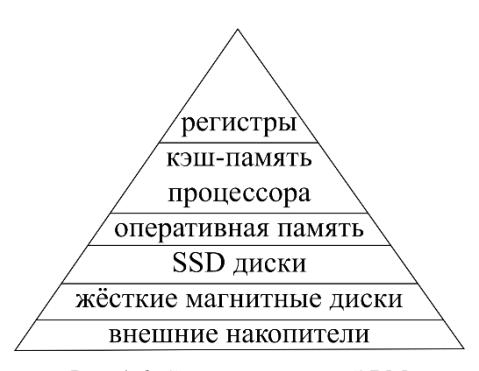

Рис. 1.6. Структура памяти ЭВМ

Зачастую итоговая длительность расчетов определяется не количеством арифметических операций, которым большинство авторов оценивают вычислительную сложность численного метода, а объемом коммуникаций внутри иерархической структуры памяти ЭВМ. Удачной признается организация вычислений, при которой упомянутый объем минимизируется, даже за счет некоторого увеличения числа арифметических операций.

С ростом популярности вычислений на специализированных векторных процессорах (графические ускорители, Intel Xeon Phi) особое внимание приходится уделять преодолению ограничений на

объем памяти этих устройств. Так, на каждом вычислительном узле суперкомпьютера К-100 Института прикладной математики РАН установлено по три графических ускорителя с размером видеопамяти 2,5 Гб при объеме оперативной памяти на узле в 96 Гб. Полноценное использование ускорителей для решения "больших" задач должно сопровождаться составлением алгоритмов, учитывающих указанное ограничение. Сама видеопамять также иерархически организована.

# Вопросы и задачи к параграфу 1.1

- 1.1.1 Чем отличаются модели конвейерной ЭВМ и многопроцессорной ЭВМ с сетевой конфигурацией *процессорная линия*? При каком условии этим отличием можно пренебречь?
- 1.1.2 Изобразите графически несколькими различными способами *гиперкуб* размерности 4.
- 1.1.3 Предложите правило построения *гиперкуба* размерности m+1 из двух *гиперкубов* размерности m.
- 1.1.4 Игнорируя одни связи между процессорами внутри гиперкуба и используя другие продемонстрируйте возможность построения на основе гиперкуба размерности 4 процессорной линии, кольца, решетки, тора и бинарного дерева с тем же количеством процессоров. При решении необходимо маркировать вершины гиперкуба числами, проверяя затем соединяются ли в нем процессоры, соседствующие в других перечисленных сетевых топологиях.
- 1.1.5 Для построения *процессорной линии*, *кольца* и *бинарного дерева* на основе *гиперкуба* произвольной размерности сформулируйте соответствующие алгоритмы.
- 1.1.6 Сформулируйте условия и алгоритмы построения квадратных *решетки* и *тора* на основе *гиперкуба*.

#### 1.2 Модели алгоритмов

Понятие алгоритма как последовательности действий, известное со школьной скамьи, не сочетается с предметной областью параллельных вычислений, в которой последовательность является антонимом параллельности, действия же относят к вычислительному процессу, а не алгоритму.

Уместней общее определение Александра Александровича Маркова [8], согласно которому алгоритм есть точное предписание, определяющее вычислительный процесс, ведущий от варьируемых исходных данных к искомому результату.

Вслед за определением алгоритма Александр Александрович перечисляет его свойства:

- а) точность предписания, не оставляющая место произволу, и его общепонятность **определенность** алгоритма;
- б) возможность исходить из варьируемых в известных пределах исходных данных **массовость** алгоритма;
- в) направленность алгоритма на получение некоторого искомого результата, в конце концов и получаемого при надлежащих исходных данных, **результативность** алгоритма.

Для непосредственной работы с алгоритмами (синтеза и анализа) исследователь нуждается в средствах их описания, желательно менее формализированных и более удобных для практических целей, чем представляемые в рамках классической теории алгоритмов (машины Тьюринга, Поста и т.п.). В области параллельных вычислений для этого используются собственные модели.

#### 1.2.1 Модель задача/канал

Популярная модель задача/канал [14] представляет из себя ориентированный граф, пример которого изображен на рис. 1.7.

Задачи изображаются окружностями и содержат наборы инструкций и данных, над которыми инструкции исполняются. Каналы соответствуют дугам на графе и необходимы для пересылки данных между задачами.

Так, в представленной на рис. 1.7 задаче 3 сначала производится прием данных от задачи 1, затем от задачи 2; после чего запланированы вычисления, завершающиеся отправкой данных задаче 4.

Внутри одной задачи инструкции исполняются в строгой очередности: одна за другой, как в последовательном алгоритме. Одновременное исполнение инструкций в нескольких задачах обуславливает параллельность вычислений, характеризуя алгоритм, содержащий эти задачи, как параллельный. В ходе работы параллельного алгоритма задачи могут упраздняться и порождаться в соответствии с инструкциями других задач.

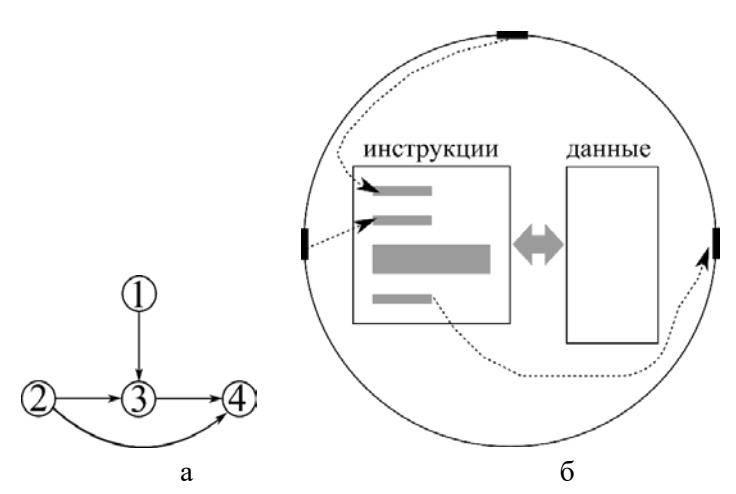

Рис. 1.7. Пример описания алгоритма в рамках модели задача/канал: а – общая структура алгоритма: 6 – солержание залачи № 3

Особенностью канала является ориентированность, задающая направление пересылки. Для отправки данных в обратном направлении необходимо организовать другой канал, связывающий те же

задачи, но ориентированный противоположно. Отправления по одному каналу производятся по принципу первый вошел — первый вышел.

В соответствии с порядком организации коммуникаций параллельного алгоритма различают следующие их типы, характеризующие данный алгоритм.

Локальные и глобальные коммуникации. Первые отличаются слабой (не превышающей логарифмической) зависимостью количества соседей выбранной характерной задачи алгоритма от общего числа задач, вторые — более сильной. Так коммуникации алгоритма, повторяющие сетевые конфигурации процессорная линия, кольцо, решетка, тор, бинарное дерево и гиперкуб признают локальными, а полносвязаную и звезду — глобальными.

Синхронные и асинхронные коммуникации. Синхронизация коммуникаций подразумевает определенное согласование действий во время оправки и приема данных внутри отправляющих и принимающих задач, этими коммуникациями связанных. Синхронная отправка и прием исключает производство каких-либо иных действий в отправляющей и принимающей задачах до окончания приема. В ходе асинхронной отправки и приема данных возможно исполнение следующих далее в задачах инструкций до завершения приема. Не исключается ситуация асинхронной отправки и синхронного приема (или наоборот), при которой отправляющая задача не дожидается окончания приема (или принимающая окончания отправки).

Статические и динамические коммуникации. Если топология коммуникаций алгоритма не зависит ни от начальных данных, ни от промежуточных результатов расчета, то говорят о статических коммуникациях. В противном случае коммуникации именуют динамическими, возникающими или упраздняющимися в ходе вычислений в зависимости от значений начальных данных либо промежуточных результатов.

Регулярные и нерегулярные коммуникации. При составлении алгоритма принято ориентироваться на определенный круг доступных разработчику вычислительных комплексов, характеризующихся известным набором сетевых конфигураций. Совпадение топологии коммуникаций алгоритма с известной или планируемой к развертыванию сетевой конфигурацией определяет такие коммуникации как регулярные. В противном случае нерегулярных коммуникаций, реализация алгоритма на любой известной сетевой конфигурации потребует дополнительной маршрутизации через промежуточные вычислительные узлы, что приведет к замедлению расчетов.

#### 1.2.2 Нотация Джина Голуба

Следующая форма представления алгоритмов Джина Голуба [3] не подменяет, а дополняет предыдущую, позволяя конкретизировать содержание задач. Что не умаляет ее ценность как самостоятельной формы.

Как и ранее, каждой задаче (Голуб называет задачу процессором, однако позволим себе эту замену) ставится в соответствие свой набор инструкций, который необходимо задать при составлении параллельного алгоритма. Буквально следовать этому правилу, раздельно оформляя инструкции всем задачам, неудобно, особенно если точное количество задач заранее неизвестно. Поэтому для лаконичности параллельного алгоритма принято писать один набор инструкций, предназначая его к исполнению всем задачам. В зависимости от номера задачи, внутри нее исполняются или пропускаются те или иные фрагменты этого набора. Значительная часть фрагментов может исполняться несколькими (даже всеми) задачами одновременно.

Описание алгоритма делится на две части. Инициализация, в которую вынесены результаты подготовительной стадии расчетов: задание общего количества задач p, определение номера конкретной

задачи  $\mu$ , распределение начальных данных по задачам и конкретизация соседей  $\mu$ -ой задачи. При программной реализации необходимы известные усилия для подготовки этих данных, однако здесь они считаются уже известными. Вторая часть — собственно алгоритм на языке Голуба, почти совпадающем с синтаксисом МАТLAB'a. Например, вектор a длины n записывается как a(1:n), из него можно выбрать все нечетные элементы, указав a(1:2:n); аналогично обозначается квадратная матрица A(1:n, 1:n) и ее блок  $A(n_1:n_2, n_3:n_4)$ .

Из всех топологий коммуникаций Голуб особо выделяет четыре: линию, кольцо, решетку и тор. В случае одномерной топологии соседи задачи  $\mu$  обозначаются за left, right; в случае двумерной соседи задачи  $(\mu,\lambda)$  – east, west, north, south. То есть без учета крайних задач:  $left = \mu$ -1,  $right = \mu$  + 1 в одномерном случае и  $east = \mu$ +1,  $west = \mu$ -1,  $north = \lambda$ -1,  $south = \lambda$ +1 в двумерном. На кольце для задачи  $\mu$  = 1 левым соседом будет задача p, для  $\mu$  = p правый сосед – 1. Несложно аналогично определить соседей крайних задач в торе.

Организация коммуникаций в случае сетевой конфигурации (пример распределенной памяти с *полносвязной* топологией по Хокни у Голуба понимается как вариант сетевой конфигурации) производится посредством введения операций *send(<umo omnpaвляется>,<кому отправляется>)* и *recv(<umo принимается>,<от кого принимается>)*. В последней инструкции указание второго аргумента не обязательно, данные уже поступили и их можно принять не зная номера задачи отправителя. Также может быть заранее неизвестен объем принимаемых данных – его допускается определить после приема.

При записи алгоритма на общей памяти инициализация дополняется приведением данных, доступных всем задачам; соседи не упоминаются. В тексте алгоритма локальные данные, находящиеся в распоряжении только одной задачи, помечаются нижним индексом *loc*. Коммуникации между задачами организуются посредством

записи в общий участок памяти из локального операцией put(<локальные ∂анные>,<общие ∂анные>) и обратного действия - get(<общие ∂анные>,<локальные ∂анные>).

Проблема исключения одновременного доступа нескольких задач к одному участку общих данных и возникающая в связи с этим неопределенность решаются в [3] с использованием мониторов, от которых автор отказался в следующем издании монографии (к сожалению не переведенном на русский язык), практикуя там применение критических интервалов. Критический интервал представляет из себя участок алгоритма, обрамленный следующей нотацией

# begin critical section инструкции end critical section

Внутри него исключается одновременное исполнение инструкций несколькими задачами. В критический интервал входит только одна, остальные задерживаются перед ним.

Важным инструментом организации вычислений также является барьерная синхронизация задач параллельного алгоритма. Дойдя до инструкции *barrier* задача прекращает действия до тех пор, пока все остальные также не подойдут к барьеру, не обязательно этому же.

Механизм распределения начальных данных между задачами в инициализации раскрывать не принято, однако результат такого распределения оговорить необходимо. В нотации Голуба различаются линейное и циклическое распределения.

Пусть необходимо распределить n элементов вектора a(1:n) между p задачами. Тогда, положив для простоты, что n делится на p нацело и r=n/p, отнесем при линейном распределении к ведению задачи  $\mu$  ( $1 \le \mu \le p$ ) часть вектора  $a((\mu-1)r+1:\mu r)$ . Элементы выделенного фрагмента вектора соседствовали друг другу и в векторе a. При циклическом распределении  $a(\mu:p:n)$  это не так, из a выбираются элементы с шагом p.

Распределение матриц зависит от способа хранения двумерного массива в памяти ЭВМ. Разворачивая его по строкам (например, как в языке си) говорят о строчном хранении, по столбцам (как на фортране) – о столбцовом. В табл. 1.2 представлены варианты линейного и циклического распределения в обоих случаях.

Таблица 1.2. Распределение матрицы А между задачами алгоритма

|                              | столбцовое              | строчное                 |
|------------------------------|-------------------------|--------------------------|
|                              | хранение                | хранение                 |
| линейное<br>распределение    | $A(:,(\mu-1)r+1:\mu r)$ | $A((\mu-1)r+1: \mu r,:)$ |
| циклическое<br>распределение | A(:,μ:p:n)              | <i>A</i> (μ:p:n,:)       |

Во второй строке табл. 1.2 задаче  $\mu$  достается блочный столбец или строка, в третьей строке — циклический набор столбцов или строк. Случаи специальных схем хранения A (по лентам, блочных и т.п.) пока оставим.

Способ выбора элементов из массива может оказать решающее влияние на длительность вычислений в ходе реализации самого алгоритма, после распределения начальных данных. Очевидна необходимость учета структуры хранения и в этом случае. Ключевым здесь является понятие шага выборки – расстояния между двумя извлекаемыми из массива элементами, измеренное в количестве ячеек. Предпочтительны операции с единичным шагом выборки, характеризующиеся наименьшим временем доступа к данным и лучшей конвейеризацией вычислений. Эта проблема будет подробно освещена при рассмотрении векторных (на практике для производства векторных операций задействуется конвейер) алгоритмов матричных вычислений.

Независимо от типа коммуникаций (сетевых или на общей памяти) при их организации принято соблюдать следующие два правила хорошего тона.

- 1. Отправляемые данные должны располагаться в одной области памяти без разрывов. Например, при строчном хранении данных неудачной будет операция send(A(:,1),left) или  $put(A_{loc}(:,1),a)$  по пересылке первого столбца матрицы A. Ее производство сопряжено с предварительной выборкой элементов этого столбца, характеризующейся неединичным шагом.
- 2. Необходимо оценить эффективность объединения коммуникационных операций, разумеется при возможности такого объединения. В первом приближении, зависимость длительности коммуникации Т от объема пересылаемых данных V имеет линейный характер (рис. 1.8, пунктирная линия). На самом деле (второе приближение), пересылку данных предваряет этап подготовки коммуникации (длительности  $t_1$  на рис. 1.8), а сама отправка производится дискретными порциями пакетами (объема  $V_1$ ). Длительность передачи одного пакета  $t_2$  составляется из времени подготовительного этапа и издержек на собственно пересылку.

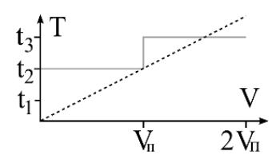

Рис. 1.8. Линейная (пунктирная линия) и ступенчатая (непрерывная кривая) модели коммуникаций

При V<V $_{\rm II}$  отправляется все равно целый пакет, график исследуемой зависимости T(V) в силу этого имеет ступенчатый вид. Поэтому небольшие объемы данных выгодно объединять и пересылать одной операцией. В третьем приближении, когда V>>V $_{\rm II}$ , линейная модель коммуникаций становится адекватной, пунктирная прямая на рис. 1.8 будет хорошо аппроксимировать непрерывную ступенчатую и объединение можно не производить.

# 1.2.3 Пример параллельного алгоритма, рассылка данных по дереву

Составляя первый параллельный алгоритм реализуем линейное распределение элементов вектора a(1:n) по p задачам этого алгоритма. Перед началом вычислений в памяти первой задачи a содержится целиком, в остальных задачах  $(2 \le \mu \le p)$  элементы вектора отсутствуют. По завершению, в задаче  $\mu$   $(1 \le \mu \le p)$  находится часть вектора  $a((\mu-1)r+1:\mu r)$ , хранящаяся в локальной памяти под именем a(1:r), где r=n/p - для простоты целое. Отметим полезность данного алгоритма для начального распределения данных, предшествующего основным вычислениям по другим численным методам.

Наиболее просто распределение производится по алгоритму с топологией коммуникаций *звезда* (рис. 1.5, е) следующим образом.

#### Алгоритм 1.1 Рассылка данных на звезде

**Инициализация**  $\{a(1:n)$  — рассылаемый вектор, n — его размер,  $\mu$  — номер задачи, p — общее количество задач, r=n/p, топология коммуникаций —  $38e3\partial a\}$ 

- 01 *if*  $\mu$ =1 *then* % действия первой задачи
- 02 *for* i=2:p % обход в цикле остальных задач
- 03  $send(a((i-1)r+1:i\cdot r),i);$  % отправка задаче i ее части вектора
- 04 *end for* % завершение цикла
- 05 *else* % действия всех задач, кроме первой
- 06 recv(a(1:r),1); % прием своей части вектора от первой задачи 07 *end if* % завершение условного перехода

В строке 01 все задачи разделяются на первую и остальные, которые принимают данные от первой в строке 06. Первая в свою очередь последовательно рассылает их в цикле 02-04.

Однако, как отмечалось ранее, такой алгоритм во-первых нельзя назвать параллельным (действия производятся последовательно),

во-вторых топологию коммуникаций *звезда* для большого количества задач будет затруднительно отобразить на сетевую конфигурацию существующей вычислительной системы без дополнительной маршрутизации сообщений.

Уместней распределять вектор по бинарному дереву, связывающему p задач алгоритма, положив для простоты значение  $log_{\gamma}p$  целым. Рассматривая пример бинарного дерева на рис. 1.5в для p=8, выделим на нем четыре уровня, нумеруя их сверху вниз 3, 2, 1, 0 в порядке убывания. На третьем (верхнем) расположена задача 1, которой предстоит начать вычисления, отправив задаче 5 правую половину вектора a(n/2+1:n). На втором уровне задача 1 отправляет задаче 3 вторую четверть вектора a(n/4+1:n/2), задача 5 принимает вторую половину а от задачи 1 и отправляет последнюю четверть  $a(3/4\cdot n+1:n)$  задаче 7. Действия на первом уровне характеризуются отправкой задачей 1 второй восьмушки вектора a(n/8+1:n/4) задаче 2; задачи 3 и 7 принимают от 1 и 5 вектора a(n/4+1:n/2) и  $a(3/4\cdot n+1:n)$  соответственно; затем задачи 3, 5 и 7 отправляют задачам 4, 6 и 8 вектора  $a(3/8 \cdot n + 1 : n/2)$ ,  $a(5/8 \cdot n + 1 : 3/4 \cdot n)$  и  $a(7/8 \cdot n + 1 : n)$ . На нижнем уровне задачи с четными номерами принимают отправленные им ранее данные.

Теперь необходимо сформулировать это в виде алгоритма, не ограничиваясь случаем восьми задач. Осмыслив проблему в целом, разделим задачи искомого алгоритма на три множества: первая задача (несколько раз отправляет данные), четные задачи (один раз принимают) и все остальные (один раз принимают, несколько раз отправляют). Сформулировав инструкции для первой и четных задач можно объединить их и предписать получившиеся действия остальным задачам. В итоге получится Алгоритм 1.2.

Первой задаче предписывается исполнение инструкций в строках 02-06, где она в цикле по i, спускаясь по уровням дерева, рассылает вторую половину оставшегося у нее вектора a (вектор на каждой итерации сокращается вдвое с отсечением конца) задаче  $I+2^{i-1}$ .

Все четные задачи исполняют инструкцию 09, принимая известное количество элементов вектора у задачи с номером на единицу менышем.

Алгоритм 1.2 Рассылка данных на бинарном дереве

```
Инициализация \{a(1:n) – рассылаемый вектор, n – его размер, \mu –
номер задачи, p — общее количество задач, r = n/p, топология ком-
муникаций – бинарное дерево}
01 if \mu=1 then % действия первой задачи
    k=log_2p; % верхний уровень дерева
03 for i=k:-1:1 % организация коммуникаций
       send(a(n/2+1:n), 1+2^{i-1}); % отправка данных
04
       n=n/2; % сокращение длины вектора
05
06
    end for
07 else
    if \mu - четное then % действия четных задач
08
       recv(a(1:r), \mu-1); % прием данных
09
10
    else % лействия оставшихся задач
11
       % поиск уровня k, с которого начинается рассылка
12
       k=0; q=\mu;
      while mod(q,2)\neq 0
13
14
         q=(q+1)/2; k=k+1;
15
      end while
      n=n/2^{log2p-k}; % размер принимаемых данных
16
      recv(a(1:n), \mu-2^k); % прием данных
17
18
      for i=k:-1:1 % организация коммуникаций
         send(a(n/2+1:n), u+2^{i-1}): % отправка данных
19
20
         n=n/2: % сокращение длины вектора
21
       end for
22
     end if
23 end if
```

Нечетные, за исключением первой, сначала в 11-15 по знакомой из теории графов процедуре вычисляют уровень дерева k, на котором необходимо произвести прием. Затем определяют в зависимости от этого уровня количество принимаемых данных (строка 16) и производят прием (17) от задачи  $\mu$ - $2^k$  — фрагмент, аналогичный действиям четных задач. Завершается алгоритм рассылкой этих данных по дереву (18-21), как в первой задаче.

Несложно сформулировать другой вариант данного алгоритма, исключив из него вычисления в 11-16. Действительно, уровень, на котором обсуждаемая задача примет данные в строке 17, известен другой задаче, эти данные передающие, — он на единицу меньше того, с которого передача произведена. Следовательно, его значение разумно отправить вместе с фрагментом вектора a, поместив, например, за последним элементом вектора. Принимающая задача может получить данные не зная заранее номера отправляющей и количества полученных элементов. Размер фрагмента n, как и уровень дерева k, она извлечет из уже принятой посылки.

Алгоритм рассылки по дереву может быть записан и более лаконичным, хотя и менее понятным, способом. Кроме того, в интерфейс передачи сообщений MPI (Message Passing Interface) [1] включена готовая процедура, производящая такую рассылку. Однако, для понимания ее «внутренней механики» знакомство с Алгоритмом 1.2 представляется весьма полезным.

# Вопросы и задачи к параграфу 1.2

- 1.2.1 Зачем необходимы модели алгоритмов, если из параграфа 1.1 известны модели архитектур вычислительных систем? В чем общность и какие различия между этими моделями?
- 1.2.2 Чем в свою очередь алгоритм отличается от программы и чем не отличается?

- 1.2.3 Как связаны понятия алгоритм и численный метод? Приведите пример метода и нескольких его алгоритмов.
- 1.2.4 Оцените погрешность линейной модели коммуникаций по сравнению со ступенчатой. В оценке должен фигурировать объем передаваемого сообщения.
- 1.2.5 Перепишите Алгоритм 1.2 с условием, что уровень дерева k, на котором нечетные задачи (кроме первой) приступают к принятию данных, пересылается а не рассчитывается. Фрагмент алгоритма, относящийся к первой задаче, также необходимо модифицировать.
- 1.2.6 Запишите алгоритм сбора данных, аналогичный рассылке, только в обратном направлении. Перед началом вычислений каждая задача хранит свой фрагмент вектора, по завершении весь вектор в памяти первой задачи.
- 1.2.7 На основе Алгоритма 1.2 и алгоритма из предыдущей задачи сформулируйте параллельный алгоритм численного интегрирования, который начинается рассылкой первой задачей табличных значений подынтегральной функции и завершается формированием в памяти первой задачи результата интегрирования.
- 1.2.8 Для последнего алгоритма, в случае 8 задач, изобразите соответствующий ему согласно модели задача/канал ориентированный граф.

# 1.3 Модели вычислительных процессов

Теория вычислительных процессов [11] появилась значительно позже теории алгоритмов [8], однако к настоящему времени характеризуется не менее развитым математическим аппаратом. В рамках данного изложения ограничимся ее обсуждением на интуитивном уровне, ознакомившись с несколькими формами представления таких процессов.

Отличие вычислительного процесса от алгоритма очевидно уже из определения последнего по Маркову, где фигурирует и понятие

«вычислительный процесс». Алгоритм относится к миру платоновских идей, процесс же расположен в чувственном мире и является набором действий, характеризующихся хронологически (начало, окончание, длительность) и пространственно (локализован в определенной части реальной вычислительной системы). Это различие и обуславливает необходимость отдельного рассмотрения вычислительных процессов, наряду с архитектурами вычислительных систем и алгоритмами.

Рассматривая триаду алгоритм, процесс и архитектура в целом, отметим, что по алгоритму задается (определяется, по Маркову) вычислительный процесс, протекающий на выбранной архитектуре. При этом крайне желательно, чтобы значимые для протекания процесса особенности архитектуры учитывались уже на стадии разработки алгоритма (отображение академика Марчука).

### 1.3.1 Пространственно-временные диаграммы

В качестве примера рассмотрим следующий алгоритм вычисления корней квадратного уравнения с положительным дискриминантом. Инструкции будем маркировать большими буквами русского алфавита, инициализация не требуется в силу отсутствия начальных данных.

# Алгоритм 1.3 Решение квадратного уравнения

- A  $ввод{a, b, c}$  % задание коэффициентов уравнения
- Б  $D=b^2-4ac$  % вычисление дискриминанта
- В  $x_I = (-b + \sqrt{D})/(2a)$  % значение первого корня
- $\Gamma = x_2 = (-b \sqrt{D})/(2a)$  % значение второго корня
- Д вывод $\{x_1, x_2\}$  % вывод корней

Вычислительный процесс, определенный этим алгоритмом, можно кратко описать последовательностью исполнения инструкций: А, Б, В, Г, Д (процесс  $Q_1$ ). Вместе с тем, указанный процесс нельзя назвать необходимым, существует еще один, приводящий к тому же результату: А, Б, Г, В, Д (процесс  $Q_2$ ) и именно он может оказаться реализованным на вычислительной системе при исполнении Алгоритма 1.3 в силу предварительной выборки команд (за один такт из памяти извлекается несколько инструкций). Более того, возможен другой процесс  $Q_3$ , эквивалентный рассмотренным, в котором инструкции В и Г исполнятся параллельно — то есть одновременно.

Далее будем говорить о двух процессах как об эквивалентных, если при одинаковых входных данных они приводят к одному результату. Сравнению подлежат исключительно эквивалентные вычислительные процессы.

В пространственно-временной диаграмме на рис. 1.9 связаны инструкции Алгоритма 1.3 (отложены по оси ординат) и время (ось абсцисс) их исполнения. Для простоты длительность исполнения всех операций принята одинаковой. Отрезком обозначается исполнение выбранной инструкции в определенное время. Последнее может отсчитываться в секундах либо тактах процессора.

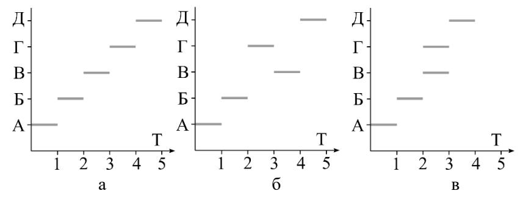

Рис. 1.9. Пространственно-временные диаграммы вычислительных процессов, определенных Алгоритмом 1.3: а – процесс  $Q_1$ ; б – процесс  $Q_2$ ; в – процесс  $Q_3$ 

Пространственно-временная диаграмма представляет исчерпывающую информацию о вычислительном процессе, однако при анализе длительных процессов, включающих исполнение тысяч инструкций, может оказаться чрезмерно громоздкой. Тогда принято объединять инструкции в блоки, выделять различные ветви вычислительного процесса, внутри которых инструкции выполняются последовательно, наносить на диаграмму дополнительные обозначения, поясняющие движение данных между такими ветвями.

## 1.3.2 Графы следования

Более развитые модели вычислительных процессов представляются в виде ориентированных графов [12], для задания которых необходимо определить множества вершин и бинарные отношение на этих множествах.

Каждой инструкции алгоритма поставим в биективное соответствие действие вычислительной системы по ее исполнению. В действительности таких действий будет несколько и возможно они не производятся непрерывно, однако здесь объединим их в одно слитное. Совокупность таких действий определит множество вершин графа.

Будем говорить, что действия  $d_1$  и  $d_2$  вступают в бинарное отношение [5] непосредственного следования ( $d_2$  непосредственно следует за  $d_1$ ), если  $d_2$  начинается после завершения  $d_1$  и отсутствует действие  $d_3$ , стартующее после завершения  $d_1$  и финиширующее перед началом  $d_2$ . Указанное бинарное отношение на множестве действий задает дуги искомого графа, который назовем графом непосредственного следования.

Ни рис. 1.10 представлены графы непосредственного следования для примера из предыдущего пункта, где для ясности действия маркированы теми же литерами, что инструкции в Алгоритме 1.3.

Как видно из сравнения рис. 1.10 а, б, в, процессы  $Q_1$ ,  $Q_2$  и  $Q_3$  отличаются последовательностью действий B и  $\Gamma$ , как и в пространственно-временной диаграмме на рис. 1.9. B  $Q_1$  действие  $\Gamma$  непосредственно следует за B, в  $Q_2$  наоборот B за  $\Gamma$ , а в  $Q_3$  обсуждаемые действия не вступают в отношение непосредственного следования.

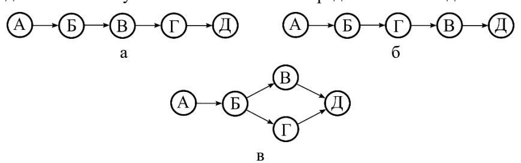

Рис. 1.10. Графы непосредственного следования для вычислительных процессов, определенных Алгоритмом 1.3: а – процесс  $Q_1$ ; б – процесс  $Q_2$ ; в – процесс  $Q_3$ 

Далее, на основе введенного бинарного отношения, посредством его транзитивного замыкания, строят новое отношение — следования. Граф следования характеризуется тем же множеством вершин, что и предыдущий. Практически, построение транзитивного замыкания отношения непосредственного следования заключается в соединении дополнительными дугами (прежние остаются) вершин на графе, ранее связанных через одного или нескольких посредников (рис. 1.11).

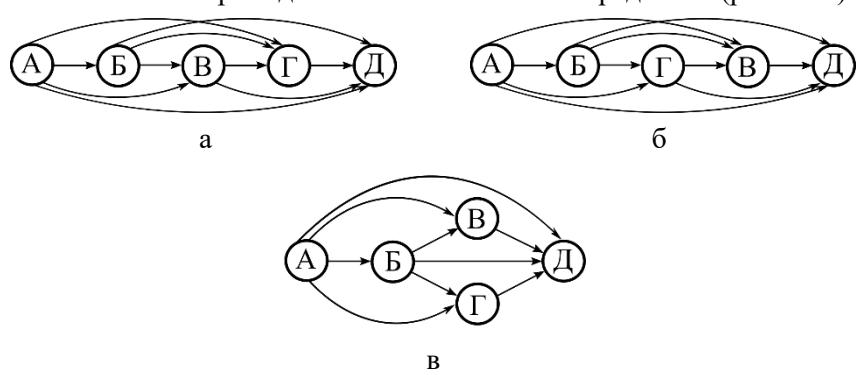

Рис. 1.11. Графы следования для вычислительных процессов, связанных с Алгоритмом 1.3: а – процесс Q<sub>1</sub>; б – процесс Q<sub>2</sub>; в – процесс Q<sub>3</sub>

Может показаться, что введение нового бинарного отношения усложнит анализ вычислительных процессов. Действительно, графы на рис. 1.11 выглядят избыточными по сравнению с изображенными на рис.1.10, однако следующий формализм сравнения процессов основан на использовании именно отношения следования.

Назовем вычислительный процесс Q не менее параллельным, чем некоторый Q', эквивалентный Q, если для любой пары действий  $d_1,d_2$ , такой что в Q  $d_2$  следует за  $d_1$ , верно, что и в Q' действие  $d_2$  также следует за действием  $d_1$ .

Так, сравнивая процессы  $Q_1$ ,  $Q_2$  и  $Q_3$  по их графам следования на рис. 1.11, отметим  $Q_3$  как не менее параллельный, чем  $Q_1$  и  $Q_2$ ; последние же два процесса как несравнимые между собой по введенному правилу. Действительно, в  $Q_1$  действие  $\Gamma$  следует за B (в  $Q_2$  не следует), а в  $Q_2$  B следует за  $\Gamma$  (в  $Q_1$  не следует).

Максимально параллельным назовем вычислительный процесс, не менее параллельный, чем все, ему эквивалентные.

Обсуждая некоторый максимально параллельный процесс (в нашем примере это  $Q_3$ ) заметим, что все его действия, вступающие в бинарное отношение следования, вступают в это же отношение и такими же парами во всех эквивалентных процессах ( $Q_1$  и  $Q_2$  в примере). Вместе с тем, указанных пар, по сравнению с остальными эквивалентными процессами, в обсуждаемом меньше. А значит больше действий свободно от следования друг за другом и выполняются одновременно, тогда и длительность максимально параллельного процесса окажется наименьшей по сравнению с остальными.

Далее, в теории автоматического распараллеливания (Глава 2), будут вскрыты и классифицированы причины возникновения различных бинарных отношений зависимостей на множестве инструкций алгоритма, которые в свою очередь во многом обуславливают

отношения следования на множестве действий вычислительного процесса. Отметим также, что исполнение независимых инструкций вполне может состояться последовательно, тогда связанные с ними действия в таком процессе вступят в отношения следования. Пока же перенесем методику сравнения процессов на сопоставление алгоритмов.

Сочтем два алгоритма эквивалентными, если эквивалентны любые два вычислительных процесса, ими определенные.

Укажем на алгоритм A, как на не менее параллельный, чем алгоритм B, эквивалентный A, если множество вычислительных процессов, определенных A, содержит множество вычислительных процессов, определенных B, в качестве подмножества.

Максимально параллельным назовем алгоритм, не менее параллельный, чем все ему эквивалентные.

Таким образом, лучшим с представленной теоретической точки зрения будет алгоритм, определяющий наиболее мощное множество эквивалентных вычислительных процессов, включающее все возможные их реализации. На практике же предпочтение отдается построению алгоритмов, ориентированных на конкретные вычислительные системы и определяющих узкий круг процессов, в этих системах протекающих.

# 1.3.3 Сети Петри

Ни пространственно-временные диаграммы, ни графы следования не позволяют моделировать протекание вычислительного процесса, описывая уже состоявшуюся его реализацию. Моделирование процессов традиционно связывают с сетями Петри [7].

Профессор, тогда еще будущий, Карл Адам Петри изобрел свои сети в возрасте 13 лет (1939 г.) для моделирования химических реакций. В 1941-ом году Петри узнает о работах инженера Конрада Эрнста Отто Цузе (человека с не менее интересной биографией) –

создателя первого компьютера, используемого для технических расчетов, и даже решается собрать собственный. Любознательный юноша в раннем возрасте связал свою судьбу с наукой, изучая в библиотеке Лейпцига среди прочих и запрещенные в фашисткой Германии работы Эйнштейна и Гейзенберга. К счастью, его жизнь не оборвалась ни во время службы в вермахте (с 1944 г.), ни в британском плену. В 1950-ом году Петри приступает к научной деятельности в области вычислительной математики, а в 1962-ом успешно защищает по своим сетям докторскую диссертацию "Коттинікаtion mit Automaten" в Дармштадтском университете. Почетным профессором Гамбургского университета Петри становится в 1988 г.

#### 1.3.3.1 Определения и свойства

Сетью N назовем тройку объектов (P,T,F), где:

P — непустое конечное множество мест (графически изображаются окружностями);

T – непустое конечное множество переходов (графически изображаются отрезками);

F — функция инцидентности (графически изображается дугами) с областью определения  $P \times T \cup T \times P$  и областью значений — множеством натуральных чисел с нулем.

Таким образом, сеть является ориентированным графом с двумя типами вершин и дугами, соединяющими вершины разных типов.


Рис. 1.12. Пример сети

На рис. 1.12 изображена сеть, характеризующаяся множеством мест  $P = \{p_1, p_2, p_3, p_4, p_5, p_6\}$ , множеством переходов  $T = \{t_1, t_2, t_3, t_4, t_5\}$  и функцией инпидентности F, значения которой представлены в табл. 1.3.

Таблица 1.3. Значения F для сети на рис. 1.12

|   |                       | T     |       |                |                |                       |
|---|-----------------------|-------|-------|----------------|----------------|-----------------------|
|   |                       | $t_1$ | $t_2$ | t <sub>3</sub> | t <sub>4</sub> | <b>t</b> <sub>5</sub> |
|   | $\mathbf{p}_1$        | 1     | 0     | 0              | 0              | 0                     |
|   | $p_2$                 | 0     | 1     | 0              | 0              | 0                     |
| P | <b>p</b> <sub>3</sub> | 0     | 0     | 1              | 0              | 0                     |
| 1 | <b>p</b> <sub>4</sub> | 0     | 0     | 0              | 1              | 0                     |
|   | <b>p</b> <sub>5</sub> | 0     | 0     | 0              | 0              | 2                     |
|   | <b>p</b> <sub>6</sub> | 0     | 0     | 0              | 0              | 0                     |

|   |                | P     |       |       |                       |                       |                       |
|---|----------------|-------|-------|-------|-----------------------|-----------------------|-----------------------|
|   |                | $p_1$ | $p_2$ | $p_3$ | <b>p</b> <sub>4</sub> | <b>p</b> <sub>5</sub> | <b>p</b> <sub>6</sub> |
|   | $t_1$          | 0     | 1     | 0     | 0                     | 0                     | 0                     |
|   | $t_2$          | 0     | 0     | 1     | 1                     | 0                     | 0                     |
| T | $t_3$          | 0     | 0     | 0     | 0                     | 1                     | 0                     |
|   | t <sub>4</sub> | 0     | 0     | 0     | 0                     | 1                     | 0                     |
|   | <b>t</b> 5     | 0     | 0     | 0     | 0                     | 0                     | 1                     |

Известны следующие свойства сети.

#### 1. $P \cap T = \emptyset$

Множества мест и переходов не пересекаются, являясь разными множествами по своей сути. Переходы обычно связывают с действиями вычислительного процесса, а места с условиями производства этих действий.

2.  $\forall$ p∈P  $\exists$ t∈T такой, что F(p,t)≠0 или F(t,p) ≠0.

Любое место сети связано хотя бы с одним переходом. Либо дуга ведет из такого перехода в данное место, либо из места в такой переход.

3.  $\forall t \in T \exists p \in P$  такое, что  $F(t,p) \neq 0$  или  $F(p,t) \neq 0$ .

Аналогично для переходов, Любой переход сети связан хотя бы с одним местом. Либо из такого места ведет дуга в данный переход, либо из перехода в такое место.

- 4.  $\forall p_1, p_2 \in P$  при условии (\* $p_1$ =\* $p_2$ ) и ( $p_1$ \*= $p_2$ \*) верно, что  $p_1$ = $p_2$ . Здесь: \*p множество входных переходов для места p (всех переходов сети, из которых ведут дуги в данное место):
- $p^*$  множество выходных переходов для места p (всех переходов сети, в которые ведут дуги из данного места).

Например, для перехода  $p_5$  сети на рис. 1.12 множество входных переходов  $p_5 = \{t_3, t_4\}$ , множество выходных переходов  $p_5 = \{t_5\}$ .

Согласно последнему свойству сети отрицается необходимость в существовании двух разных мест одинаково инцидентных одними и теми же переходам. Причем для переходов аналогичное свойство не формулируется.

Сетью Петри PN назовем четверку объектов (P,T,F,M), где M- разметка сети.

Разметка есть функция, областью определения которой является множество мест, а областью значений — множество натуральных чисел с нулем. Графически значения разметки изображаются фишками внутри мест. Для примера на рис.  $1.12\ M(p_i)=0\$ при  $1\le i\le 6$  (иногда пишут в векторной форме M=(0,0,0,0,0,0)) — ни в одном из шести мест сети нет фишек. В отличие от функции инцидентности, разметка сети меняется, "оживляя" сеть Петри. Смене разметки предшествует срабатывание переходов.

Говорят, что переход  $t \in T$  может (но не должен!) сработать, если  $\forall p \in {}^*t$  выполняется неравенство  $M(p) \ge F(p,t)$ . Иногда это же условие срабатывания перехода  $t \in T$  записывают в векторной форме:  $M \ge {}^*F(t)$ .

Поясним введенные обозначения и условие в целом. Аналогично входному и выходному множествам переходов некоторого места различают входное  $^*$ t и выходное  $t^*$  множества мест перехода t. В первое помещают все места, из которых ведут дуги в указанный переход, во второе — в которые ведут дуги из указанного перехода. Так, для перехода  $t_2$  сети на рис. 1.12 множество входных мест  $^*t_2=\{p_2\}$ , множество выходных мест  $t_2^*=\{p_3,p_4\}$ .

Обозначениям  $^*F(t)$  и  $F^*(t)$  соответствуют вектора ( $F(p_1,t)$ ,  $F(p_2,t)$ ,  $F(p_3,t)$ , ...) и ( $F(t,p_1)$ ,  $F(t,p_2)$ ,  $F(t,p_3)$ , ...), содержащие значения функции инцидентности и отображающие в указанном порядке связь перехода t и всех мест сети. Сравнение векторов M и  $^*F(t)$  производится покомпонентно; условие  $M{\geq}^*F(t)$  считается выполненным, если оно верно для всех пар компонент обоих векторов. Здесь, в отличие от

скалярной формы записи  $\forall p \in {}^*t$   $M(p) \ge F(p,t)$ , фактически проверяется неравенство  $\forall p \in P$   $M(p) \ge F(p,t)$ . Результаты обеих проверок совпадают с учетом того, что F(p,t) = 0 для  $\forall p \notin {}^*t$ .

Таким образом, условие срабатывания перехода полагают выполненным, если значение разметки каждого входного места данного перехода не меньше, чем значение функции инцидентности, их связывающей (место — первый аргумент, переход — второй). Графически — если количество фишек для любого места, из которого в данный переход ведут дуги не меньше, чем число этих дуг.

#### 1.3.3.2 Сеть Петри для алгоритма решения квадратного уравнения

Для сети на рис. 1.12 условие срабатывания перехода не выполнено ни для одного из них. Переходя к рассмотрению той же сети с другой разметкой на рис. 1.13, отметим выполнение условия срабатывания переходов:  $t_1$  для разметки на рис. 1.13 a,  $t_2$  на рис. 1.13 б,  $t_3$  и  $t_4$  на рис. 1.13 в,  $t_4$  на рис. 1.13 г,  $t_5$  на рис. 1.13 д. Далее, на рис. 1.13 е, не выполняется условие срабатывания ни одного перехода.

За срабатыванием перехода t следует смена разметки сети Петри с M на M' по следующему правилу:

$$\forall p \in {}^*t \cup t^* M'(p) = M(p) - F(p,t) + F(t,p);$$
  
 $\forall p \notin {}^*t \cup t^* M'(p) = M(p);$   
 $M' = M - {}^*F(t) + F^*(t) - B$  векторной форме.

То есть, для входных мест сработавшего перехода значение разметки уменьшается на величину соответствующего значения функции инцидентности; для выходных мест аналогичным образом увеличивается. Графически — из места исчезнет столько фишек, сколько дуг ведет от него к сработавшему переходу, и появится дополнительно к имеющимся столько фишек, сколько дуг ведет в него из сработавшего перехода. В общем случае, когда  $^*t \cap t^* \neq \emptyset$ , одно и то же место р может оказаться входным и выходным для t, тогда его

разметка изменится на F(t,p)-F(p,t). Разметка не меняется вовсе для ∀p∉\* t∪t \* – мест, не инцидентных сработавшему переходу.


Рис. 1.13. Различные разметки сети Петри, изображенной на рис. 1.12: а – M0=(1,0,0,0,0,0); б – M1=(0,1,0,0,0,0); в – M2=(0,0,1,1,0,0); г – M3=(0,0,0,1,1,0); д – M4=(0,0,0,0,2,0); е – M5=(0,0,0,0,0,1)

Иллюстрируя сказанное повторно обратимся к сети на рис. 1.13. Разметка M0, изображенная на рис. 1.13 а, при которой выполняется условие срабатывания первого (в последовательности срабатываний) перехода, называется начальной. Действительно, при ней выполняется условие срабатывания перехода t1. После срабатывания t1 разметка меняется, согласно правилу смены разметки, на M1 (рис. 1.13 б). Теперь может сработать t2; после его срабатывания наблюдаем разметку M2 (рис. 1.13 в). При M2 условие срабатывания перехода выполняется сразу для двух: t3 и t4. Возможно четыре варианта дальнейшего развития событий.

- 1. Не срабатывает ни один и разметка сети более не меняется. Ведь в случае выполнения условия срабатывания перехода последний может, но не должен сработать.
- 2. Срабатывает t3, а t4 пока не срабатывает. Разметка меняется на M3 (рис. 1.13 г).
- 3. Срабатывает t4, а t3 пока не срабатывает. Разметка меняется на M6 = (0,0,1,0,1,0), не изображенную на рис. 1.13.
- 4. Срабатывают t3 и t4 вместе. Разметка меняется на M4 (рис. 1.13 д).

Второй случай может быть дополнен последующим срабатыванием t4, для которого при M3 выполняется условие срабатывания; а для t5 не выполняется, хотя в p5 будет одна фишка (нужно две).

Третий может быть дополнен последующим срабатыванием t3, для которого при M6 выполняется условие срабатывания; а для t5 не выполняется, хотя в p5 также будет одна фишка при двух необходимых по условию.

В итоге, независимо от последовательности или одновременности срабатывания t3 и t4, разметка сменится на M4 (рис. 1.13 д). Завершается работа сети срабатыванием t5 (при M4 в p5 две фишки) и переходом к разметке M5, при которой ни один переход сработать уже не может.

Традиционным заблуждением при первом знакомстве с сетями Петри является «открытие» обучающимися «закона сохранения фишек». Действительно, при срабатывании t1 одна фишка исчезает и одна появляется. Однако, при срабатывании t2 исчезает одна фишка, а появляются две. При срабатывании t5 исчезают две, одна появляется. «Закона сохранения фишек» нет.

Другой важный момент – выбор сработавшего перехода (переходов, если они срабатывают вместе) из множества переходов, для которых при данной разметке выполняется условие срабатывания. Здесь следует помнить, что сеть Петри это модель определенного процесса и исследователь не управляет действительным ходом моделируемого явления, а изучает его посредством математического моделирования на сети. Для чего желательно рассмотрение всех вариантов протекания процесса. Так, в приведенном выше примере отдельно оговаривалось течение процесса при двух вариантах последовательного срабатывания  $t_3$ ,  $t_4$  и одном параллельном. То есть подлежали рассмотрению три вычислительных процесса на одной сети.

Для описания работы сети в целом используют два множества: сработавших переходов  $\tau$  и достижимых от начальной  $M_0$  разметок  $R(M_0)$ .

Внимательный читатель уже догадался о связи сети на рис. 1.12, 1.13 и вычислительных процессов  $Q_1$ ,  $Q_2$ ,  $Q_3$ , определяемых Алгоритмом 1.3 из пункта 1.3.1. Для описания процесса  $Q_1$  положим множество сработавших переходов  $\tau_1 = \{t_1, t_2, t_3, t_4, t_5\}$ , где срабатывание  $t_1$  соответствует производству действия A в Алгоритме 1.3, срабатывание  $t_2$  соответствует производству Б,  $t_3 - B$ ,  $t_4 - \Gamma$ ,  $t_5 - \mathcal{A}$ . Последовательность расположения переходов во множестве согласуется с последовательностью их срабатывания. Процессы  $Q_2$  и  $Q_3$  характеризуются множествами  $\tau_2 = \{t_1, t_2, t_4, t_3, t_5\}$  и  $\tau_3 = \{t_1, t_2, (t_3, t_4), t_5\}$ , где в круглые скобки заключены одновременно сработавшие переходы.

Обращаясь к описанию множества достижимых разметок введем на множестве разметок сети Петри бинарное отношение непосредственного следования. Как уже отмечалось, разметка сети Петри это функция, но из векторов ее значений для всех мест сети (например, упоминаемых ранее  $M_0, M_1, M_2, M_3, M_4, M_5, M_6$ ) можно составить множество. На нем и вводится следующее отношение.

Будем говорить, что разметка M' непосредственно следует за разметкой M и писать M'[t>M, если  $\exists t \in T$  такой, что  $(M \le F(t))$  и (M'=M-F(t)+F(t)). То есть известен переход, который при разметке M может сработать, более того — он сработал, после чего разметка изменилась и стала M'.

Тогда для описания процессов  $Q_1, Q_2$  и  $Q_3$  используем цепочки:

 $Q_1 \text{ -} M_0[t_1 \!\!>\!\! M_1[t_2 \!\!>\!\! M_2[t_3 \!\!>\!\! M_3[t_4 \!\!>\!\! M_4[t_5 \!\!>\!\! M_5;$ 

 $Q_2 - M_0[t_1>M_1[t_2>M_2[t_4>M_6[t_3>M_4[t_5>M_5;$ 

 $Q_3 - M_0[t_1>M_1[t_2>M_2[(t_3,t_4)>M_4[t_5>M_5,$ 

составленные из последовательности разметок, связанных отношением непосредственного следования. В более лаконичной форме, с учетом, что последовательность сработавших переходов уже описана в  $\tau_1, \tau_2, \tau_3$ , ограничиваются указанием на множество достижимых от начальной  $M_0$  разметок для каждого процесса:

 $R_1(M_0)=\{M_1,M_2,M_3,M_4,M_5\}$  для  $Q_1$ ,

 $R_2(M_0) = \{M_1, M_2, M_6, M_4, M_5\}$  для  $Q_2$  и

 $R_3(M_0)=\{M_1,M_2,M_4,M_5\}$  для  $Q_3$ .

Оба множества, описывающие работу сети Петри, и сработавших переходов и достижимых разметок, являются строго упорядоченными

# 1.3.3.3 Сети Петри для моделирования циклических конструкций

Предыдущий пример сети Петри для моделирования вычислительных процессов, определенных алгоритмом решения квадратного уравнения (Алгоритм 1.3), не может вполне удовлетворить пытливого читателя. В основе подавляющего большинства численных методов лежат циклические конструкции. Как связать их с сетями Петри?

Приступим к изложению этой связи на примере Алгоритма 1.4, содержащего простой цикл (строки 02-04), в теле которого n раз исполняется *инструкция 3*; предшествующая циклу *инструкция 1* и следующая за ним *инструкция 3* исполняются однократно.

На рис. 1.14 изображена соответствующая этому алгоритму сеть Петри с начальной разметкой  $M_0$ =(1,0,0,0). Латинская буква под дугой — значение функции инцидентности (т.е.  $F(t_1,p_2)$ =n). Будем мар-

кировать его таким образом когда оно больше двух, чтобы не перегружать граф избыточными дугами. Переходы сети, срабатывание которых соответствует исполнению инструкций алгоритма, и связанные с ними инструкции, маркированы одинаковыми индексами (срабатывание перехода  $t_k$  есть исполнение *инструкции k*). Наклон буквы или цифры свидетельствует о принадлежности ее к описанию алгоритма, прямое расположение — к описанию сети, при совпадении остальных смыслов.

#### Алгоритм 1.4 Простой цикл

01 инструкция 1 02 for i=1:n 03 инструкция 2 04 end for 05 инструкция 3 01 02 03 инструкция 3 03 04 ели for 05 инструкция 3 04 ели for 05 инструкция 3 04 05 инструкция 3 05 05 инструкция 3 05 05 05 05 05 05 05 05

После срабатывания перехода  $t_1$  (*инструкция 1* единожды исполнится) разметка сети на рис. 1.14 сменится на (0,n,0,0). Теперь выполнено условие срабатывания перехода  $t_2$ ; после исполнения *инструкции 2* разметка примет вид (0,n-1,1,0). Несмотря на наличие фишки в  $p_3$ , при текущей разметке переход  $t_3$  не может сработать, ведь  $F(p_3,t_3)$ =n. До тех пор, пока *инструкция 2* не исполнится n раз. После  $\kappa$ -ой  $(1 \le k \le n)$  итерации цикла разметка сети равна (0,n-k,k,0). Наконец, по достижению разметкой значения (0,0,n,0) выполнится условие срабатывания  $t_3$  и *инструкция 3* сможет единожды исполниться.

Сложнее и интересней случаи вложенной циклической конструкции, представленной в Алгоритме 1.5, и соответствующей ей сети Петри (рис. 1.15).

При графическом обозначении начальной разметки  $M_0$ =(1,0,0,0,0,0,n) в месте  $p_7$  на рис. 1.15 вместо фишек изображена буква, обозначающая их количество.

# **Алгоритм 1.5** Вложенная циклическая конструкция

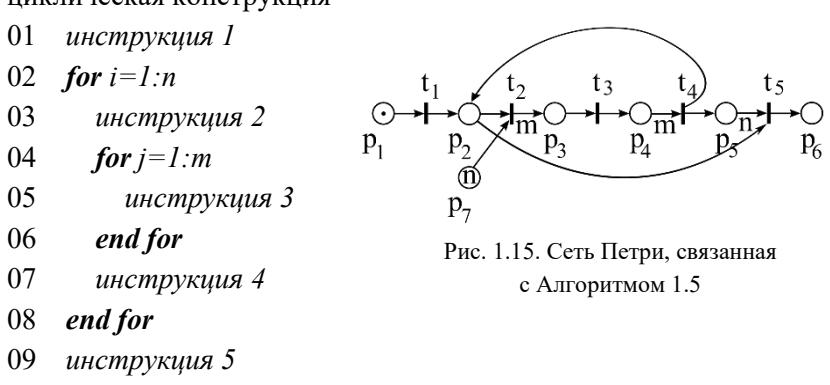

Отметим значительное совпадение центрального фрагмента, с места p2 до p5 включительно, новой сети на рис. 1.15 и всей прежней на рис. 1.14. Неудивительно, ведь в Алгоритме 1.5 вложенный цикл является простым – случай, представленный Алгоритмом 1.4. По сему, при описании работы новой сети подробно обсуждать данный фрагмент не будем, указав лишь на роль трех дополнительных дуг сверху и снизу основной горизонтали на рис. 1.15.

Начинается работа сети срабатыванием перехода t1 с последующей сменой разметки на (0,1,0,0,0,0,n). Следующий переход t2 не может сработать n раз подряд как в сети для Алгоритма 1.4, ведь после первого его срабатывания разметка примет вид (0,0,m,0,0,0,n-1) и в месте p2 не окажется фишки. Теперь *m* раз отработает тело вложенного цикла (строка 05 Алгоритма 1.5), по окончанию итераций которого разметка окажется равной (0,1,0,0,1,0,n-1). За счет дуги F(t4,p2) в месте p2 опять появится фишка и t2 снова сработает. Тело внешнего цикла (строки 03-07 Алгоритма 1.5) таким образом выполнится *n* раз, пока не исчерпаются фишки в месте p7 в силу существования дуги  $F(p_7,t_2)$ . Завершение k-ой итерации внешнего цикла отмечается разметкой (0,1,0,0,k,0,n-k). После последней итерации разметка примет вид (0,1,0,0,n,0,0) и выполнится условие срабатывания перехода  $t_5$ . Дуга  $F(p_2,t_5)$  необходима для очистки разметки в месте  $p_2$  по завершению моделирования вычислительного процесса. Принято индикатором такого завершения считать разметку (0,0,0,0,0,1,0).

Для моделирования условных переходов используют регулярные сети Петри, изложение которых весьма интересно, однако его необходимо предварять введением соответствующей алгебры. К сожалению, это значительно выходит за рамки настоящего пособия. Интересующийся читатель найдет регулярные сети Петри в монографии [12]. Как отмечалось в начале параграфа 1.3, вычислительный процесс помимо прочего характеризуется длительностью протекания. В классическом формализме сетей Петри, изложенном выше, переходы срабатывают мгновенно и время не отслеживается. Для работы с ним существуют темпоральные сети Петри [7], в которых каждому переходу ставится в соответствие длительность его срабатывания. В цветных (раскрашенных) сетях Петри [7] используют несколько функций разметки, маркируя фишки разными цветами. Полезное понятие составного перехода, позволяющее: моделировать исполнение инструкций с перекрытием по времени и производить вложение сетей, вводится в иерархических сетях Петри [10].

# 1.3.3.4 Задача о пяти философах

При изучении сетей Петри хорошим тоном стало рассмотрение задачи о пяти философах, сформулированной 1965 году Эдсгером Дейкстрой и Ричардом Хоаром, иллюстрирующей ряд важных особенностей протекания параллельных вычислительных процессов [7,10,12].

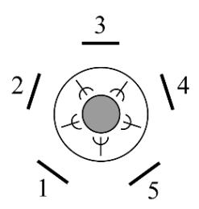

Рис. 1.16. Постановка задачи о пяти философах

Пусть пять философов гуляют по саду, время от времени посещая беседку. Там для них сервирован стол (рис. 1.16), в центре которого расположено блюдо со спагетти. За каждым философом закреплено определенное место (цифры на рис. 1.16), по левую и правую руку от посетителя лежат вилки. Спагетти положено кушать двумя вилками одновременно, однако на всех вилок пять. Необходимо построить модель для предсказания поведения философов в виде сети Петри.

Заранее ограничим спектр возможных действий философа, включив для ясности такое ограничение в состав задачи. Пусть i-ый философ (1≤i≤5) может, но не должен, совершить следующие действия:

- 1. Зайти в беседку и занять свое место за столом (срабатывание перехода ti1 сети);
  - 2. Взять левую от себя вилку (срабатывание перехода ti2 сети);
  - 3. Взять правую от себя вилку (срабатывание перехода ti3 сети);
  - 4. Принять пищу (срабатывание перехода ti4 сети);
  - 5. Оставить свою левую вилку (срабатывание перехода ti5 сети);
  - 6. Оставить свою правую вилку (срабатывание перехода ti6 сети);
  - 7. Покинуть беседку (срабатывание перехода ti7 сети).

Оговорим также очередность действий: философ берет вилки в любой последовательности или одновременно только после занятия своего места, затем принимает пищу, после чего оставляет вилки (также в любой последовательности или одновременно) и покидает беседку. Этот процесс может повторяться сколько угодно раз. Нарушение указанной очередности недопустимо.

Также воспрещается одновременное пользование одной вилкой двум философам, хотя ловкие студенты демонстрировали автору настоящего текста и такое. Опоздавший к столу философ вынужден ожидать соседа, пока тот не освободит общую вилку. Вопросы гигиены при этом выносятся за рамки рассмотрения.

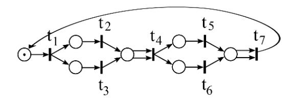

Рис. 1.17. Сеть Петри для случая одного философа

Сначала для простоты обратимся к решению задачи в постановке с одним философом (рис. 1.17). При указанной начальной разметке сработать может только переход t1. После срабатывания t1, допускается срабатывание t2 и t3 – одновременное или в любой очередности. Этот фрагмент сети совпадает с аналогичным на рис. 1.13. После взятия обоих вилок возможен прием пищи. Моделирование оставления вилок производится тем же образом, что и их взятие. Последующее покидание беседки связано с оставлением вилок в модели на рис. 1.17 так же, как принятие пищи со взятием вилок. Дуга, соединяющая последний переход и первое место сети, необходима для моделирования повторного возвращения философа в беседку. Отметим, что согласно сети на рис. 1.17 философ не может принимать пищу или покинуть беседку с одной вилкой, как это и требуется по условию.

Возвращаясь к задаче в полной постановке с пятью философами попробуем принять за ее решение пять не связанных друг с другом сетей, аналогичных представленной на рис. 1.17 – по одной для каждого философа. Однако это противоречит необходимости согласования действий философов при пользовании общими вилками. Например, левая вилка первого философа есть правая вилка второго (рис. 1.16).

Вилки в данном случае будут общими ресурсами процессов. Работа с общим ресурсом в модели, построенной на основе сети Петри, сопровождается выделением под него дополнительного места и помещением в это место при начальной разметке сети количества фишек, равного числу процессов, которым позволено упомянутым ресурсом одновременно пользоваться. Под процессом здесь будем понимать совокупность действий одного философа, рассматривая в итоге пять взаимодействующих процессов.

Таким образом, к оговоренным ранее пяти сетям необходимо добавить пять дополнительных мест, через которые сети окажутся связанными в одну общую. На рис. 1.18 представлен фрагмент этого решения, содержащий подсети для первого и второго философов, связанных через дополнительное место p1. Пунктирными дугами на рисунке обозначены связи с другими подсетями: для третьего философа сверху и пятого снизу.

При начальной разметке (рис. 1.18а) в p1 помещается одна фишка – вилкой может пользоваться только один философ. Если в ходе работы сети Петри место p1 окажется пустым, значит один из философов, первый либо второй, пользуются вилкой, место которой между ними. Так, на рис. 1.18б изображена разметка, при которой второй философ, отобедав, оставил левую от себя вилку, задержав правую. Из-за чего первый не может взять свою левую (это правая вилка второго философа) и приступить к трапезе (свою правую он уже взял). Как только сработает t26 в месте p1 появится фишка и первый философ сможет взять свою левую вилку.

Модель не определяет результат конкуренции философов за общую вилку, когда они одновременно получат возможность взять ее. Однако любой исход этой коллизии может быть описан сетью на рис. 1.18.

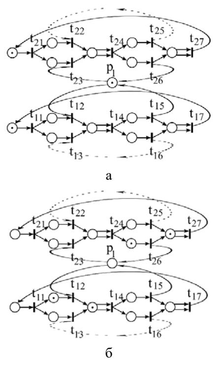

Рис. 1.18. Фрагмент сети Петри для задачи о пяти философах: а – с начальной разметкой; б – иллюстрирующий невозможность одновременного использования общего ресурса

Представим теперь ситуацию, когда все философы, зайдя в беседку, одновременно взяли левые от себя вилки (параллельно сработали все переходы ti2 сети). Судьба общего вычислительного процесса после этого печальна, что отражается и на модели – ни один переход далее сработать не может. Ведь левая вилка философа есть правая вилка его соседа слева, следовательно ни один философ не в состоянии взять свою правую вилку и произвести все остальные действия. Оставить левую вилку философ так же не в праве, это действие возможно только после принятия пищи, а принятие – после взятия правой вилки.

Сложившееся положение, когда ход вычислительного процесса останавливается действиями его участников (подпроцессов), воспрещающих друг другу доступ к общему ресурсу, при том критически в нем нуждающихся, назовем блокировкой (clinch или deadlock в англоязычной литературе).

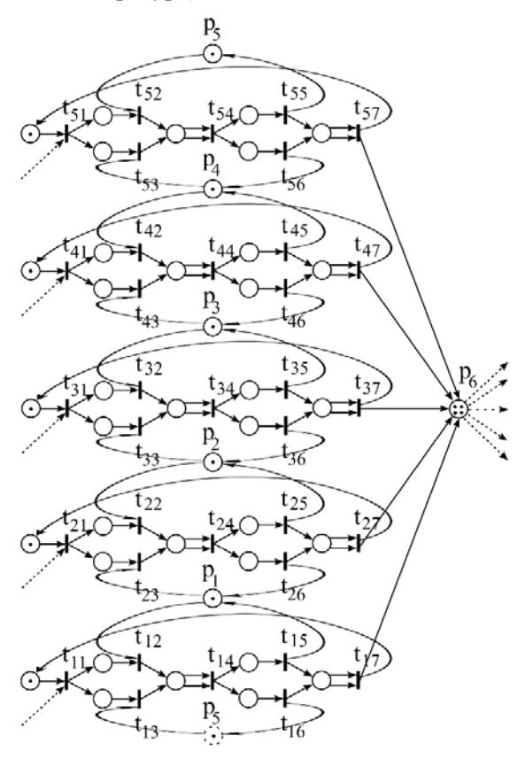

Рис. 1.19. Сеть Петри для задачи о пяти философах с воспрещением всем одновременного посещения беседки

Обнаружение блокировки в ходе моделирования не является свидетельством ошибки построения Сети Петри; наоборот — это успех в ее использовании. Для исправления ситуации необходимо в первую очередь не модифицировать сеть (*что на зеркало пенять, коли рожа крива*), а понять и устранить причины блокировки в реальном процессе.

В случае задачи о пяти философах одним из способов исключения блокировки признается введение в условие задачи запрета на одновременное посещение беседки всеми философами. Дополнительно к вилкам общим ресурсом становится сама беседка, что при построении модели реализуется появлением на изображении сети (рис. 1.19) нового перехода р<sub>6</sub> и помещением в него при начальной разметке четырех фишек (количество процессов, одновременно допущенных к общему ресурсу).

На рис. 1.19 пунктирной окружностью обозначено продублированное место  $p_5$ , а пунктирными дугами значения функции инцидентности  $M(p_6,t_{1i})$  для всех i.

С упрощением модели связан другой способ исключения блокировки, при котором философам предписывается одновременное взятие и оставление вилок (рис. 1.20).

На примере данной сети изучают вторую, характерную наряду с блокировкой, ошибку, допускаемую при организации параллельных вычислений. Положим, что первый и третий философы вступили в преступный сговор с целью уморить второго голодом. Видя его намерение пообедать, первый обгоняет второго, берет обе свои вилки и приступает к трапезе. Второй, заняв свое место за столом, не может взять правую вику (ее взял первый философ), хотя левая свободна. Через некоторое время за стол присаживается третий философ и берет свои вилки, начиная принимать пищу. Первый оставляет вилки и уходит. Второй философ и в этом случае не может покушать — теперь у него свободна правая вилка, однако уже занята

левая. Так, чередуясь, первый и третий философ препятствуют второму получить доступ о общим ресурсам – вилкам и отталкивают его от пищи.

Положение, когда в целом процесс не останавливается, однако в его рамках один или несколько подпроцессов не в состоянии получить доступ к общему ресурсу в силу препятствий, обусловленных действиями других участников, называется отталкиванием (starvation или livelock в англоязычной литературе).

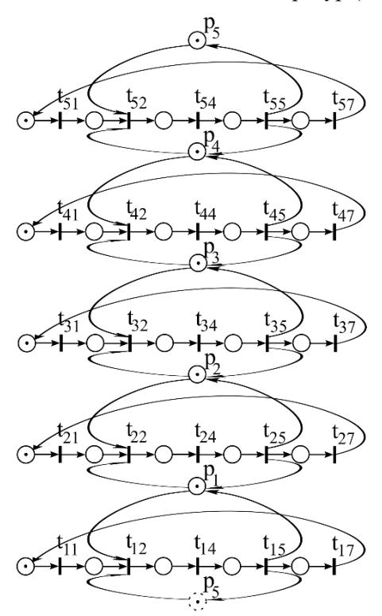

Рис. 1.20. Сеть Петри для задачи о пяти философах с предписанием одновременного взятия и оставления вилок

В отличие от блокировки, которая легко диагностируется на практике однократным просмотром в системном мониторе списка процессов и их активности, отталкивание можно не замечать длительное время и даже оставить необнаруженным, если оно не приводит к ошибке в вычислениях. Для его предварительного выявления и используется моделирование на сетях Петри.

#### Вопросы и задачи к параграфу 1.3

- 1.3.1 Сколько ветвей можно выделить в каждом из вычислительных процессов, пространственно-временные диаграммы которых изображены на рис. 1.9?
- 1.3.2 Можно ли по графу следования оценить длительность вычислительного процесса?
  - 1.3.3 Что общего между сетями Петри и конечными автоматами?
- 1.3.4 Почему для переходов сети Петри не формулируется свойство, аналогичное четвертому свойству сети для мест? Например,  $\forall t_1, t_2 \in T$  при условии ( ${}^*t_1 = {}^*t_2$ ) и ( $t_1 = {}^*t_2$ ) верно, что  $t_1 = t_2$ .
- 1.3.5 Составьте и опишите работу сети Петри, моделирующей процесс умножения двух квадратных матриц n×n
- 1.3.6 Составьте и опишите работу сети Петри, моделирующей процесс решение системы линейных алгебраических уравнений, с матрицей трехдиагонального вида, методом Гаусса-Зейделя. Количество итераций примите заранее известным.
- 1.3.7 Составьте и опишите работу сети Петри, моделирующей процесс решение системы линейных алгебраических уравнений, с матрицей трехдиагонального вида, методом прогонки.
- 1.3.8 Сформулируйте новый вариант условия задачи о пяти философах, включающий одновременное взятие и оставление философом вилок, устраняющий отталкивание. Составьте соответствующую модель с помощью сети Петри.

# **2** АВТОМАТИЧЕСКОЕ РАСПАРАЛЛЕЛИВАНИЕ ПОСЛЕДОВАТЕЛЬНЫХ ПРОГРАММ

Встретившись с необходимостью ускорения вычислений по существующей последовательной программе, исследователь зачастую обращается к использованию директив автоматического распараллеливания стандартов ОрепМР [1] или ОрепАСС [2]. Действительно, для полноценной разработки параллельного алгоритма желательны как владение предметной областью, задача из которой решается в ходе выполнения программы, так и определенная квалификация в области параллельных вычислений. Такое сочетание навыков в одном человеке – редкость. Когда же встречаются двое, предметник удивляется как можно не знать таких простых вещей, а вычислитель не понимает чего от него хотят. Выходом из сложившейся ситуации традиционно является использование автоматического распараллеливания. Большим подспорьем при этом будет знакомство, хотя бы в общих чертах, с особенностями такого распараллеливания.

Далее, следуя классификации директив OpenMP и OpenACC, отдельно рассмотрим два случая автоматического распараллеливания: ациклических и циклических участков последовательных программ.

# 2.1 Автоматическое распараллеливание ациклических участков последовательных программ

Абстрагируясь от предметной области (физики, химии, биологии и т.п.) будем считать последовательную программу пошаговым предписанием действий над различными участками памяти. Для простоты, допустим в ней лишь два вида инструкций: присваивания и условного перехода, выразив остальные через них.

#### 2.1.1 Стандартный граф

В первую очередь построим по такой программе стандартный граф. Последний характеризуется двумя типами вершин (преобразователи, распознаватели) и дугами. Преобразователи соответствуют операторам присваивания и обозначаются на графе прямоугольниками, распознаватели — операторам условных переходов и обозначаются окружностями. Один преобразователь может быть связан с несколькими операторами присваивания (расположенными в тексте программы рядом без пропусков); при том один оператор всегда соотносится только с одной вершиной. Один распознаватель связан лишь с одним условным переходом и наоборот.

Дуги стандартного графа задаются бинарным отношением непосредственного следования на множестве вершин, которое в свою очередь определяется последовательностью расположения операторов друг за другом в тексте программы и условными переходами. Из преобразователя выходит не более одной дуги, из распознавателя не более двух. Дуга, соответствующая истинности условия, связанного с распознавателем, маркируется цифрой 1, ложности – 0. Вершину, в которую не входит ни одна дуга, назовем входной; из которой не выходит не одна дуга – выходной вершиной стандартного графа.

Продолжая пример из прошлой главы, связанный с решением квадратного уравнения, несколько усложним его, допустив произвольное значение дискриминанта. Для записи программы используем язык, совпадающий с ранее введенной (пункт 1.2.2) алгоритмической нотацией.

В тексте Программы 2.1 все переменные действительного типа, за исключением *res*, в которой хранится строка. Операция "+" применяется в том числе для объединения строк, функция "*str*" переводит действительную величину в строчную.

**Программа 2.1** Решение квадратного уравнения с условным переходом

```
А bbod{a, b, c} % задание коэффициентов уравнения В d=b^2-4ac % вычисление дискриминанта С if\ b^2<4ac\ then % проверка значения дискриминанта D res='deŭcmbumeльных\ корней\ неm' else Е x_1=(-b+\sqrt{d}\ )/(2a) % значение первого корня F x_2=(-b-\sqrt{d}\ )/(2a) % значение второго корня G res='x_1='+str(x_1)+';\ x_2='+str(x_2) end\ if Н bbbod{res} % вывод результата
```

На рис. 2.1 а изображен стандартный граф для Программы 2.1 с входной вершиной A и выходной H. Маркировка операторов программы и соответствующих им вершин совпадает. Вершины A, B, D, E, F, G, H — преобразователи. Дуги, выходящие из единственной вершины — распознавателя C обозначены оговоренным ранее образом.

# 2.1.2 Граф зависимостей

За этапом построения стандартного графа следует формирование графа зависимостей. Вершины обоих графов совпадают, а функции инцидентности разнятся. Зависимостями будем называть следующие три бинарных отношения на множестве вершин нового графа. Их общее (без различия типа отношения) транзитивное замыкание задает дуги графа зависимостей.

Информационная зависимость. Будем говорить, что вершина А' информационно зависит от вершины А, если они лежат на одном пути стандартного графа из входной вершины в выходную, при чем А предшествует А', и хотя бы в одном из операторов, относящихся

к вершине A, изменяется значение переменной, которую не перезаписывает, но использует хотя бы один оператор, относящийся к вершине A':  $Out(A) \cap (In(A')/Out(A')) \neq \emptyset$ . Более того, на указанном пути между A и A' отсутствует вершина A", связанная с хотя бы одним оператором программы, меняющим значение упомянутой переменой.

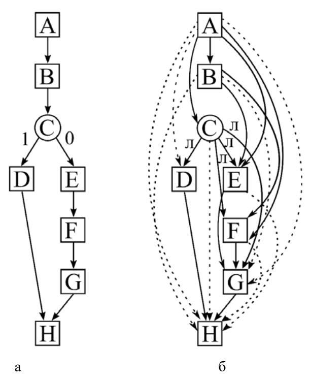

Рис. 2.1. Стандартный граф (а) и граф зависимостей (б) для Программы 2.1

В приведенной формуле запись Out(A) обозначает множество всех переменных (элементов массивов), расположенных в левой части операторов присваивания, связанных с вершиной A; In(A') – множество всех переменных (элементов массивов), расположенных в правой части операторов присваивания, связанных с A', если эта вершина преобразователь, или формирующих условие, если A' –

распознаватель. В общем случае  $In(A') \cap Out(A') \neq \emptyset$  — одна и та же переменная может присутствовать в связанном с A' операторе присваивания по обе его части. Тогда, для обозначения ситуации «не перезаписывает, но использует», верна нотация In(A')/Out(A'). Информационную зависимость вершины от самой себя исключим, как не имеющею смысла в рассматриваемом контексте (свойство антирефлексивности информационной зависимости).

Как следует из определения, вершина от которой информационно зависят — всегда преобразователь, которая информационно зависит — может быть как преобразователем, так и распознавателем.

Возвращаясь к примеру с программой 2.1, нанесем на граф зависимостей (рис. 2.1 б) дуги, соответствующие бинарному отношению информационной зависимости, изобразив их непрерывными линиями со стрелками на конце без дополнительной маркировки. Сравнивая графы на рис. 2.1 а и 2.1 б отметим появившиеся различия. Так, на стандартном графе вершина С непосредственно следует за В, а на графе зависимостей С информационно от В не зависит. И наоборот, на рис. 2.1 а из А в С нет дуги, а на рис. 2.1 б есть.

*Погическая зависимость*. Будем говорить, что вершина А' логически зависит от вершины А, если они лежат на одном пути стандартного графа из входной вершины в выходную, при чем А предшествует А', и существует другой путь на стандартном графе из входной вершины в выходную, совпадающий с первым вплоть до А включительно, далее отличающийся от него и не содержащий А'.

Значит вершина от которой логически зависят – всегда распознаватель, которая логически зависит – может быть как преобразователем, так и распознавателем.

В примере на рис. 2.1 б логические зависимости обозначены непрерывными дугами, маркированными в начале (при выходе из распознавателя) литерами "л". Может показаться, что все вершины, следующие за С в стандартном графе, должны логически от С зависеть. Однако на рис. 2.1 б такой зависимости для Н нет, почему?

Дело в том, что через H действительно проходит путь стандартного графа, в котором C предшествует H, и существует другой путь, отличающийся от первого сразу после C. Однако оба упомянутых пути содержат вершину H, в силу чего она не зависит логически от C. C каким бы значением условия не выполнился оператор условного перехода, связанный с C, оператор, относящийся к H, далее в ходе вычислительного процесса будет обязательно исполнен.

Конкуренционная зависимость. Будем говорить, что вершина A' конкуренционно зависит от вершины A, если они лежат на одном пути стандартного графа из входной вершины в выходную, при чем A предшествует A', и хотя бы в одном из операторов, относящихся к вершине A, изменяется значение переменной, которая также модифицируется хотя бы в одном операторе, относящимся к вершине A':  $Out(A) \cap (Out(A')) \neq \emptyset$ .

К случаю конкуренционной зависимости отнесем ситуацию, когда в операторе, связанном с вершиной А', оговариваемая переменная присутствует по обе стороны от символа присваивания. В конкуренционную зависимость вступают исключительно преобразователи.

В рассматриваемом примере Программы 2.1 конкуренционные зависимости отсутствуют.

Завершая формирование графа зависимостей откажемся от различения их типов, необходимого только на предыдущих этапах построения, произведя транзитивное замыкание. Дополнительные дуги, появившиеся в результате этой операции, изображены на рис. 2.1 а пунктирными.

В итоге, вершина Н все-таки оказалась зависимой от Р. С каким бы значением условия не выполнился оператор условного перехода, связанный с С, важно, что он выполнился и исполнение оператора, относящегося к Н, должно следовать позже. А значит Н зависит от Р, пусть и не логически.

Далее зависимость вершины A' от A будем записывать как dep(A,A'), обращаясь к графу зависимостей. Если же речь пойдет о пути, то смотреть будем на стандартный граф.

#### 2.1.3 Ярусно-параллельная форма

Построение ярусно-параллельной формы (ЯПФ) программы начинается с помещения в первый ее ярус вершин графа зависимостей, которые не зависят ни от какой другой вершины этого графа. Каждый следующий ярус образуется из вершин, зависящих исключительно от вершин предыдущих ярусов. С исчерпанием вершин графа зависимостей построение ярусно-параллельной формы считается завершенным.

Разрабатывая методы автоматического распараллеливания необходимо алгоритмизировать и предельно формализовать все предписания, как предназначенные для исполнения на вычислительной системе.

Тогда процедура построения ЯП $\Phi$  может быть представлена в следующем виде.

- **Шаг 1.** В первый ярус ЯПФ помещаются вершины А такие, что  $\forall A' \ \ \ \ \$  dep(A',A). При записи ЯПФ общего вида они будут дополнительно маркированы парой индексов  $A_{1,1}; A_{1,2}; A_{1,3}; \ldots A_{l,n_l}$ , где первый номер яруса, второй номер в ярусе. Пусть первый ярус будет составлен из  $n_l$  вершин.
- **Шаг 2.** Положим, что k ярусов уже построены. Если  $\forall A$  из графа зависимостей  $\exists i \leq k$  и  $\exists j \leq n_i$  такие, что  $A = A_{i,j}$  (все вершины распределены по ярусам), то построение ЯПФ завершено. Иначе переходим на шаг 3.
- **Шаг 3.** Ярус k+1 заполняется вершинами A такими, что  $\forall A$  из dep(A',A) следует, что  $\exists i \leq k$  и  $\exists j \leq n_i$  такие, что  $A_{i,j}=A'$  (A зависит только от вершин предыдущих ярусов). Увеличиваем счетчик ярусов k на единицу, переходим на шаг 2.

По окончанию заполнения ЯПФ примет вид, представленный в табл. 2.1.

Таблица 2.1. ЯПФ в общем виде ярус 1 А1,1; A1,2; A1,3; … 1 A1,n ярус 2 А2,1; A2,2; A2,3; … 2 A2,n … … ярус k Аk,1; Ak,2; Ak,3; … k Ak,n

Таблица 2.2. ЯПФ для Программы 2.1 ярус 1 A ярус 2 B; C ярус 3 D; E; F ярус 4 G ярус 5 H

Обращаясь к примеру графа зависимостей на рис. 2.1 б для Программы 2.1 поместим соответствующую им ЯПФ в табл. 2.2.

Важной особенностью ЯПФ является независимость вершин одного яруса в силу требования их зависимости исключительно от вершин предыдущих ярусов (шаг 3). Значит операторы программы, относящиеся к разным вершинам одного яруса, можно исполнять независимо друг от друга – параллельно. В ЯПФ на рис. 2.1 б одновременно можно исполнять операторы, связанные с вершинами B и C (второй ярус), затем D, E и F (третий ярус). Указанное обстоятельство служит основой для построения параллельного алгоритма по ЯПФ.

### *2.1.4 Параллельный алгоритм*

Известно множество способов синтеза параллельных алгоритмов и программ по составленной ЯПФ [10,12], здесь же представим наиболее простой.

Пусть заранее известно число задач параллельного алгоритма *p*. Необходимо распределить вершины ЯПФ по задачам, оговорив для каждой последовательность исполнения операторов, с этими вершинами связанных, и коммуникации между задачами.

Процедура синтеза параллельного алгоритма может быть представлена в следующем виде.

- **Шаг 1.** К задаче *µ* параллельного алгоритма (1≤*µ*≤*p*) отнесем следующие вершины первого яруса: А1,*µ*; A1,*µ*+*p*; A1,*µ*+2*p*; … A1,*µ*+*rp*, где *r* – натуральное число и вершины A1,*µ*+(*r*+1)*<sup>p</sup>* не существует (*µ*+*rp*≤n1<*µ*+(*r*+1)*p* – т.е. ярус для задачи *µ* исчерпан). Читатель уже знаком с таким способом распределения данных по задачам, именуемым в пункте 1.2.2. циклическим.
- **Шаг 2.** Положим, что q ярусов ЯПФ уже распределены между задачами. Если q = k (все ярусы исчерпаны), то параллельный алгоритм считаем построенным, иначе переходим на шаг 3.
- **Шаг 3.** К задаче *µ* параллельного алгоритма отнесем следующие вершины яруса q, расположив их после вершин предыдущего яруса в последовательности: c(Аq,*µ*); Аq,*µ*; c(Aq,*µ*+*p*); Aq,*µ*+*p*; c(Aq,*µ*+2*p*); Aq,*µ*+2*p*; … c(Aq,*µ*+*rp*); Aq,*µ*+*rp*, где *µ*+*rp*≤nq<*µ*+(*r*+1)*p*. Каждой вершине A в этом списке, в отличие от шага 1, предшествует функция c(A). Увеличиваем счетчик q на единицу, переходим на шаг 2.

Таким образом к каждой задаче относят вершины определенного яруса ЯПФ с шагом *p*, перебирая ярусы до их исчерпания. Произвольность расположения вершин на одном ярусе задает вариативность их распределения по задачам и возможность «пересборки» параллельного алгоритма. Кроме того, применение сформулированной процедуры распределения при большом количестве задач и малом числе вершин на некоторых ярусах обусловит несбалансированность алгоритма, когда задачам с меньшими номерами достанется большее количество вершин. В такой ситуации уместней не модифицировать правило распределения вершин по ярусам, а уменьшить число задач.

Отдельного внимания заслуживает обсуждение формализма определения значений функции c(A), задающей синхронизацию вычислений между задачами и коммуникации параллельного алгоритма. Обсуждаемая функция может:

- принимать значение 1 («истина»), тогда операторы, относящиеся к следующей за ней вершине A, подлежат исполнению;
- принимать значение 0 («ложь»), тогда операторы, относящиеся к следующей за ней вершине A, не подлежат исполнению, а вычислительный процесс, связанный с исполнением инструкций данной задачи, продолжается определением значения следующей за A функции c(..);
- не принимать определенного значения, тогда вычислительный процесс, связанный с исполнением инструкций данной задачи, приостанавливается до определения значения c(A).

То есть c(A) не функция в строгом математическом смысле, в рамках которого не рассматривается развитие во времени вычислительного процесса по определению ее значения. В параллельном алгоритме c(A), как правило, соответствует инструкциям приема данных, необходимых для выполнения операторов вершины A и формируемых в других задачах, содержащих вершины, от которых А зависит. Следовательно, в этих других задачах необходимо организовать отправку упомянутых данных.

Обращаясь непосредственно к формализму определения c(A) положим, что из входной вершины стандартного графа в вершину A ведет S различных путей. Свяжем c каждым из них  $(1 \le s \le S)$  функцию  $c_s$ :

- принимающую значение 1 ("истина"), если в ходе вычислительного процесса (уже параллельного) исполнились все операторы, относящиеся к вершинам выбранного пути, от которых А зависит, таким образом, чтобы эти зависимости оказались удовлетворенными;
- принимающую значение 0 ("ложь"), если в ходе вычислительного процесса (уже параллельного) хотя бы один оператор, относящийся к любой вершине выбранного пути, от которой А зависит, заведомо не исполнится удовлетворяющим эту зависимость образом;

 пока не принимающую определенного значения, если ход вычислительного процесса не определен на столько, чтобы знать, исполнились ли обсуждаемые операторы удовлетворительным образом или не исполнились.

Что здесь понимается под удовлетворением зависимости? Для оператора присваивания, формирующего значение необходимой переменной, имеется в виду его исполнение. Говоря об операторе условного перехода, имеется в виду не только исполнение этого оператора, но и такое значение условия, при котором вычислительный процесс пойдет далее по пути, содержащем А.

Тогда c(A)= $c_1$  $\lor$  $c_2$  $\lor$  ...  $\lor$  $c_s$ . То есть, если течение вычислительного процесса тем или иным путем (а их всего S) дошло до исполнения действий, связанных с вершиной A, то указанные действия надлежит исполнить. Если же ни один из возможных путей в ходе вычислительного процесса не реализовался и уже точно не реализуется, то исполнять действия, связанные с A не следует.

Отметим, что обсуждаемый параллельный вычислительный процесс и последовательный процесс, описываемый стандартным графом, суть разные процессы. Что, однако, не мешает отмечать ход параллельного процесса на стандартном графе маркированием части его вершин, как пройденных, и таким образом иметь возможность говорить о реализации того или иного пути на этом графе.

Предваряя формализацию определения значений  $c_s$ , выпишем все вершины на пути s, от которых A зависит, в порядке их следования:  $A^1, A^2, A^3, ..., A^I$ . Тогда  $c_s = c^1 \wedge c^2 \wedge ... \wedge c^I$ . В свою очередь, при  $1 \le i \le I$ :

 $c^{i}=c(A^{i})$ , если  $A^{i}$  – преобразователь;

 $c^i$ = $c(A^i$ =1), если  $A^i$  — распознаватель и для реализации пути в необходима истинность значения, связанного с ним условия (при таком значении  $c^i$ =1, иначе 0);

 $c^{i}$ = $c(A^{i}$ =0), если  $A^{i}$  — распознаватель и для реализации пути в необходима ложность значения, связанного с ним условия (при таком значении  $c^{i}$ =1, иначе 0).

И итоге, искомое значение c(A) формируется как дизьюнкция коньюнкций и зачастую результирующее выражение выглядит достаточно громоздко. Однако, может быть значительно упрощено из ряда практических соображений. Например, нет смысла проверять значение  $c(A^i)$ , если вершина  $A^i$  отнесена к той же задаче параллельного алгоритма и ее операторы действовали над общей с операторами A областью памяти. Или, если вычисление  $c(A^i)$  предваряло исполнение операторов, относящихся к  $A^j$  (пусть даже в другой задаче), а сейчас  $c(A^i)$  подлежит проверке наряду  $c(A^j)$ ; тогда довольно ограничиться определением значения только последней функции.

Поясним изложенное примером, продолжая работу с Программой 2.1, графами на рис. 2.1 и ЯПФ из табл. 2.2. Положим число задач искомого параллельного алгоритма равным двум и распределим вершины из ярусов ЯПФ между ними, как это показано в табл. 2.3.

Таблица 2.3. Распределение вершин из ЯПФ в табл. 2.2 между задачами параллельного алгоритма при p=2

| anvori | задачи алгоритма |         |  |  |  |
|--------|------------------|---------|--|--|--|
| ярусы  | 1                | 2       |  |  |  |
| 1      | A                |         |  |  |  |
| 2      | c(C); C          | c(B); B |  |  |  |
| 3      | c(D); D; c(E); E | c(F); F |  |  |  |
| 4      | c(G); G          |         |  |  |  |
| 5      | c(H); H          |         |  |  |  |

В каждой задаче инструкции, связанные с конкретными вершинами, будут исполняться последовательно, в направлении сверху вниз по соответствующему столбцу табл. 2.3. Так, первая задача последовательно исполнит операторы, относящиеся к A; c(C); C; c(D); D; c(E); E; c(G); G; c(H); H. Вторая -c(B); B; c(F); F.

Теперь необходимо конкретизировать выражение для каждой функции с(..), по возможности упростив его.

Вершине А, как не зависящей ни от какой другой вершины, не предшествует функция с(..). Оператор, к ней относящийся, исполнится без предварительных условий.

Рассматривая c(B) примем c(B)=c(A): на пути стандартного графа из A (входная вершина) в B расположена только вершина A и B от нее зависит. Практически эта зависимость выражается в необходимости организовать прием значений переменных a, b и c во второй задаче (В помещена в нее) перед исполнением оператора, относящегося к вершине B, в котором эти переменные используются. Соответственно, в первой задаче за оператором, относящимся к A, полагается организовать отсылку указанных значений.

Рассматривая c(C) примем c(C)=c(A)=1: на пути стандартного графа из A в C расположены вершины A и B, при чем C зависит только от A. Более того, C расположена в той же задаче параллельного алгоритма (первой), что и A, следуя за ней. Значит оператор, относящийся к C, исполнится только после оператора, относящегося к A - синхронизации не требуется. К тому же оба оператора исполняются над одной областью памяти - коммуникации не требуется. В итоге, если вычислительный процесс дошел до C, то оператор, с этой вершиной связанный, может быть исполнен без всяких приготовлений.

Рассматривая c(D) примем  $c(D)=c(A)\land c(C=1)=c(C=1)$ : на единственном пути стандартного графа из A в D расположены вершины A, B и C, из них D зависит только от A и C. Все три далее обсуждаемые вершины (A, C и D) помещены в одну задачу, при чем C сама зависит от A и эта зависимость, как было показано выше, удовлетворяется автоматически — значит c(A) можно исключить из коньюнкции. Этого нельзя сделать c(C=1), ведь в зависимости от зна-

чения условия оператора условного перехода, с C связанного, оператор, относящийся к D, может либо исполниться либо нет. На практике указанное условие реализуется помещением оператора, относящегося к вершине D, в подходящую ветку условного перехода.

Рассматривая c(E) примем  $c(E)=c(A)\land c(B)\land c(C=0)=c(B)\land c(C=0)$ : на единственном пути стандартного графа из A в E расположены вершины A, B и C - E зависит от всех. Зависимостью от A, предшествующей E в той же задаче, можно пренебречь по приведенным ранее соображениям. Зависимость от B на практике реализуется отправкой из второй задачи, содержащей B, и приемом в первой, содержащей E, значения переменной d. Обращая внимание на второй сомножитель B конъюнкции, поместим оператор, относящийся B0 вершине B1, в ветку условного перехода, отличную от той, куда ранее отнесли оператор, связанный B2.

Определение значения c(F) аналогично предыдущему случаю с той лишь разницей, что вершина F отнесена K другой задаче. ТаK,  $c(F)=c(A)\land c(B)\land c(C=0)=c(C=0)$ . Зависимостью от K можно пренебречь в силу ее учета при формировании значения K во второй задаче ранее. В силу того, что вершина K предшествует K в одной задаче, зависимость от K также игнорируем. Остается учесть зависимость от K что на практике можно сделать разными способами. Передать результат сравнения K0 из первой задачи, K1 с оно производится при исполнении оператора условного перехода, относящегося K2 вершине K3. Либо продублировать сравнение во второй и обойтись без дополнительной коммуникации. Ведь значения переменных K3 и K4 второй задачей получены ранее при определении K4. Далее выберем второй вариант.

Рассматривая c(G) примем  $c(G)=c(A)\land c(B)\land c(C=0)\land c(E)\land c(F)=$   $=c(C=0)\land c(F)$ . Зависимости от A и E здесь не существенны в силу расположения этих вершин в первой задаче перед G. Зависимость

от В учтена ранее, при формировании c(E). Остается поместить оператор, относящийся к G, в нужную ветку условного перехода и принять значение переменной  $x_2$  от второй задачи, где его формирует оператор, связанный с вершиной F.

**Алгоритм 2.1** Решение квадратного уравнения с условным переходом, разбиение на две задачи

```
if \mu=1 then % инструкции первой задачи
     8800\{a, b, c\} % задание коэффициентов уравнения
     send((a,b,c),2) % отправка коэффициентов второй задаче
     if b^2 < 4ac then % проверка условия
\mathbf{C}
         res='действительных корней нет'
D
      else
        recv(d,2) % получение дискриминанта от второй задачи
        x_1 = (-b + \sqrt{d})/(2a) % значение первого корня
\mathbf{E}
        recv(x_2,2) % получение второго корня от второй задачи
        res = 'x_1 = '+str(x_1) + '; x_2 = '+str(x_2)
G
     end if
     вывод{res} % вывод результата
Н
  else % инструкции второй задачи
     recv((a,b,c),1) % прием коэффициентов от первой задачи
                    % вычисление дискриминанта
B
     d=b^2-4ac
     if b^2 \ge 4ac then % дублирующая проверка условия
        send(d, l) % отправка дискриминанта первой задаче
         x_2 = (-b - \sqrt{d})/(2a) % значение второго корня
F
        send (x_2, 1) % отправка второго корня первой задаче
     end if
   end if
```

Особенностью рассмотрения c(H) является наличие двух путей из входной вершины в  $H: c(H)=[c(A)\land c(B)\land c(C=1)\land c(D)]$   $\vee$ 

 $[c(A)\land c(B)\land c(C=0)\land c(E)\land c(F)\land c(G)]=c(D)\lor c(G)=1$ . Первый путь завершается вершиной D, второй – G. Разумно проверить исполнение инструкций, связанных только с этими вершинами, для выяснения – пройдены ли соответствующие пути или нет. К тому же, обе указанные вершины помещены в ту же задачу, где оказалась вершина H и предшествуют ей. Следовательно, производство упомянутых проверок представляется излишним. Если вычислительный процесс дошел, не важно каким путем, до оператора, связанного с G, то может не останавливаться.

Построенный параллельный алгоритм в нотации Голуба выглядит следующим образом.

Обратим внимание на отправку значения дискриминанта второй задачей — она производится после условного перехода. Отправка дискриминанта сразу, по его вычислению, не имеет смысла. Если  $b^2 < 4ac$ , то в первой задаче инструкция по приему такого дискриминанта не предусмотрена.

Автор предостерегает читателя от реализации приведенного примера, характеризующегося исключительно методической ценностью, на практике. Выигрыш от одновременного исполнения части инструкций будет нивелирован коммуникационными издержками. В действительности, к одной вершине стандартного графа и графа зависимостей необходимо относить блоки кода со значительно большим количеством операторов.

## Вопросы и задачи к параграфу 2.1

- 2.1.1 Может ли в стандартном графе быть несколько входных или выходных вершин и почему?
- 2.1.2 Укажите свойства следующих бинарных отношений: информационной зависимости, логической зависимости и конкуренционной зависимости.

- 2.1.3 Может ли в ярусно-параллельной форме на первом ярусе находиться несколько вершин (приведите примеры)?
- 2.1.4 Может ли в ярусно-параллельной форме на ярусе k+1 находиться вершина, не зависящая ни от одной вершины яруса k?
- 2.1.5 Может ли в ярусно-параллельной форме на ярусе k+1 находиться вершина, не зависящая от некоторой вершины яруса k?
- 2.1.6 Запишите последовательную программу нахождения корней кубического уравнения по формуле Кардано, составьте для нее стандартный граф.
- 2.1.7 Постройте граф зависимостей для последовательной программы из предыдущей задачи, составьте по этому графу яруснопараллельную форму.
- 2.1.8 Составьте параллельный алгоритм решения кубического уравнения по формуле Кардано, используя результаты решения 2.1.6 и 2.1.7. Рассмотрите случаи алгоритмов с двумя и тремя задачами.

# 2.2 Автоматическое распараллеливание циклических участков последовательных программ

Обозревая инструментальный набор вычислительной математики непросто обнаружить численный метод, в котором большая часть арифметических операций не выполнялась бы циклически. У итерационных методов решения нелинейных уравнений, систем линейных и нелинейных уравнений, указанная особенность даже упомянута в названии. В практике программирования она реализуется посредством циклических конструкций.

## 2.2.1 Пространство итераций

Остановимся на рассмотрении вложенной циклической конструкции [12], представленной в Программе 2.2.

```
Программа 2.2 Вложенная циклическая конструкция for \ i_1 = 1 : n_1 % первый цикл for \ i_2 = 1 : n_2 % второй цикл ... for \ i_K = 1 : n_K % k-ый цикл T(i_1, i_2, ..., i_K) % тело циклической конструкции end \ for ... end \ for end \ for
```

Тело циклической конструкции  $T(i_1,i_2,...,i_K)$  Программы 2.2 содержит операторы, характеризующие численный метод, в которых используются значения параметров циклов  $i_1,i_2,...,i_K$ , возможно не все.

Здесь, как и в предыдущем параграфе, необходимо перейти от программы к ее математической модели. Затем, в рамках этой модели, поставить цель, достижение которой связать с построением параллельного алгоритма. Формулируя его сначала на языке модели, затем вне его, возвращаясь к привычному перечислению инструкций.

Поставим каждой итерации вложенной циклической конструкции Программы 2.2 во взаимно однозначное соответствие вектор  $(i_1,i_2,...,i_K)$ , где  $1 \le i_k \le n_k$ ,  $1 \le k \le K$ ; различая прямое и наклонное написание одних и тех же букв. Относя прямое к математической модели программы, наклонное — к коду и понимая их связь. Совокупность всех таких векторов для обсуждаемой циклической конструкции составит относящееся к ней пространство итераций  $I = \{(i_1,i_2,...,i_K): 1 \le i_k \le n_k, 1 \le k \le K\}$ .

На построенном пространстве зададим два бинарных отношения, предварительно представив всю циклическую конструкцию в

«развернутом» ациклическом виде: T(1,...,1,1); T(1,...,1,2); ...  $T(1,...,1,n_K)$ ; T(1,...,2,1); ...  $T(n_1,...,n_{K-1},n_K)$ . Из параграфа 2.1 для нее уже известны бинарные отношения непосредственного следования и зависимости. Транзитивным замыканием отношения непосредственного следования несложно ввести бинарное отношение следования на множестве вершин стандартного графа «развернутой» конструкции.

Помним о взаимно однозначном соотношении фрагмента кода, связанного с набором операторов  $T=T(i_1,i_2,...,i_K)$  в обсуждаемом ациклическом построений, и соответствующего ему вектора  $\mathbf{i}=(i_1,i_2,...,i_K)$  пространства итераций. Определяя бинарное отношение следования, будем говорить, что вектор  $\mathbf{i}'$  следует в пространстве итераций I за вектором  $\mathbf{i}$ , если в стандартном графе для «развернутой» конструкции любая вершина, относящаяся к фрагменту T', следует за любой вершиной, связанной с T.

Аналогично, определяя бинарное отношение зависимости, будем говорить, что вектор і' зависит в пространстве итераций І от вектора і, если в графе зависимостей для «развернутой» конструкции существует вершина, относящаяся к фрагменту T', которая зависит от любой вершины, связанной с T.

Положим своей целью отыскание покрытия  $\{I_q\}_{q=1,Q}$  пространства итераций I такого, что любое подмножество  $I_q$ , его составляющее, содержит только независимые друг от друга вектора. Все итерации циклической конструкции, связанные с такими векторами из  $I_q$ , могут исполняться независимо — параллельно.

Логично одной задаче искомого параллельного алгоритма, заданного обсуждаемым покрытием, предписать исполнение инструкций фрагмента T, связанного с вектором i, входящим в подмножество  $I_q$ . Тогда общее количество задач алгоритма можно принять равным мощности некоторого подмножества  $I_q$  ( $1 \le q \le Q$ ) из найденного покрытия, содержащего наибольшее количество векторов.

Дальнейшая конкретизации алгоритма (размещение по задачам инструкций из фрагментов, связанных с векторами из разных подмножеств одного покрытия, и установка коммуникаций) зависит от используемого метода построения и подлежит объяснению далее, вместе с изложением метода. В методе же оговаривается и правило нахождения покрытия.

Ускорение вычислений по параллельному алгоритму оценим безразмерной величиной  $S = \prod_{k=1}^K n_k / Q$ . Действительно, при условии одинаковой длительности исполнения всех итераций и без учета коммуникационных издержек, время выполнения параллельной программы будет в Q раз меньше по сравнению со временем последовательной. Ведь все итерации, связанные с одним подмножеством  $I_q$  исполнятся одновременно, как одна по длительности. Тогда общее время вычислений по параллельной программе окажется пропорциональным количеству подмножеств в покрытии — Q, независимо от мощности каждого подмножества; а по последовательной, пропорционально общему количеству итераций —  $\prod_k^K n_k$ .

В общем случае может быть найдено несколько покрытий пространства итераций, удовлетворяющих требованию независимости векторов одного подмножества I<sub>q</sub>, Лучшим принято считать характеризующееся максимальным ускорением параллельного алгоритма, с таким покрытием связанного. При этом следует помнить об ограниченной адекватности ранее представленной оценки ускорения и принимать экспериментальную практику как единственный окончательный критерий истины: «Практика выше (теоретического) познания, ибо она имеет не только достоинство всеобщности, но и непосредственной действительности» [6].

Предваряя изложение конкретных методов автоматического распараллеливания циклических фрагментов последовательных

программ укажем на общие для них ограничения: недопустимость изменения параметров цикла в его теле и запрет на существование оператора условного перехода, ведущего за тело цикла.

# 2.2.2 Метод параллелепипедов

Рассмотрим пример циклической конструкции из одного цикла.

#### Программа 2.3

Простой цикл for i=1:10 x(i)=f(x(i-4)) end for

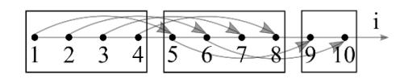

Рис. 2.2. Пространство итераций для Программы 2.3 и его разбиение

В теле цикла из Программы 2.3 значение массива в ячейке i находится как некоторая функция f от значения в ячейке i-4. При этом массив считается заданным для -3<i<10.

Пространство итераций данной циклической конструкции, в котором вектора оказываются скалярами в силу единственности цикла,  $I=\{(i): 1\leq i\leq 10\}$  представлено на рис. 2.2. Не следует сопоставлять всю совокупность элементов массива x и пространство итераций; элементов больше, чем векторов пространства. Стрелками на рис. 2.2 обозначены некоторые отношения зависимости между векторами, соответствующие отношению информационной зависимости на графе зависимостей для "развернутой" конструкции. Их транзитивное замыкание, которое необходимо строить при точном следовании рекомендациям пункта 2.2.1, не добавило бы ничего важного для синтеза параллельного алгоритма, перегрузив рисунок.

Для указанного пространства итераций, с учетом зависимостей на нем, можно построить несколько покрытий, характеризующихся свойством независимости векторов одного подмножества: содержащее в качестве подмножеств по одному вектору пространства

 $\{1\}\cup\{2\}\cup\{3\}\cup\{4\}\cup\{5\}\cup\{6\}\cup\{7\}\cup\{8\}\cup\{9\}\cup\{10\};$  содержащее в качестве подмножеств следующие пары векторов  $\{1,2\}\cup\{3,4\}\cup\{5,6\}\cup\{7,8\}\cup\{9,10\};$  комбинации из предыдущих двух вариантов; приведенное на рис. 2.2  $\{1,2,3,4\}\cup\{5,6,7,8\}\cup\{9,10\}.$  Все перечисленные покрытия окажутся разбиениями пространства І. Рассмотрим их по отдельности.

Первый случай признаем вырожденным. Такое разбиение без труда составляется для любого пространства и любой топологии зависимостей, однако по нему нельзя записать параллельный алгоритм - все итерации придется исполнять последовательно.

Во втором случае возможна организация параллельных вычислений по двухзадачному алгоритму –одно подмножество разбиения содержит два вектора. Путь в алгоритме первой задаче соответствуют все нечетные вектора в порядке их следования (бинарное отношение следования) в пространстве итераций, второй – все четные. Тогда необходимости в организации коммуникаций между задачами не возникает, ведь нечетные вектора зависят только от нечетных, а четные от четных (рис. 2.2) и данные, необходимые для удовлетворения информационной зависимости, хранятся в локальной памяти одной задачи. Записанный в нотации Голуба такой алгоритм представлен далее (Алгоритм 2.2), его ускорение оценивается как S=10/5=2.

## Алгоритм 2.2

Двухзадачный вариант for  $i=\mu:2:10$  x(i)=f(x(i-4)) end for

## Алгоритм 2.3

Четырехзадачный вариант  $for\ i=\mu:4:10$  x(i)=f(x(i-4)) end for

Последнему варианту разбиения пространства итераций, представленному на рис. 2.2, соответствует четырехзадачный Алгоритм

2.3. К его первой задаче отнесем последовательность (обусловленную бинарным отношением следования) векторов 1,5,9, ко второй – 2,6,10, третьей – 3,7 и четвертой – 4,8. Тогда первая и вторая задачи произведут по две итерации цикла, третья и четвертая – по одной. Оценка ускорения в этом случае поднимется до значения S=10/3. Обратим внимание на отсутствие необходимости в какой-либо синхронизации вычислений между задачами. Вполне может статься, что все инструкции первой задачи уже исполнены, а вычислительный процесс, связанный со второй еще не начинался. Заявленного ускорения при этом подтвердить конечно не получится, но и ошибок не будет. Менее удачное распределение векторов по задачам, например: первой задаче принадлежат вектора 1,6,9, а второй – 2,5,10, обусловит включение в параллельный алгоритм коммуникационных операций и, как следствие, увеличение длительности расчетов.

Разбиения одномерного пространства итераций во всех рассмотренных случаях складывались из подмножеств, которые можно интерпретировать отрезками на прямой і (рис. 2.2). Распространяя излагаемый метод на двумерный случай будем говорить о параллелограммах, на трехмерный — о параллелепипедах, давших название методу.

Обращаясь к распараллеливанию циклической конструкции общего вида из Программы 2.2 представим метод параллелепипедов как следующую последовательность этапов [12].

- 1. В декартовом виде строится пространство итераций, на котором задаются бинарные отношения зависимости и следования.
- 2. Ищутся разбиения этого пространства на параллелепипеды, размерности не выше K, каждый из которых содержит исключительно независимые вектора. Далее этапы 3 и 4 проходятся для каждого разбиения по отдельности.
- 3. В некотором разбиении выбирается параллелепипед максимального объёма с длинами сторон  $p_1, p_2, ..., p_K$  (к декартовой длине

прибавляется единица). Каждому вектору і внутри такого параллелепипеда ставится во взаимно однозначное соответствие задача параллельного алгоритма, характеризующаяся в свою очередь другим вектором  $(g_1,g_2,..,g_K)$ , где  $g_k$   $(1 \le k \le K)$  – значение k-ой компоненты вектора і в новой декартовой системе, построенной на ребрах выбранного параллелепипеда и начинающейся с отметки (1,1,..,1). В случае, когда размерность параллелепипеда меньше К, не меняющиеся внутри него координаты gk, принимают равными единице, ей же полагают равными длины фиктивных сторон p<sub>k</sub>. Тогда общее число задач параллельного алгоритма, связанного с выбранным параллелепипедом составит  $\prod^K p_k$  , если параллелепипед прямоуголь-

ный.

- 4. Все вектора пространства итераций распределяются по задачам параллельного алгоритма, при чем из каждого параллелепипеда некоторого разбиения к ведению одной задачи относят не более одного вектора. Внутри задачи вектора располагаются в соответствии с бинарным отношением следования на пространстве итераций. При необходимости оговаривается синхронизация между задачами. Параллельный алгоритм переписывается в нотации Голуба, где синхронизация реализуется посредством инструкций приема и отправки данных. Наиболее простой способ распределения векторов по задачам представлен в параллельном Алгоритме 2.4 для последовательной Программы 2.2.
- 5. Построенные параллельные алгоритмы сравниваются, выбирается наилучший по критерию ускорения вычислений.

Поясним изложенное вторым примером, построив по методу параллелепипедов параллельные алгоритмы для последовательной Программы 2.4. Как и ранее, элементы массива х с нулевыми и отрицательными индексами будем полагать существующими, а их значения - известными.

# **Алгоритм 2.4** Вложенная циклическая конструкция, параллельный вариант

```
for i_1 = g_1 : p_1 : n_1 % первый цикл
   for i_2 = g_2: p_2: n_2 % второй цикл
          for i_K = g_K : p_K : n_K % k-ый цикл
              T(i_1, i_2, ..., i_K) % тело циклической конструкции
              <синхронизация>
          end for
   end for
end for
Программа 2.4
Второй пример п. 2.2.2
for i_1 = 1:7
   for i_2 = 1:3
       x(i_1,i_2)=f(x(i_1-2,i_2-1))
   end for
end for
                                                           a
```

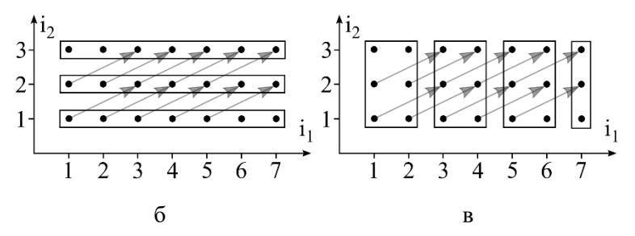

Рис. 2.3. Пространство итераций для Программы 2.4 и три его разбиения: а – первое; б – второе; в – третье

На рис. 2.3 в декартовом виде изображено пространство итераций  $I=\{(i_1,i_2):\ 1\le i_1\le 7,\ 1\le i_2\le 3\}$  и часть бинарных отношений зависимости, соответствующих отношению информационной зависимости на графе зависимостей для "развернутой" Программы 2.4. Их транзитивное замыкание достроим мысленно.

Там же предложено три варианта разбиения пространства итерапий:

- 1. На рис. 2.3а  $\{(1,1), (2,1)\}\cup\{(1,2), (2,2)\}\cup\{(1,3), (2,3)\}\cup\{(3,1), (4,1)\}\cup\{(3,2), (4,2)\}\cup\{(3,3), (4,3)\}\cup\{(5,1), (6,1)\}\cup\{(5,2), (6,2)\}\cup\{(5,3), (6,3)\}\cup\{(7,1)\}\cup\{(7,2)\}\cup\{(7,3)\};$
- 2. На рис. 2.36  $\{(1,1), (2,1), (3,1), (4,1), (5,1), (6,1), (7,1)\}\cup\{(1,2), (2,2), (3,2), (4,2), (5,2), (6,2), (7,2)\}\cup\{(1,3), (2,3), (3,3), (4,3), (5,3), (6,3), (7,3)\};$
- 3. На рис. 2.3в  $\{(1,1), (2,1), (1,2), (2,2), (1,3), (2,3)\} \cup \{(3,1), (4,1), (3,2), (4,2), (3,3), (4,3)\} \cup \{(5,1), (6,1), (5,2), (6,2), (5,3), (6,3)\} \cup \{(7,1), (7,2), (7,3)\}.$

Определяя в первом варианте параллелепипед максимального объема, обратим внимание на нижний правый отрезок (рис.2.3а), характеризующийся длинами сторон  $p_1$ =2 и  $p_2$ =1 (фиктивная сторона). Тогда будем говорить о двух задачах параллельного алгоритма, задаваемых парой индексов:  $g_1$ =1,  $g_2$ =1 для первой задачи и  $g_1$ =2,  $g_2$ =1 для второй. Задаче (1,1) достанутся все вектора пространства итераций с нечетным первым индексом (или первый вектор в каждом подмножестве разбиения), задаче (2,1) – с четным (второй вектор в каждом подмножестве разбиения).

Построение параллельного алгоритма завершается упорядочиванием векторов внутри каждой задачи в соответствии с бинарным отношением следования на пространстве итераций. В итоге, задаче (1,1) предпишем последовательное исполнение инструкций, связанных с векторами: (1,1), (1,2), (1,3), (3,1), (3,2), (3,3), (5,1), (5,2), (5,3), (7,1), (7,2), (7,3); задаче (2,1) – связанных с векторами (2,1), (2,2),

(2,3), (4,1), (4,2), (4,3), (6,1), (6,2), (6,3). Представление данного алгоритма в нотации Голуба получено конкретизацией вложенной конструкции в Алгоритме 2.4 и подстановкой туда тела цикла из Программы 2.4.

Обратим внимание на отсутствие в Алгоритме 2.5 синхронизации. При выбранных разбиении пространства итераций (рис. 2.3а) и распределении векторов между задачами, ни один вектор не связан отношением зависимости с вектором из другой задачи. Оценка ускорения обсуждаемого алгоритма составляет S=21/12=1,75.

**Алгоритм 2.5** Первый параллельный алгоритм для последовательной Программы 2.4

```
for i_1=g_1:p_1:7

for i_2=g_2:p_2:3

x(i_1,i_2)=f(x(i_1-2,i_2-1))
\nend for
\nend for
```

Определяя для второго варианта разбиения (рис. 2.36) параллелепипед максимального объема, обратим внимание на нижний отрезок, характеризующийся длинами сторон  $p_1$ =7 и  $p_2$ =1 (фиктивная сторона). Тогда будем говорить о семи задачах параллельного алгоритма, задаваемых парой индексов ( $g_1,g_2$ ), где  $1 \le g_1 \le 7$ ,  $g_2$ =1. Задаче ( $g_1,g_2$ ) в каждом из трех подмножеств рассматриваемого разбиения достанется  $g_1$ -ый вектор с начала. Упорядочивание векторов внутри каждой задачи производится в соответствии с отношением следования на множестве итераций - в задаче ( $g_1,g_2$ ) вектора будут следовать друг за другом в порядке: ( $g_1,1$ ), ( $g_1,2$ ) и ( $g_1,3$ ).

В отличие от предыдущего алгоритма, здесь необходима синхронизация. Обсуждая ее особенности выделим на множестве задач три подмножества. Задачи, отнесенные к первому  $(g_1 \le 2)$  — только

отправляют данные; отнесенные ко второму  $(g_1 \ge 6)$  — только принимают; остальные — делают и то и другое. Указанное обстоятельство определяет содержание Алгоритма 2.6.

Цикл по  $i_I$  в алгоритме 2.6 вполне может быть заменен оператором присваивания  $i_I = g_I$ , ведь при его реализации будет произведена всего одна итерация. Первый условный переход необходим для корректного приема данных, сформированных другой задачей ( $g_1$ -2, $g_2$ ) ранее в ходе выполнения инструкций алгоритма. Очевидно, что задачам с  $g_1 \le 2$  принимать нечего — связанные с ними вектора пространства итераций независимы. Второй условный переход служит для корректной отправки данных, сформированных только что текущей задачей, задаче ( $g_1$ +2, $g_2$ ). Задачам с  $g_1 \ge 6$  отправлять нечего — от связанных с ними векторов пространства итераций не зависит ни один другой вектор данного пространства. Более того, задачи с  $g_1 \le 6$  не отправляют данных на последней итерации внутреннего цикла, а задачи с  $g_1 \ge 2$  не принимают на первой. Оценка ускорения Алгоритма 2.6 - S = 21/3 = 7 составлена без учета коммуникационных издержек.

**Алгоритм 2.6** Второй параллельный алгоритм для последовательной Программы 2.4

```
for i_1=g_1:p_1:7

for i_2=g_2:p_2:3
\nif (i_1-2)\geq 1 and (i_2-1)\geq 1 then recv(x(i_1-2,i_2-1),(g_1-2,g_2)) end if x(i_1,i_2)=f(x(i_1-2,i_2-1))
\nif (i_1+2)\leq 7 and (i_2+1)\leq 3 then send(x(i_1,i_2),(g_1+2,g_2)) end if end for end for
```

Считается неуместным вносить условные переходы в тело цикла, когда этого можно избежать. Указанный прием увеличивает

длительность расчетов по алгоритму. Действительно, не сложно переписать Алгоритм 2.6 в виде отдельных инструкций для трех ранее упомянутых подмножеств множества задач. Однако это нивелирует методическую ценность алгоритма — совершенно не похожего в таком случае на Алгоритм 2.4 — общую форму записи параллельного алгоритма, построенного по методу параллелепипедов.

Любопытна топология коммуникаций Алгоритма 2.6, представляющая из себя две не связанные друг с другом линии, соединяющие задачи с нечетными значениями  $g_1$ : (1,1), (3,1), (5,1), (7,1) и с четными: (2,1), (4,1), (6,1) (рис. 2.4 a).

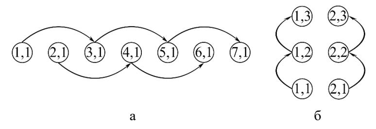

Рис. 2.4. Топология коммуникаций параллельных алгоритмов для Программы 2.4: а – второго алгоритма, б – третьего

Обращаясь к построению третьего параллельного алгоритма для последовательной программы 2.4 выделим на покрытии из рис. 2.3в левый прямоугольник характеризующийся длинами сторон  $p_1$ =2 и  $p_2$ =3. Будем говорить о шести задачах параллельного алгоритма, задаваемых парой индексов  $(g_1,g_2)$ , где  $1 \le g_1 \le 2$ ,  $1 \le g_2 \le 3$ . Задаче  $(g_1,g_2)$  выделим вектора  $(1,g_2)$ ,  $(3,g_2)$ ,  $(5,g_2)$ ,  $(7,g_2)$  из пространства итераций, если  $g_1$ =1 и  $(2,g_2)$ ,  $(4,g_2)$ ,  $(6,g_2)$ , при  $g_1$ =2. Их последовательность расположения в задаче соответствует отношению следования на множестве итераций.

Записывая получившийся параллельный алгоритм в нотации Голуба изменим в тексте Алгоритма 2.6 адресаты в коммуникационных инструкциях на:  $(g_1,g_2-1)$  при приеме и  $(g_1,g_2+1)$  при отправке

данных. Остальные инструкции в новом алгоритме останутся прежними, ведь бинарное отношение зависимости на пространстве итераций, задающее условия производства коммуникаций, не зависит от выбора покрытия. Алгоритм 2.5 также можно записать с двумя условными переходами и соответствующими им коммуникационными операторами, тогда отправлять данные каждой задаче придется самой себе.

Топология коммуникаций третьего параллельного алгоритма для Программы 2.4 представлена на рис. 2.4 б и представляет из себя две не связанные друг с другом линии, соединяющие задачи с одинаковыми значениями  $g_1$ . Оценка ускорения третьего алгоритма без учета коммуникационных издержек составляет S=21/4=5,25.

## 2.2.3 Метод пирамид

В отличие от метода параллелепипедов, метод пирамид не годится для работы с простыми циклами, за то допускает включения параметров цикла в нелинейные выражения внутри его тела, что является ограничением для метода параллелепипедов.

Приступим к изложению нового метода [12], разбив его на этапы.

- 1. Как и ранее строится пространство итераций, на котором задаются бинарные отношения зависимости и следования. Здесь декартово представление пространства не обязательно, хотя работать с ним безусловно проще.
- 2. На пространстве выделяются вектора, от которых не зависит ни один другой вектор пространства. Их называют результирующими. Каждому результирующему вектору ставится во взаимно однозначное соответствие одна задача искомого параллельного алгоритма.
- 3. Далее к каждой задаче добавляются все вектора, от которых зависит результирующий, с этой задачей связанный. Внутри задачи

они упорядочиваются в соответствии с бинарным отношением следования на пространстве итераций. Алгоритм построен.

Остановимся на характерных особенностях метода пирамид. В нем тоже ищется покрытие пространства итераций. Одно подмножество такого покрытия составляется из векторов, отнесенных к одной задаче; для построения всего покрытия задействуются все задачи параллельного алгоритма. При этом такое покрытие совершенно не обязательно окажется разбиением и часть векторов может дублироваться в разных задачах и подмножествах. Данное обстоятельство обуславливает повторение одинаковых инструкций и получение одинаковых результатов различными задачами, что следует отнести к недостаткам метода. Способ построения покрытия определяет, в отличие от метода параллелепипедов, единственность покрытия – другой недостаток, исключающий оптимизацию. Главное - вектора, составляющие любое подмножество покрытия, обязательно вступают в бинарное отношение зависимости в силу правила формирования подмножества: «... добавляются все вектора, от которых зависит результирующий». То есть метод пирамид не соответствует общему формализму пункта 2.2.1.

В чем же его достоинство, уравновешивающее столько недостатков? В отсутствии синхронизации между задачами. Если для метода параллелепипедов такая ситуация приятная неожиданность, то здесь коммуникации между задачами алгоритма исключаются сознательно в ходе построения алгоритма. Действительно, последний вектор в каждой задаче — результирующий, зависящий от всех предыдущих, относящихся к этой же задаче. Выбрав любой другой вектор данной задачи можем быть уверенными, что все вектора, от которых зависит выбранный, предшествуют ему там же. Ведь в силу транзитивного замыкания, посредством которого конструировалось отношение зависимости, от них зависит и результирующий. Значит ни один вектор, отнесенный к некоторой задаче, не зависит ни от

одного другого, расположенного в иной задаче и не продублированного в некоторой. Зачем тогда коммуникации?

Очевидно, к области применения метода пирамид следует отнести случаи, когда параллельный алгоритм предназначается для реализации в вычислительных системах, узлы которых связаны сетью с низкой пропускной способностью или (и) характеризующейся высокой вероятностью обрыва соединения.

Продемонстрируем применение метода пирамид следующим примером. Пусть речь идет о построении параллельного алгоритма для последовательной Программы 2.5, связанной с некоторой трехслойной явной разностной схемой, воображаемый шаблон которой представлен на рис. 2.5 а.

**Программа 2.5** Организация вычислений по явному дифференциальному шаблону на рис. 2.5a

```
for i_1=1:n_1 % перебор узлов сеточной области по i_1 for i_2=1:n_2 % перебор узлов сеточной области по i_2 x(i_1,i_2)=f(x(i_1-1,i_2),x(i_1-1,i_2+1),x(i_1-2,i_2),x(i_1-2,i_2-1)) end for end for
```

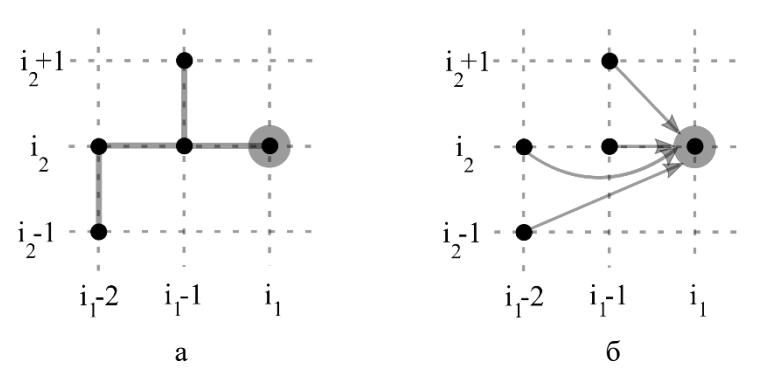

Рис. 2.5. Трехслойный дифференциальный шаблон (a) и бинарное отношение зависимости, с ним связанное (б)

Пространство итераций  $I=\{(i_1,i_2):\ 1\leq i_1\leq n_1,\ 1\leq i_2\leq n_2\}$  в рассматриваемом случае весьма похоже на сеточную область: его вектора задаются теми же парами, что и узлы области; за исключением узлов, необходимых для учета при разностном решении начального и граничных условий (такие узлы считаются существующими, а значения сеточной функции x в них сформированными). Отношение зависимости на пространстве итераций определяется структурой дифференциального шаблона; с рис. 2.5 б стрелки, ведущие в выделенный вектор, переносятся на все вектора пространства итераций с последующим транзитивным замыканием. Отношение следования формируется порядком исполнения инструкций в последовательной Программе 2.5.

Результирующими назовем вектора  $\{(i_1,i_2): i_1=n_1, 1\leq i_2\leq n_2\}$ , связанные с последним слоем сеточной области по  $i_1$ ; от любого из них не зависит ни один вектор пространства итераций. Тогда далее будем различать  $n_2$  задач параллельного алгоритма, характеризуя некоторую задачу номером  $1\leq \mu \leq n_2$ .

На завершающем этапе построения параллельного алгоритма, к задаче  $\mu$  отнесем кроме вектора ( $i_1$ , $\mu$ ) все, от которых данный результирующий зависит. На рис. 2.6 а они заключены в треугольник, образованный прямыми h, m и осью  $i_2$ ; результирующий вектор обозначен звездочкой.

В рассматриваемой задаче правые вектора из треугольника (в трехмерном случае — пирамиды, отсюда название метода) следуют за левыми, верхние за нижними — в соответствии с заданным бинарным отношением следования.

На рис. 2.6 б демонстрируется дублирование векторов (закрашенная подобласть пространства итераций, ограниченная прямыми h, m' и осью  $i_2$ ), отнесенных к двум разным задачам:  $\mu$  и  $\mu$ '. Видно, что с уменьшением значения индекса  $i_1$  вектор ( $i_1,i_2$ ) будет относиться к большему количеству задач алгоритма.

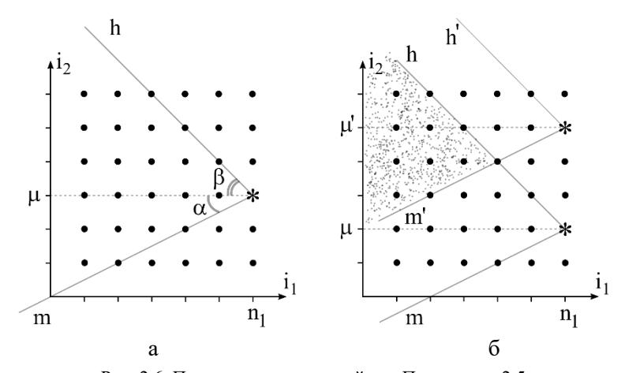

Рис. 2.6. Пространство итераций для Программы 2.5: а – результирующий вектор ( $i_1$ , $\mu$ ) и прямые, ограничивающие вектора от которых он зависит; б – пересечение двух подмножеств покрытия пространства, относящихся к задачам  $\mu$  и  $\mu$ '

Построенный параллельный алгоритм в нотации Голуба запишется следующим образом.

**Алгоритм 2.7** Параллельный алгоритм для последовательной программы 2.5

```
for i_1=1:n_1

for i_2=\max\{1,\mu-(n_1-i_1)tg(\alpha)\}:\min\{n_2,\mu+(n_1-i_1)tg(\beta)\}

x(i_1,i_2)=f(x(i_1-1,i_2),x(i_1-1,i_2+1),x(i_1-2,i_2),x(i_1-2,i_2-1))
\nend for
\nend for
```

Первый цикл Алгоритма 2.7 повторяет соответствующий цикл Программы 2.5 – все задачи параллельного алгоритма содержат вектора с  $1 \le i_1 \le n_1$ . Второй же цикл каждой задачей исполнится по-своему, для  $\max\{1,\mu-(n_1-i_1)tg(\alpha)\}\le i_2 \le \min\{n_2,\mu+(n_1-i_1)tg(\beta)\}$ . Операции

мах $\{1,...\}$  и міп $\{n_2,...\}$  предотвращают выход за пределы пространства итераций. Условие  $\mu$ - $(n_1$ - $i_1)$ tg $(\alpha)$   $\leq i_2 \leq \mu$ + $(n_1$ - $i_1)$ tg $(\beta)$  не позволяет выйти за треугольник, связанный с задачей  $\mu$ , на итерации  $i_1$  внешнего цикла. Если значения  $(n_1$ - $i_1)$ tg $(\alpha)$  и  $(n_1$ - $i_1)$ tg $(\beta)$  оказываются не целыми, их следует округлять до ближайшего меньшего целого.

Тангенсы углов  $\alpha$  и  $\beta$  задаются дифференциальным шаблоном, принимая в рассмотренном примере значения  $\frac{1}{2}$  и 1 соответственно. Здесь важно не смешивать пространство итераций и сеточную область, на которой определены шаги (имеющие физическую размерность) и данные углы примут в силу этого обстоятельства уже другие значения. Пространство итераций и сеточная область - хоть и похожие, но все же отличающиеся объекты из разных областей математики.

При участии параметров цикла внутри его тела в нелинейных выражениях, прямые h и m на рис. 2.6 примут форму, соответствующую этим выражениям.

Применение Алгоритма 2.7 в представленном виде имеет смысл при условии  $n_2 >> n_1$ , когда взаимное дублирование векторов в задачах не превышает пределов разумного. В противном случае большая часть времени вычислений окажется уделенной повторению одного и того же в разных вычислительных подпроцессах. Кроме того, в реальных задачах вычислительной физики, связанных с моделированием протяженных объектов, сеточная область по одному направлению зачастую разбивается на количество узлов, многократно превосходящее число параллельных вычислительных потоков, характеризующих используемую вычислительную систему. Последнее замечание равным образом относится и к методу параллелепипедов.

Решение представленных проблем связывают с дополнением методов автоматического распараллеливания, предусматривающим укрупнение задач; оговоренное также в третьем этапе («Agglomeration») общей схемы синтеза произвольных параллельных алгоритмов в методике Фостера [14].

Применительно к методу пирамид, такое объединение сопровождается допущением коммуникаций между задачами параллельного алгоритма через определенное число итераций (высота пирамиды) внешнего цикла. Дублирование векторов при этом значительно сокращается. На рис. 2.7 представлен пример пространства итераций, разделенного между тремя задачами параллельного алгоритма, получившимися в ходе объединения. Каждой задаче соответствует  $n_2/3$  результирующих векторов, на рисунке обозначены звездочками.

Плотно закрашены дополнительные подобласти каждой задачи, которые дублируются в соседней и выходят за основную подобласть, закрашенную менее интенсивно. Основные подобласти трех задач составляют разбиение пространства итераций; все подобласти – покрытие.

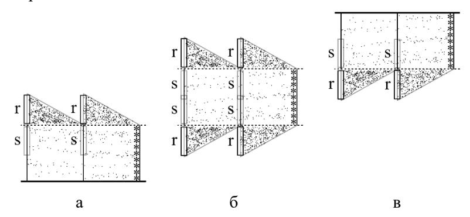

Рис. 2.7. Разделение пространства итераций между тремя задачами параллельного алгоритма: а – фрагмент I для первой задачи; б – фрагмент для второй задачи; в – фрагмент для третьей

Коммуникации сопровождаются отправкой значений сеточной функции, полученных в ходе итераций, относящихся к фрагментам пространства итераций, помеченных литерой s и приемом значений сеточной функции, полученных в ходе итераций, на участках, маркированных литерой г. Получаемые значения сформированы в ходе

вычислительного процесса, определенного другой задачей алгоритма, отправляемые — в ходе определенного данной задачей. Топология коммуникаций такого алгоритма — линия.

В параллельном алгоритме, построенном по модифицированному методу пирамид, появляется новый параметр — высота пирамиды (на рис. 2.7 равен n<sub>1</sub>/2), варьируя который можно в известных пределах управлять длительностью вычислений. При высоте пирамиды, равной n<sub>1</sub> коммуникации внутри циклической конструкции исключаются полностью (отправка и получение значений, связанных с самыми левыми участками s и r в каждой задаче, предусматривается до всех циклов при формировании начального условия), а количество продублированных векторов пространства итераций — максимально; при высоте пирамиды равной 1 дублирования векторов не происходит, но коммуникации сопровождают каждую итерацию внешнего цикла. Подбирать оптимальное значение высоты пирамиды принято экспериментально на конкретной вычислительной системе.

# 2.2.4 Распараллеливание вычислений по рекуррентным выражениям

Циклические конструкции широко применяются для организации вычислений по рекуррентным выражениям. Оценим могущество изложенных методов автоматического распараллеливания на следующем простом примере рекуррентного выражения  $x_i=a_i\cdot x_{i-1}$   $(1\leq i\leq n)$  при необходимости отыскать  $x_n$ .

На пространстве итераций  $I=\{(i): 1\leq i\leq n\}$  каждый вектор зависит от всех предыдущих (пространство упорядочено отношением следования) и нет никаких двух независимых друг от друга векторов. Следовательно, какой бы метод автоматического распараллеливания (для ациклических или циклических конструкций) мы не выбрали, параллельного алгоритма по нему этим путем построить не удастся.

И все же такой алгоритм очевиден [12]. Представим рассматриваемое рекуррентное выражение в «развернутом» виде

$$x_n = a_n \cdot a_{n-1} \cdot a_{n-2} \cdot \dots \cdot a_3 \cdot a_2 \cdot a_1 \cdot x_0$$

и поставим в соответствие задаче  $\mu$  ( $1 \le \mu \le n/2$ ) параллельного алгоритма операцию  $a_{2\mu}$   $a_{2\mu-1}$ . Все n/2 таких операций на первом шаге параллельного алгоритма могут быть произведены одновременно — параллельно. Далее возможно одновременное исполнение n/4, n/8, ..., 2 умножений — всего за  $\log_2(n)$ -1 шагов параллельного алгоритма. На завершающем шаге результат домножается на  $x_0$ . Ускорение вычислений по такому алгоритму оценим величиной  $n/\log_2(n)$ .

Приведенный пример с одной стороны иллюстрирует превосходство живого человеческого воображения над шаблонным подходом, с другой стороны указывает на необходимость формализации процедуры распараллеливания вычислений по рекуррентным выражениям.

Решая поставленную задачу будем двигаться в сторону усложнения рекуррентного выражения. Рассмотрим случай  $x_i=a_i\cdot x_{i-1}+b_i$  ( $1\leq i\leq n$ ) при необходимости отыскать  $x_n$ . Применить для его параллельного вычисления прием, аналогичный предыдущему, удастся после представления рассматриваемого выражения в форме без последнего слагаемого. Для этого перейдем к матричной нотации.

Пусть вектор 
$$\mathbf{x}_{i} = \begin{pmatrix} \mathbf{x}_{i} \\ 1 \end{pmatrix}$$
 и матрица  $\mathbf{A}_{i} = \begin{pmatrix} \mathbf{a}_{i} & \mathbf{b}_{i} \\ 0 & 1 \end{pmatrix}$ . Тогда рекуррент-

ное выражение запишется в виде  $\mathbf{x}_i = A_i \mathbf{x}_{i-1}$ . И  $\mathbf{x}_n = A_n \cdot A_{n-1} \cdot A_{n-2} \cdot \ldots$   $A_3 \cdot A_2 \cdot A_1 \cdot \mathbf{x}_0$  после «развертывания». Умножение матриц можно провести параллельно по ранее представленной процедуре. Структура матрицы, характеризующейся второй строчкой (0 1), при умножении воспроизводится, следовательно лишних арифметических операций не будет.

При работе с выражением  $\mathbf{x}_i = a_i \cdot \mathbf{x}_{i-1} + b_i \cdot \mathbf{x}_{i-2}$  уместно представить вектор  $\mathbf{x}_i = \begin{pmatrix} \mathbf{x}_i \\ \mathbf{x}_{i-1} \end{pmatrix}$  и матрицу  $\mathbf{A}_i = \begin{pmatrix} a_i & b_i \\ 1 & 0 \end{pmatrix}$ . Тогда рекуррентное выражение по-прежнему запишется в виде  $\mathbf{x}_i = A_i \mathbf{x}_{i-1}$ .

Далее, для рекуррентного выражения  $x_i=a_i\cdot x_{i-1}+b_i\cdot x_{i-2}+c_i$  размерность вектора и матрицы повысится:

$$\mathbf{x}_{i} = \begin{pmatrix} \mathbf{x}_{i} \\ \mathbf{x}_{i-1} \\ 1 \end{pmatrix} \mathbf{u} \ \mathbf{A}_{i} = \begin{pmatrix} \mathbf{a}_{i} & \mathbf{b}_{i} & \mathbf{c}_{i} \\ 1 & 0 & 0 \\ 0 & 0 & 1 \end{pmatrix}.$$

В общем случае, для выражения  $x_i=a_i\cdot x_{i-1}+b_i\cdot x_{i-2}+\ldots+c_i\cdot x_{i-k+1}+d_i\cdot x_{i-k}+e_i$  записывают:

$$\boldsymbol{x}_i = \begin{pmatrix} \boldsymbol{x}_i \\ \boldsymbol{x}_{i-1} \\ \dots \\ \boldsymbol{x}_{i-k+1} \\ \boldsymbol{x}_{i-k} \\ 1 \end{pmatrix}_{\boldsymbol{H}} \, \boldsymbol{A}_i = \begin{pmatrix} \boldsymbol{a}_i & \boldsymbol{b}_i & \dots & \boldsymbol{c}_i & \boldsymbol{d}_i & \boldsymbol{e}_i \\ 1 & 0 & \dots & 0 & 0 & 0 \\ \dots & \dots & \dots & \dots & \dots \\ 0 & 0 & \dots & 0 & 0 & 0 \\ 0 & 0 & 0 & 1 & 0 & 0 \\ 0 & 0 & \dots & 0 & 0 & 1 \end{pmatrix}.$$

Вопросы и задачи к параграфу 2.2

- 2.2.1 Модифицируйте Алгоритм 2.6, вынеся условные переходы за циклическую конструкцию.
- 2.2.2 Используя метод параллелепипедов составьте параллельный алгоритм для программы 2.5, сравните его с Алгоритмом 2.7.
- 2.2.3 Модифицируйте Алгоритм 2.7 согласно схеме на рис. 2.7: объединив задачи в три и организуя коммуникации через заданное количество итераций внешнего цикла.
- 2.2.4 Используя метод пирамид составьте параллельный алгоритм для программы 2.4, сравните его с Алгоритмами 2.5 и 2.6.

- 2.2.5 Запишите в нотации Голуба параллельный алгоритм для организации вычислений по рекуррентному выражению xi=ai∙xi-1+bi.
- 2.2.6. Будет ли воспроизводиться структура матрицы Ai в ходе вычислений по параллельному алгоритму (когда эти матрицы умножаются), предназначенному для организации расчетов по рекуррентному выражению xi=ai∙xi-1+bi∙xi-1? Оцените ускорение такого параллельного алгоритма с учетом ответа на предыдущий вопрос.

# **СПИСОК ЛИТЕРАТУРЫ**

- 1. *Антонов А.С.* Параллельное программирование с использованием технологии MPI: учеб. пособие. М.: Изд-во МГУ, 2004. 71 с.
- 2. *Антонов А.С.* Параллельное программирование с использованием технологии OpenMP: учеб. пособие. М.: Изд-во МГУ, 2009. 77с.
- 3. *Голуб Дж., Лоун Ч. Ван.* Матричные вычисления / пер. с англ. М.: Мир, 1999. 548 с.
- 4. *Деммель Дж.* Вычислительная линейная алгебра. Теория и приложения / пер. с англ. М.: Мир, 2001. 430 с.
- 5. *Кук Д., Бейз Г.* Компьютерная математика / пер. с англ. М.: Наука, 1990. 384 с.
- 6. *Ленин В.И.* Философские тетради. Конспект книги Гегеля «Наука логики». М.: Изд-во политической литературы, 1969. 185 с.
- 7. *Мараховский В. Б., Розенблюм Л. Я., Яковлев А. В.* Моделирование параллельных процессов. Сети Петри. Курс для системных архитекторов, программистов, системных аналитиков, проектировщиков сложных систем управления. СПб.: Профессиональная литература, АйТи-Подготовка, 2014. 400 с.
- 8. *Марков А.А.* Теория алгорифмов // Труды Математического института имени В. А. Стеклова АН СССР. 1954. Т. 42. С. 3–375.
  - 9. Официальный сайт OpenACC: https://www.openacc.org
- 10. *Федотов Е.И.* Модели параллельного программирования. М.: СОЛОН-ПРЕСС, 2012. 384 с.
- 11. *Хоар Ч.* Взаимодействующие последовательные процессы / пер. с англ. М.: Мир, 1989. 264 с.
- 12. Элементы параллельного программирования / *В.А. Вальковский, В.Е. Котов, А.Г. Марчук* [и др.]. М.: Радио и связь, 1983. 239 с.

- 13. *Flynn M.J.* Very high-speed computing systems // Proceedings of the IEEE. 1966. Vol. 54. Iss. 12. Р. 1901–1909.
- 14. *Foster I.* Designing and Building Parallel Programs. Boston: Addison-Wesley Longman Publishing, 1995. 430 p.
- 15. *Hockney R.W.* Classification and Evaluation of Parallel Computer Systems // Parallel Computing in Science and Engineering: 4th International DFVLR Seminar on Foundations of Engineering Sciences. Bonn, 1987. P. 13-25.

# Учебное издание

# *Головашкин Димитрий Львович*

# **МОДЕЛИ В ТЕОРИИ ПАРАЛЛЕЛЬНЫХ ВЫЧИСЛЕНИЙ**

# *Учебное пособие*

В авторской редакции.

Техническое редактирование А.В. Ярославцевой Подготовка оригинал-макета А.В. Ярославцевой

Подписано в печать 25.11.2019. Формат 60×84 1/16. Бумага офсетная. Печ. л. 6,0. Тираж 120 экз. (1 з-д 1-25). Заказ .

ФЕДЕРАЛЬНОЕ ГОСУДАРСТВЕННОЕ АВТОНОМНОЕ ОБРАЗОВАТЕЛЬНОЕ УЧРЕЖДЕНИЕ ВЫСШЕГО ОБРАЗОВАНИЯ «САМАРСКИЙ НАЦИОНАЛЬНЫЙ ИССЛЕДОВАТЕЛЬСКИЙ УНИВЕРСИТЕТ ИМЕНИ АКАДЕМИКА С.П. КОРОЛЕВА» (САМАРСКИЙ КНИВЕРСИТЕТ) 440086, САМАРА, МОСКОВСКОЕ ШОССЕ, 34.

> Издательство Самарского университета. 443086, Самара, Московское шоссе, 34.