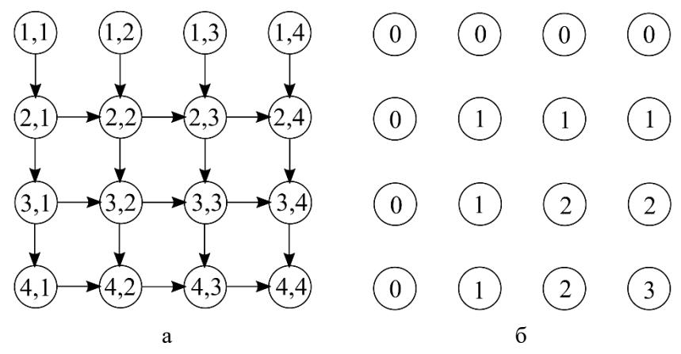

### МИНИСТЕРСТВО НАУКИ И ВЫСШЕГО ОБРАЗОВАНИЯ РОССИЙСКОЙ ФЕДЕРАЦИИ

ФЕДЕРАЛЬНОЕ ГОСУДАРСТВЕННОЕ АВТОНОМНОЕ ОБРАЗОВАТЕЛЬНОЕ УЧРЕЖДЕНИЕ ВЫСШЕГО ОБРАЗОВАНИЯ «САМАРСКИЙ НАЦИОНАЛЬНЫЙ ИССЛЕДОВАТЕЛЬСКИЙ УНИВЕРСИТЕТ ИМЕНИ АКАДЕМИКА С.П. КОРОЛЕВА» (САМАРСКИЙ УНИВЕРСИТЕТ)

# *Д.Л. ГОЛОВАШКИН*

# ПАРАЛЛЕЛЬНЫЕ АЛГОРИТМЫ ВЫЧИСЛИТЕЛЬНОЙ ЛИНЕЙНОЙ АЛГЕБРЫ

Рекомендовано редакционно-издательским советом федерального государственного автономного образовательного учреждения высшего образования «Самарский национальный исследовательский университет имени академика С.П. Королева» в качестве учебного пособия для обучающихся по основной образовательной программе высшего образования по направлению подготовки 01.03.02 Прикладная математика и информатика

> САМАРА Издательство Самарского университета 2019

УДК 519.6(075) ББК 32.97 Г 61

> Рецензенты: д-р техн. наук, доц. С. В. С м и р н о в, д-р техн. наук, доц. С. В. В о с т о к и н

### *Головашкин, Димитрий Львович*

Г 61 **Параллельные алгоритмы вычислительной линейной алгебры:** учеб. пособие / *Д.Л. Головашкин*. – Самара: Изд-во Самарского университета, 2019. – 88 с.: ил.

# **ISBN 978-5-7883-1447-1**

В пособии представлены сведения, необходимые для знакомства с предметной областью параллельных матричных вычислений. В частности: параллельные алгоритмы умножения матриц, LU-разложения, разложения Холецкого и решения треугольных систем. Особое внимание уделяется описанию теоретической и экспериментальной методик исследования свойств параллельных алгоритмов. На многочисленных примерах формируются навыки решения различных задач вычислительной линейной алгебры на современных ЭВМ.

Предназначено для студентов, обучающихся по направлению подготовки 01.03.02 Прикладная математика и информатика.

Подготовлено на кафедре технической кибернетики.

УДК 519.6(075) ББК 32.97

# **ОГЛАВЛЕНИЕ**

| Предисловие                                         | 4  |
|-----------------------------------------------------|----|
| Введение                                            | 5  |
| 1 Умножение матриц                                  | 6  |
| 1.1<br>Параллельные алгоритмы gaxpy<br>на процессор |    |
| ном кольце                                          | 6  |
| 1.2 Параллельные алгоритмы умножения матриц на      |    |
| процессорном кольце                                 | 14 |
| 1.3 Параллельный алгоритм умножения матриц на       |    |
| торе                                                | 18 |
| 2 Матричные разложения                              | 24 |
| 2.1 Параллельный алгоритм разложения Холецкого      |    |
| на процессорном кольце                              | 24 |
| 2.2 Параллельный алгоритм LU-разложения<br>на про   |    |
| цессорном кольце                                    | 35 |
| 2.3 Параллельный алгоритм LU-разложения на про      |    |
| цессорной решетке                                   | 39 |
| 2.4<br>Параллельный алгоритм разложения Холецкого   |    |
| на процессорной решетке                             | 48 |
| 2.5 Параллельный алгоритм решения СЛАУ тре          |    |
| угольного вида на процессорном кольце               | 52 |
| 3 Теоретическое и экспериментальное исследования    |    |
| параллельных<br>алгоритмов                          | 64 |
| 3.1 Ускорение, эффективность и масштабируемость     | 65 |
| 3.2 Закон Амдала                                    | 68 |
| 3.3 Учет коммуникационных издержек                  | 73 |
| 3.4 Экспериментальное исследование параллельных     |    |
| алгоритмов                                          | 77 |
| Список литературы                                   | 87 |

#### ПРЕДИСЛОВИЕ

Настоящее пособие является продолжением учебных изданий [1, 2], знакомство с которыми, по замыслу автора, должно предшествовать обращению читателя к данному тексту. Так, из работы [1] наследуется язык описания параллельных алгоритмов и общие представления об архитектурных особенностях вычислительных систем. В [2] подробно изложены, с выводами и комментариями, векторные варианты алгоритмов, на основании которых разрабатывались параллельные, предлагаемые здесь. Кроме того, одновременно с изучением представленного в пособии материала желательно освоение обучающимися курса параллельного программирования для взаимного закрепления теоретических и практических навыков из одной предметной области.

Основной особенностью изложения материала в настоящем пособии является достаточное глубокое рассмотрение небольшого количества базовых параллельных алгоритмов вычислительной линейной алгебры (умножения матриц, LU-разложения, разложения Холецкого и решения треугольных систем), ориентированных на несколько сетевых топологий. По мнению автора такая подача материала предпочтительнее поверхностного обзора изрядного количества параллельных вариантов многочисленных методов для различных архитектур, характеризуясь большей методической ценностью. Как говорится в одноименной работе Владимира Ильича Ленина «Лучше меньше, да лучше».

Автор сердечно благодарит своих студентов за многолетнюю помощь в выборе материала и методических приемов его изложении, без которой предлагаемое пособие никогда не было бы подготовлено. И рассчитывает на полезность нестоящего текста в будущем. Внимательный читатель может счесть пособие не свободным от недостатков, автор будет благодарен ему за указание на них по электронной почте golovashkin2010@yandex.ru.

#### **ВВЕДЕНИЕ**

Под параллельным алгоритмом будем понимать предписание, определяющее вычислительный процесс, часть действий которого производится одновременно (параллельно).

Следуя модели задача/канал [7] положим, что каждая задача параллельного алгоритма определяет свою ветвь соответствующего такому алгоритму вычислительного процесса. Задачей (графически изображается окружностью) считается последовательность инструкций и данные, над которыми запланировано их исполнение. Задачи связаны каналами (графически изображаются стрелками), задающими коммуникации параллельного алгоритма.

Представляя алгоритм договоримся приводить в нем инструкции для каждой задачи в нотации Джина Голуба из [4], почти совпадающей с синтаксисом языка МАТLAB. Предварять основной текст алгоритма инициализацией, указывая значения ряда переменных и массивов (начальное распределение данных между задачами).

В рамках настоящего изложения везде, где это возможно, будем стремиться к построению систолических параллельных алгоритмов [4], характеризующихся следующей очередностью инструкций.

```
for t=1:T

отправка данных

прием данных

производство арифметических операций
\nend for
```

Упорядоченная структура систолического алгоритма необходима для согласования (синхронизации) действий в ходе вычислительного процесса между его ветвями по приведенному правилу, исключающему блокировку процесса и упрощающему верификацию алгоритма.

### 1 УМНОЖЕНИЕ МАТРИЦ

Умножение матриц является одной из базовых операций вычислительной линейной алгебры. К ней неизменно сводятся блочные алгоритмы матричных разложений, которые в свою очередь широко применяются при решении систем линейных алгебраических уравнений и алгебраической проблемы собственных значений — двух основных задач упомянутой предметной области.

#### 1.1 Параллельные алгоритмы дахру на процессорном кольце

Операцию gaxpy (general <u>A x p</u>lus <u>y</u>.) принято записывать в виде z=Ax+y, при  $z,y\in\mathbb{R}^{n\times 1}$ ,  $x\in\mathbb{R}^{m\times 1}$  и  $A\in\mathbb{R}^{n\times m}$ . Через нее удобно выражать [4] умножение матриц, матричные разложения и итерационные методы решения СЛАУ.

Положим, что вектора и матрица из дахру для удобства составления параллельного алгоритма разбиты на блоки:  $z_i, y_i \in \mathbb{R}^{\alpha \times 1}$ ,  $x_j \in \mathbb{R}^{\beta \times 1}$ ,  $A_{ij} \in \mathbb{R}^{\alpha \times \beta}$ , где  $1 \le i, j \le p$ ,  $\alpha = n/p$ ,  $\beta = m/p$ , а p — количество задач искомого алгоритма. Построение параллельного алгоритма начинается с распределения блоков матрицы A между задачами; выбранный способ распределения служит для дальнейшей классификации алгоритмов.

# Распределение матрицы по блочным строкам

Пусть результатом вычислений, заданных задачей  $\mu$  ( $1 \le \mu \le p$ ) параллельного алгоритма, будет  $\mu$ -ый блок вектора  $z-z_\mu=A_\mu x+y_\mu$ , где  $A_\mu \in \mathbb{R}^{\alpha \times m}$  есть  $\mu$ -ая блочная строка матрицы A. Тогда выделяя из строки и x отдельные блоки перепишем последнее выражение через блочное скалярное произведение блочной строки A и вектора x:

$$z_{\mu} = \sum_{j=1}^{p} A_{\mu j} x_{j} + y_{\mu}. \tag{1}$$

Таким образом, для организации вычислений по ф. (1) в памяти задачи  $\mu$  необходимо разместить все указанные в (1) блоки:  $A_{\mu j}, x_j$  ( $1 \le j \le p$ ) и  $y_\mu$  (рис. 1a). То есть всю блочную строку  $A_\mu$  и весь вектор x. Искомый блок  $z_\mu$  сформируем поверх блока  $y_\mu$  (алгоритм с замещением начальных данных результатами расчетов).


Рис. 1. Иллюстрации к параллельным алгоритмам gaxpy с распределением матрицы A между задачами по блочным строкам: а —данные размещенные в памяти задачи 2 Алгоритма 1 при p=5; б — топология коммуникаций Алгоритма 2

Необходимости в обмене данными между задачами при таком их распределении не возникает; платой за отсутствие коммуникаций является дублирование вектора *х* в памяти всех задач.

Алгоритм 1 Параллельный алгоритм дахру без коммуникаций с распределением матрицы по блочным строкам Иницализация $\{row=(\mu-1)\alpha+1:\mu\alpha;\ A_{loc}=A(row,:);\ x_{loc}=x;\ y_{loc}=y(row)\}$  for j=1:p % проход по слагаемым из суммы в ф. (1)  $a=(j-1)\beta+1:j\beta$  % индексы, задающие блочный столбец j  $y_{loc}=y_{loc}+A_{loc}(:,a)x_{loc}(a)$  % вычисление слагаемого j из (1) end for

При инициализации определяется содержание вектора row длины  $\alpha$ , элементами которого являются целые числа с ( $\mu$ -1) $\alpha$ +1 по

μα. Это индексы строк матрицы A и элементов вектора y, доставшихся при распределении задаче μ. Вектор x размещается в памяти этой задачи полностью. Указанием на различное содержание одинаково именованного массива в памяти разных задач является нижний индекс loc. Вектор  $x_{loc}$  — характерное для данного алгоритма исключение.

Инструкции Алгоритма 1 относятся ко всем его p задачам. Различия между задачами обуславливаются не содержанием инструкций, которые в Алгоритме 1 одинаковы для всех задач, а данными, над которыми эти инструкции будут исполняться. Одновременное исполнение инструкций обеспечит параллельность вычислительного процесса.

В цикле по j из Алгоритма 1 производится суммирование блоков по формуле (1). Блоку  $A_{\mu j}$  из формулы соответствует  $A_{loc}(:,a)$  в алгоритме, блоку  $x_j - x_{loc}(a)$  в алгоритме, а  $y_\mu$  и  $z_\mu - y_{loc}$ . Нотация  $A_{loc}(:,a)$  указывает на фрагмент массива  $A_{loc}$ , совпадающий с ним по первой размерности и ограниченный индексами из вектора a по второй.

Так, на первой итерации цикла во всех задачах предписывается одновременное вычисление первого элемента суммы в ф. (1) для разных значений  $\mu$ . В первой задаче задается произведение  $A_{11}x_1$ , во второй  $A_{21}x_1$ , ..., в последней  $A_{p1}x_1$ . Фактически, все они одновременно определяют умножение первого блочного столбца матрицы A, собранного из перечисленных блоков, на блок  $x_1$ . На второй итерации речь идет о произведении второго блочного столбца A на блок  $x_2$ , где каждая задача задает произведение свой части указанного блочного столбца на  $x_2$ . В результате всех итераций в памяти каждой задачи формируется ее часть искомого вектора z, весь же вектор z находится как линейная комбинация блочных столбцов матрицы A.

Переходя к построению следующего алгоритма откажемся от дублирования вектора x в памяти всех задач. Пусть при начальном распределении данных задаче  $\mu$  достанется блок  $x_{\mu}$ . Тогда необходимо предусмотреть обмен блоками этого вектора между задачами

алгоритма; такой, чтобы в памяти любой задачи побывали все блоки x, как необходимые для вычислений по (1).

**Алгоритм 2** Параллельный алгоритм gaxpy на кольце с распределением матрицы по блочным строкам

```
Иницализация\{row = (\mu-1)\alpha+1: \mu\alpha; A_{loc} = A(row,:); x_{loc} = x((\mu-1)\beta+1: \mu\beta); y_{loc} = y(row); left, right\} for j=1:p % проход по слагаемым из суммы в ф. (1) send(x_{loc}, right) % отсылка x_{loc} правому соседу recv(x_{loc}, left) % прием x_{loc} от левого соседа % определение индекса полученного блока x_{\tau} \tau=\mu-j; if \tau\leq 0 then \tau=\tau+p end if a=(\tau-1)\beta+1:\tau\beta % индексы, задающие блочный столбец \tau y_{loc}=y_{loc}+A_{loc}(:,a)x_{loc} % вычисление слагаемого \tau из (1) end for
```

В новом варианте инициализации иначе определяется вектор  $x_{loc}$ , теперь в памяти задачи  $\mu$  будет находиться лишь один блок вектора x; перед началом вычислений это  $x_{\mu}$ , которому в алгоритме при инициализации соответствует  $x((\mu-1)\beta+1:\mu\beta)$ . Переменные left, right — номера соседей  $\mu$ -ой задачи, с которыми она будет обмениваться данными. При организации коммуникаций на процессорном кольце (рис. 1 б) left= $\mu$ -1 и right= $\mu$ +1 при  $1 < \mu < p$ ; у первой задачи левый сосед — задача p, у последней правый — задача 1. В примере на рис. 1, б задачи с большими номерами располагаются снизу от выбранной, с меньшими — сверху.

В соответствии с Алгоритмом 2 отправка блока  $x_{loc}$  (операция send) производится правому соседу, последующий прием (операция recv) другого блока вектора x в массив с тем же именем  $x_{loc}$  ожидается от левого соседа. Движение блоков между задачами производится по каналам алгоритма, ориентация которых задает направление коммуникаций (рис. 1, 6). Таким образом, за p итераций цикла через задачу  $\mu$  пройдут все блоки вектора x.

Оговоренный порядок движения данных по процессорному кольцу задает способ определения индекса полученного блока —  $\tau$  в Алгоритме 2. Фактически выясняется какая задача на кольце владела этим блоком сразу после инициализации. Так, при  $\tau \le 0$  значение индекса увеличивается на p (условный переход в алгоритме), что обусловлено переходом полученного блока по кольцу между задачами p и 1 во время своего путешествия. В зависимости от значения  $\tau$  из находящейся в распоряжении  $\mu$ -ой задачи блочной строки матрицы A выбирается блок  $A_{\mu\tau}$  ( $A_{loc}(:,a)$  в тексте Алгоритма 2), соответствующий принятому  $x_{\tau}$  в сумме из  $\phi$ . (1).

В отличие от Алгоритма 1, где предписывалось одновременное производство вычислений по  $\phi$ . (1) с одним и тем же блоком вектора x, в Алгоритме 2 одна итерация цикла соответствует вычислениям с разными блоками. В ходе первой итерации в первой задаче задается произведение  $A_{1p}x_p$ , во второй  $-A_{21}x_1$ , ..., в последней  $-A_{p,p-1}x_{p-1}$ . На второй итерации в первой задаче задается  $A_{1p-1}x_{p-1}$ , во второй  $-A_{2p}x_p$ , ..., в последней  $-A_{p,p-2}x_{p-2}$ . Заключительная итерация сопровождается одновременным производством операций  $A_{11}x_1$ ,  $A_{22}x_2$ , ...,  $A_{p,p}x_p$  в ветвях вычислительного процесса, определенных первой, второй, ..., последней задачами алгоритма соответственно. То есть в задачах предписывается сложение по  $\phi$ . (1) согласно различным порядкам следования индексов. Такая ситуация предопределена одновременным хранением в памяти разных задач не дублирующихся блоков вектора x.

Отмечая недостатки Алгоритма 2 обратим внимание на операции, связанные с последней итерацией цикла. Их вполне можно произвести до первой итерации, когда в памяти  $\mu$ -ой задачи размещен блок  $x_{\mu}$ . Препятствует этому систоличность алгоритма, следуя которой разработчик вынужден предварять производство арифметических действий коммуникациями.

С последними в Алгоритме 2 тоже не все хорошо. Одновременная отправка данных, заданная во всех задачах, чрезмерно нагружает сетевое оборудование. Более разумным решением было бы чередование отправки и приема. Например, в четных задачах предписывается отправка, а в нечетных прием данных; после наоборот — прием в четных и отправка в нечетных. И этому препятствует систоличность, согласно которой в любой задаче прием всегда располагается за отправкой.

Впрочем, при кодировании алгоритмов упомянутые недостатки без труда исправляются.

### Распределение матрицы по блочным столбцам

Изменение способа распределения блоков матрицы A между задачами обусловит выбор другого математического формализма для описании gaxpy. Распределение по блочным строкам из предыдущего пункта связывалось с производством блочного скалярного произведения (1), с каким формализмом будет связано распределение матрицы A по блочным столбцам (рис. 2)?


Рис. 2. Распределение матрицы A между задачами по блочным столбцам; именованы блоки, доставшиеся второй задаче при p=5

Речь идет о линейной комбинации блочных столбцов A:  $z=\sum_{j=1}^p A_j x_j+y \ ,$  где блочный столбец  $A_j\in\mathbb{R}^{n\times \beta}$  при  $1\leq\!\!\!\!\!\!\!\!\!\!\!\!\!\!\!\!\!\!\!\!\!\!\!\!\!\!\!\!\!\!\!\!\!\!\!\!$ 

распределить действия по данной операции между p задачами параллельного алгоритма, оговорив коммуникации.

Положим, что к задаче  $\mu$  по-прежнему относится вычисление блока  $z_{\mu}$ . Тогда, при  $\omega_i = A_i x_i$  выражение для  $z_{\mu}$  запишется как:

$$z_{\mu} = \sum_{j=1}^{p} \omega_{j} (row) + y_{\mu}, \qquad (2)$$

где  $\omega_j \in \mathbb{R}^{n \times 1}$ ,  $row = (\mu - 1)\alpha + 1$ :  $\mu \alpha$ ,  $\omega_j (row) \in \mathbb{R}^{\alpha \times 1}$  (рис. 3).


Рис. 3. Иллюстрация к ф. (2) при  $\mu$ =2 и p=5; закрашены фрагменты векторов  $\omega$ , с которыми запланированы действия во второй задаче

**Алгоритм 3** Параллельный алгоритм дахру на кольце с распределением матрицы по блочным столбцам

```
Иницализация{row = (\mu - 1)\alpha + 1: \mu\alpha; col = (\mu - 1)\beta + 1: \mu\beta}; A_{loc} = A(:,col); x_{loc} = x(col); y_{loc} = y(row); left, right} \omega = A_{loc}x_{loc} % формирование \omega_{\mu} for j = 1: p % проход по слагаемым из суммы в ф. (2) send(\omega, right) % отсылка \omega правому соседу recv(\omega, left) % прием \omega от левого соседа y_{loc} = y_{loc} + \omega(row) % сложение по ф. (2)
```

end for

Коль в памяти  $\mu$ -ой задачи после инициализации окажутся блочный столбец  $A_{\mu}$  (в Алгоритме  $3-A_{loc}$ ) и блок  $x_{\mu}$  (в Алгоритме  $3-x_{loc}$ ) вектора x, то разумно предусмотреть их умножение, а результат —  $\omega_{\mu}$ 

(в Алгоритме 3 до первой коммуникации —  $\omega$ ) передавать затем по кольцу. В ходе всех итераций цикла из Алгоритма 3 через все задачи алгоритма таким образом пройдут все вектора  $\omega_i$  из  $\varphi$ . (2).

Кроме коммуникаций на каждой итерации цикла предписывается производство одного сложения из (2). Порядок сложений, как и в Алгоритме 2, для каждой задачи будет разный, однако в силу коммутативности операции сложения векторов это несущественно. Более того, в отличие от Алгоритма 2, в обсуждаемом Алгоритме 3 при записи операции сложения не учитывается номер задачи, в которой был сформирован полученный вектор  $\omega$ . Со всеми принятыми векторами делается одно и то же. Следствием того является значительное упрощение нового алгоритма по сравнению с прежним.

Платой за упомянутое упрощение является увеличение объема коммуникаций в  $n/\beta$  раз при прежнем их количестве. Вместо векторов  $x_{loc}$ , содержащих  $\beta$  элементов, по кольцу пересылаются вектора  $\omega$ , состоящие из n компонент.

### Вопросы и задачи к параграфу 1.1

- 1.1.1 Перепишите Алгоритмы 2 и 3 (дозволяется пренебречь систоличностью), сократив количество предусмотренных коммуникаций с p до p-1.
- $1.1.2~{\rm При}$  каких условиях использование Алгоритма 2 предпочтительнее применения Алгоритма 3? Учтите особенности хранения матрицы A в памяти ЭВМ и пакетной передачи данных.
- 1.1.3 При работе с небольшими матрицами производство операции условного перехода в Алгоритме 2 может существенно замедлить вычисления. Каким образом можно определять т не прибегая для этого к условному переходу и даже арифметическим операциям? Подсказка: ознакомьтесь с содержанием пункта 1.2.3 из пособия [1].

- 1.1.4 Сформулируйте параллельные алгоритмы с распределением матрицы A по блочным строкам и столбцам для случая, когда n и m не делятся на p нацело.
- 1.1.5 Составьте параллельные алгоритмы (с распределением матрицы A по блочным строкам и столбцам) для операции строчной gaxpy: z=xA+y, при  $z,y\in\mathbb{R}^{1\times n}$ ,  $x\in\mathbb{R}^{1\times m}$  и  $A\in\mathbb{R}^{m\times n}$ .
- 1.1.6 На основе Алгоритма 3 разработайте параллельный алгоритм итерационного метода Якоби решения СЛАУ.

# 1.2 Параллельные алгоритмы умножения матриц на процессорном кольце

Далее будем говорить о производстве операции 
$$D=C+AB$$
. (3)

где  $D,C\in\mathbb{R}^{n\times m}$ ,  $A\in\mathbb{R}^{n\times q}$ ,  $B\in\mathbb{R}^{q\times m}$  и известно разбиение представленных матриц на блоки  $D_{ij},C_{ij}\in\mathbb{R}^{\alpha\times\beta}$ ,  $A_{ij}\in\mathbb{R}^{\alpha\times\gamma}$ ,  $B_{ij}\in\mathbb{R}^{\gamma\times\beta}$ , для  $1\leq i,j\leq p,\ \alpha=n/p,\ \beta=m/p,\ \gamma=q/p,$ а p — количество задач искомого параллельного алгоритма.

Отнесем к задаче  $\mu$  ( $1 \le \mu \le p$ ) нахождение блочного столбца матрицы D через линейную комбинацию блочных столбцов A:

$$D_{\mu} = C_{\mu} + AB_{\mu} = C_{\mu} + \sum_{j=1}^{p} A_{j}B_{j\mu} , \qquad (4)$$

где блочные столбцы  $D_{\mu}, C_{\mu} \in \mathbb{R}^{n \times \beta}, \ B_{\mu} \in \mathbb{R}^{q \times \beta}$  и  $A_j \in \mathbb{R}^{n \times \gamma}$  (рис. 4).


Рис. 4. Иллюстрация к ф. (4) при  $\mu$ =2 и p=5

Как видно из (4), матрица A целиком необходима всем задачам искомого параллельного алгоритма. Рассмотрим вариант алгоритма без коммуникаций, продублировав A в памяти всех задач.

Алгоритм 4 Параллельный алгоритм умножения матриц без коммуникаций с распределением матрицы B по блочным столбцам Uницализация $\{col=(\mu-1)\beta+1:\mu\beta;\ A_{loc}=A;\ B_{loc}=B(:,col);\ C_{loc}=C(:,col)\}$   $for\ j=1:p\ \%$  проход по слагаемым из суммы в ф. (4)  $a=(j-1)\gamma+1:j\gamma\ \%$  индексы, задающие блочный столбец j матр. A  $C_{loc}=C_{loc}+A_{loc}(:,a)B_{loc}(a,:)\ \%$  вычисление слагаемого j из (4)  $end\ for$ 

По завершению вычислений в матрице  $C_{loc}$ , относящейся к задаче  $\mu$ , будет сформирован блочный столбец  $D_{\mu}$  искомой матрицы. Отметим, что блок  $B_{loc}(a,:)$  в Алгоритме 4 есть  $B(a,col) - B_{j\mu}$  в (4).

Параллельные вычисления традиционно связывают с длительными расчетами, производство которых последовательным образом занимает слишком много времени. При этом подразумевается, что и данные, задействованные в таких вычислениях, занимают достаточно большой объем. Большой настолько, что памяти персонального компьютера может не хватить для их размещения.

Поэтому в Алгоритме 5 матрица *А* распределяется по блочным столбцам, а вычисления по ф. (4) сопровождаются пересылками упомянутых столбцов между задачами. Для организации таких пересылок используются каналы, изображенные на рис. 1, б, соответствующие топологии процессорное кольцо. В отличие от Алгоритма 4, в рассматриваемом порядок суммирования по ф. (4) изменяется аналогично представленному в Алгоритме 2, что не влияет на корректность результата в силу свойства коммутативности операции сложения матриц. В силу сходства Алгоритмов 2 и 5 большинство пояснений к Алгоритму 2 из параграфа 1.1 верно и для Алгоритма

5. Отметим также разную ширину блочных столбцов матриц A и B, содержащих по  $\gamma$  и  $\beta$  столбцов соответственно.

Алгоритм 5 Параллельный алгоритм умножения матриц на процессорном кольце с пересылкой блочных столбцов матрицы A Иницализация $\{col=(\mu-1)\beta+1:\mu\beta;\ col2=(\mu-1)\gamma+1:\mu\gamma;\ A_{loc}=A(:,col2);\ B_{loc}=B(:,col);\ C_{loc}=C(:,col),\ left,\ right\}$  for j=1:p % проход по слагаемым из суммы в ф. (4)  $send(A_{loc},right)$  % отсылка  $A_{loc}$  правому соседу  $recv(A_{loc},left)$  % прием  $A_{loc}$  от левого соседа % определение индекса полученного блока  $A_{\tau}$   $\tau=\mu-j;\ if\ \tau\leq 0\ then\ \tau=\tau+p\ end\ if$   $a=(\tau-1)\gamma+1:\tau\gamma$  % индексы, задающие блочный столбец  $\tau$  матр. A  $C_{loc}=C_{loc}+A_{loc}B_{loc}(a,:)$  % вычисление слагаемого  $\tau$  из (4)  $end\ for$ 

При умножении прямоугольных матриц A и B может случиться, что элементов в A значительно больше, чем в B (при n>>m). Тогда для сокращения коммуникационных издержек разумнее пересылать по кольцу блоки матрицы B, а не A, выражая  $\mu$ -ую блочную строку матрицы D через линейную комбинацию блочных строк матрицы B:

$$D_{\mu} = C_{\mu} + A_{\mu}B = C_{\mu} + \sum_{i=1}^{p} A_{\mu i}B_{i} , \qquad (5)$$

где блочные строки  $D_{\mu}, C_{\mu} \in \mathbb{R}^{\alpha \times m}$ ,  $A_{\mu} \in \mathbb{R}^{\alpha \times q}$  и  $B_{i} \in \mathbb{R}^{\gamma \times m}$  (рис. 5).


Рис. 5. Иллюстрация к ф. (5) при  $\mu$ =2 и p=5

Искомый параллельный алгоритм отличается от предыдущего весьма незначительно.

```
Алгоритм 6 Параллельный алгоритм умножения матриц на процессорном кольце с пересылкой блочных строк матрицы B Иницализация\{row=(\mu-1)\alpha+1:\mu\alpha;\ row2=(\mu-1)\gamma+1:\mu\gamma;\ A_{loc}=A(row,:);\ B_{loc}=B(row2,:);\ C_{loc}=C(row,:),\ left,\ right\} for i=1:p % проход по слагаемым из суммы в ф. (5) send(B_{loc},right) % отсылка B_{loc} правому соседу recv(B_{loc},left) % прием B_{loc} от левого соседа % определение индекса полученного блока B_{\tau} \tau=\mu-j;\ if\ \tau\leq 0\ then\ \tau=\tau+p\ end\ if a=(\tau-1)\gamma+1:\tau\gamma % индексы, задающие блочную строку \tau матр. B C_{loc}=C_{loc}+A_{loc}(:,a)B_{loc} % вычисление слагаемого \tau из (5) end for
```

Таким образом в распоряжении читателя оказываются два параллельных алгоритма умножения матриц, отличающиеся способом распределения матриц (по блочным столбцам или строкам) между задачами и организацией коммуникаций (пересылке подлежат блоки *А* или *B*). Применение Алгоритма 5 уместно при *п>т*, Алгоритма 6 в обратном случае. Укажем также, что при хранении матриц по блочным столбцам разумнее использовать языки со столбцовой схемой хранения двумерных массивов (например, фортран), по блочным строкам — со строчной (например, си). В этом случае упрощается начальное распределение матриц по задачам, производство которого вынесено в настоящем тексте в инициализацию. Следовательно, соотношение размеров умножаемых матриц влияет на выбор алгоритма и языка программирования. На практике, разумеется, пользуются готовыми библиотечными процедурами, доступными исследователю.

Вопросы и задачи к параграфу 1.2

- 1.2.1 Обратим внимание на внешнее сходство Алгоритмов 2 и 5 и различие Алгоритмов 3 и 5. Что удивительно, ведь Алгоритмы 3 и 5 основаны на одной операции линейной комбинации блочных столбцов матрицы *A*, а Алгоритм 2 на другой блочном скалярном произведении. Чем объясняются отмеченные сходство и различие?
- 1.2.2 Перепишите Алгоритмы 5 и 6 (дозволяется пренебречь систоличностью), сократив количество предусмотренных коммуникаций с p до p-1.
- 1.2.3 Сформулируйте параллельные Алгоритмы 5 и 6 для случая, когда n, m и q не делятся на p нацело.
- 1.2.4 Рассматривая Алгоритм 5 положим, что в памяти одной задачи допустимо хранить не один блочный столбец матрицы A, а несколько (пусть k). Возможна ли модификация Алгоритма 5, при которой объем коммуникаций снизится в k раз?
- 1.2.5 Сформулируйте параллельный алгоритм LU-разложения с использованием Алгоритма 5. За основу необходимо взять блочный вариант LU-разложения из [2,4].
- 1.2.6 Сформулируйте параллельный алгоритм разложения Холецкого с использованием Алгоритма 6. За основу необходимо взять блочный вариант разложения Холецкого из [2,4].

# 1.3 Параллельный алгоритм умножения матриц на торе

Рассмотрев умножение матриц (3) на основе линейной комбинации блочных столбцов (4) и строк (5) обратимся к использованию блочного скалярного произведения:

$$D_{\mu,\lambda} = C_{\mu,\lambda} + A_{\mu}B_{\lambda} = C_{\mu,\lambda} + \sum_{k=1}^{N} A_{\mu,k}B_{k,\lambda} , \qquad (6)$$

где пара  $(\mu,\lambda)$  — двузначный номер задачи  $(1 \le \mu \le N$  и  $1 \le \lambda \le N$ ,  $N = \sqrt{p}$ ); блоки с двойными индексами  $D_{\mu,\lambda}, C_{\mu,\lambda} \in \mathbb{R}^{\alpha \times \beta}$ ,  $A_{\mu,k} \in \mathbb{R}^{\alpha \times \gamma}$ ,  $B_{k,\lambda} \in \mathbb{R}^{\gamma \times \beta}$  ( $\alpha = n/N$ ,  $\beta = m/N$ ,  $\gamma = q/N$ ); с одинарными  $A_{\mu} \in \mathbb{R}^{\alpha \times q}$ ,  $B_{\lambda} \in \mathbb{R}^{q \times \beta}$  (рис. 6).


Рис. 6. Иллюстрация к ф. (6) при  $(\mu,\lambda)=(2,3)$  и p=9

Формулируя параллельный алгоритм без коммуникаций условимся о хранении в памяти задачи ( $\mu$ , $\lambda$ )  $\mu$ -ой блочной строки матрицы  $A-A_{\mu}$  и блочного столбца  $\lambda$  матрицы  $B-B_{\lambda}$ . Отметим, что по сравнению с Алгоритмом 4 объем хранящихся данных существенно снизится.

**Алгоритм 7** Параллельный алгоритм умножения матриц без коммуникаций на основе блочного скалярного произведения

Иницализация
$$\{row=(\mu-1)\alpha+1:\mu\alpha; col=(\lambda-1)\beta+1:\lambda\beta; A_{loc}=A(row,:); B_{loc}=B(:,col); C_{loc}=C(row,col)\}$$

*for* k=1:N % проход по слагаемым из суммы в ф. (6)

 $a{=}(k{-}1)\gamma{+}1{:}k\gamma$  % индексы, задающие блоки  $A_{\mu,k}$  и  $B_{k,\lambda}$ 

 $C_{loc} = C_{loc} + A_{loc}(:,a)B_{loc}(a,:)$  % вычисление слагаемого k из (6)

# end for

Между тем, каждая блочная строка матрицы A и блочный столбец матрицы B дублируется в разных задачах N раз. Так, строка  $A_2$  хранится в памяти задач (2,1), (2,2) и (2,3) в примере на рис. 6; а столбец  $B_3$  в задачах (1,3), (2,3) и (3,3) из того же примера.

Стремясь исключить дублирование данных и снизить объем занимаемой памяти разработаем алгоритм с коммуникациями на торе (рис. 7). Пусть отправка блоков матрицы A производится в горизонтальном направлении с востока на запад, блоков матрицы B в вертикальном — с юга на север (рис. 7, а). Задачи, расположенные на крайнем западе тора связаны каналами с задачами крайнего востока, расположенные на крайнем севере связаны с задачами крайнего юга.

Тогда у задачи (µ,λ) будет четыре соседа: западный – (µ,λ-1), при λ=1 (µ,*N*); северный – (µ-1,λ), при µ=1 (*N*,λ); восточный – (µ,λ+1), при λ=*N* (µ,1) и южный – (µ+1,λ), при µ=*N* (1,λ).


Рис. 7. Топология коммуникаций параллельных алгоритмов умножения матриц на торе: а – с отправкой данных на запад и север; б – с отправкой на восток и юг

Важной особенностью искомого алгоритма является начальное распределение данных. Необходимо, чтобы перед началом вычислений в памяти задачи (µ,λ) находились блоки *С*µ,λ, *A*µ,<sup>ρ</sup> и *B*ρ,<sup>λ</sup> где ρ=<λ+µ-1>*N*. Последняя операция связана с делением с остатком значения λ+µ-1 (делимое) на *N* (делитель). При нулевом остатке положим ρ=*N*, при отличном от нуля примем ρ равным этому остатку.

Если предварительно отнести к задаче (µ,λ) блоки *A*µ,<sup>λ</sup> и *B*µ,λ, то в ходе начального распределения данных необходимо сдвинуть циклически µ-ую блочную строку матрицы *A* на µ-1 позицию влево, а блочный столбец λ матрицы *B* на λ-1 позицию вверх (рис. 8).


Рис. 8. Распределение блоков умножаемых матриц между задачами: а – «естественное», но неправильное распределение матрицы *A;* б – «естественное», но неправильное распределение матрицы *В*; в – правильное распределение матрицы *A;* г – правильное распределение матрицы *В*

Положим, что начальное распределение матриц между задачами произведено неверно (или неокончательно), как на рис. 8 а, б. Сформулируем алгоритм правильного (или окончательного) распределения матриц в этом случае (рис. 8 в, г).

**Алгоритм 8** Параллельный алгоритм начального распределения матриц по задачам, предваряющий их умножение

*Иницализация{row=(µ-1)α+1:µα; col=(λ-1)β+1:λβ; row2=(µ-1)γ+1:µγ; col2=(λ-1)γ+1:λγ; Aloc=A(row,col2); Bloc=B(row2,col); east, west, north, south}*

*for k=1:µ-1* % циклическое смещение блочной строки µ матрицы A *send(Aloc,west); recv(Aloc,east)* % на µ-1 позицию влево

## *end for*

*for k=1:λ-1* % циклическое смещение блочн. столбца λ матрицы *В send(Bloc,north); recv(Bloc,south)* % на λ-1 позицию вверх *end for*

**Алгоритм 9** Параллельный алгоритм умножения матриц на торе *Иницализация{row=(µ-1)α+1:µα; col=(λ-1)β+1:λβ; row2=(ρ-1)γ+1:ργ; col2=(ρ-1)γ+1:ργ; Cloc=C(row,col); Aloc=A(row,col2); Bloc=B(row2,col); east, west, north, south}*

*for k=1:N* % проход по слагаемым из суммы в ф. (6) *send(Aloc,west)* % отправка блока матрицы *A* западному соседу *send(Bloc,north)* % отправка блока матрицы *B* северному соседу *recv(Aloc,east)* % получение блока матр. *A* от восточного соседа *recv(Bloc,south)* % получение блока матрицы *B* от южного соседа *Cloc=Cloc+AlocBloc* % вычисление слагаемого из (6)

# *end for*

Алгоритм 8 имеет исключительно методическую ценность; данные следует распределять между задачами правильно изначально –

задаче  $(\mu, \lambda)$  блоки  $C_{\mu, \lambda}$ ,  $A_{\mu, \rho}$  и  $B_{\rho, \lambda}$ . Тогда не возникнет необходимости в исправлении уже сделанного распределения, которое будет соответствовать инициализации из Алгоритма 9 умножения матриц на торе.

Сравнивая Алгоритмы 7 и 9 отметим изменившийся порядок суммирования по ф. (6). Если в Алгоритме 7 он полностью соответствует формуле, то в Алгоритме 9 уже нет. Так, принимая в качестве начального распределения матриц пример на рис. 8 в, г рассмотрим действия, задаваемые задачей (2,3) Алгоритма 9.

Сразу после инициализации в памяти данной задачи хранятся блоки  $A_{2,1}$  и  $B_{1,3}$ . На первой итерации цикла они отправляются задачам (2,2) — западному соседу и (1,3) — северному соседу. От задач (2,1) — восточного соседа и (3,3) — южного соседа принимаются блоки  $A_{2,2}$  и  $B_{2,3}$ , которые далее умножаются. На рис. 9 а, б представлено распределение матриц A и B по всем задачам после первой итерации цикла из Алгоритма 9.


Рис. 9. Распределение блоков умножаемых матриц между задачами Алгоритма 9: a — распределение матрицы A после первой итерации цикла; б — распределение матрицы B после первой итерации цикла; b — распределение матрицы d после второй итерации цикла; d — распределение матрицы d после второй итерации цикла

В начале второй итерации цикла в задаче (2,3) предписывается отправка хранящихся блоков западному и северному соседям, прием от восточного и южного соседей блоков  $A_{2,3}$  и  $B_{3,3}$  (рис. 9 в, г), с последующим их умножением. На третьей итерации данные блоки отправляются, а принимаются  $A_{2,1}$  и  $B_{1,3}$ , сделавшие полный

оборот по широтному и меридиональному направлениям (рис. 8 в, г). Таким образом, в задаче (2,3) задаются действия:  $C_{2,3}+A_{2,2}B_{2,3}+A_{2,3}B_{3,3}+A_{2,1}B_{1,3}$ , а искомый блок  $D_{2,3}$  формируется поверх  $C_{2,3}$ .

Сопоставляя параллельные алгоритмы умножения матриц на кольце (Алгоритмы 5, 6) и торе (Алгоритм 9) укажем как на разное количество коммуникаций (p пар операций отправка-прием на кольце против  $2\sqrt{p}$  пар на торе), так и на разный их объем (матрица A либо B целиком против блочной строки A и блочного столбца B), для одной задачи алгоритма. Предпочтение при таком сравнении следует отдать умножению матриц на торе, в силу меньших коммуникационных издержек при одинаковом количестве арифметических операций.

### Вопросы и задачи к параграфу 1.3

- 1.3.1 Во сколько раз сокращается общий объем занимаемой памяти при переходе от вычислений по Алгоритму 4 к расчетам по Алгоритму 7?
- 1.3.2 Сформулируйте параллельный алгоритм умножения матриц на торе с топологией коммуникаций, представленной на рис. 76.
- 1.3.3 Почему в Алгоритме 9, в отличие от Алгоритмов 5 и 6, нет необходимости определять на каждой итерации цикла номер задачи, которой принадлежали сразу после инициализации полученные на данной итерации блоки матриц?
- 1.3.4 Для каких задач Алгоритма 9 начальное распределение матриц, представленное на рис. 8а и 8б, окажется правильным и почему?
- 1.3.5 Укажите на условие, при котором Алгоритм 5 характеризуется одинаковым объемом коммуникаций для одной задачи по сравнению с Алгоритмом 9. И на случай, когда он характеризуется меньшим объемом коммуникаций.

#### 2 МАТРИЧНЫЕ РАЗЛОЖЕНИЯ

Производство матричных разложений относится к базовым задачам вычислительной линейной алгебры. С их помощью решаются системы линейных алгебраических уравнений и проблема собственных значений. В настоящей Главе остановимся на рассмотрении LU-разложения и разложения Холецкого, иллюстрируя этими примерами приемы разработки параллельных алгоритмов матричных разложений.

# 2.1 Параллельный алгоритм разложения Холецкого на процессорном кольце

Далее будем говорить о выводе параллельного алгоритма разложения Холецкого  $A = GG^T$ , где матрица  $A \in \mathbb{R}^{n \times n}$  — симметричная положительно определенная, а  $G \in \mathbb{R}^{n \times n}$  — нижняя треугольная с положительными элементами на главной диагонали.

Предваряя синтез параллельного алгоритма выберем из всего многообразия вариантов упомянутого разложения векторный алгоритм, основанный на операции gaxpy [2,4]. В нем расчет j-ого столбца матрицы G (j в цикле изменятся от 1 до n) разделяется на два шага:

- 1. Вычисление вектора  $v(j:n)=A(j:n,j)-G(j:n,1:j-1)G^{T}(1:j-1,j);$
- 2. И собственно столбца  $G(j:n,j)=v(j:n)/\sqrt{v\left(j\right)}$  .

Внимательный читатель узнал операцию gaxpy, составляющую содержание первого шага, и отметил, что к моменту начала j-ой итерации цикла элементы G(j:n,1:j-1) и  $G^{T}(1:j-1,j)=[G(j,1:j-1)]^{T}$  уже найлены.

Первоначально для простоты положим число задач искомого параллельного алгоритма p равным размерности матрицы n и условимся, что  $\mu$ -ая задача  $(1 \le \mu \le p)$  содержит инструкции для нахождения одного столбца  $G(\mu:n,\mu)$ .

Тогда в ней предписывается сначала производство дахру:

$$G(\mu:n,1:\mu-1)G^{T}(1:\mu-1,\mu) = \sum_{j=1}^{\mu-1} G(\mu:n,j)G(\mu,j),$$
 (7)

затем деление на корень.

При начальном распределении матрицы A по столбцам между задачами отнесем к задаче  $\mu$  столбец  $A(:,\mu)$ . Отметим, что задаче  $\mu$  для реализации (7) потребуются все столбцы G с номерами меньше  $\mu$ . Организуя коммуникации на процессорном кольце (рис. 1б), предусмотрим на одной итерации цикла искомого алгоритма отправку данных слева направо, от задачи  $\mu$  к задаче  $\mu$ 1 и прием в задаче  $\mu$  от задачи  $\mu$ 1. При этом в первой задаче исключим прием (в ней дахру не производится), в последней – отправку (всем остальным задачам уже переданы необходимые им данные). Фактически, пока речь идет не о кольце, а о процессорной линии.

**Алгоритм 10** Параллельный алгоритм разложения Холецкого на кольце при p=n

```
Иницализация\{A_{loc}=A(:,\mu);\ left,\ right\} for j=1:\ \mu-1 % проход по слагаемым из суммы в ф. (7) recv(g(j:n),left) % получение столбца G(j:n,j) if \mu< n then send(g(j:n),right) end if % отправка столбца G(j:n,j) A_{loc}(\mu:n)=A_{loc}(\mu:n)-g(\mu:n)g(\mu); % вычисление слагаемого из (7) end for A_{loc}(\mu:n)=A_{loc}(\mu:n)/\sqrt{A_{loc}(\mu)} % реализация шага 2
```

if  $\mu$ <n then  $send(A_{loc}(\mu:n), right)$  end if % отправка столбца  $G(\mu:n,\mu)$ 

Приступая к обсуждению Алгоритма 10 отметим отсутствие систоличности. В цикле данные сначала принимаются, затем передаются. Не приведет ли такое нарушение привычной структуры алгоритма к блокировке вычислительного процесса, все ветви которого будут ожидать приема данных друг от друга? Обратим внимание на

первую задачу, в которой не предусматривается исполнение цикла. Именно в ней оговаривается отправка первого столбца матрицы G (последняя строчка Алгоритма 10 при  $\mu$ =1), который затем будет как по эстафете передаваться в цикле от второй задачи до последней.

Во второй задаче предусматривается исполнение одной итерации цикла, с приемом в начале итерации столбца G(1:n,1) под именем g(j:n) от первой задачи и передачей его третьей задаче с последующим вычислением в конце итерации одного слагаемого из (7). По завершению цикла предписывается отыскание G(2:n,2) (к этому моменту v(j:n) найден) с отправкой его третьей задаче.

Аналогично для задачи  $\mu$  в ходе j-ой итерации цикла предусмотрен прием от левого соседа и передача правому j-ого столбца матрицы G, ранее вычисленного задачей j и формирование вектора  $v(\mu:n)$ . По завершению цикла вычисляется столбец  $G(\mu:n,\mu)$  с последующей отправкой его задаче  $\mu+1$ . Матрица G для экономии памяти записывается поверх нижнего треугольника A.

Представим состояние вычислительного процесса в момент, когда первый столбец матрицы G находится где-то в середине процессорного кольца. Часть ветвей процесса, соответствующих задачам с небольшими номерами, уже завершили вычисления и простаивают. Ветви, связанные с последними задачами, тоже простаивают, но по другой причине — до них еще не дошли данные, с которыми можно производить действия по  $\phi$ . (7); они ожидают приема первого столбца матрицы G. В работающих ветвях по кольцу передаются вычисленные столбцы G, при чем столбцы с меньшими номерами опережают на кольце столбцы с большими, и вычисляются вектора v. Какая-то одна ветвь (и никогда две одновременно) в текущий момент времени завершает вычисления некоторого столбца G, выйдя за пределы цикла.

Ветвь, соответствующая последней задаче, завершит вычисления по Алгоритму 10 в одиночестве, когда остальные ветви будут

простаивать, при чем большая часть ветвей давно. Отказ от систоличности при построении Алгоритма 10 обуславливает меньшую степень синхронизации задач, чем это принято в систолических алгоритмах (например, в Алгоритме 9). Поэтому описать ход вычислительного процесса более конкретно, чем это сделано выше, достаточно сложно.

Сравнивая векторный и параллельный алгоритмы обратим внимание на разный смысл циклической конструкции в обоих случаях. В векторном алгоритме одна итерация цикла сопровождается производством одной операции дахру (от начала до конца этой операции) и вычислением одного столбца искомой матрицы. В параллельном, на одной итерации некоторая задача вычисляет лишь часть своей операции дахру — одно слагаемое линейной комбинации столбцов G в  $\Phi$ . (7), а все задачи вместе реализуют разные дахру. Поэтому и количество итераций зависит от номера задачи.

Стремясь к сокращению объема коммуникаций Алгоритма 10 можно при каждой отправке j-ого столбца матрицы G по кольцу уменьшать его длину на один элемент. Так, пусть до задачи  $\mu$  дойдет не весь первый столбец матрицы G, а лишь элементы  $G(\mu:n,1)$ , необходимые ей. Правому соседу  $\mu+1$  обсуждаемой задачи передадим только элементы  $G(\mu+1:n,1)$ , участвующие в вычислениях, определенных данной задачей. Впрочем, количество коммуникаций от этого не изменится, по сему разработчики такими мелочами стараются не затрудняться (Aquila non captat muscas).

Как отмечалось ранее, Алгоритм 10 не является окончательным. Матрицы небольших размерностей достаточно быстро умножаются по последовательному алгоритму, а для умножения больших матриц с *n*>1000 по Алгоритму 10 придется искать вычислительную систему с таким же количеством потоков. К тому же значимая часть ветвей в ходе вычислений по обсуждаемому алгоритму будет про-

стаивать. Более того, в не простаивающих ветвях времена производства коммуникаций и арифметических операций окажутся сопоставимыми: за приемом—отправкой вектора g(j:n) следует операция  $A_{loc}(\mu:n)=A_{loc}(\mu:n)-g(\mu:n)g(\mu)$ , характеризующаяся совсем небольшой вычислительной сложностью. При том, что эффективными считаются параллельные алгоритмы, для которых длительность арифметических операций, исполняемых в одной ветви, значительно превышает время коммуникаций в ней же. Завершая перечисление недостатков Алгоритма 10 укажем на несбалансированность его задач. В первой предусмотрена одна коммуникационная операция и одна векторная. Во второй по две аналогичных операции, в третьей по три и т.д. Длины векторов также везде разные.

Продолжая разработку искомого алгоритма договоримся о вычислении в одной его задаче n/p>1 столбцов матрицы G. Первоначально рассмотрим наиболее очевидный линейный вариант распределения A и G между задачами, при котором упомянутые столбцы соседствуют другу, например как рис. 10a, где n=11, p=3.


Рис. 10. Распределение столбцов матриц A и G между задачами параллельного алгоритма: а — линейное распределение; б — циклическое распределение; в — содержимое памяти первой задачи; г — второй задачи; д — третьей задачи. Темным цветом закрашены столбцы, отнесенные к первой задаче, светлым — ко второй, столбцы третьей задачи не закрашены. Числа сверху соответствуют глобальной нумерации столбцов (в квадратной матрице до распределения по задачам), снизу — локальной (в прямоугольных матрицах, хранящихся в памяти конкретных задач)

К сожалению, при указанном распределении простои не прекратятся. Так, после вычисления четырех первых столбцов матрицы G в ветви процесса, связанной с первой задачей алгоритма, все инструкции этой задачи окажутся исчерпанными, хотя действия по второй задаче и третьей еще далеки от завершения. Останется и несбалансированность алгоритма по коммуникационным и арифметическим операциям.

Более удачным признается циклическое распределение, представленное на рис. 10а. В этом случае задаче µ будут соответствовать столбцы A(:,col) при  $col=\mu:p:n-$  от  $\mu-$ ого и до столбца с номером не более n-ого с шагом p. Вектор col длины L=length(col) используется для хранения индексов столбцов. Так, в примере из рис. 10 к ведению первой задачи будут отнесены столбцы col=(1,4,7,10)матрицы A (рис. 10в), к ведению второй – столбцы col=(2,5,8,11)(рис. 10г), к третьей – col=(3,6,9) (рис. 10д). Будучи хранимыми в каждой отдельной прямоугольной задаче В  $A_{loc}(:,1:L)=A(:,col)$ , с размерами 11×4, 11×4 и 11×3 соответственно, указанные столбцы кроме глобальной индексируются еще и по локальной нумерации. Так, во второй задаче второй (в локальной нумерации) столбец матрицы  $A_{loc}$  будет пятым (в глобальной нумерации) столбцом матрицы А. Для нахождения глобального индекса і по известному локальному к удобно использовать соотношение j=col(k) не забывая при этом, что содержание вектора col (иногда и его длина) у каждой задачи будут свои.

Топологией коммуникаций искомого алгоритма будет кольцо, а не линия, как в Алгоритме 10. Каждый найденный столбец матрицы G, за исключением последних p-1 столбцов, совершит один полный оборот по кольцу. Простои начнутся на последнем участке вычислительного процесса, когда количество задач алгоритма превысит число оставшихся невычисленными столбцов G. В силу незначительности простоев хорошей окажется и сбалансированность.

**Алгоритм 11** Параллельный алгоритм разложения Холецкого на кольце, общий случай

```
Иницализация\{col=\mu:p:n; L=length(col); A_{loc}(:,l:L)=A(:,col);
right}
j=1; k=1; % установка значений локального и глобального индексов
while k \le L % пока не исчерпаны столбцы G, подлежащие расчету
   if j=col(k) then % выбор задачи, в которой вычисляется G(:,j)
      A_{loc}(j:n,k)=A_{loc}(j:n,k)/\sqrt{A_{loc}(j,k)} % нахождение G(:j)
      if j\neq n then send(A_{loc}(j:n,k),right) end if % отправка G(j:n,j)
      for a=k+1:L % проход по пока не вычисленным столбцам G
          r = col(k) % в локальном столбце q всего n - r + 1 элементов
          A_{loc}(r:n,q) = A_{loc}(r:n,q) - A_{loc}(r:n,k) A_{loc}(r,k) % слагаемое из (7)
       end for
      j=j+1; k=k+1; % увеличение индексов
   else
      recv(g(j:n), left); % получение столбца G(j:n,j)
      if (\alpha \neq right) and (\beta > j) then send(g(j:n), right) end if % и отправка
      for q=k:L % проход по пока не вычисленным столбцам G
          r = col(k) % в локальном столбце q всего n - r + 1 элементов
          A_{loc}(r:n,q) = A_{loc}(r:n,q) - g(r:n)g(r) % слагаемое из (7)
       end for
      i=i+1 % увеличение глобального индекса
   end if
```

Напомним читателю, что текст параллельного алгоритма (в том числе Алгоритма 11) одинаков для всех задач, однако действия по нему в отдельной ветви вычислительного процесса (всего ветвей p) будут зависеть от номера задачи, с этой ветвью связанной. В отличие от Алгоритма 10, в рассматриваемом упомянутый номер  $\mu$  фигурирует лишь в инициализации, однако, как будет показано далее, этого достаточно для задания различными задачами отличающихся действий.

end while

Алгоритм открывается начальным заданием значений глобального и локального индексов j и k. Далее j обозначает глобальный номер столбца в общей матрице G (фрагменты которой хранятся по отдельным задачам), вычисляемого или только что вычисленного в некоторой ветви (для нее j=col(k)). Локальный индекс k относится k фрагменту k и указывает на столбец, подлежащий вычислению при первой возможности в ветви, связанной с задачей, его хранящей. В отличии от столбца k, конкретный столбец k может быть вычислен весьма нескоро, особенно если col(k)-k=k=k=k=k=k=k=k=k=k=

Критерием выхода из внешнего цикла для некоторой задачи является исчерпание всех подлежащих расчету столбцов матрицы G, относящихся к данной задаче. При этом на одной итерации обсуждаемого цикла вычислению подлежит лишь один столбец j и предписывается это вычисление только в одной задаче, его хранящей (для нее j=col(k)). Остальными задачами предписываются действия, задаваемые после else в Алгоритме 11.

Пусть пока речь идет о единственной задаче  $\alpha$ , хранящей столбец j, и действиях, задаваемых после первого then, с ней связанных. В первую очередь находится указанный столбец матрицы G. Если матрица не исчерпана и остались еще не вычисленные столбцы хотя бы в одной другой задаче, найденный передается правому соседу. Согласно декомпозиции матрицы между задачами, этот сосед не может простаивать в рассматриваемой ситуации. Завершается итерация цикла расчетом одного слагаемого из  $\phi$ . (7) для всех пока не вычисленных столбцов G(:,k+1:L), хранящихся в задаче  $\alpha$ . При этом учитывается треугольный вид матрицы G; в вычислениях участвуют элементы главной диагонали и ниже — от r до n. Обратим внимание на различное использование глобального и локального индексов для выбора элементов из матрицы  $A_{loc}$ : по первому задаются строки, по

второму столбцы. Так, элемент  $A_{loc}(j,k)$  расположен на главной диагонали матрицы G, хотя в общем случае  $j\neq k$ . Последние инструкции из обсуждаемой задачи на этой итерации внешнего цикла — увеличение на единицу индексов j и k. Найден столбец матрицы G, необходимо искать следующий (j=j+1), при чем найден в ветви вычислительного процесса, заданной этой задачей (k=k+1).

Другие не простаивающие задачи содержат инструкции, следующие за *else*. Сначала принимается вычисленный задачей α столбец i матрицы G. Принимается не обязательно не от самой  $\alpha$ , а доходит от нее по кольцу через другие задачи. Затем он передается правому соседу в случае, если это не в нем найден принятый столбец (α≠right) и в ветви процесса, связанной с правым соседом, еще не завершились вычисления ( $\beta > i$ ). В данном условии  $\beta$  – глобальный индекс последнего столбца из фрагмента матрицы, хранящегося в памяти правого соседа. Таким образом воспрещается пересылка столбца ј задачам, которым он без надобности. Отметим, что на каждой новой итерации внешнего цикла  $\alpha$  меняется, а значение  $\beta$  для конкретной задачи остается постоянным. Завершается итерация расчетом одного слагаемого из ф. (7) для всех пока не вычисленных столбцов G(:,k:L), хранящихся в каждой не простаивающей задаче  $\mu \neq \alpha$ . В отличие от действий по задаче  $\alpha$ , для  $\mu$  индекс k не увеличивается на единицу, ведь k-ый столбец из этой задачи еще не найден.

Поясним алгоритм примером вычислительно процесса. Пусть три ветви, соответствующие трем задачам из рис. 10, одновременно начали действия и вошли в цикл **while**. Условие j=col(k) выполнится только для первой ветви, связанной с задачей 1 ( $\alpha$ =1), остальные перейдут к исполнению операции recv(g(j:n),left). Действительно, для первой задачи col(1)=1 (рис. 10в), для второй col(1)=2 (рис. 10г), для первой col(1)=3 (рис. 10д). В первой вычисляется столбец G(1:n,1) и передается второй. Вторая, приняв столбец, переправит его третьей, на чем путешествие столбца по процессорному кольцу завершится.

Ведь в третьей  $\alpha$ =right. Возвращаясь к действиям первой ветви на первой итерации внешнего цикла отметим, что в ней выполнится внутренний цикл с параметром q=k+l:L, после чего j=2 и k=2. Остальные ветви зайдут в аналогичные циклы с q=k:L, значение индекса j увеличится в них до 2, k же останется равным 1.

В ходе второй итерации цикла *while* роли ветвей поменяются: вычисление второго столбца матрицы G выпадет второй ветви процесса, а первая и третья выполнят действия по алгоритму после *else*. При этом упомянутый столбец по кольцу передается от второй задаче к третьей, а от третьей — первой. На третьей итерации *while* столбец вычисляется в третьей ветви, а его пересылка завершается на второй. Четвертая итерация повторяет первую (по распределению действий между ветвями) для других значений индексов j и k. И так далее ...

Отдельный интерес представляет изучение завершающей части вычислительного процесса, когда его ветви начнут простаивать. Это произойдет на десятой итерации внешнего цикла, в исполнении которой уже не участвует третья ветвь; для нее после девятой итерации k > L (k = 4 и k = 3). Пересылка десятого столбцы матрицы G будет прервана второй ветвью не в силу равенства  $\alpha = right$ , как это всегда происходило ранее (здесь  $\alpha = 1$ , right = 3), а по причине несоблюдения условия  $\beta > j$  (здесь  $\beta = 9$ , а j = 10). Пересылаемый столбец впервые не сделает полного оборота по процессорному кольцу.

На следующей, последней итерации внешнего цикла, алгоритм фактически становится последовательным — в действиях по нему принимает участие лишь одна ветвь, связанная со второй задачей, а первая и третья ветви простаивают. Пересылок по кольцу не производится вовсе (j=n).

Завершая анализ Алгоритма 11 отметим, что в отличие от Алгоритма 10, за одной операцией приема-отправки вектора g(j:n) следует L-k+1 арифметических операций типа saxpy, что обуславливает

высокую длительность производства арифметических операций по сравнению с коммуникационными; а следовательно — эффективность Алгоритма 11.

### Вопросы и задачи к параграфу 2.1

- 2.1.1 Сформулируйте модификацию Алгоритма 11, предусмотрев передачу по кольцу лишь тех элементов j-ого столбца матрицы G, что необходимы принимающим далее задачам для производства предусмотренных в них арифметических операций.
- 2.1.2 Анализируя решение предыдущей задачи укажите на условие, при которых новый алгоритм окажется эффективней прежнего. Подсказка: сопоставьте длину пересылаемого вектора с размером пакета, учитывая пакетный способ передачи данных.
- 2.1.3 Несбалансированность Алгоритма 10 обосновывалась выше сравнением количества векторных операций в разных задачах. Действительно, в задаче µ предусматривается производство µ операций над векторами: µ-1 saxpy в цикле и одно умножение вектора на скаляр после цикла. Однако все вектора характеризуются разной длиной и задачам, в которых предусмотрено меньше действий над векторами, соответствуют вектора большей длины. Проверьте, окажется ли алгоритм несбалансированным по общему количеству арифметических операций со скалярными величинами.
- 2.1.4 Уточните, как находятся значения величин  $\alpha$  и  $\beta$ , фигурирующих в Алгоритме 11. Учтите, что  $\beta$  константа (хоть и разная в каждой задаче), а  $\alpha$  изменяется в ходе вычислительного процесса и является для всех задач при пересылке конкретного столбца общей.
- 2.1.5 Почему в условие передачи j-ого столбца матрицы G по кольцу включена проверка неравенства  $\beta > j$ , а не  $\beta \ge j$ ? Что произойдет, если в ходе вычислительного процесса для одной из его ветвей окажется верным равенство  $\beta$  и j?

- 2.1.6 Составьте параллельный алгоритм решения СЛАУ вида Ax=b с использованием Алгоритма 11, принимая A симметричной и положительно определенной.
- 2.1.7 Составьте параллельный алгоритм обращения симметричной и положительно определенной матрицы A на основе Алгоритма 11.
- 2.1.8 Можно ли разработать на основе Алгоритмов 6 и 11 параллельный блочный вариант разложения Холецкого? А на основе Алгоритмов 9 и 11?

# 2.2 Параллельный алгоритм LU-разложения на процессорном кольпе

Искомый параллельный алгоритм LU-разложения матрицы A (A=LU) на кольце будет внешне весьма похож на Алгоритм 11, однако основан на другой матричной операции — операции модификации матрицы внешним произведением (далее сокращенно мм). Алгоритм LU-разложения через дахру, в отличие от аналогичного алгоритма метода Холецкого, содержит решение СЛАУ треугольного вида, представление которого весьма просто в векторном варианте и достаточно сложно (а главное малоэффективно) в параллельном.

Алгоритм LU-разложения через модификацию матрицы внешним произведением принято представлять в виде двух шагов, производящихся в цикле по k от 1 до n-1:

1. нахождение k-ого столбца матрицы L —

$$A(k+1:n,k)=A(k+1:n,k)/A(k,k);$$

2. и производство собственно мм. –

$$A(k+1:n,k+1:n)=A(k+1:n,k+1:n)-A(k+1:n,k)A(k,k+1:n).$$

При этом матрица L формируется ниже главной диагонали A (она унитреугольная), матрица U в верхнем треугольнике A.

Обсуждая замысел параллельного алгоритма LU-разложения будем оглядываться на Алгоритм 11. Договоримся пересылать по

кольцу только что вычисленный k-ый столбец матрицы L, т.е. вектор множителей Гаусса. Тогда вместо вычисления одного слагаемого по ф. (7) в Алгоритме 11 для пока не найденных столбцов G, предпишем производство модификации матрицы внешним произведением для столбцов, составляющих блок A(k+1:n,k+1:n), в ходе итераций тех же внутренних циклов, что и в Алгоритме 11.

```
Алгоритм 12 Параллельный алгоритм LU-разложения на кольце
Инииализация\{col=\mu:p:n; L=length(col); A_{loc}(:,l:L)=A(:,col); left,
right}
k=1; s=1; % установка значений локального и глобального индексов
while s \le L % пока не исчерпаны столбцы L u U, подлежащие расчету
 if k=col(s) then % выбор задачи, где вычисляется L(:,k)
   if k < n then % столбец k не последний
      A_{loc}(k+1:n,s) = A_{loc}(k+1:n,s) / \sqrt{A_{loc}(k,s)} % нахождение L(:,k)
      send(A_{loc}(k+1:n,s),right)% отправка L(:,k)
     for q=s+1:L % проход по не вычисленным столбцам L u U
         A_{loc}(k+1:n,q) = A_{loc}(k+1:n,q) - A_{loc}(k+1:n,s) A_{loc}(k,q) \% MM.
      end for
      k=k+1: % увеличение глобального индекса
   end if
   s=s+1; % увеличение локального индекса
 PISP
   recv(g(k+1:n), left); % получение столбца L(k+1:n,k)
   if (\alpha \neq right) and (\beta \geq i) then send(g(k+1:n), right) end if %отправка
  for q = s:L % проход по пока не вычисленным столбцам L и U
      A_{loc}(k+1:n,q)=A_{loc}(k+1:n,q)-g(k+1:n)A_{loc}(k,q) % MM.
   end for
   k=k+1 % увеличение глобального индекса
 end if
end while
```

Для сохранения преемственности параллельного алгоритма от векторного, в Алгоритме 12 за глобальный индекс принят k, локальным назначен s. Указывая на остальные различия Алгоритмов 12 и 11 отметим, что отличные от нуля элементы обращаемого по кольцу столбца начинаются с позиции под главной диагональю в силу унитреугольности L; модификации подлежит не нижний треугольник оставшейся матрицы A, а ее нижний правый квадратный блок (поэтому исключена операция r = col(k) во внутреннем цикле); в модификации матрицы внешним произведением участвует вектор множителей Гаусса, полученный по кольцу, и k-ый элемент s-ого столбца матрицы A.

Читатель вправе осведомиться, где именно в Алгоритме 12 формируются элементы верхней треугольной матрицы U, в комментариях к алгоритму о них ничего не сказано. В векторном алгоритме на k-ом шаге определяется k+1-ая строка U, когда над элементами этой строки матрицы A в последний раз производится операция модификации матрицы внешним произведением. В параллельном аналогично: во всех задачах, участвующих в данной операции, формируется поверх  $A_{loc}(k+1,q)$  элемент U(k+1,col(q)). Поэтому в Алгоритме 12 за первым условным переходом сразу следует дополнительный *if*  $k \le n$  *then*. Действительно, при k = n искомые матрицы L и U уже рассчитаны: матрица L унитреугольная и L(n,n)=1, а U(n,n)найден задачей, для которой col(L)=n, на предыдущей итерации цикла while. Значит вычислять на текущей итерации этой задаче уже нечего, а остальные простаивают – действия по алгоритму завершены. Совместить два упомянутых перехода, объединив их условия, нельзя; в этом случае не увеличится локальный индекс и последняя работающая задача обречена на зацикливание.

Отметим также, что в Алгоритме 12 отсутствует условие *if*  $j \neq n$  *then*, предваряющее первую отправку вычисленного столбца по

кольцу в Алгоритме 11. Для нового алгоритма такая проверка избыточна, последний столбец матрицы L известен всегда и в вычислениях участия не принимает. Как замечено только что, в задаче, хранящей последний столбец матрицы A, при k=n не предусмотрено ни арифметических, ни коммуникационных операций кроме увеличения локального индекса.

Завершая рассмотрение Алгоритма 12 ответим на вопрос: чем гарантируется получение именно k-ого вектора множителей Гаусса при исполнении операции recv(g(k+1:n),left)? Столбцы матрицы L, составленные из таких векторов, вычисляются и первый раз отправляются по кольцу в разных задачах, однако последовательно — в порядке увеличения глобального индекса столбца. Обгон на кольце одного столбца, с меньшим индексом, другим, с большим, исключен в силу особенностей перемещения данных по кольцу (первый вошел — первый вышел). Следовательно, при ожидании k-ого столбца в некоторой задаче, будет получен именно он, а не какой другой.

### Вопросы и задачи к параграфу 2.2

- 2.2.1 Обоснуйте сбалансированность Алгоритма 12.
- 2.2.2 На каком шаге Алгоритма 12 начнутся простои задач?
- 2.2.3 Сформулируйте параллельный алгоритм LU-разложения на основе gaxpy, предусмотрев в нем последовательное решение треугольной СЛАУ.
- 2.2.4 Составьте параллельный алгоритм решения СЛАУ вида Ax=b с использованием Алгоритма 12.
- 2.2.5 Составьте параллельный алгоритм обращения матрицы A на основе Алгоритма 12.
- 2.2.6 Можно ли разработать на основе Алгоритмов 6 и 12 или 9 и 12 параллельный блочный вариант LU-разложения?
- 2.2.7 Составьте параллельный алгоритм QR-разложения, предусмотрев пересылку по кольцу вектора Хаусхолдера и укажите на его отличия от Алгоритмов 11 и 12.

# 2.3 Параллельный алгоритм LU-разложения на процессорной решетке

Задавая очередность представления параллельных алгоритмов автор настоящей работы следовал методическому принципу "от простого к сложному". И если параллельный алгоритм разложения Холецкого на процессором кольце (Алгоритм 11) проще параллельного алгоритма LU-разложения на кольце (Алгоритм 12), то для алгоритмов на процессорной решетке (рис. 11a) наоборот.



Рис. 11. Иллюстрации к Алгоритму 13: а — топология коммуникаций «процессорная решетка»; б — количество операций модификации матрицы внешним произведением, в которых участвует элемент матрицы, связанный с определенной задачей

Как и ранее, в предыдущем параграфе, составляя параллельный алгоритм LU-разложения будем основываться на варианте векторного алгоритма с использованием операции модификации матрицы внешним произведением. Положим для простоты, что одной задаче параллельного алгоритма (i,j), где  $1 \le i \le n$ ,  $1 \le j \le n$  при начальном распределении разлагаемой матрицы A передается элемент A(i,j); в ходе вычислений по искомому алгоритму поверх него формируется элемент L(i,j) при i > j, либо U(i,j) при  $i \le j$ .

Ключевой характеристикой задачи в искомом алгоритме является количество операций модификации матрицы внешним произведением A(k+1:n,k+1:n)=A(k+1:n,k+1:n)-A(k+1:n,k)A(k,k+1:n), в которых, в ходе вычислений по алгоритму ( $1 \le k \le n-1$ ), участвует элемент матрицы, хранящийся в памяти данной задачи. Очевидно, элементы первых столбца и строки не участвуют в обсуждаемой операции вовсе; элементы вторых столбца и строки, за исключением оговоренных только что (например, первый элемент второй строки), участвуют в одной операции модификации матрицы внешним произведением; третьих столбца и строки, за известным исключением, участвуют дважды; и т.д. (рис. 11, 6).

Тогда предпишем в первой части искомого алгоритма задаче (i,j) производство мм.  $\min\{i,j\}$ -1 раз. Перед собственно модификацией элемента A(i,j) по формуле A(i,j)=A(i,j)-A(i,k)A(k,j) в соответствующей задаче необходимо предусмотреть получение множителя A(i,k) — элемента вектора множителей Гаусса, от западного соседа, с передачей его восточному; и множителя A(k,j) — элемента k-ой строки матрицы U, от северного соседа, с передачей его южному (рис. 11, а). В отличие от Алгоритма 9, по достижению южной и восточной границ решетки движение пересылаемых по ней в соответствующих направлениях данных прекращается.

Далее, по окончанию модификаций, действия задачи также зависят от ее расположения на решетке. Все задачи с номерами i>j содержат инструкции по вычислению j-ого вектора множителей Гаусса A(j+1:n,j)=A(j+1:n,j)/A(j,j), компоненты которого в таких задачах формируются. Перед этим всем перечисленным задачам необходимо получить элемент A(j,j), который отправляется из задачи (j,j) на юг, последовательно проходя через задачи (j+1,j), (j+2,j), .. (n,j) (рис. 11, а). По получении A(j,j) и вычислении с его помощью L(i,j)=A(i,j)/A(j,j) необходимо предусмотреть пересылку результата на восток, где еще продолжается модификация матрицы внешним произведением; в том числе с использованием j-ого вектора множителей Гаусса.

Иные действия задаются задачами с  $i \le j$  после завершения первой части алгоритма. Так как строка U(i,i:n) после i-1 модификации считается найденной, во всех перечисленных задачах предписывается лишь отправка значения A(i,j) на юг, и ничего более. Элемент A(i,i), равный A(j,j), как оговорено ранее, будет использован расположенными южнее (j,j) на решетке задачами для отыскания вектора множителей Гаусса. А элементы строки U(i,i+1:n) необходимы всем задачам, находящимся на решетке южнее (рис. 11, а), для модификации оставшегося блока матрицы A(i+1:n,i+1:n).

# **Алгоритм 13** Параллельный алгоритм LU-разложения на решетке *Иницализация* $\{a=A(i,j); north, south, west, east\}$

- k=l; % счетчик модификаций матрицы внешним произведением
- *while*  $k \le min\{i,j\}$  % пока в задаче (i,j) не завершены модификации
- $recv(a_{north}, north)$ ; % получение A(k,j) от северного соседа
- *if*  $i \neq n$  then  $send(a_{north}, south)$  end if % A(k,j) отправляется дальше
- $recv(a_{west}, west)$ ; % получение A(i,k) от западного соседа
- *if*  $j\neq n$  *then*  $send(a_{west}, east)$  *end if* % A(i,k) отправляется дальше
- $a = a a_{west} a_{north} \%$  модификация внешним произведением
- k=k+1

#### 09 end while

- 10~% действия задач, формирующих и хранящих элементы U
- if  $(i \le j)$  and  $(i \ne n)$  then send(a, south) end if % отправка U(i, i : n) на юг
- *if i>j then* % действия задач, формирующих и хранящих L
- $recv(a_{north}, north)$ ; % получение A(j,j) от северного соседа
- *if*  $i\neq n$  *then*  $send(a_{north}, south)$  *end if* % A(j,j) отправляется дальше
- $a=a/a_{north}$  % отыскание множителя Гаусса
- send(a,east) % его отправка на восток

### 17 end if

Отследим коммуникации Алгоритма 13. Операции приема данных в строке 03 алгоритма соответствует инструкция отправки в строке 04, если в отправляющей задаче предыдущий прием также производился по инструкции, расположенной на строке 03. Иначе приему в 03 соответствует отправка в 11 от задачи, формирующей и хранящей элемент строки *U*. Ведь в меридиональном направлении передаются элементы этой матрицы. Операции приема данных в строке 05 алгоритма соответствует инструкция отправки в строке 06, если в отправляющей задаче предыдущий прием также производился по инструкции, расположенной на строке 05. Иначе приему в 05 соответствует отправка в 16 от задачи, формирующей и хранящей элемент вектора множителей Гаусса. Которые передаются в широтном направлении. Последняя по порядку следования строк операция приема в Алгоритме 13 (строка 13) связана с инструкцией отправки в строке 14, если в отправляющей задаче предыдущий прием также производился по инструкции в 13, иначе обсуждаемому приему соответствует отправка, оговоренная в строке 11, от задачи с одинаковыми первым и вторым индексами.

Поясним условие **if**  $(i \le j)$  and  $(i \ne n)$  **then**, а именно вторую его часть,  $i \ne n$ . Речь идет о единственной задаче (n,n) из всех с  $i \le j$ , в которой таким образом исключается передача данных в южном направлении в силу завершения вычисления LU-разложения и окончания расчетов к моменту, когда соответствующая ей ветвь вычислительного процесса дошла до исполнения обсуждаемой инструкции.

Иногда, говоря о матричных разложения на процессорных решетках, используют термины «волновой фронт», «волновые вычисления», «волновые алгоритмы» [6]. Раскрывая их смысл рассмотрим состояния вычислительного процесса в определенные моменты времени, связанные с исполнением того или иного шага алгоритма.

Пусть на первом шаге от задач (1,1), (1,2), (1,3) и (1,4) отправляются задачам (2,1), (2,2), (2,3) и (2,4), где принимаются, значения  $a_{11}$ ,  $a_{12}$ ,  $a_{13}$ , и  $a_{14}$ , соответственно. Это первая волна с горизонтально ориентированным фронтом, в которой с севера на юг пересылаются элементы первой строки матрицы U. Остальные задачи пока простаивают.

Второй шаг сопровождается продолжением пересылки  $a_{11}$ ,  $a_{12}$ ,  $a_{13}$ , и  $a_{14}$ , теперь уже от задач (2,1), (2,2), (2,3) и (2,4) задачам (3,1), (3,2), (3,3) и (3,4). Задачи (1,1), (1,2), (1,3) и (1,4) начиная с этого момента и далее до завершения расчетов простаивают как окончившие вычисления; задачи (4,1), (4,2), (4,3) и (4,4) еще простаивают как не начавшие.

На третьем шаге в них принимаются  $a_{11}$ ,  $a_{12}$ ,  $a_{13}$ , и  $a_{14}$  от (3,1), (3,2), (3,3) и (3,4), в то время, как в задаче (2,1) производится операция деления, предусмотренная на строке 15. Задачи (2,2), (2,3) и (2,4) простаивают в ожидании приема данных от западных соседей.

Четвертый шаг характеризуется завершением перемещения первой строки U по решетке в меридиональном направлении, когда в задачах (4,1), (4,2), (4,3) и (4,4) воспрещается отправка данных: в (4,1) на строке 14, в остальных на строке 04. Элемент  $a_{21}$  пересылается от задачи (2,1) задаче (2,2); начинается вторая волна. В задаче (3,1) производится деление, предусмотренное в строке 15.

В ходе пятого шага алгоритма в задачах (2,2) и (3,1) передаются  $a_{21}$  и  $a_{31}$  задачам (2,3) и (3,2) соответственно. Таким образом продолжается движение второй волны, связанной с пересылкой элементов первого вектора множителей Гаусса, фронт которой распложен как показано на рис. 12 под углом  $45^{0}$ . Далее, для краткости, будем описывать исключительно действия по задачам, включенных в эту и следующие волны.

На шестом шаге первая волна сдвигается на восток: от задачи (2,3), (3,2) и (4,1) передаются задачам (2,4), (3,2) и (4,2) элементы

 $a_{21}$ ,  $a_{31}$  и  $a_{41}$  соответственно. В задаче (2,2) производится модификация внешним произведением — поднимается третья волна, связанная с этой операцией (рис. 12, a).

Седьмой шаг интересен зарождением четвертой волны, по которой элементы второй строки матрицы U передаются на юг. Продолжают распространение третья и четвертая волны: в задачах (2,3) и (3,2) производится модификация внешним произведением, в задачах (3,3) и (4,2) пересылаются задачам (3,4) и (4,3) элементы вектора множителей Гаусса (рис. 12б). Стрелка, связанная с отправкой элемента  $a_{22}$  от задачи (2,2) на юг на рис. 12б изображена укороченной, так его прием в задаче (3,2) произойдет лишь на следующем шаге алгоритма.


Рис. 12. Иллюстрации к Алгоритму 13: а – действия по шестому шагу алгоритма; б – действия по седьмому шагу. Литерой «3» обозначены задачи, завершившие вычисления, «О» – ожидающие прием данных, «К» – производящие коммуникационные операции, «ММ» – участвующие в производстве операции модификации матрицы внешним произведением, «В» – которым воспрещена отправка данных

Переходя к общему описанию волновых вычислений отметим, что для Алгоритма 13 свойственно чередование следующих трех волн с наклоненным на  $45^0$  фронтом: пересылка элементов строки матрицы U в меридиональном направлении, элементов столбца L в

широтном и производство операции модификации матрицы внешним произведением. Некоторым исключением является пересылка элементов первой строки матрицы U, произведенная в должной очередности (первой), однако волной с горизонтальным фронтом (шаги 1-3 Алгоритма 13).

Разумеется, в ходе реального, а не воображаемого как сейчас, вычислительного процесса его ветви могут действовать не совершенно синхронно. Точной одновременности коммуникаций или производства модификации матрицы внешним произведением для выбранных ветвей процесса может и не быть, а изображенные на рис. 12 волновые фронты окажутся не идеально плоскими. Однако циклическая последовательность: пересылка строки U с севера на юг, столбца L с запада на восток и производство модификации внешним произведением для каждой ветви будет строго соблюдаться. А значит, в силу зависимости действий ветвей друг от друга, и волновые фронты действительно существуют.

Вместе с тем, Алгоритм 13, имеющий безусловную методическую ценность, не вполне готов для практического применения. Как следует из описания первых семи его шагов, большая часть задач в ходе вычислений простаивает: в них или уже завершились расчеты по алгоритму или еще не начались. В действующих задачах одной арифметической операции со скалярными величинами соответствуют две коммуникационных, что обуславливает низкую эффективность алгоритма — большая часть времени вычислений связана с пересылкой данных. Операцией, которая в векторном алгоритме отсутствует вовсе и должна иметь в параллельном вспомогательный характер, не занимая столько времени. Как и для Алгоритма 10, условие вычисления в одной задаче одного элемента L либо U, очевидно неприемлемо на практике, где  $p << n^2$ .

Для устранения двух последних недостатков принято [6,7] укрупнять задачи Алгоритма 13, ставя в соответствие каждой блок

матрицы вместо одного элемента (рис. 13а). Тогда двум коммуникационным операциям при производстве одной модификации матрицы внешним произведением будут соответствовать  $2q^2$  арифметических, где q – размер блока.

| (1,1)    | (1,2)    | (1,3)    | (1,4)    |
|----------|----------|----------|----------|
| $A_{11}$ | $A_{12}$ | $A_{13}$ | $A_{14}$ |
| (2,1)    | (2,2)    | (2,3)    | (2,4)    |
| $A_{21}$ | $A_{22}$ | $A_{23}$ | $A_{24}$ |
| (3,1)    | (3,2)    | (3,3)    | (3,4)    |
| $A_{31}$ | $A_{32}$ | $A_{33}$ | $A_{34}$ |
| (4,1)    | (4,2)    | (4,3)    | (4,4)    |
| $A_{41}$ | $A_{42}$ | $A_{43}$ | $A_{44}$ |

| (1)      | (2)      | (3)      | (4)      |  |
|----------|----------|----------|----------|--|
| $A_{11}$ | $A_{12}$ | $A_{13}$ | $A_{14}$ |  |
| (4)      | (1)      | (2)      | (3)      |  |
| $A_{21}$ | $A_{22}$ | $A_{23}$ | $A_{24}$ |  |
| (3)      | (4)      | (1)      | (2)      |  |
| $A_{31}$ | $A_{32}$ | $A_{33}$ | $A_{34}$ |  |
| (2)      | (3)      | (4)      | (1)      |  |
| $A_{41}$ | $A_{42}$ | $A_{43}$ | $A_{44}$ |  |
| б        |          |          |          |  |

Рис. 13. Укрупнение задач Алгоритма 13: а – одной задаче (обозначена двойным индексом) соответствует один блок матрицы, б – одной задаче (обозначена одинарным индексом) соответствует несколько блоков матрицы

Что, прочем, не освобождает от первого недостатка — многочисленных простоев задач алгоритма. Ранее, при переходе от Алгоритма 10 к Алгоритму 12 простои значительно сокращались за счет применения циклической декомпозиции столбцов матрицы между задачами. Здесь оговорим циклическую декомпозицию блоков, изображенную на рис. 13, б. Пусть к ведению первой задачи будут отнесены блоки главной блочной диагонали; к ведению второй — блоки первой блочной диагонали и диагонали -(N-1), где N=n/q; задачи  $\mu$ ,  $1 \le \mu \le p$ , — блочных диагоналей  $\mu$  и - $(N-\mu+1)$ . Тогда простои начнутся не после вычисления первых блочных строки и столбца матриц U и L соответственно (как для алгоритма с декомпозицией на рис. 13а), а значительно позже. При том, что сразу станет простаивать незначительная часть задач.

Отметим также, что переход к блочности обеспечит более рациональную организацию коммуникаций, при которой пересылке подлежат не скалярные величины, а векторные. Известно, что отправка и прием одного числа на практике занимает столько же времени, сколько и q, пока не превышен объема пакета.

# Вопросы и задачи к параграфу 2.3

- 2.3.1 Перечислите свойства блочного алгоритма LU-разложения с декомпозицией, представленной на рис. 136. А именно, когда начнутся простои задач (укажите на блочный размер Q оставшегося фрагмента матрицы A); сколько задач будет простаивать, если оставшийся фрагмент имеет размерность M, где Q < M < N?
- 2.3.2 Изобразите топологию коммуникаций блочного алгоритма LU-разложения с декомпозицией, представленной на рис. 136.
- 2.3.3 Сформулируйте параллельный алгоритм LU-разложения с декомпозицией, представленной на рис. 13а.
- 2.3.4 Сформулируйте параллельный алгоритм LU-разложения с декомпозицией, представленной на рис. 136.
- 2.3.5 Сформулируйте параллельный алгоритм LU-разложения на основе gaxpy с коммуникациями на процессорной решетке, предусмотрев в нем последовательное решение треугольной СЛАУ и ограничившись при этом наиболее простым вариантом такого алгоритма.
- 2.3.6 Составьте параллельный алгоритм решения СЛАУ вида Ax=b с использованием Алгоритма 13.
- 2.3.7 Составьте параллельный алгоритм обращения матрицы A на основе Алгоритма 13.
- 2.3.8 Составьте параллельный алгоритм QR-разложения, предусмотрев пересылку по решетке вектора Хаусхолдера и укажите на его отличия от Алгоритма 13.

2.3.9 Сравните параллельные алгоритмы LU-разложения (наиболее удачные варианты, принимая количество задач в них одинаковым) на процессорном кольце и процессорной решетке по простоям, эффективности (доля арифметических операций в вычислительной сложности) и масштабируемости.

# 2.4 Параллельный алгоритм разложения Холецкого на процессорной решетке

Упрощая вывод параллельного алгоритма Холецкого на процессорной решетке будем стремиться к максимальной преемственности искомого алгоритма от Алгоритма 13, для чего рассмотрим в качестве основного векторного не алгоритм Холецкого через дахру (как в параграфе 2.1), а разложение Холецкого через модификацию матрицы внешним произведением [4]. При этом, для большего сходства с LU факторизацией, в нижнем треугольнике разлагаемой матрицы A будем формировать G, а в верхнем –  $G^{\mathsf{T}}$ .

Тогда векторный алгоритм разложения Холецкого будет состоять из следующих шагов, исполняемых в цикле по k от 1 до n:

- 1) нахождение элемента главной диагонали  $A(k,k) = \sqrt{A(k,k)}$ ;
- 2) матрица G, k-ый столбец -A(k+1:n,k)=A(k+1:n,k)/A(k,k);
- 3) матрица  $G^{T}$ , k-ая строка -A(k,k+1:n)=A(k,k+1:n)/A(k,k);
- 4) собственно производство мм. –

A(k+1:n,k+1:n)=A(k+1:n,k+1:n)-A(k+1:n,k)A(k,k+1:n),где на последней итерации цикла исполняется лишь первый шаг.

Сходство с векторным алгоритмом LU-разложения из параграфа 2.2 очевидно; отличия заключаются лишь в добавлении первого и третьего шагов, что обуславливает небольшое изменение топологии коммуникаций искомого параллельного алгоритма: на рис. 14а по сравнению с рис. 11а появились дополнительные каналы, связывающие задачи с первым индексом i=1. Действительно, для производства третьего шага задачам с i=1 и j>1 необходимо принять от задачи (1,1) элемент главной диагонали матрицы G.

Количество операций модификации внешним произведением для задачи (i,j), с учетом того, что в данной задаче предусмотрено нахождение только одного элемента G(i,j) при  $i \ge j$  или  $G^{\mathsf{T}}(i,j)$  при i < j, остается прежним, как и содержание цикла **while**, в котором данные модификации производятся.


Рис. 14. Иллюстрации к Алгоритму 14: а — топология коммуникаций алгоритма; 6 — топология коммуникаций с учетом симметричности матрицы A

# **Алгоритм 14** Параллельный алгоритм разложения Холецкого на решетке

Иницализация $\{a=A(i,j); north, south, west, east\}$  строки 01-09 совпадают с соответствующими строками Алг. 13 10 if i=j then % формирование элементов главной диагонали G

- 11  $a=\sqrt{a}$
- 12 *if*  $i \neq n$  *then* send(a, south); send(a, east) *end if* % отправка соседям 13 *end if*

строки 14-19 по нахождению G совпадают с 12-17 Aлг. 13

- 20 *if*  $i \le j$  *then* % действия задач, формирующих и хранящих  $G^{\mathrm{T}}$
- 21  $recv(a_{west}, west)$ ; % получение A(i,i) от западного соседа
- 22 **if**  $j\neq n$  **then**  $send(a_{west}, east)$  **end if** % A(i,i) отправляется дальше
- 23  $a=a/a_{west}$ % отыскание элемента строки  $G^{T}$
- 24 send(a, south) % его отправка на юг
- 25 *end if*

Наследуется без изменений также фрагмент Алгоритма 13, связанный с вычислением столбца результирующей матрицы G. Отличия Алгоритма 14 от Алгоритма 13 проявляются при нахождении строк  $G^{\rm T}$  (строчки 20-25 нового алгоритма) и элементов главной диагонали (строчки 10-13). Они обусловлены необходимостью извлечения квадратного корня (недаром метод Холецкого в учебниках времен борьбы с космополитизмом называется методом квадратного корня) и деления на него элементов соответствующей строки матрицы A. В Алгоритме 13 та же строка матрицы U считалась уже известной после производства необходимого количества модификаций и действия над ней ограничивались пересылкой ее элементов на юг.

Обратим внимание на особенности обработки в некоторой задаче полученных от соседей данных, общие для обоих обсуждаемых алгоритмов. В первую очередь эти данные отправляются по решетке далее и только по окончанию коммуникаций над ними производятся арифметические действия. Дело в том, что отправка только что полученных данных соседним задачам позволяет быстрее начать вычисления в этих задачах, что сокращает простои и, как следствие, общую длительность расчетов. В систолических алгоритмах последовательность коммуникационных операций иная: сначала отправка, затем прием. Однако следование систоличности при производстве матричных разложений настолько усложняет параллельные алгоритмы [4], что автор не решился их привести в настоящем тексте, опасаясь затруднить читателя сверх разумной меры.

Будучи созданным по образу Алгоритма 13, Алгоритм 14 наследует все его свойства и недостатки, способы преодоления которых те же. К единственной значимой особенности разложения Холецкого на решетке следует отнести отказ от работы с верхним треугольником матрицы A при учете ее симметричности, в результате которого топология коммуникаций модифицированного алгоритма примет вид, изображенный на рис. 14 б.

### Вопросы и задачи к параграфу 2.4

- 2.4.1 Ранее указывалось на совпадение строк 14-19 Алгоритма 14 и строк 12-17 Алгоритма 15. Между тем производство LU-разложения сопровождается определением элементов вектора множителей Гаусса (строки 12-17 Алгоритма 15), при том, что в методе Холецкого такой вектор не фигурирует. Поясните причину упомянутого совпадения.
- 2.4.2 Модифицируйте Алгоритм 14 приняв топологию коммуникаций, приведенную на рис. 14б. Какие коммуникации искомого алгоритма соответствуют вертикально ориентированным каналам на рисунке? Будут ли эти каналы использоваться в ходе производства операции модификации матрицы внешним произведением, как это было для Алгоритма 14?
- 2.4.3 Сформулируйте блочную версию алгоритма, являющегося решением предыдущего упражнения, объединяя его соседние задачи. Перечислите свойства нового алгоритма, проведите сравнение с аналогичным алгоритмом LU-разложения (упражнение 2.3.3).
- 2.4.4 Предложите варианты циклической декомпозиции блоков нижнего треугольника симметричной матрицы A между задачами параллельного алгоритма, аналогичную изображенной на рис. 136 для не симметричной матрицы.
- 2.4.5 Выбрав наиболее удачный вариант такой декомпозиции сформулируйте соответствующий ему параллельный алгоритм. Перечислите свойства нового алгоритма, проведите сравнение с аналогичным алгоритмом LU-разложения (упражнение 2.3.4).
- 2.4.6 Сформулируйте параллельный алгоритм разложения Холецкого на основе дахру с коммуникациями на процессорной решетке, предусмотрев в нем последовательное решение треугольной СЛАУ и ограничившись при этом наиболее простым вариантом такого алгоритма.
- 2.4.7 Составьте параллельный алгоритм решения СЛАУ вида Ax=b, где A симметричная и положительно определенная матрица, с использованием Алгоритма 14.

- 2.4.8 Составьте параллельный алгоритм обращения симметричной положительно определенной матрицы A на основе Алгоритма 14.
- 2.4.9 Сравните параллельные алгоритмы разложения Холецкого (наиболее удачные варианты, принимая количество задач в них одинаковым) на процессорном кольце и процессорной решетке по простоям, эффективности (доля арифметических операций в вычислительной сложности) и масштабируемости.

# 2.5 Параллельный алгоритм решения СЛАУ треугольного вида на процессорном кольце

Решение треугольных систем линейных алгебраических уравнений следует за производством матричных разложений при работе с системами общего вида. К синтезу параллельных алгоритмов решения треугольных систем большинство авторов научной и учебной литературы относятся несколько насторожено. Некоторые [4] сопровождают их изложение оговорками о сомнительной ценности таких алгоритмов, часть [6] и вовсе находит эти алгоритмы не достойными упоминания. Действительно, если матричные разложения характеризуются производством  $O(n^3)$  арифметических операций, то решение треугольных СЛАУ сопровождается значительно меньшим их числом –  $O(n^2)$ , в силу чего создание параллельных алгоритмов такого решения многим представляется необоснованным: "И так быстро посчитаем, зачем параллелить?".

Вместе с тем, автор настоящего текста связывает этот скепсис с высокой сложностью поставленной задачи (Лисица и виноград), являющейся безусловно актуальной. Во-первых матрица системы (даже треугольная) может не уместиться в оперативной памяти персонального компьютера, тем более, что при решении СЛАУ общего вида после производства разложения таких матриц оказывается две.

Во-вторых, переход от параллельного алгоритма матричного разложения к последовательному алгоритму решения треугольных СЛАУ (на практике они зачастую применяются вместе) будет сопровождаться значительными коммуникациями, которые логично включить, коль они все равно неизбежны, в параллельный алгоритм решения треугольных СЛАУ. В третьих, известны методы вычислительной линейной алгебры (например, неполной факторизации в модификации Айзенштата для матриц больших размерностей), где решение треугольных систем оказывается частью, характеризующейся наибольшей вычислительной сложностью [5]. Наконец, методическая ценность излагаемого далее алгоритма, как наиболее сложного алгоритма настоящего пособия, очевидна.

Для определенности далее будем рассматривать систему вида Lx=b, где матрица системы  $L\in\mathbb{R}^{n\times n}$  нижняя унитреугольная,  $x,y\in\mathbb{R}^{n\times 1}$ . Ориентируясь на столбцовую схему хранения элементов матрицы выберем векторный алгоритм решения системы, основанный на операции saxpy b(j+1:n)=b(j+1:n)-b(j)L(j+1:n,j), заключенной в цикл по j от 1 до n-1. При этом элементы вектора x формируются поверх вектора правой части b [2,4].

В [7] признается необходимой следующая доработка данного алгоритма, предваряющая синтез параллельного варианта.

```
Алгоритм 15 Решение треугольной системы на основе saxpy j=0; z(1:n)=0; while j< n % проход по столбцам матрицы L j=j+1; b(j)=b(j)-z(j); % нахождение j-ой компоненты вектора x z(j+1:n)=z(j+1:n)+L(j+1:n,j)b(j); % модификация вектора z end while
```

Каждая операция saxpy из Алгоритма 15 связана: с подстановкой только что найденного элемента вектора неизвестных в систему, а

именно — умножению этого элемента на коэффициенты, ему соответствующие; и накоплением полученных таким образом значений в векторе z.

Выбирая способ декомпозиции матрицы L остановимся на циклическом разбиении по столбцам (как в Алгоритмах 11 и 12), обеспечивающем, с учетом треугольного вида матрицы, балансировку задач. Вектор-столбец правой части также распределим циклически, чтобы найденные и записанные поверх него неизвестные соответствовали хранимым в выбранной задаче оговоренным образом коэффициентам. Положим для простоты  $n=p \cdot r$  (каждой задаче алгоритма достанется одинаковое количество столбцов матрицы).

**Алгоритм 16** Распределенный алгоритм решения треугольной системы

Иницализация $\{col=\mu:p:n;\ L_{loc}(1:n,1:r)=L(1:n,col);\ b_{loc}(1:r)=b(col);$ 

```
z(1:n)=0; left, right\} k=0; % счетчик оборотов вектора z по кольцу, меняется от 0 до r-1 while k< r % пока z не обернулся по кольцу r раз % первой задаче на первом обороте принимать нечего if (k\neq 0) and (\mu\neq 1) then recv(z,left) end if % иначе принимаем z k=k+1 % вектор z принят, задача \mu участвует в его k-ом обороте j=col(k) % нахождение неизвестной с глобальным индексом j b_{loc}(k)=b_{loc}(k)-z(j) % и локальным k if j< n then % если найдена не последняя неизвестная z(j+1:n)=z(j+1:n)+L_{loc}(j+1:n,k)b_{loc}(k); % модификация z send(z,right) % отправка z по кольцу далее end if
```

Основой Алгоритма 16 является пересылка вектора z по кольцу. После его получения в задаче предписывается нахождение j-ой компоненты вектора неизвестных (записывается в локальный вектор b

под индексом k) и модификация вектора z с учетом этой компоненты. Обновленный вектор отправляется по кольцу далее.

К сожалению, все действия по алгоритму производятся хоть и распределенно (распределенный алгоритм), но последовательно. После отправки вектора z и до его следующего получения действий по некоторой выбранной задаче  $\mu$  в Алгоритме 16 не предусматривается. Актуальный вариант вектора, сформированный с учетом всех ранее найденных неизвестных, в любой момент времени находится в памяти лишь одной задачи. Таким образом в задачах последовательно, в одной за другой, принимается z, находится следующая неизвестная, модифицируется и отправляется z.

Размышляя о возможности организации параллельных вычислений ответим на вопрос: необходимо ли получение всего вектора z в задаче  $\mu$  для вычисления j-ого неизвестного? Пусть в первой задаче (для простоты рассмотрим двухзадачный алгоритм) после нахождения x(1)=b(1) эта неизвестная умножается не на весь ей соответствующий столбец L(2:n,1), а лишь на один его элемент L(2,1). Результат произведения L(2,1)x(1) отправляется второй задаче, а расчет L(3:n,1)x(1) предписывается в первой задаче уже после такой отправки.

Во второй задаче после приема L(2,1)x(1) предусматривается отыскание x(2)=b(2)-L(2,1)x(1) с последующей подстановкой результата не сразу в весь столбец L(3:n,2). Предпишем лишь умножение L(3,2)x(2) с отправкой произведения первой задаче. И лишь после этого во второй завершим подстановку L(4:n,2)x(2). Таким образом, при достаточно большом n в обеих задачах подстановки (разумеется, в каждой задаче своя) будут производится одновременно.

Далее в первой задаче предписывается получение произведения L(3,2)x(2) от второй и расчет x(3)=b(3)-L(3,1)x(1)-L(3,2)x(2). Затем вычисление L(4,3)x(3) с отправкой результата сложения

L(4,1)x(1)+L(4,3)x(3) второй задаче. Лишь после производится подстановка L(5:n,3)x(3). Во второй задаче одновременно с этим предусматривается получение оговоренного отправления от первой задачи, нахождение с его участием x(4)=b(4)-L(4,1)x(1)-L(4,2)x(2)-L(4,3)x(3) и отправка L(5,2)x(2)+L(5,4)x(4) первой задаче. Затем следует подстановка L(6:n,4)x(4).

Таким образом, на шаге k параллельного двухзадачного алгоритма в первой задаче предусмотрен прием  $\sum\limits_{l=1}^{k-1}L\big(2k-1,2l\big)x\big(2l\big)$  от второй и расчет

$$x(2k-1) = b(2k-1) - \sum_{l=1}^{k-1} L(2k-1,2l-1)x(2l-1) - \sum_{l=1}^{k-1} L(2k-1,2l)x(2l).$$

Затем следует отправка второй задаче  $\sum\limits_{l=1}^k L(2k,2l-1)x(2l-1)$  и подстановка L(2k+1:n,2k-1)x(2k-1). Во второй задаче одновременно с этим предписывается прием  $\sum\limits_{l=1}^k L(2k,2l-1)x(2l-1)$ , расчет  $x(2k)=b(2k)-\sum\limits_{l=1}^k L(2k,2l-1)x(2l-1)-\sum\limits_{l=1}^{k-1} L(2k,2l)x(2l)$ , отправка первой задаче  $\sum\limits_{l=1}^k L(2k+1,2l)x(2l)$  и подстановка L(2k+2:n,2k)x(2k).

Разумеется, в ходе расчетов нет нужды производить каждый раз умножение элементов матрицы на элемент вектора, если оно уже сделано в выбранной задаче в ходе ранее произведенной подстановки. И вычисление всех слагаемых некоторой суммы, если упомянутую подстановку сопроводить формированием вектора z, теперь уже локального для каждой задачи, в котором складываются части из рассчитываемых в ней подстановок.

Сформулируем параллельный алгоритм заново, с учетом изложенного выше примера, перейдя к общему случаю p задач. Для начала выразим j-ую компоненту вектора x, относящуюся к ведению

задачи  $\mu$ , через скалярное произведение j-ой строки матрицы L-L(j,1:j-1) и ранее найденных компонент вектора x-x(1:j-1):

$$x(j) = b(j) - \sum_{l=1}^{j-1} L(j,l)x(l).$$
 (8)

Далее объединим в векторную операцию скалярного произведения (в формуле (9) маркируется как «·») под знаком суммы слагаемые, формирующиеся в памяти одной задачи:

$$x(j) = b(j) - \sum_{l=1}^{\min\{p, j-1\}} L(j, l: p: j-1) \cdot x(l: p: j-1).$$
 (9)

Действительно, к задаче l в силу принятой циклической декомпозиции относятся как элементы x(l:p:j-1), так и столбцы l:p:j-1 матрицы L, в том числе L(j,l:p:j-1). Операция  $\min\{p,j-1\}$  необходима для выделения случая, когда в начале вычислений по алгоритму еще не во всех задачах имеются рассчитанные элементы вектора неизвестных. Например, при p=3,  $\mu=2$  и j=2 во второй и третьей задачах ни одна компонента x еще не вычислена и в ф. (9) фигурировать не может. После нахождения x(p) верхний предел суммирования устанавливается равным p (необходимы неизвестные, рассчитанные всеми задачами алгоритма) и далее с увеличением j не меняется. Новые неизвестные будут учитываться в (9) за счет увеличения длины векторов x(l:p:j-1). Читателя не должно смущать выражение скалярного произведения векторов в (8) через другие скалярные произведения в (9). По сути речь идет о представлении общего скалярного произведения векторов через сумму скалярных произведений их фрагментов.

Несколько забегая вперед условимся, что по кольцу будет обращаться вектор w длины p, некоторый элемент которого связан с соответствующей его индексу задачей.

Как отмечалось ранее, нет необходимости при расчетах по ф. (9) каждый раз заново вычислять все компоненты скалярного произведения, относящиеся к ведению выбранной задачи l; разумно накап-

ливать их в локальном векторе z длины n, формируя его таким образом, чтобы к моменту вычисления задачей  $\mu$  значения x(j) на k-ом обороте по кольцу вектора w

$$L(j,l:p:j-1)\cdot x(l:p:j-1) = \begin{cases} z_l^{(k)}(j) \text{ при } 1 \le l < \mu; \\ z_l^{(k-1)}(j) \text{ при } \mu \le l \le p. \end{cases}$$
 (10)

Это возможно при  $z_l^{(k)} = L(1:n,l:p:l+(k-1)p)x(l:p:l+(k-1)p)$ , или то же самое с выделением последнего слагаемого из линейной комбинации столбцов матрицы L:

$$z_l^{(k)} = z_l^{(k-1)} + L(1:n,l+(k-1)p)x(l+(k-1)p).$$
(11)

Подставляя (10) в выражение (9) получим:

$$x(j) = b(j) - \sum_{l=1}^{\mu-1} z_l^{(k)}(j) - z_{\mu}^{(k-1)}(j) - \sum_{l=\mu+1}^{p} z_l^{(k-1)}(j),$$
 (12)

где на первом обороте по кольцу локальные вектора  $z_l^{(0)}$  с  $l \ge \mu$  считаются заполненными нулями.

Определим обращающийся по кольцу между задачами вектор w исходя из равенства

$$w(\mu) = \sum_{l=1}^{\mu-1} z_l^{(k)}(j) + \sum_{l=\mu+1}^{p} z_l^{(k-1)}(j)$$
(13)

ко времени вычисления задачей  $\mu$  значения x(j) на k-ом обороте по кольцу данного вектора.

Тогда с учетом (13) перепишем (12) в виде:

$$x(j) = b(j) - w(\mu) - z_{\mu}^{(k-1)}(j). \tag{14}$$

В ходе циркуляции по кольцу вектора w, в каждой получившей его задаче после вычислений по (14) будут доопределяться компоненты этого вектора в соответствии с найденной данной задачей неизвестной и ее дальнейшей подстановкой в уравнения системы.

**Алгоритм 17** Параллельный алгоритм решения треугольной системы

```
Иницализация\{col=\mu:p:n;\ L_{loc}(1:n,1:r)=L(1:n,col);\ b_{loc}(1:r)=b(col);
z(1:n)=0; w(1:p)=0; left, right}
k=0; % счетчик оборотов вектора z по кольцу, меняется от 0 до r-1
while k < r % пока z не обернулся по кольцу r раз
   % первой задаче на первом обороте принимать нечего
   if (k\neq 0) and (\mu\neq 1) then recv(w,left) end if % иначе принимаем w
   k=k+1 % вектор w принят, задача \mu участвует в его k-ом обороте
  j=col(k) % нахождение неизвестной с глобальным индексом j
   b_{loc}(k) = b_{loc}(k) - w(\mu) - z(j) % и локальным k
   if j < n then % если найдена не последняя неизвестная
      % модификация части z, необходимой для формирования w
      q = min\{n, j+p-1\} % граница модифицируемого фрагмента
      z(j+1:q)=z(j+1:q)+L_{loc}(j+1:q,k)b_{loc}(k) % вычисления по (11)
      % доопределение циркулирующего вектора w
      if k < r then % если верхняя часть w еще понадобится
         w(1:\mu-1)=w(1:\mu-1)+z(j+p-\mu+1:j+p-1) % верхняя часть w
         w(\mu)=0 % часть w, относящаяся к данной задаче
      end if
      w(\mu+1:p)=w(\mu+1:p)+z(j+1:j+p-\mu) % нижняя часть w
      send(w,right) % отправка w по кольцу далее
      \% модификация остальной части z
      if a < n then % пока она еще остается
         z(q+1:n)=z(q+1:n)+L_{loc}(q+1:n,k)b_{loc}(k) % вычисления по (11)
      end if
   end if
end while
```

Таким образом, в каждой задаче Алгоритма 17 предписывается на одной итерации внешнего цикла (пока не будут найдены все отнесенные к этой задаче неизвестные): отыскание j-ой компоненты

вектора x по ф. (14); обновление части локального вектора z, необходимой для доопределения w, по ф. (11); производство такого доопределения и обновление оставшейся части вектора z по ф. (11).

Поясним подробнее наиболее сложный фрагмент алгоритма — формирование вектора w. В модифицирующей его задаче  $\mu$  отдельно производится дополнение элементов с индексами меньше  $\mu$ :  $w(1:\mu-1)=w(1:\mu-1)+z(j+p-\mu+1:j+p-1)$ , которые соответствуют задачам от 1 до  $\mu$ -1. И отдельно для элементов с индексами больше  $\mu$ :  $w(\mu+1:p)=w(\mu+1:p)+z(j+1:j+p-\mu)$ , которые соответствуют задачам от  $\mu$ +1 до p. Какой элемент вектора w и в какой задаче потребуется в первую очередь после такого дополнения и чему он должен быть равен? Следующей задачей, которую w посетит на k-ом обороте по кольцу, будет  $\mu$ +1 —ая. Ей, согласно (13), необходим вектор w такой, что

$$w(\mu+1) = \sum_{l=1}^{\mu} z_l^{(k)}(j+1) + \sum_{l=u+2}^{p} z_l^{(k-1)}(j+1).$$
 (15)

На рассматриваемом этапе алгоритма, когда w формируется в задаче  $\mu$  после отыскания x(j), элемент вектора  $w(\mu+1)$  доопределяется по выражению  $w(\mu+1)=w(\mu+1)+z(j+1)$ , что соответствует последнему слагаемому первой суммы в (15). Ранее для элемента  $\mu+1$  на обороте k-1 в задачах  $\mu+1$ ,  $\mu+2$ , ..., p сформированы и сложены слагаемые второй суммы(15); теперь на обороте k завершено формирование и сложение слагаемых первой суммы в задачах  $1, 2, ..., \mu$ . В итоге  $w(\mu+1)$  полностью готов для подстановки в  $\phi$ . (14) в ходе вычислений по задаче  $\mu+1$  при отыскании x(j+1).

Аналогичным образом в задаче  $\mu$  доопределяются и остальные элементы w. Задачам  $\mu$ +2, ..., p на k-ом обороте потребуются элементы z(j+2), ...,  $z(j+p-\mu)$  локального вектора z, размещенного в памяти задачи  $\mu$ , для формирования слагаемых первой суммы из формул, схожих с (13) и (15). Задачам 1, ...,  $\mu$ -1 на следующем k+1-ом обороте (если он состоится, для того и проверка **if** k<r **then** в Алгоритме 17) потребуются элементы  $z(j+p-\mu+1)$ , ..., z(j+p-1) локального

вектора z, размещенного в памяти задачи  $\mu$ , для формирования слагаемых второй суммы из формул, схожих с (13) и (15). Отметим также, что задание одного элемента w через накопление слагаемых производится в ходе одного полного оборота (завершение k-ого оборота и начало k+1-ого оборота) по кольцу, после чего этот элемент обнуляется в задаче  $\mu$ , ему соответствующей. Далее, со следующей задачи, начинается накопление в нем новой суммы. Ведь в вычислениях по (13) участвуют только слагаемые текущего оборота, сформированные в задачах с номерами меньше  $\mu$ , и предыдущего, сформированные в задачах с номерами больше  $\mu$ , а никакие другие.

В целом, путешествие вектора w по кольцу можно проиллюстрировать примером движения поезда по кольцевой железной дороге, когда на каждой станции (задача) освобождается один, соответствующий только этой остановке, вагон (элемент вектора w), а все остальные вагоны дополнительно догружаются.

При такой организации вычислений и коммуникаций формирование пересылаемого по кольцу вектора хоть и производится в задачах последовательно, как в Алгоритме 16, однако сам вектор значительно короче (p элементов вместо n в Алгоритме 16) и остальные вычисления, связанные с модификацией z(q+1:n), выполняются по задачам алгоритма независимо. Вычисление здесь верхнего индекса через  $q = min\{n, j+p-1\}$  необходимо для исключения ситуации, когда на завершающем обороте ко кольцу j+p-1>n и что-либо делать с z в параллельной части алгоритма уже не следует, вектор z исчерпан. модификация ограничивается Тогла Z операцией  $z(j+1:q)=z(j+1:q)+L_{loc}(j+1:q,k)b_{loc}(k)$ , производимой в последовательном фрагменте Алгоритма 17.

Анализируя структуру Алгоритма 17 и следуя за авторами [3] отметим, что по мере вычисления неизвестных количество арифметических операций, связанных с модификацией вектора z, сокращается линейно, а объем пересылаемых данных остается постоянным

(вектор из p чисел). В силу этого доля длительности арифметических операций в общем времени вычислений на одном обороте вектора w по кольцу падает с увеличением числа оборотов. Следовательно, на заключительных оборотах по кольцу падает и эффективность распараллеливания.

Снизить длительность вычислений по алгоритму можно за счет его разделения на две части: основную (Алгоритм 17 вплоть до некоторого оборота  $r_0$  включительно) и заключительную (Алгоритм 15, начиная с  $j=r_0p+1$ ). При этом для слишком малых значений  $r_0$  снижение времени расчетов по сравнению с Алгоритмом 17 не будет достигаться в силу существенной доли заключительной части в общем времени вычислений, а для слишком больших значений даст о себе знать отмеченный выше недостаток Алгоритма 17, связанный с высокой длительностью коммуникаций по сравнению со временем производства арифметических операций.

Переход от основного участка алгоритма к заключительному сопровождается пересылкой векторов z от всех задач к выделенной (только по ней далее будут производится вычисления) с их суммированием. Получившийся вектор будет соответствовать z из Алгоритма 15. Вектор правой части  $b(r_0p+1:n)$  собирается из соответствующих компонент, хранящихся в локальной памяти всех задач. То же касается и оставшихся столбцов матрицы системы, ранее не задействованных в расчетах.

### Вопросы и задачи к параграфу 2.5

- 2.5.1 Укажите на фрагменты Алгоритма 17, составляющие его последовательную и параллельную части.
- 2.5.2 Говоря о последовательной части Алгоритма 17 имеется в виду последовательное исполнение в задачах алгоритма инструкций только этой части (в один момент времени эти инструкции исполняются исключительно в одной выбранной задаче) с возможностью

производства вычислений в это время по параллельной части алгоритма в других его задачах, отличных от выбранной; либо подразумеваются простои всех остальных задач при исполнении инструкций выбранной в последовательной части алгоритма?

- 2.5.3 Обращаясь к анализу Алгоритма 17 оцените длительность простоя первой ветви вычислительного процесса, связанной с первой задачей алгоритма, соотнеся ее с общим временем расчетов по алгоритму.
- 2.5.4 Дополните Алгоритм 17 с учетом отказа от свойства унитреугольности матрицы решаемой системы. Пусть L нижняя треугольная матрица с произвольными элементами на главной диагонали.
- 2.5.5 Сформулируйте параллельный алгоритм решения треугольной системы на процессорном кольце, если матрица системы U- верхняя треугольная.
- 2.5.6 Модифицируйте Алгоритм 17 для случая, когда направление коммуникаций меняется на противоположное: вектор w передается от задач с большими номерами задачам с меньшими.
- 2.5.7 Перейдите к рассмотрению общего случая, при котором n не делится нацело на p; сформулируйте для него параллельный алгоритм решения нижней треугольной системы на процессорном кольпе.
- 2.5.8 Сформулируйте блочную версию Алгоритма 17 на основе блочного алгоритма решения треугольной системы из [4].
- 2.5.9 Предложите параллельные алгоритмы решения СЛАУ с матрицей общего вида на основе Алгоритмов 12 и 17 и с симметричной положительно определенной на основе Алгоритмов 11 и 17.

# **3 ТЕОРЕТИЧЕСКОЕ И ЭКСПЕРИМЕНТАЛЬНОЕ** ИССЛЕДОВАНИЯ ПАРАЛЛЕЛЬНЫХ АЛГОРИТМОВ

Анализ параллельных алгоритмов важен как сам по себе, позволяя отобрать из нескольких имеющихся в распоряжении исследователя программных реализаций одного численного метода наиболее подходящую для его целей, так и в качестве значимого этапа синтеза, без которого невозможно оценить качество нового алгоритма и увидеть пути его улучшения. Традиционно различают теоретический и экспериментальный способы исследования некоторого алгоритма, сопровождающие его анализ.

Первый подразумевает изучение алгоритма до его реализации и как правило заключается в отыскании оценок ускорения, эффективности и масштабируемости, полученных по известным теоретическим методикам. Второй способ связан с наблюдением в ходе натурного эксперимента вычислительного процесса, определенного исследуемым алгоритмом; результатом такого наблюдения являются конкретные значения ускорения, эффективности и масштабируемости.

Несомненное достоинство теоретического пути – работа с алгоритмом до его программной реализации на вычислительной системе. Хорошо выполненное теоретическое исследование позволяет выявить и исправить недостатки алгоритма, сэкономив время (потраченное на программную реализацию неудачного варианта) и средства (выделенные на аренду вычислительной системы) исследователя. Вместе с тем, достоверность полученных теоретическим способом результатов весьма зависит от квалификации исследователя, которая в свою очередь повышается лишь в ходе практической деятельности.

Главным достоинством экспериментального пути исследования алгоритмов является достоверность полученных результатов. Единственным безусловным критерием истинности того или иного

утверждения в науке является его экспериментальная проверка («У истины может быть только один критерий –практика» Мао Цзэдун). Вместе с тем, экспериментальному исследованию подлежит уже не сам алгоритм, а пусть и связанный с ним, но тем не менее вполне самостоятельный объект – вычислительный процесс. Сначала производится программная реализация исследуемого алгоритма, качество которой может значительно варьироваться в зависимости от способностей программиста. Затем эта реализация запускается на конкретной программно-аппаратной базе (компьютер, операционная система, компилятор). Возможно выбранной не слишком удачно и не позволяющей продемонстрировать свойства алгоритма должным образом. Наконец одна и та же программа на одной и той же аппаратной базе может порождать разные вычислительные процессы, значительно отличающиеся по длительности (особенно при работе с операционной системой Windows). Таким образом, грамотная постановка вычислительного эксперимента и корректный перенос полученных экспериментально характеристик вычислительного процесса на алгоритм, с ним связанный, достаточно сложная задача. Для ее успешного решения желательна известная теоретическая подготовка.

### 3.1 Ускорение, эффективность и масштабируемость

Прохождение вычислительного процесса сопровождается выделением под него памяти ЭВМ (дисковой, оперативной, кэш-памяти процессора, регистровой), потоков выполнения и коммуникационных ресурсов. В силу этого за характеристики вычислительного процесса примем: объем занимаемой памяти (разных иерархических уровней), количество потоков выполнения (ветвей), количество и время арифметических и коммуникационных операций, а также общую длительность вычислений. В ходе реализации процесса значения части характеристик могут варьироваться.

На основе характеристик вычислительного процесса, которые как правило мало интересны в силу многочисленности и привязке к конкретной программно-аппаратной базе, получают характеристики алгоритма, с таким процессом связанного: ускорение, эффективность и масштабируемость.

Под ускорением понимают отношение длительности вычислений по последовательному алгоритму выбранного численного метода  $(T^1)$  ко времени расчетов по исследуемому параллельному  $(T^p)$ , разумеется того же метода:

$$S=T^1/T^p, (16)$$

где p — количество задач алгоритма, упрощенно принимаемое равным числу потоков выполнения вычислительного процесса. Наблюдателя в первую очередь интересует: быстрее ли производятся расчеты по параллельному алгоритму, чем по последовательному, и на сколько. Это и есть ускорение. В разговорной речи с тем же смыслом часто используют понятие скорости вычислений, не встречающееся однако в научной литературе. Последнее обстоятельство обычно удивляет физиков — время есть, ускорение есть, а скорости нет.

Эффективностью принято называть величину

$$E=S/p=T^{1}/(T^{p}p), \tag{17}$$

также безразмерную, как и ускорение. Наблюдатель любопытствует: насколько независимо (параллельно) исполняются расчеты по исследуемому алгоритму на задействованной аппаратной базе, используются ли аппаратные возможности достаточно эффективно.

Качественно масштабируемость есть свойство алгоритма, связанное с возможностью увеличения объема расчетов по некоторому численному методу при росте количества задач алгоритма (потоков выполнения вычислительного процесса) без изменения длительности вычислений. Количественно масштабируемость определяется следующим образом:

$$M = V^p/V^1$$
 при  $T^p = T^1$ , (18)

где  $V^p$  — объем памяти, занимаемый параллельным вычислительным процессом,  $V^1$  — последовательным. Объем расчетов здесь выражен через объем занимаемой памяти, а не количество арифметических или коммуникационных операций. Во-первых, последние для конкретного алгоритма могут быть однозначно определены через объем занимаемой памяти; во-вторых, измерения, связанные с памятью, производятся быстрее, проще и точнее. Таким образом, хорошо масштабируемым будет алгоритм, для организации расчетов по которому за приемлемое время при решении более объемной, чем прежняя, вычислительной проблемы достаточно задействовать аппаратную базу с большим количеством исполнительных устройств (процессоров, ядер).

### Вопросы и задачи к параграфу 3.1

- 3.1.1 Какие предельные значения могут достигать ускорение, эффективность и масштабируемость алгоритма, определенные по ф. (16)-(18), при увеличении числа задач до бесконечности?
- 3.1.2 Специалисты в области естественных наук удивляются, почему с ростом производительности суперкомпьютера эффективность вычислений на нем не может расти и в лучшем случае не падает. Объясните это противоречие.
- 3.1.3 Приведите примеры хорошо и плохо масштабируемых алгоритмов. Подсказка: рассмотрите итерационные и прямые методы решения ленточных СЛАУ. Пусть, Якоби и Томаса (прогонки), оценив возможность их распараллеливания.
- 3.1.4 Предположим существование параллельного алгоритма, не имеющего последовательного аналога (например, алгоритм декомпозиции области из [6]). Предложите характеристики такого алгоритма, подлежащие оценке и вычислению, если  $T^1$  из (16)-(18) ни оценить ни вычислить невозможно.

#### 3.2 Закон Амлала

Приступая к изложению теоретических методов оценки характеристик параллельного алгоритма рассмотрим наиболее простой из них, применение которого возможно даже без самого параллельного алгоритма, исключительно на основе существующего последовательного

Представим что исследователь, анализируя структуру некоторого последовательного алгоритма, оценил долю тех операций по нему в общем количестве операций, которые не могут быть исполнены параллельно и обозначил ее за f. Обычно это операции, тем или иным образом (информационно, логически или конкуренционно [1]) зависящие друг от друга.

Тогда длительность вычислений по возможному (пусть пока и не разработанному) параллельному алгоритму можно оценить как  $T^p = f \cdot T^1 + (1-f) \cdot T^1/p$ , где  $f \cdot T^1 -$  длительность последовательно исполняемого фрагмента параллельного алгоритма,  $(1-f) \cdot T^1/p -$  длительность исполнения параллельного фрагмента, распределенного между p задачами. Подставляя данные выражения в ф. (16) и сокращая  $T^1$  в числителе и знаменателе получим

$$S \le \frac{1}{f + \frac{\left(1 - f\right)}{p}},\tag{19}$$

где замена равенства в (16) на неравенство в (19) произведена в силу существования дополнительных коммуникационных издержек, свойственных параллельному алгоритму и не учтенных при выводе (19). Получившееся выражение именуют законом Амдала (по имени Джина Амдала, сформулировавшего его в 1967 году) или законом Амдаля-Уэра.

Рассмотрим некоторые частные случаи его применения. Представим, что в распоряжении исследователя имеется фантастическая

вычислительная система с неограниченным количеством исполнительных устройств ( $p=\infty$ ). Тогда (19) примет вид  $S \le 1/f$ , а график зависимости ускорения от числа задач алгоритма имеет характер, изображенный на рис. 15, а.


Рис. 15. Иллюстрации к закону Амдала: а –случай f=0,2; 6-f=0

Например, если пятая часть инструкций (f=0,2) некоторого последовательного алгоритма исполняется всегда друг за другом в силу определенной причины (допустим, речь идет о рекуррентных расчетах, при которых каждое следующее значение выражается через предыдущее), то общая длительность вычислений по параллельному алгоритму, независимо от числа задействованных исполнительных устройств, не может оказаться меньше, чем время расчета упомянутой последовательной части. Следовательно и значение ускорения не превысит 5 при сколь угодно больших p (рис. 15, а). Дополнительно подключаемые к расчетам исполнительные устройства будут либо простаивать, либо дублировать вычисления.

Указанный барьер также не преодолеть за счет совершенного искусства разработки параллельных алгоритмов и наилучшим образом составленных параллельных программ (разумеется при условии, что последовательная программа составлялась в этом же стиле). Единственным верным решением в случае, когда разработчика не устраивает величина максимально достижимого по закону Амдала ускорения, является отказ от использования выбранного последовательного алгоритма (или даже численного метода в целом)

и разработка нового. Иногда в таких условиях создается новый численный метод, ориентированный на параллельное исполнение.

В качестве второго примера рассмотрим случай фантастического последовательного алгоритма, в котором любые две инструкции (и даже инструкции, из которых составлены сами инструкции) независимы друг от друга и могут исполняться одновременно (f=0). Тогда ускорение соответствующего ему параллельного алгоритма, согласно закону Амдала, будет ограничено лишь количеством задач:  $\phi$ . (19) примет вид S</br>  $\phi$ , график зависимости ускорения от числа задач алгоритма имеет характер, изображенный на рис. 15,  $\phi$ .

Разумно предположить, что ускорение параллельного алгоритма не может превысить количества его задач, между которыми распределены операции, предусмотренные по последовательному. И тем не менее в вычислительной практике встречаются исключения из этого правила. Рассмотрим на рис. 16. одно из них, с которым автору настоящего текста довелось познакомиться при решении трехдиагональной СЛАУ методом встречных прогонок.


Рис. 16. Иллюстрации к закону Амдала, случай нарушения условия  $S \le p$  при p=2, где n — размерность матрицы решаемой системы

Упомянутый метод состоит из правой и левой прогонок, распределенных в первую и вторую задачи двухзадачного параллельного алгоритма, действия по которым можно производить почти независимо. Начиная с некоторой размерности  $n_1$  системы ускорение вычислительного процесса, протекающего на двухпроцессоной ЭВМ, превышает 2, достигая в максимуме 2,4. Затем, с дальнейшим ростом размерности, ускорение возвращается к значению 2 при  $n_2$  и более от него не отличается, подчиняясь закону Амдала (рис. 16).

Анализ результатов выявил связь объема кэш-памяти процессора с поведением ускорения на рис. 17: все данные, необходимые для решения СЛАУ, целиком помещались в кэш процессора при  $n < n_1$ . С ростом n кэш переполнялся и начиналось интенсивное использование оперативной памяти. Таким образом, последовательный и параллельный процессы находятся в равных условиях для  $n \le n_1$ , когда их протекание не сопровождается производством дополнительных коммуникаций между оперативной памятью ЭВМ и кэшпамятью процессора. При  $n_1 < n < n_2$  в ходе последовательного процесса указанные коммуникации производятся, а в ходе параллельного (под который выделяется вдвое меньше памяти) нет, что обуславливает дополнительное увеличение длительности вычислений по последовательному алгоритму и, как следствие, дополнительный рост ускорения за счет обсуждаемого эффекта. Для  $n \ge n_2$  коммуникации между оперативной памятью ЭВМ и кэш-памятью процессора свойственны уже и параллельному процессу, в силу чего сравнение алгоритмов опять производится в схожих условиях и закон Амдала выполняется вновь.

Закон Амдала несомненно полезен на начальной стадии разработки параллельного алгоритма для оценки потенциальных возможностей распараллеливания. Вместе с тем следует с осторожностью подходить к его применению при скрупулезном анализе уже разработанного параллельного алгоритма, характеризующегося параметрами, не входящими в ф. (19). Так, кроме ранее упомянутых коммуникаций между различными иерархическими уровнями памяти ЭВМ, свойственным и последовательному вычислительному процессу, в параллельном, как правило, производятся коммуникации между различными ветвями процесса, соответствующие пересылкам данных по каналам, связывающим задачи параллельного алгоритма. Без учета таких коммуникаций между ветвями, на основании одного лишь закона Амдала, невозможно объяснить поведение ускорения при  $n < n_1$  на графике из рис. 17. Почему с увеличением n ускорение растет, в силу каких причин размерность системы влияет на значение ускорения, как ускорение параллельного алгоритма может оказаться меньше единицы? Для ответа на эти вопросы обратимся к более сложному теоретическому методу исследования параллельных алгоритмов.

#### Вопросы и задачи к параграфу 3.2

- 3.2.1 Постройте в соответствии с законом Амдала графики зависимости ускорения от параметра f при фиксированном числе задач (пусть p=100, f варьируется от 0,01 до 0,1) и соответствующей такому ускорению эффективности. Что можно сказать о масштабируемости в данном случае?
- 3.2.2 Заполните таблицу значениями ускорения и эффективности, рассчитанными по закону Амдала; сделайте заключение на основании полученных результатов.

| _    | - |    |     |     |      |
|------|---|----|-----|-----|------|
| f/p  | 2 | 10 | 100 | 250 | 5000 |
| 0    |   |    |     |     |      |
| 0,01 |   |    |     |     |      |
| 0,1  |   |    |     |     |      |
| 0,25 |   |    |     |     |      |
| 0,5  |   |    |     |     |      |

- 3.2.3 Оцените величину f для Алгоритмов 9,  $\overline{1}1$  и 17 настоящего пособия и постройте с учетом полученной оценки в соответствии с законом Амдала графики зависимостей ускорения упомянутых алгоритмов от числа задач, где последнее варьируется от 10 до 100.
- 3.2.4 Оцените величину f для алгоритмов, являющихся решениями задач 2.1.6 и 2.2.3 настоящего пособия, и постройте с учетом полученной оценки в соответствии с законом Амдала графики зависимостей ускорения упомянутых алгоритмов от числа задач, где последнее варьируется от 10 до 100.
- 3.2.5 Что можно сказать о масштабируемости параллельного алгоритма метода встречных прогонок?

#### 3.3 Учет коммуникационных издержек

Оценивая длительность расчетов по параллельному алгоритму рассмотрим далее случай, когда последний хорошо сбалансирован: во всех задачах предусматривается производство одинакового количества арифметических и коммуникационных операций (пусть и различных для двух выбранных ветвей в один момент времени), а время простоев несущественно. Тогда искомую оценку можно представить как  $T^p = t_a + t_k$ , где первое слагаемое есть длительность арифметических операций (в рассматриваемом идеализированном случае принимается за  $T^1/p$ ), второе – время коммуникаций. Подставляя ее в выражения (16) и (17) получаем:

$$S = \frac{pt_a}{t_a + t_k} = \frac{p}{1 + w}; \ E = \frac{1}{1 + w}, \tag{20}$$

где  $w=t_{\rm k}/t_{\rm a}$  называют коэффициентом сетевой деградации,  $pt_{\rm a}=T^{\rm l}$ . Действительно, при отсутствии зависимостей между задачами параллельного алгоритма, а следовательно и необходимости в обмене данных,  $t_{\rm k}=0$ , а эффективность такого алгоритма E=1 (составляет 100%). Влияние коммуникационных издержек на эффективность зависит от их отношения к длительности арифметических операций; это и есть коэффициент сетевой деградации.

Иллюстрируя применение (20) остановимся подробнее на упомянутом ранее двухзадачном параллельном алгоритме метода встречных прогонок. Первый шаг этого алгоритма связан с производством прямых ходов прогонок: в первой задаче по методу правой прогонки для уравнений первой половины системы, во второй — по методу левой прогонки для второй половины. На втором шаге предусматривается обмен прогоночными коэффициентами двух соседних уравнений из середины системы, отнесенных к ведению разных задач, и нахождение двух принадлежащих к этим уравнениям (после прямого хода третье неизвестное исключается) неизвестных.

Завершающий третий шаг алгоритма состоит из инструкций обратного хода правой прогонки для первой половины уравнений и левой для второй в первой и второй задачах соответственно.

В рассматриваемом алгоритме предусмотрена одна коммуникация на втором шаге, в ходе которой каждая задача отсылает и принимает пару прогоночных коэффициентов. При этом длительность этой коммуникации не зависит от размерности системы, чего нельзя сказать о времени арифметических операций:  $t_a$ = $t_a$ (n). Подставляя в ф. (20) число задач алгоритма, запишем:

$$S = \frac{2}{1 + t_{\kappa}/t_a(n)}. (21)$$

При достаточно малых n, таких, что  $t_{\kappa} > t_{\rm a}(n)$ , ускорение окажется меньше единицы (что видно на графике из рис. 16) и расчеты по параллельному алгоритму производятся медленнее, чем по последовательному. С ростом n длительность арифметических операций увеличивается и ускорение растет, проходя через 1 и достигая 2, когда вторым слагаемым в знаменателе из (21) можно пренебречь.

Возвращаясь к обсуждению формулы (20) с общей точки зрения, а именно к смыслу коэффициента сетевой деградации, представим последний в виде:  $w = \frac{t_k}{t_a} = \frac{q}{O} \cdot \frac{\tau_{\rm k}}{\tau_{\rm s}}$ , где время коммуникаций опреде-

ляется их количеством q и длительностью одного обмена  $\tau_{\kappa}$ ; время арифметических действий — количеством Q и длительностью одной арифметической операции  $\tau_{\rm a}$ . Частное q/Q именуют алгоритмической частью коэффициента сетевой деградации, как определяющейся из исследуемого алгоритма;  $\tau_{\kappa}/\tau_{\rm a}$  — технической частью, зависящей от параметров конкретной вычислительной системы, на которой предполагается реализация параллельного алгоритма. В свою очередь, при задании  $\tau_{\kappa}$  необходимо учитывать, что время одной коммуникации складывается из длительности подготовительного этапа (время латентности или установки) и числа отправленных по

сети пакетов, умноженного на время пересылки одного пакета. Указанные времена зависят от маршрутизации сообщений и в общем случае могут варьироваться даже на одной вычислительной системе. Их точная оценка зачастую возможна лишь в ходе проведения натурного исследования, когда техническая часть коэффициента сетевой деградации определяется экспериментально.

Как отмечалось ранее, помимо коммуникаций между ветвями параллельного вычислительного процесса, на длительность вычислений существенное (а иногда и определяющее) влияние оказывают пересылки, сопровождающие производство расчетов внутри одной ветви и связанные с перемещением данных между иерархическими уровнями памяти ЭВМ. В выражении (20) длительность таких пересылок не учитывается. Кроме того, часть коммуникаций производится одновременно с арифметическим операциями, что ставит под сомнение предположение о нахождении общей длительности вычислений как суммы времени арифметических и коммуникационных операций:  $T^p = t_a + t_K$ . Действительно, в большинстве случаев разработчик параллельного алгоритма и программного комплекса не в состоянии напрямую управлять ходом вычислительного процесса со степенью детализации, достаточной не только для точного указания значений всех параметров в ф. (20), но и для уверенности в адекватности математической модели, выраженной формулой (20).

Более точные модели для оценки длительности вычислений (основанные, например, на темпоральных сетях Петри) строятся не для параллельного алгоритма, а для его реализации на конкретной вычислительной системе с учетом множества особенностей последней. В силу изложенного примем, что наиболее достоверные значения характеристик параллельного алгоритма (ускорения, эффективности и масштабируемости) могут быть получены только в ходе натурного эксперимента, будучи неразрывно связаны с конкретными вычислительными процессами.

Вопросы и задачи к параграфу 3.3

- 3.3.1 Сформулируйте параллельный алгоритм метода встречных прогонок, используя формальную нотацию Джина Голуба, принятую в настоящем пособии для описания алгоритмов.
- 3.3.2 Учитывается ли в представлении (20) ограничение, связанное с параметром f из закона Амдала и если учитывается, то каким образом?
- 3.3.3 В работе [6] предлагается следующее выражение для оценки ускорения параллельного алгоритма:

$$S = \frac{T^{1}}{(f + \alpha_{1}/k + \alpha_{2}/p)T^{1} + t_{d}},$$
(22)

где:  $\alpha_1$  — доля операций, производимых со средней степенью параллелизма k < p;  $\alpha_2$  — доля операций, производимых со степенью параллелизма p и  $t_d$  — общее время, требуемое для подготовки данных. При этом под степенью параллелизма алгоритма понимается число его операций, которые можно выполнять параллельно; средней степенью параллелизма называется отношение общего числа операций алгоритма к числу его *параллельных* этапов, *производимых последовательно* (курсивом уточнение автора настоящего пособия). Временем подготовки данных называется задержка, вызванная обменами, конфликтами памяти или синхронизацией и необходимая для того, чтобы разместить данные, требующиеся для продолжения вычислений

При каких значениях участвующих в (22) параметров можно из рассматриваемого выражения получить ф. (19) – закон Амдала и ф. (20) – модель с учетом коммуникационных издержек? Рассмотрите другие следствия из (22).

3.3.4 Оцените, согласно ф. (20), характеристики параллельных Алгоритмов 5, 9, 11, 12 и 17, приняв для всех одинаковой техническую часть коэффициента сетевой деградации.

# 3.4 Экспериментальное исследование параллельных алгоритмов

Разделим понятия натурного и вычислительного экспериментов по способу получения искомых величин. В случае, когда последние рассчитываются будем говорить о вычислительном эксперименте; если они измеряются — о натурном. Так, один и тот же эксперимент может оказаться одновременно и вычислительным и натурным. Например, при разностном решении задачи теплопроводности с помощью параллельного алгоритма значения температурного поля рассчитываются, а длительность вычислений измеряется. В рамках настоящего текста все алгоритмы рассматриваются исключительно с точки зрения сокращения времени вычислений, следовательно их экспериментальное исследование сопровождается постановкой натурных экспериментов.

Далее читателю предлагается последовательность этапов, соблюдение которой полезно при производстве экспериментального исследования чего-либо, в том числе и параллельных алгоритмов.

### Этап 1 Постановка цели эксперимента

Ясное представление о цели и задачах экспериментальной деятельности необходимо исследователю перед ее началом. Для чего ставится эксперимент, какая проблема получит решение в результате его проведения, что ранее предпринимали другие исследователи в аналогичной ситуации?

### Этап 2 Выбор инструментальных средств эксперимента

Поставленной цели должны соответствовать инструментальные средства эксперимента. В контексте данной работы их можно разделить на программные, системные и аппаратные. К первым относится программная реализация исследуемого алгоритма, которая либо выбирается из известной библиотеки, либо разрабатывается

самостоятельно. При этом особое внимание уделяется используемому языку программирования, который должен соответствовать исследуемому алгоритму. Например, обеспечивать заданный шаг выборки данных из памяти; предусматривать использование конструкций, совпадающих или схожих с применяемыми в алгоритме. Так, на языке фортран естественным образом описываются векторные операции, однако матрицы хранятся по столбцам, что неуместно при реализации алгоритмов со строчной схемой хранения. Язык си соответствует требованию построчного хранения матриц, однако в нем не поддерживается векторная нотация.

К системным средствам эксперимента принято относить операционную систему и компилятор. Начинающий экспериментатор зачастую производит выбор системы по критерию удобства, останавливаясь на хорошо ему знакомой и привычной. Вместе с тем, от такого выбора зависит многое: переносимость разработанного программного комплекса, простота его сопряжения со сторонним программным обеспечением, а главное — воспроизводимость экспериментально полученных данных. Например, длительность расчетов на системах семейства windows по одной программе с неизменными параметрами меняется от запуска к запуску в весьма значительных пределах. Операционные системы на основе linux менее распространены, однако их применение позволяет получать более стабильные результаты.

Желательно хорошее соответствие используемого компилятора операционной системе. Так, популярный набор компиляторов GNU Compiler Collection (GCC) изначально создавался для работы с юниксоподобными операционными системами и его версия для windows (к моменту написания настоящего текста) отличается значительно меньшей эффективностью. Важно полноценное использование компилятором и операционной системой тех архитектурных особенностей вычислительной системы, на задействование которых

ориентирован исследуемый параллельный алгоритм. Например, превосходная для своего времени среда разработки Fortran PowerStation, включающая компилятор фортрана, не позволяет эффективно реализовывать векторные операции на современных процессорах с поддержкой набора инструкций SSE. Или, работая с операционными системами Windows 7 Home Basic и Home Basic Premium невозможно использовать более одного процессора, даже если их несколько.

Продолжая говорить об архитектурных особенностях, на задействование которых ориентирован алгоритм, отметим обязательность их присутствия в выбранных аппаратных средствах эксперимента. Исследователю затруднительно будет изучать свойства параллельного алгоритма на одноядерном процессоре (например, Intel Atom E680T) или исследовать характеристики алгоритма с длинными векторами [6] на центральном процессоре (сколь угодно современном) без задействования графического.

### Этап 3 Выбор параметров эксперимента

Под параметрами эксперимента в рамках настоящего текста будем понимать размерности матриц и блоков, точность представления вещественных чисел в памяти ЭВМ и количество задействованных потоков выполнения вычислительного процесса (число задач алгоритма). В ходе проведения эксперимента для достижения его цели часть параметров варьируется в определенных исследователем пределах с заданным шагом. Указанные определение и задание подлежат тщательному обоснованию при планировании эксперимента.

Выбор параметров в первую очередь должен соответствовать цели эксперимента, во вторую – обеспечить достоверность получаемых результатов. Так, при исследовании масштабируемости некоторого алгоритма размерности матриц в соответствии с ф. (18)

должны подбираться таким образом, чтобы длительность вычислений по последовательному и параллельному алгоритмам совпала для заданного числа задач параллельного алгоритма и фиксированной точности представления чисел (двойной либо одинарной).

Кроме того, размерности матриц и блоков не должны быть слишком маленькими, чтобы длительность эксперимента не оказалась чувствительной к случайным системным событиям (во время выполнения программы ЭВМ продолжает жить своей жизнью), способным значимо повлиять на ее измерение. И не слишком большими, с учетом ограничений по времени и стоимости на доступ к вычислительной системе.

Последнее обстоятельство важно и при выборе шага изменения параметров эксперимента. С одной стороны, задание слишком мелкого шага может привести к срыву исследования в силу превышения временных и финансовых ограничений; с другой стороны, использование избыточно большого шага зачастую затрудняет последующий анализ результатов, не характеризующихся в этом случае необходимой точностью.

### Этап 4 Теоретическое предсказание результатов эксперимента

Сколь сложным бы ни был эксперимент, исследователь всегда заранее ориентируется на тот либо иной его исход и руководствуется этими предварительными соображениями на предыдущих этапах планирования, осуществление которых в противном случае оказалось бы невозможным.

При составлении таких предварительных соображений полезно применение теоретических методов из параграфов 3.2 и 3.3, которое в данном случае, в силу оценочного характера такого применения, не стесняется осознанием их ограниченности. Далее, в ходе экспериментального исследования, характеристики алгоритмов будут уточнятся и нет большой беды в их настоящей предварительности.

#### Этап 5 Проведение эксперимента

Экспериментальная деятельность сродни охоте и способна увлечь исследователя чрезмерно. Отдавшись ей целиком, молодой ученый вскоре забывает о цели эксперимента и в состоянии азарта производит множество малоосмысленных действий. В итоге перед уставшим экспериментатором оказываются: россыпь заметок с эмоциональными комментариями, колонки невнятных цифр и несколько графиков сомнительного происхождения. Ничего предосудительного для юноши в этом нет (на то она и молодость!), однако всему свое время.

Постоянным спутником начинающего научного работника должен стать лабораторный журнал. В нем фиксируется содержание подготовительных этапов, предваряющих постановку эксперимента (этапы 1-4 настоящей работы), и полученные экспериментально результаты с тщательным указанием всех обстоятельств их получения. Кажущаяся сейчас избыточной та или иная подробность затем может оказаться решающей при анализе результатов и определении дальнейшего направления исследований. Со временем ведение журнала входит в привычку и не составляет затруднений.

Встретившись в ходе экспериментальной деятельности с серьезным препятствием не стоит впадать в крайности: паниковать, отступать или навязчиво повторять одни и те же действия. Необходимо продолжать исследование, как предлагается далее, сохраняя выдержку. Последнему способствует отвлечение на культурный досуг.

### Этап 6 Представление результатов

В настоящем изложении под результатами эксперимента понимаются зависимости характеристик исследуемых алгоритмов (в первую очередь длительность расчетов) от выбранных инструментальных средств и параметров эксперимента.

Предполагаются два способа представления результатов: табличный и графический. Первый характеризуется полнотой, второй — наглядностью. Действительно, по длинным колонкам цифр не каждый исследователь сразу составит ясное представление о результатах эксперимента; в то же время, рассматривая график зачастую сложно почувствовать тенденции, зреющие в чередовании цифр после десятичного разделителя.

Далее, в ходе анализа эксперимента, по существующим табличным данным можно построить новые графики с лучшей детализацией в интересующей области; однако для этого такие данные должны быть изначально сохранены в максимально подробном виде. Интерпретация одних и тех же результатов может значительно варьироваться в зависимости от личности исследователя и обстоятельств рассмотрения результатов. Сами же они остаются неизменными и целиком определяют ценность проведенного эксперимента.

### Этап 7 Описание результатов

Словесное описание результатов — необходимый этап их осмысления. Устное, а еще лучше письменное, выражение наблюдаемых закономерностей значительно упрощает их последующий анализ. Например, рассматривая некоторый график зависимости ускорения вычислений по исследуемому параллельному алгоритму от размерности матрицы, исследователь может отметить, что от значения размерности  $n_1$  до  $n_2$  ускорение увеличивается логарифмически, достигая при  $n_2$  максимального значения  $S_{\rm max}$ . С дальнейшим увеличением n ускорение линейно падает до  $S_{\rm min}$  при размерности  $n_3$ .

Не следует мысленно «сглаживать» графики, избавляя себя от неудобства рассмотрения результатов, не вписывающихся в ожидаемую картину. Возможно, именно эти особенности далее станут ключом к пониманию чего-то важного. Исследователю необходимо оставаться честным в первую очередь перед самим собой, подмечая и фиксируя все странности поведения экспериментально полученных данных.

#### Этап 8 Анализ результатов

Если на предыдущем этапе исследователь отвечал на вопрос *как* меняются результаты в зависимости от выбора инструментария и параметров эксперимента, то на данном необходимо выяснить *почему* они так меняются. Например, почему от значения размерности  $n_1$  до  $n_2$  ускорение увеличивается логарифмически, достигая при  $n_2$  максимального значения  $S_{\text{max}}$ ? Почему с дальнейшим увеличением n ускорение линейно падает до  $S_{\text{min}}$  при размерности  $n_3$ ?

Главным подспорьем в этом является сопоставление теоретических предсказаний, сформулированных на этапе 4, и полученных экспериментально результатов. В практике автора настоящей работы теоретические ожидания никогда полностью не совпадали с экспериментальными данными. В лучшем случае такое совпадение при первом рассмотрении имело качественный характер. Так и должно быть, в противном случае экспериментальная деятельность не являлась бы основой научного познания.

Следующим после горького недоумения действием при анализе экспериментально полученных результатов в случае кардинального их несовпадения с теоретическими ожиданиями должно стать возвращение к предыдущим этапам постановки эксперимента. Возможно ли достижение цели в том виде, в каком она была изначально сформулирована? Или желательна ее корректировка после столкновения с реальностью. Обеспечивает ли произведенный выбор инструментария достижение поставленной цели? Вполне возможно, что необходимо задуматься о его смене на более подходящий. Рационально ли выбраны параметры эксперимента, или уместно сместить диапазон их изменения? Не задуматься ли об адекватности используемой для предсказания результатов теоретической модели в целом или ее параметров в частности? Не нуждается ли она в корректировке? Насколько можно верить полученным эксперимен-

тально результатам? Как последние меняются при перестановке эксперимента с теми же параметрами на той же инструментальной базе? С другими параметрами и на другой базе?

В итоге проведения дополнительных проверок, пересмотра теоретических предположений и повторного производства экспериментов исследователь приходит к одному их трех результатов.

- а) Полученные экспериментально данные и теоретические предположения, сделанные по известной модели, оказываются соответствующими друг другу, по крайней мере качественно. Следовательно, в ходе эксперимента подтверждена адекватность такой модели, а экспериментальные данные, в свою очередь, этой моделью верифицированы.
- б) На основе экспериментальных данных разработана новая модель (или существенно уточнена прежняя); предложено ее теоретическое обоснование и определены границы адекватности. Это сильный теоретический результат, позволяющий существенно расширить представления о вычислительных процессах. Как правило он связан с использованием вычислительной техники на новой архитектурной базе, для которой прежние модели утрачивают адекватность. Так, например, вошла в научный оборот программная модель CUDA (Compute Unified Device Architecture), сейчас широко применяющаяся при разработке программ и алгоритмов, ориентированных на графические ускорители.
- в) Приведение в соответствие теоретических и экспериментальных знаний не увенчалось успехом. В таком случае уместно применение феноменологического подхода, сопровождающегося сознательным отказом от теоретических обобщений и описанием результатов такими, какими они сами себя явили. Фактически, исследования завершаются на седьмом этапе, который приобретает особую ценность и должен быть проведен в силу этого с максимально возможной тщательностью. Феноменологический подход признается

полноценным инструментом познания и исследователь не должен стесняться прибегать к нему при необходимости.

#### Этап 9 Составление заключения

Выводы по эксперименту в первую очередь должны быть тесно связаны с его целью (этап 1). Она может оказаться достигнутой в ходе экспериментальной деятельности; модифицирована и затем достигнута в новом, измененном виде; либо признана полностью неуместной. В последнем случае такое признание должно сопровождаться веской аргументаций, опирающейся на экспериментальные данные и теоретические построения.

Во вторую очередь к выводам следует отнести значимые результаты предыдущего этапа: соответствие теоретических построений и практических наблюдений; новые теоретические представления на основе экспериментальных данных; либо признание полученных данных не укладывающимися ни в какие (новые или прежние) теоретические построения.

В соответствии с концепцией Анаксимена о расширяющемся круге знаний, удачно проведенный эксперимент, в результате которого получены ответы на поставленные вопросы, должен дать пищу для постановки большего количества более глубоких вопросов. В силу этого исследователь не должен избегать новых вопросов (тем более скрывать их), появление которых не является признаком неудачи. Видение новых проблем после решения прежних есть главное свидетельство успеха проведенного исследования. Особенно ценно возникновение кажущихся неразрешимыми парадоксов, которые являются отправной точкой научного синтеза — наиболее эффективного и сложного инструмента познания.

# Вопросы и задачи к параграфу 3.4

- 3.4.1 Перечислите средства измерения длительности вычислительного процесса, укажите на наиболее точное среди них.
- 3.4.2 С помощью каких системных инструментов можно наблюдать за протеканием вычислительного процесса в различных операционных системах?
- 3.4.3 В каких случаях необходимо искусственное прерывание вычислительного процесса и как оно производится?
- 3.4.4 Перечислите типичные примеры неудачного протекания вычислительного процесса, указав на различия между блокировкой и отталкиванием.
- 3.4.5 Планируя эксперимент по сравнению Алгоритмов 5 и 9 из настоящего пособия обоснуйте выбор количества задач и размерностей матриц, при которых уместно такое сравнение.
- 3.4.6 Почему при экспериментальном исследовании Алгоритма 17 из настоящего пособия не стоит работать с матрицами небольших (меньше тысячи) размерностей?
- 3.4.7 Как связаны выбор числа задач и задание размерности матриц при планировании экспериментального исследования Алгоритма 12. Чем такая связь будет отличаться от аналогичной при исследовании Алгоритма 11?
- 3.4.8 Приведите пример парадокса, решение которого дало импульс развитию науки.

# **СПИСОК ЛИТЕРАТУРЫ**

- 1. *Головашкин Д.Л.* Модели в теории параллельных вычислений: учеб. пособие / Самара: Изд-во Самарского университета, 2019. 96 с.
- 2. *Головашкин Д.Л.* Векторные алгоритмы вычислительной линейной алгебры: учеб. пособие / Самара: Изд-во Самарского университета, 2019. 76 с.
- 3. *Головашкин Д.Л., Журавлёва Н.Н.* Параллельно-последовательный алгоритм решения треугольных систем на процессорном кольце // Компьютерная оптика, 2009. Т. 33, №3. С. 332-335.
- 4. *Голуб Дж., Лоун Ч. Ван* Матричные вычисления / пер. с англ. М.: Мир, 1999. 548 с.
- 5. *Ильин В.П.* Проблемы высокопроизводительных технологий решения больших разреженных СЛАУ// Вычислительные методы и программирование, 2009. Т.10, №1. С. 130-136.
- 6. *Ортега Дж.* Введение в параллельные и векторные методы решения линейных систем / пер. с англ. М.: Мир, 1991. 367 с.
- 7. *Foster I.* Designing and Building Parallel Programs / Boston: Addison-Wesley Longman Publishing, 1995. 430 p.

# Учебное издание

### *Головашкин Димитрий Львович*

# **ПАРАЛЛЕЛЬНЫЕ АЛГОРИТМЫ ВЫЧИСЛИТЕЛЬНОЙ ЛИНЕЙНОЙ АЛГЕБРЫ**

## *Учебное пособие*

В авторской редакции.

Техническое редактирование А.В. Ярославцевой Подготовка оригинал-макета А.В. Ярославцевой

Подписано в печать 25.11.2019. Формат 60×84 1/16. Бумага офсетная. Печ. л. 5,5. Тираж 120 экз. (1 з-д 1-25). Заказ .

ФЕДЕРАЛЬНОЕ ГОСУДАРСТВЕННОЕ АВТОНОМНОЕ ОБРАЗОВАТЕЛЬНОЕ УЧРЕЖДЕНИЕ ВЫСШЕГО ОБРАЗОВАНИЯ «САМАРСКИЙ НАЦИОНАЛЬНЫЙ ИССЛЕДОВАТЕЛЬСКИЙ УНИВЕРСИТЕТ ИМЕНИ АКАДЕМИКА С.П. КОРОЛЕВА» (САМАРСКИЙ КНИВЕРСИТЕТ) 440086 , САМАРА, МОСКОВСКОЕ ШОССЕ, 34.

> Издательство Самарского университета. 443086, Самара, Московское шоссе, 34.