#### Глава 1 - Модели в теории параллельных вычислений

#### Лекция 1 (7.02.26)

Г.И. Марчуг сформулировал: Это отображение численного метода на архитектуру вычислительной системы. Верно и обратное.

Инвариант Янинко - каким бы не был уровень развития математики, каким бы не был уровень развития эвм???

#### Уровни сложности:

- 1. Автоматическое распараллеливание
- 2. Последовательный алгоритм  $\rightarrow$  параллельный алгоритм
- 3. Параллельный численный метод

А.А. Самарский - Триада Самарского Объект  $\to$  мат.модель  $\to$  численные методы  $\to$  программа (Мат. модель никогда не описывает объект полностью)

#### Параграф 1.1 - Модели архитектур вычислительных систем

**Модель (классификация) Флинна 1966 г.** данные, команды  $\to$  ЭВМ

| команды/потоки | одна команда         | много команд           |  |
|----------------|----------------------|------------------------|--|
| один поток     | однопроц. ЭВМ (SISD) | конвейерные ЭВМ (MISD) |  |
| много потоков  | векторные (SIMD)     | многопроц. ЭВМ (MIMD)  |  |

#### Классификация Хокни для MIMD

- 1. Конвейерные (!Проблема взаимного исключения!)
- 2. Переключаемые
  - 1. С одной памятью
  - 2. С распределенной памятью
- 3. Сети
  - 1. Процессорная линия (частный случай конвейерного)
  - 2. Процессорное кольцо
  - 3. Процессорная решетка
  - 4. Тор (бублик)
  - 5. Гиперкуб
  - 6. Бинарное дерево (частный случай гиперкуба)
  - Звезда
  - 8. Гиперкуб с размерностью k содержит  $p = 2^k$  вершин

#### Лекция 2 (14.02.26)

1. **Иерархическая структура памяти ЭВМ** Пирамида (Скорость растет снизу вверх, Объем растет сверху вниз):

- 1. Регистры
- 2. Кэш процессора ((L1,L1),(L2,L2),L3)
- 3. Оперативная память
- 4. Дисковая память

tilig (блочность)

- 2. Модели коммуникации коммуникация между компьютерами по сети
  - 1. Самая простая **Линейная модель** Время и скорость передачи непрерыв
  - 2. Пакетная модель коммуникации

Есть время установки Время отправки одного пакета

Рекомендации по организации пакет: При выборе частой отправки небольшого количества данных или редкой отправки большого, предпочтительнее второй вариант, как более соответствующий пакетной модели

Можно аппроксимировать до линейной модели если  $v\gg v_n$ 

#### Параграф 1.2 - Модели алгоритмов

**По Маркову под алгоритмом будем понимать** ясные предписания, задающие вычислительный процесс, идущий от варьируемых начальных данных к искомому результату

Свойства алгоритмов: - Детерминированность (результативность) - за конечное количество шагов алгоритм либо приводит к результату, либо к убежденности невозможности получить результат. - Дискретность - подразумевает, что алгоритм должен разбиваться на шаги - Масса - схожие задачи должны допускать решение одним алгоритмом - Однозначность - алгоритм не допускает двух разных трактовок

#### Модели параллельных алгоритмов:

1. Задача/Канал Под задачей будем понимать последовательный набор инструкций и данных, над которыми инструкции выполняются (Кружочки)

Параллельность обеспечивается за счет того, что одновременно выполняются несколько задач

Канал - средство коммуникации между задачами (Стрелочки)

#### Два правила каналов:

- 1. Перемещение данных по каналу всегда в одну сторону
- 2. Данные по каналу перемещаются в соответствии с правилом первый вошел, первый вышел (Вагончики)

В ходе работы алгоритма задачи могут появляться и упраздняться

#### Свойства коммуникации:

#### 1. Синхронная/Асинхронная коммуникация

#### Операции приема и отправки

Под **синхронной коммуникацией** будем понимать ситуацию, когда следующая за этой операцией инструкция не выполняется до окончания коммуникации

В асинхронном случае следующая инструкция после коммуникации выполняется сразу после начала этой коммуникации

#### 2. Локальные/Глобальные коммуникации

р - число задач

соседи  $\leq [\log_2 p]_{\text{до ближайщего большого числа}}$  , то локальная

#### 3. Статические/Динамические коммуникации

Если топология коммуникации алгоритма меняется по ходу его выполнения, то такие коммуникации называются динамические

#### 4. Регулярные/Нерегулярные коммуникации

Если коммуникация алгоритма не отображается на стандартную сетевую топология, то она нерегулярная

**2.** Джин Голуб Модель основана на аннотации языка Маркова + Операторы коммуникации Операторы: - send (A, let), где A - что посылаем, let - куда посылаем

#### Линия и кольцо

р - число задач

 $1 \le \mu \le p$  - число процессов

let -  $\mu - 1$ 

right -  $\mu + 1$ 

#### Решетка и тор

$$(\mu,\lambda)$$
 - номер задачи 
$${\rm north}\ (\mu-1,\lambda), {\rm south}\ (\mu+1,\lambda), {\rm west}\ (\mu,\lambda-1), {\rm east}$$

 $(\mu, \lambda + 1)$ 

• recv(A, let), где A - куда принимаем, let - от кого принимаем

При записи параллельного алгоритма каждой задаче должны быть поставлены в соответствии инструкции, которая она выполняет, и данные, над которыми она работает

По Голобу алгоритму предваряется инициализация

Инициализация - p число задач,  $\mu$  или  $\mu-1$  - номер задачи, локальные данные

У Голоба нет записи глобальных алгоритмов

Линейное распределение

```
Есть массив a(1:n), r=\frac{n}{p} В ходу инициализации \mu-a((\mu-1),r+1) if mu = 1 then for i = 2 : p send(a((i-1)r+1:in), i) endfor else recv(a(1:n),1) endif
```

#### Циклическое распределение

```
\mu - a(\mu:p:n)
```

Фоточка

#### Параграф 1.3 - Модели вычислительных процессов

**Вычислительный процесс** - это действия по алгоритму на определенной вычислительной системе некоторое время

#### Лекция 3 (21.02.26)

```
Сетью назовем - N=(P,T,F)
```

Р - непустое конечное множество мест (Круги на графе)

Т - непустое конечное множество переходов (Отрезки на графе)

F - функция инцендентности, имеет область определение:  $F: P \times T \cup T \times P \to N$ 


#### **Свойства сети:**

- 1. Переходы и места разные множества ∩ = ∅
- 2. ∀ ∈ ∃ ∈ либо (, ) ≠ 0 либо (, ) ≠ 0
- 3. ∀ ∈ ∃ ∈ либо (, ) ≠ 0 либо (, ) ≠ 0
- 4. ∀<sup>1</sup> ,<sup>2</sup> ∈ (∗<sup>1</sup> = ∗<sup>2</sup> )и(∗<sup>1</sup> = ∗<sup>2</sup> )то<sup>1</sup> = <sup>2</sup>

где ∗−множество входных переходов p , ∗−множество выходных переходов p

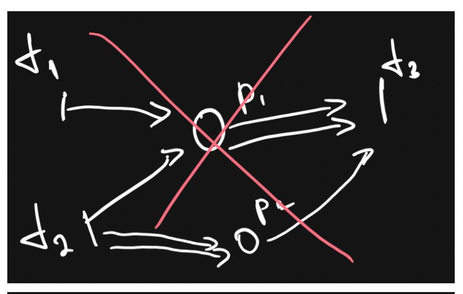


Сеть Петри PN = (P, T, F, M)

M- множество  $(M:P \to \mathbb{N})$ 

$$M = \begin{pmatrix} M(p_1) \\ M(p_2) \\ \dots \\ M(p_n) \end{pmatrix}$$

разметка меняется после срабатывания переходов.

**Условия срабатывания переходов:** 1. Переход t - может (но не должен) сработать, если  $\forall p \in *tM(p) \geq F(p,t)$  в векторном виде  $M \geq *F(t)$ 

где t\* - множество входных мест перехода t

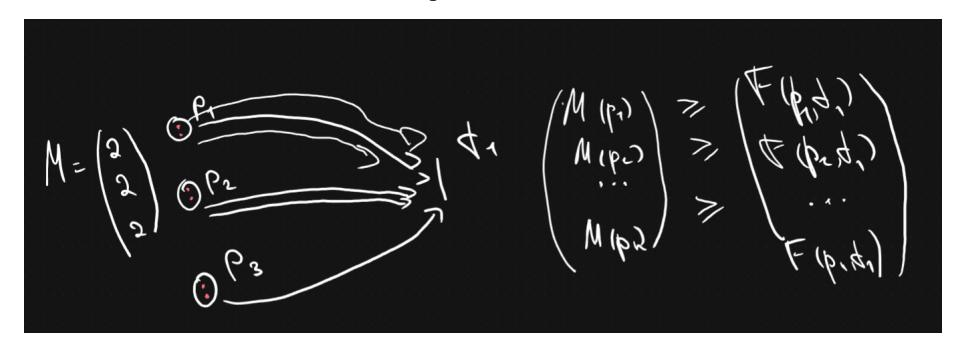

1. Допустим мог сработать и сработал, то меняется разметка  $\forall p \in PM'(p) = M(p) - F(p,t) + F(t,p)$ , в векторном виде M' = M - \*F(t) + F\*(T)

$$\begin{pmatrix} M(p_1) \\ M(p_2) \\ \dots \\ M(p_n) \end{pmatrix} = \begin{pmatrix} M(p_1) \\ M(p_2) \\ \dots \\ M(p_n) \end{pmatrix} - \begin{pmatrix} F(p_1,t) \\ F(p_2,t) \\ \dots \\ F(p_n,t) \end{pmatrix} + \begin{pmatrix} F(t,p_1) \\ F(t,p_2) \\ \dots \\ F(t,p_n) \end{pmatrix}$$


Пример:


Закона сохранения фишек НЕТ!

#### Работа всей сети Петри описывается:

- 1. Множество сработающих переходов  $\tau = \{t_1, t_2 \dots \}$
- 2. Множество достижимых разметок  $R_0 = (PN, M_0)$

$$M_0[t_1 > M_1[t_2 > M_2 \dots M_N$$

 $M_0[t_1 > M_1$  - бинарное отношение непосредственно на множестве разметок

 ${\cal M}_0, {\cal M}_1$  вступают в бинарное отношение непосредственного следования, если:

$$(M_0 \rightarrow *F(t_1))$$
 и  $(M_1 = M_0 - *F(t_1) + F^*(t_1))$ 

# Глава 2 - Автоматическое распараллеливание последовательных программ

Лекция 4 (28.02.26)

### Параграф 2.1 - Автоматическое распараллеливание ациклических участков последовательных программ

Любой указанный фрагмент допускает запись через операторы всего двух видов: - Присваивание - Условные переходы

**Этап I - Построение стандартного графа** Будем различать два типа вершин стандартного графа:

1. **Преобразовать** - каждый соответствует одному или нескольким последовательно расположенных операторов присваивания, изображается на графе **прямоугольником** 

2. **Распознаватель** - каждый соответствует строго одному оператору условного перехода, изображается на графе **окружностью** 

Дуги на графе задаются бинарным отношением непосредственного следования

Отметим, что из преобразователя выходит не более одной дуги

Из распознавателя не более двух, при этом дугу соответствующей истинности условия распознавателя маркируем 1, ложное 0

Вершину в которую не входит не одна дуга именуем входной вершиной стандартного графа

Вершину из которой не выходит не одна дуга именуем выходной вершиной стандартного графа

Пример:


#### Этап II - Построение графа зависимостей

1. Вершина В информационно зависит от A, если {A и B находятся на одном пути стандартного графа из входной вершины в выходную(при чем A предшествует В)} и хотя бы один оператор из В использует значение переменной формируем хотя бы одним оператором из A. При этом отсутствует расположенная на одном пути, такая что меняется значение

При построение графа зависимости в него переносятся вершины стандартного графа без изменений

2. Вершина В логически зависит от А, если {...} и существует другой путь на стандартном графе из входной вершины в выходную. Совпадающий с

первым до вершины А включительно, далее отличающуюся от него и не содержащую В.

3. Вершина В конкуренционно зависит от вершины A, если {...} и в каждой из вершин есть оператор присваивания меняющий значение некой общей переменной.

Отныне не различаем тип зависимости. Завершаем построение графа зависимости нанесение на него транзитивного замыкания зависимостей построенных к этому моменту.


Этап III - Построение ярусно параллельной формы

- 1. A
- 2. B; C; D; E; P
- 3. F; G
- 4. H

#### Алгоритм построения ЯПФ:

Шаг 1. Заполнение первого яруса ЯПФ

В первый ярус помещаются  $A \not\exists BDep(B,A)$ 

**Шаг 2.** Пусть к ярусов заполнено, если  $\forall A \exists_{i \leq k} \exists_{j \leq n_k} A = A_{ij}$ , то ЯПФ построен, иначе шаг 3.

**Шаг 3.** В k+1 ярус помещаются такие вершины A Dep(B,A)  $\Longrightarrow$   $\exists_{i\leq k}\exists_{j\leq n_k}A_{ij}=B$ , шаг 2.

В итоге на каждом ярусе окажутся исключительно независимые вершины, их операторы могут выполняться одновременно.

Этап IV - Построение параллельного алгоритма Метод построения параллельного алгоритма: Пусть известно p - число задач и  $1 \le \mu \le p$  - номер задачи

Шаг 1. Распределение вершин первого яруса ЯПФ между задачами

$$\mu \sim A_{1,\mu}; A_{1,\mu+p}; A_{1,\mu+2p} \dots$$

**Шаг 2.** Пусть k ярусов распределено

Если ЯПФ закончилось то алгоритм построен, иначе переходим на шаг 3.

**Шаг 3.** Распределение k+1 яруса ЯПФ по задачам параллельного алгоритма

$$\mu \sim c(A_{k+1,\mu}); A_{k+1,\mu}; c(A_{k+1,\mu+p}); A_{k+1,\mu+p}; c(A_{k+1,\mu+2p}); A_{k+1,\mu+2p} \dots$$

Если функция c(A) - истина, то мы исполняем операторы вершины сразу за функцией.

Если ложь, тогда операторы следующей вершины не выполняются, а проверяются значение функции следующей за этой вершины.

Если пока не определено, то вычислительный процесс прерывается, а  $\mu-$  задача простаивает, пока значение не станет определенным.

Переход на шаг 2.

**Формализм определения функции** c(A) Если далее говорится о пути, то имеется ввиду стандартный граф Говоря о зависимости имеется ввиду граф зависимостей Пусть через вершину A проходит n путей из входной вершины в выходную -  $\xi^1, \xi^2, \xi^3, \dots \xi^n$ , тогда каждой ставим в соответствие  $c^1, c^2, c^3, \dots c^n$ , принимающие значения истинно, если вычислительный процесс идущей по этому пути дошел до вершины A. Ложь, если заведомо известно, что пошел или пойдет другим путем, не содержащим A.  $c^i$  - неопределенно, если не одно из предыдущих утверждений пока не подходит Тогда  $c(A) = {}^1 \cup c^2 \cup c^3 \cdots \cup c^n$ 

#### Лекция 5 (07.03.26)

Выделим на данном пути, от который A зависит. Тогда  $c(A_k)$ , где  $1 \le k \le K$   $\implies c^i = c(A_1) \cap c(A_2) \cap \dots c(A_K)$ 


$$(A_k) \begin{cases} c(A_k) \\ c(A_k=1)$$
 - Если  $A_k$  - распознаватель, и для реализации пути  $\xi_i$  должно стать истинной  $c(A_k=0)$  - Если для реализизации пути  $\xi_i$  условие распознавателя  $A_k$  - ложно

### Параграф 2.2 Автоматическое распараллеливание циклических фрагментов последовательной программы

$$\begin{array}{c} (*) \\ \text{for i\_1 = 1:n\_1} \\ \text{for i\_2 = 1:n\_2} \\ \dots \\ \text{for i\_k = 1:n\_k} \\ \text{T(i\_1,i\_2,\dots,i\_k)} \\ \text{end} \\ \dots \\ \text{end} \\ \\ I = \{(i_1,i_2,\dots,i_k): 1 \leq i_g \leq n_g \quad, 1 \leq g \leq k \\ I \text{- пространство итераций} \\ (i_1,i_2,\dots,i_k) \text{- вектор из пространства итераций} \\ \end{array}$$

1. Отношение следования Развернем конструкцию (\*) следующим образом:

$$(\hat{\ })\ T(1,1,\ldots,1);\ T(1,1,\ldots,2);\ T(1,1,\ldots,n_k);\ T(1,1,\ldots,2,1);\ldots\ T(n_1,n_2,\ldots,n_k)$$

Теперь для ациклической конструкции строим стандартный граф. Ищем транзитивное замыкание отношение непосредственного следования, назовем его **отношения следования** на множестве вершин.

Между пространством итераций определенной (\*) и телами из развернутой ациклической конструкции  $(^{\wedge})$ , очевидно, существует взаимно однозначное отображение (биекция).

Тогда будем говорить, что вектор i из пространства итераций (связанный с телом T) следует за вектором i' (связанный с телом T'), если любая вершина из тела T конструкции (^) следует за любой вершиной из тела T'.

### **2. Отношение зависимость** По развернутой ациклической конструкции (^) строим граф зависимость.

Далее будем говорить, что вектор i (относящий к T) зависит от i' (относящийся к T'), если хотя бы одна вершина из T зависит хотя бы от одной из.

Целью математической части лекции является поиск покрытия пространства итераций  $\{I_q\}_{q=\overline{1,Q}}$ 

Если 
$$I=\bigcup_{q=1}^Q I_q$$
, то  $\{I_q\}_{q=\overline{1,Q}}$ 

При покрытии  $I_1 \cap I_q = \emptyset$ 

Наше цель найти покрытие, такое что любое его подмножество содержит исключительно независимые векторы.

В одном подмножестве покрытия итерации связанный с его векторами можно исполнять одновременно.

$$S = \frac{\prod_{j=1}^k n_j}{Q} = \frac{I_{\rm nocn}}{I_{\rm napann}} \to Max$$
 — ускорение (speedup)

Пример (?):

for 
$$i = 1:10$$
  
  $x(i) = f(x(i-1))$   
end

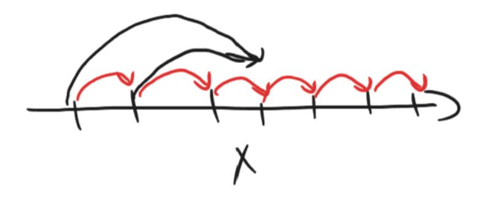

Для дальнейшего построения параллельного алгоритма необходимо соблюдений следующих условий:

- 1. Параметры его тела внутри цикла не должны изменяться
- 2. В теле цикла отсутствует переход за циклическую конструкцию
- 3. Параметры цикла в теле цикла участвуют только в линейных операциях

**Параграф 2.2.1 - Метод пирамид Шаг1.** По циклической конструкции (∗) строится пространство итераций на нём вводится отношения следования и зависимость.

На пространстве итераций выбираются вектора каждый из которых не зависит не от какого другого вектора этого пространства, назовем такие вектора **результирующими**.

**Шаг2.** Каждому такому вектору поставим во взаимное однозначное соответствие (биекция) одну задачу параллельного алгоритма.

Кроме указанного вектора отнесем к ней также все вектора пространства итераций от которых данные **результирующие** зависят.

**Шаг3.** Внутри каждой задачки упорядочим отнесенные к ней вектора в соответствие с отношением следования.

#### **Алгоритм построен.**

В отличие от других методов построения **Метод Пирамид** не характеризуется коммуникацией.

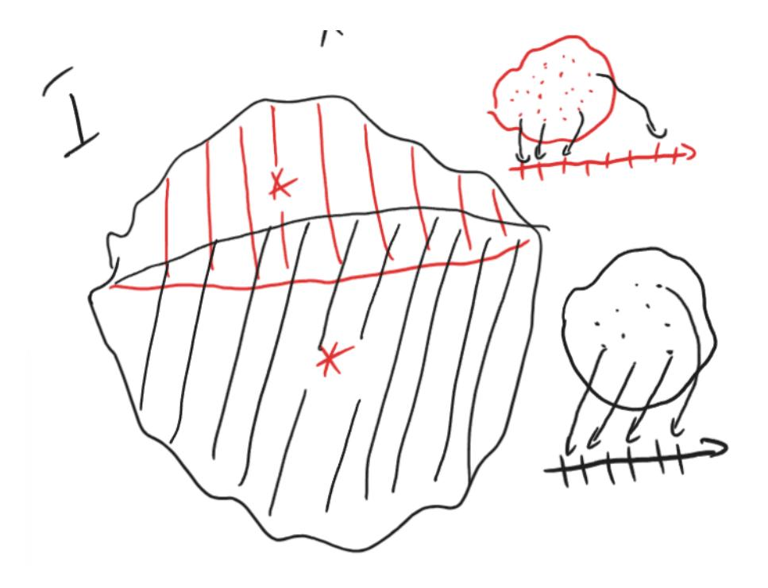

#### **Лекция 6 (14.03.26)**

#### **Пример Метода пирамид Последовательный алгоритм:**

```
for i = 1:I
    for j = 1:J
        u(i,j) = f(u(i-1,j),u(i-1,j-1)mu(i-1,j+1))
    endfor
enfor
```

#### **Параллельный алгоритм:**

```
for i = 1:I
   for j = max{1,mu-(I-i)tg(alpha)} : min{J,mu+(I-i)tg(beta)}
       u(i,j) = f(u(i-1,j),u(i-1,j-1)mu(i-1,j+1))
   endfor
endfor
 − ( − )(ℎ) -  min
 + ( − )() -  max
```


#### **Замечания**

1. Метод имеет смысл применять в 1) случае, а не 2):

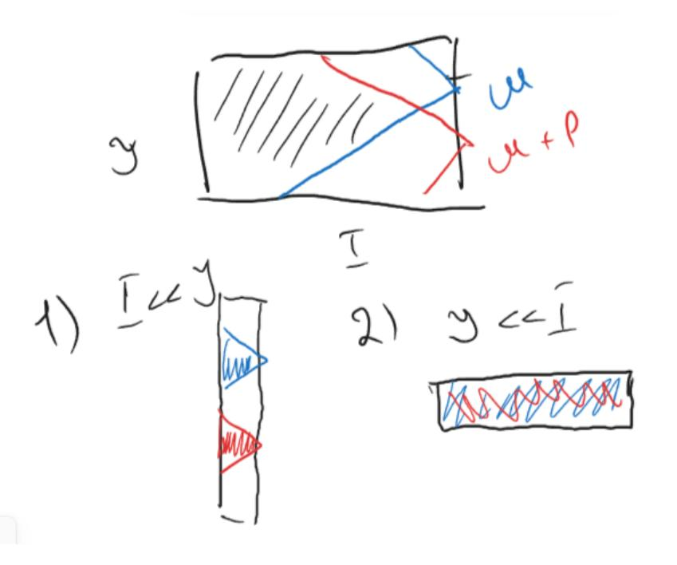

2. На практике задачи с близкими номерами принято объединять

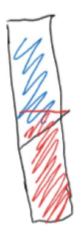

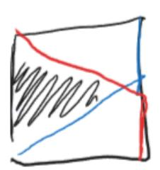

3. В отличии от остальных методов в данном допускается использование параметров цикла внутри цикла в нелинейных выражениях

#### **Параграф 2.2.2 Метод параллелепипедов**

В отличии от всех остальных методов позволяет работать с простыми циклами Последовательный алгоритм:

for 
$$i = 1:10$$
  
  $x(i) = f(x(i-4))$   
endfor

Параллельный алгоритм (вариант 1):

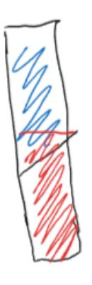

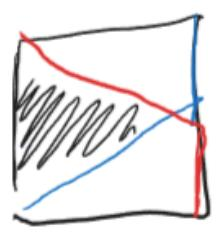

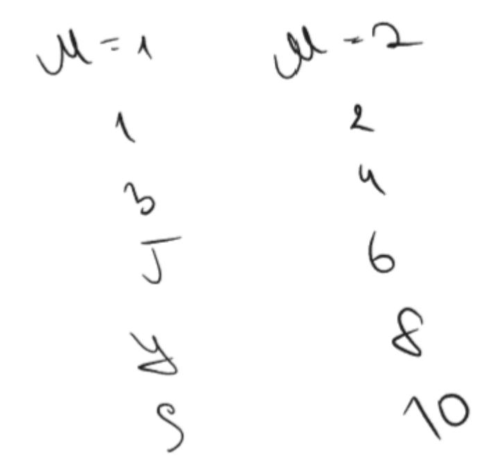

$$S = 2$$

Параллельный алгоритм (вариант 2):


$$S = \frac{10}{3}$$

**Шаг1.** Строим пространство итераций, наносим на него отношение следования и зависимости.

**Шаг2.** На пространстве итераций ищем различные покрытия, каждый из которых представляет из себя набор k - мерных параллелепипедов.

```
for i_1 = 1:n_1
    for i_2 = 1:n_2
```

**Шаг3.** Для каждого из этих покрытий выбираем параллелепипед максимального объема и на его ребрах строим новую систему координат.

Количество задач параллельного алгоритма будет равным числу векторов в выбранном промежутке.

Если длины сторон параллелепипеда равны  $p_1,p_2,\dots p_k$  (где  $p_i$  есть разница координат последнего и первого вектора по i направлению + 1), то для прямоугольного параллелепипеда общее число задач есть:  $p=\prod_{i=1}^k p_i$ 

За номер задачи примем координату вектора в выбранном параллелепипеде в новой система координат

$$(g_1,g_2,\dots g_k)$$

Может случится, что размерность выбранного параллелепипеда окажется меньше пространства итераций, в этом случае одна или несколько p будут приняты за 1

А в номере задачи соответствующая ему координата также будет принята за единицу

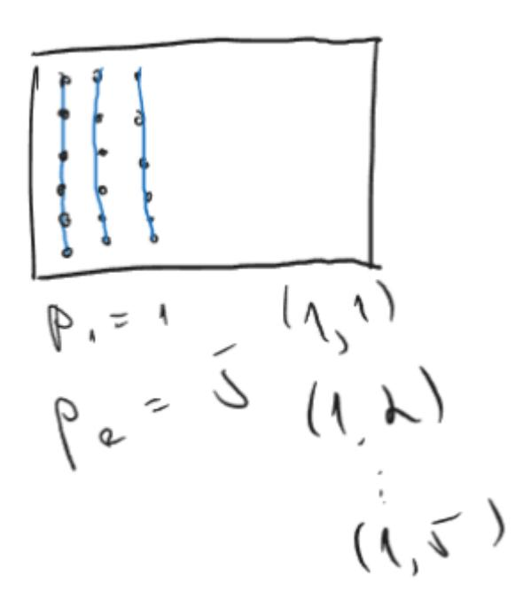

**Шаг4.** Отнесем к ведению каждой задачи не более одного вектора из каждого подмножества выбранного покрытия

Внутри каждой задачи совокупность отнесенных к ней векторов расположены в

```
соответствии с отношением следования, таким образом:
```

```
for i_1 = g_1:p_1:n_1
    for i_2 = g_2:p_2:n_2
             for i_k = g_k:p_k:n_k
                T(i_1, i_2, ..., i_k)
             endfor
    endfor
endfor
Двумерный пример:
for i=1:7
    for j=1:3
        x(i,j) = f(x(i-2,j-1))
    {\tt endfor}
endfor
Параллельный:
for i=g_1:p_1:7
    for j=g_2:p_2:3
        if (i>2) and (j>1) then
            recv(x(i-2,j-1), (g_1,g_2-1))
        x(i,j) = f(x(i-2,j-1))
        if(i<6) and (j<3) then
             send(x(i,j),(g_1,g_2+1))
    endfor
endfor
Для задачи в кружочке:
for i=1:2:7 \Rightarrow i = 1,3,5,7
    for j=3:3:3 \Rightarrow j = 3
        T(i,j)
    endfor
endfor
```

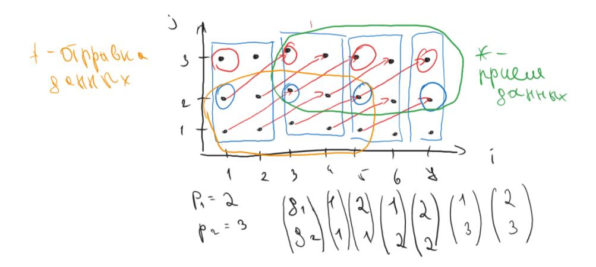

Как в прошлом случае количество задач найденных таким образом много больше числа используемых устройств, поэтому задачи объединяют.

# Глава 3 Векторные алгоритмы вычислительной линейной алгебры

Лекция 7 (21.03.26)

Параграф 3.1 Векторные алгоритмы умножения матриц

#### Пункт 1.1 Основные векторные операции Операция с вектором (аппаратно)

- 1. z = x + y, где  $z, x, y \in R$  сложение
- 2.  $z=\alpha x$ , где  $\alpha\in R$  умножение вектора на скаляр
- 3.  $a = x^T y$  скалярное произведение
- 4. z = x \* y покомпонентное произведение
- 5.  $z = \alpha_x + y$  saxpy (scalar  $\alpha x$  plus y)

#### Операции с матрицами

1. 
$$z=Ax+y$$
, где  $A\in R^{n\times m}$   $z,y\in R^{n\times 1}$   $x\in R^{m\times 1}$  - gaxpy (ganed  $A$   $x$  plus  $y$ )

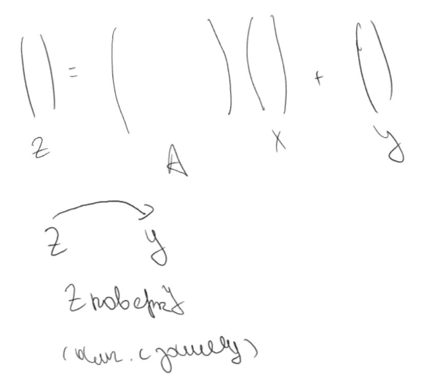

#### дахру через скалярное произведение

#### План Б. Выражение дахру через ѕахру

for j = 1:m 
$$y = y + A(:,j)x(j)$$
 endfor 
$$2. \ A = A + xy^T, \text{rge } A \in R^{n\times m} \ x \in R^{n\times 1} \ y \in R^{m\times 1}$$

--------------------------------------

Вся операция вместе - называется модификация матрицы внешним произведением

```
for i=1:n
    A(i,:) = A(i,:) + x(i)y^T - saxpy\nendfor

for j=1:m
    A(:,j) = A(:,j) + xy(j) - saxpy\nendfor
```

### Пункт 1.2 Векторные алгоритмы умножения матриц Умножение по определению:

```
for i=1:n
    for j=1:n
        for k=1:n
            c(i,j) = A(i,k)B(k,j)
        endfor
    endfor\nendfor
```

#### Цикл к преобразуем в скалярное произведение:

```
for i=1:n
    for j=1:n
        c(i,j) = A(i,:)B(:,j)
    endfor\nendfor
```

#### Цикл ј убираем, получаем дахру:

```
for i=1:n {\tt c(i,:)} = {\tt A(i,:)} {\tt B} - {\tt gaxpy} endfor z = xA + y, \text{где } A \in R^{n\times m} \ x \in R^{n\times 1} \ y \in R^{m\times 1} \text{-- строчное gaxpy}
```

| Название          |                           | Название       | c = A * B Доступ |
|-------------------|---------------------------|----------------|------------------|
| алгоритма         | Векторная операция        | операции       | к пам            |
| $\overline{ijk}$  | скалярное<br>произведение | строчное дахру | смещенная        |
| $\underline{kij}$ | строчное saxpy            |                | по строкам       |

```
for k=1:n
    for i=1:n
        for j=1:n
            c(i,j) = c(i,j) + A(i,k)B(k,j)
        endfor
    endfor\nendfor
```

#### **Свернем j цикл (saxpy строчное):**

```
for k=1:n
    for i=1:n
        c(i,:) = c(i,:) + A(i,k)B(k,:) - saxpy 
    endfor
endfor
```

#### **Свернем i цикл (модификация матрицы):**

```
for k=1:n
   c = c + A(:,k)B(k,:) -  
endfor
```

#### **Блочный алгоритм:**


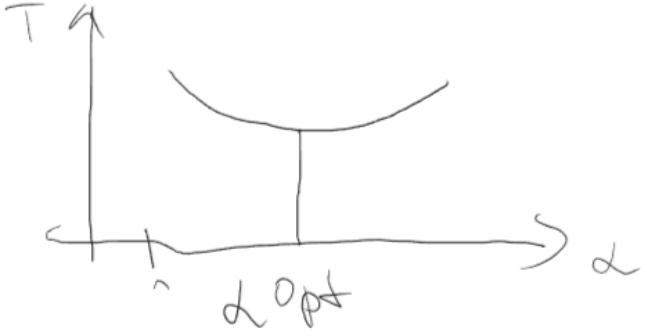

```
for i_b = 1:N
    i=1(i_b-1)alpha + 1 : i_b alpha
    for j_b = 1:N
```

```
j=1(j_b-1) \\ alpha + 1 : j_b \\ alpha \\ for \\ k_b = 1: \\ \\ k=1(k_b-1) \\ alpha + 1 : k_b \\ alpha \\ c(i,j) = c(i,j) + A(i,k) \\ B(k,j) \\ end for \\ end for \\ end for \\
```

#### Параграф 3.2 Векторные алгоритмы решения СЛАУ

#### Пункт 3.2.1 Решение СЛАУ с матрицами треугольного вида Lx = b

$$\begin{pmatrix} l_{11} & 0 & 0 & \cdots & 0 \\ l_{21} & l_{22} & 0 & \cdots & 0 \\ l_{31} & l_{32} & l_{33} & \cdots & 0 \\ \vdots & \vdots & \vdots & \ddots & \vdots \\ l_{n1} & l_{n2} & l_{n3} & \cdots & l_{nn} \end{pmatrix} \begin{pmatrix} x_1 \\ x_2 \\ x_3 \\ \dots \\ x_n \end{pmatrix} = \begin{pmatrix} b_1 \\ b_2 \\ b_3 \\ \dots \\ x_n \end{pmatrix}$$
 
$$x_1 = \frac{b_1}{l_{11}}$$
 
$$x_2 = \frac{b_2 - l_{21}x_1}{l_{22}}$$
 
$$x_3 = \frac{b_3 - l_{31}x_1 - l_{32}x_2}{l_{33}}$$
 
$$x_i = \left( b_i - \sum_{j=1}^{i=1} \frac{l_{ij}x_j}{l_{ii}} \right)$$
 
$$L(i, 1:i-1)(1:i-1) \text{ - скалярное произведение}$$
 for  $i=2:n$  
$$b(i) = b(i) \text{ - } L(i, 1:i-1)b(1:i-1) \text{ / } L(i,i)$$
 endfor 
$$\text{ Пусть L нижняя унитреугольная матриц}$$

b(i) = b(i) - L(i,1:i-1)b(1:i-1) -

endfor

$$\begin{pmatrix} l_{11} & 0 & 0 & \cdots & 0 \\ l_{21} & l_{22} & 0 & \cdots & 0 \\ l_{31} & l_{32} & l_{33} & \cdots & 0 \\ \vdots & \vdots & \vdots & \ddots & \vdots \\ l_{n1} & l_{n2} & l_{n3} & \cdots & l_{nn} \end{pmatrix} \begin{pmatrix} x_1 \\ x_2 \\ x_3 \\ \dots \\ x_n \end{pmatrix} = \begin{pmatrix} b_1 \\ b_2 \\ b_3 \\ \dots \\ b_n \end{pmatrix} - \begin{pmatrix} l_{21} \\ l_{31} \\ l_{41} \\ \dots \\ l_{n1} \end{pmatrix} - \mathbf{b}'$$
 
$$x_1 = \frac{b_1}{l_{11}}$$
 
$$x_2 = \frac{b_2'}{l_{22}}$$
 for  $\mathbf{j} = 1 : \mathbf{n} - 1$  
$$\mathbf{b}(\mathbf{j}) = \mathbf{b}(\mathbf{j}) / \mathbf{L}(\mathbf{j}, \mathbf{j}) \\ \mathbf{b}(\mathbf{j} + 1 : \mathbf{n}) = \mathbf{b}(\mathbf{j} + 1 : \mathbf{n}) - \mathbf{L}(\mathbf{j} + 1 : \mathbf{n}, \mathbf{j}) \mathbf{b}(\mathbf{j}) - \mathbf{saxpy} \ ( )$$
 endfor 
$$\mathbf{b}(\mathbf{n}) = \mathbf{b}(\mathbf{n}) / \mathbf{L}(\mathbf{n}, \mathbf{n})$$
 
$$\mathbf{\Pi}\mathbf{y}\mathbf{c}\mathbf{t}\mathbf{L} \mathbf{h}\mathbf{u}\mathbf{x}\mathbf{h}\mathbf{x}\mathbf{y}\mathbf{y}\mathbf{u}\mathbf{t}\mathbf{p}\mathbf{e}\mathbf{y}\mathbf{f}\mathbf{o}\mathbf{n}\mathbf{h}\mathbf{a}\mathbf{x}\mathbf{x}\mathbf{n}\mathbf{x}\mathbf{y}\mathbf{u}\mathbf{f}\mathbf{f}\mathbf{f}\mathbf{f}\mathbf{f}\mathbf{f}\mathbf{f}\mathbf{f}\mathbf{f}\mathbf{f$$

$$L=X=B$$
, где  $L\in R^{n\times n}$   $X,B\in R^{n\times m}$  
$$\frac{n}{N}=\alpha$$
 
$$L_{i_b,j_b}\in R^{\alpha\times \alpha}$$

 $B_{i_b}, X_{i_b} \in R^{\alpha \times m}$ 

 $1 \le i_b, j_b$ 

endfor\nendfor
L\_{N,N}X\_{N}=B\_{N}

#### Лекция 8 (28.03.26)

### Пункт 3.2.2 Алгоритм LU разложения через модификацию внешним произведением

$$\begin{pmatrix} 1 & 0 \\ -\frac{x_2}{x_1} & 1 \end{pmatrix} \begin{pmatrix} x_1 \\ x_2 \end{pmatrix} = \begin{pmatrix} x_1 \\ 0 \end{pmatrix}$$

$$\begin{pmatrix} 1 & 0 \ -\frac{x_2}{x_1} & 1 \end{pmatrix}$$
 — матрица Гаусса

$$\begin{pmatrix} 1 & 0 & \cdots & 0 & 0 & \cdots & 0 \\ 0 & 1 & \cdots & 0 & 0 & \cdots & 0 \\ \vdots & \vdots & \ddots & \vdots & \vdots & \vdots & \vdots \\ 0 & 0 & \cdots & 1 & 0 & \cdots & 0 \\ 0 & 0 & \cdots & -\frac{x_{k+1}}{x_k} & 1 & \cdots & 0 \\ \vdots & \vdots & & \vdots & \vdots & \ddots & \vdots \\ 0 & 0 & \cdots & -\frac{x_n}{x_n} & 0 & \cdots & 1 \end{pmatrix} \begin{pmatrix} x_1 \\ x_2 \\ \dots \\ x_k \\ x_{k+1} \\ \dots \\ x_n \end{pmatrix} = \begin{pmatrix} x_1 \\ x_2 \\ \dots \\ x_k \\ 0 \\ \dots \\ 0 \end{pmatrix}$$

$$\tau^{(k)} = \begin{pmatrix} 0 \\ 0 \\ \vdots \\ 0 \\ \frac{x_{k+1}}{x_k} \\ \vdots \\ \frac{x_n}{x_k} \end{pmatrix}$$

$$\tau_i^{(k)} = \left\{ \begin{array}{l} 0 \ \text{, при i} <= \mathrm{j} \\ \frac{x_i}{x_k} \ \text{, при i} > \mathrm{k} \end{array} \right.$$

$$l_k = \begin{pmatrix} 0 \\ \vdots \\ 1 \\ \vdots \\ 0 \end{pmatrix}$$

$$\tau^{(k)}l_k^T=???$$

$$\tau_i^{(k)} = \frac{a_{ik}}{a_{kk}}$$

### $I - \tau^{(k)} l_k^T - \mathbf{M}$ к матрица преобразования Гаусса

$$MkA = (I - \tau^{(k)}l_k^T)A = A - \tau^{(k)}l_k^TA = A - \tau^{(k)}A(k,:)$$

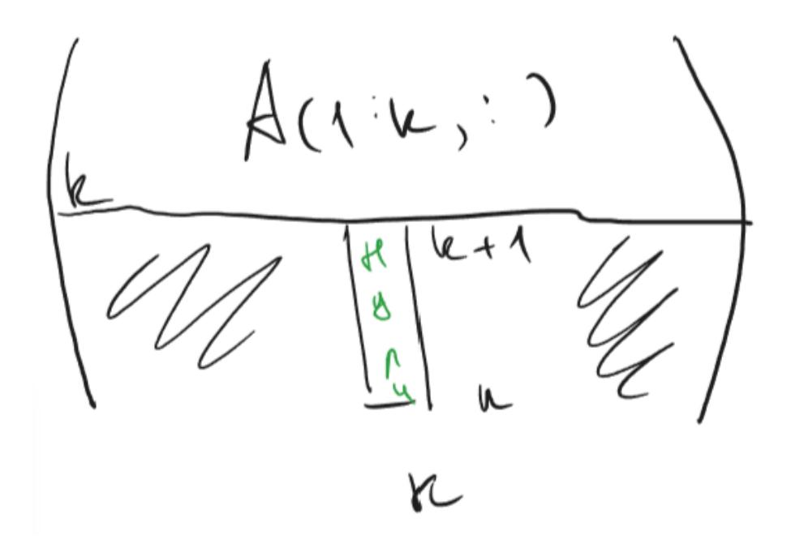

c=IAB, где  $A-{\rm I}$ на N<br/>, $B-{\rm N}$ на J<br/>, $C-{\rm I}$ на J

M<sub>N-1</sub>... M<sub>2</sub> M<sub>1</sub>A

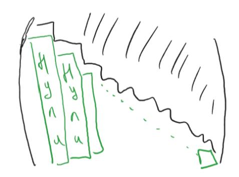

$$\begin{split} M_{n-1} \dots M_2 M_1 A &= U \\ M_{n-2} \dots M_1 A &= M_{n-1}^{-1} U \\ A &= M_1^{-1} M_2^{-1} \dots M_{n-1}^{-1} U \end{split}$$

$$L = \prod_{k=1}^{n-1} M_k^{-1} = I + \sum_{k=1}^{n-1} \tau^{(k)} l_k^T$$

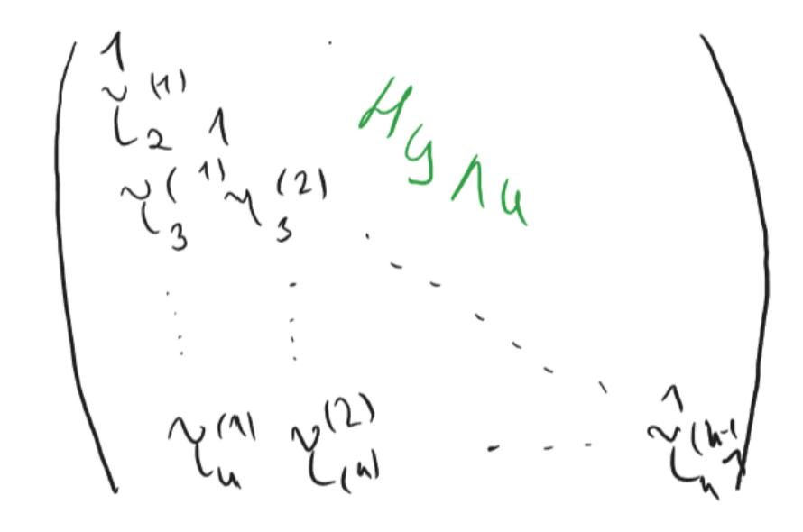

#### Алгоритм LU разложения:

for k 1:n-1 
$$A(k+1:n,k) = A(k+1:n,k)A(k,k) - k - (k-1)$$
 
$$A(k+1:n,k+1:n) = A(k+1:n,k+1:n) - A(k+1:n,k)A(k,k+1:n)$$
 endfor

На k-ом шаге алгоритма находи k+1-ый столбец:


|         | Назва | аниВектор                 | Матричный операции                           | Доступ к<br>данным |
|---------|-------|---------------------------|----------------------------------------------|--------------------|
| C       | kji   | Столбцовый<br>saxpy       | Модификация матрицы<br>внешним произведением | Столбцовый         |
| C       | kij   | Строчный<br>saxpy         | Модификация матрицы<br>внешним произведением | Строчный           |
| Fortran | jik   | Скалярное<br>произведение | Столбцовое дахру                             | Смешанное          |
| Fortran | jki   | Столбцовое saxpy          | Столбцовое gaxpy                             | Столбцовый         |

При возможности реализовать одно и тоже через модификацию матрицы или дахру предпочтение отдают дахру, потому что по сравнению с модификацией матрицей дахру характеризуется вдвое меньшим объемом коммуникаций между кэш памятью процессора и регистрами

Пункт 3.2.3 Производственное LU разложение через gaxpy

$$A = LU$$

Положим что к  $j\text{-}\mathrm{omy}$  шагу алгоритма первые j-1 столбцов L и U уже найдены, найдем j

$$A(:,j) = LU(:,j)$$
 1) 
$$A(1:j-1,j) = L(1:j-1,:)U(:,j)$$


$$A(1:j-1,j)=L(1:j-1,1:j-1)U(1:j-1,j)$$
, получаем:

$$L(1:j-1,1:j-1)$$
 - знаем

$$U(1:j-1,j)$$
 - ищем

Это СЛАУ 
$$Lx = b$$
, где  $b$  -  $A(1:j-1,j), x$  -  $U(1:j-1,j)$ 

2) 
$$A(j:n,j) = L(j:n,:)U(:,j)$$

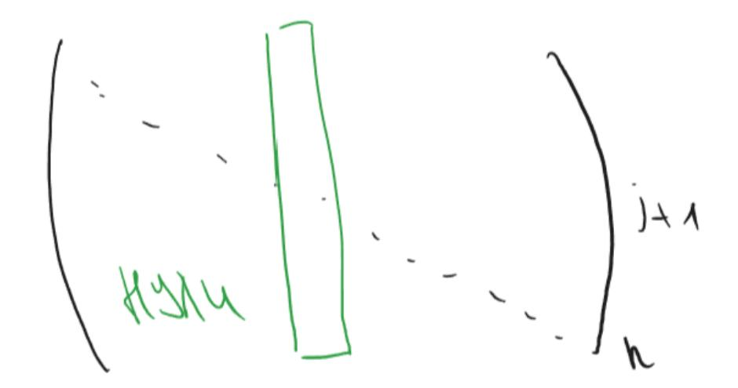

$$A(j:n,j) = L(j:n,1:j)U(1:j,j)$$

$$A(j:n,j) = \sum_{k=1}^{j} L(j:n,k) U(k,j)$$

$$A(j:n,j) = \sum_{k=1}^{j-1} L(j:n,k)U(k,j) + L(j:n,j)U(j,j)$$

$$A(j:n,j) = L(j:n,1:j-1)U(1:j-1,j) + L(j:n,j)U(j,j)$$
, получаем:

$$A(j:n,j)$$
 - знаем

$$L(j:n,1:j-1)$$
 - знаем

$$U(1:j-1,j)$$
 - знаем

$$L(j:n,j)$$
 - неизвестно  $V(j:n)$ 

$$V(j:n) = A(j:n,j) - L(j:n,1:j-1)U(1:j-1,j)$$
 - gaxpy

$$V(j:n) = L(j:n,1:j-1)U(j,j)$$

$$\begin{pmatrix}
\Box \\
\rangle = \begin{pmatrix}
\Box \\
1
\end{pmatrix}$$

$$\begin{pmatrix}
1 \\
1
\end{pmatrix}$$

$$\begin{pmatrix}
1 \\
1
\end{pmatrix}$$

$$\begin{pmatrix}
1 \\
1
\end{pmatrix}$$

$$\begin{pmatrix}
1 \\
1
\end{pmatrix}$$

$$\begin{pmatrix}
1 \\
1
\end{pmatrix}$$

$$\begin{pmatrix}
1 \\
1
\end{pmatrix}$$

$$\begin{pmatrix}
1 \\
1
\end{pmatrix}$$

$$\begin{pmatrix}
1 \\
1
\end{pmatrix}$$

$$\begin{pmatrix}
1 \\
1
\end{pmatrix}$$

$$\begin{pmatrix}
1 \\
1
\end{pmatrix}$$

$$\begin{pmatrix}
1 \\
1
\end{pmatrix}$$

$$\begin{pmatrix}
1 \\
1
\end{pmatrix}$$

$$\begin{pmatrix}
1 \\
1
\end{pmatrix}$$

$$\begin{pmatrix}
1 \\
1
\end{pmatrix}$$

$$\begin{pmatrix}
1 \\
1
\end{pmatrix}$$

$$\begin{pmatrix}
1 \\
1
\end{pmatrix}$$

$$\begin{pmatrix}
1 \\
1
\end{pmatrix}$$

$$\begin{pmatrix}
1 \\
1
\end{pmatrix}$$

$$\begin{pmatrix}
1 \\
1
\end{pmatrix}$$

$$\begin{pmatrix}
1 \\
1
\end{pmatrix}$$

$$\begin{pmatrix}
1 \\
1
\end{pmatrix}$$

$$\begin{pmatrix}
1 \\
1
\end{pmatrix}$$

$$\begin{pmatrix}
1 \\
1
\end{pmatrix}$$

$$\begin{pmatrix}
1 \\
1
\end{pmatrix}$$

$$\begin{pmatrix}
1 \\
1
\end{pmatrix}$$

$$\begin{pmatrix}
1 \\
1
\end{pmatrix}$$

$$\begin{pmatrix}
1 \\
1
\end{pmatrix}$$

$$\begin{pmatrix}
1 \\
1
\end{pmatrix}$$

$$\begin{pmatrix}
1 \\
1
\end{pmatrix}$$

$$\begin{pmatrix}
1 \\
1
\end{pmatrix}$$

$$\begin{pmatrix}
1 \\
1
\end{pmatrix}$$

$$\begin{pmatrix}
1 \\
1
\end{pmatrix}$$

$$\begin{pmatrix}
1 \\
1
\end{pmatrix}$$

$$\begin{pmatrix}
1 \\
1
\end{pmatrix}$$

$$\begin{pmatrix}
1 \\
1
\end{pmatrix}$$

$$\begin{pmatrix}
1 \\
1
\end{pmatrix}$$

$$\begin{pmatrix}
1 \\
1
\end{pmatrix}$$

$$\begin{pmatrix}
1 \\
1
\end{pmatrix}$$

$$\begin{pmatrix}
1 \\
1
\end{pmatrix}$$

$$\begin{pmatrix}
1 \\
1
\end{pmatrix}$$

$$\begin{pmatrix}
1 \\
1
\end{pmatrix}$$

$$\begin{pmatrix}
1 \\
1
\end{pmatrix}$$

$$\begin{pmatrix}
1 \\
1
\end{pmatrix}$$

$$\begin{pmatrix}
1 \\
1
\end{pmatrix}$$

$$\begin{pmatrix}
1 \\
1
\end{pmatrix}$$

$$\begin{pmatrix}
1 \\
1
\end{pmatrix}$$

$$\begin{pmatrix}
1 \\
1
\end{pmatrix}$$

$$\begin{pmatrix}
1 \\
1
\end{pmatrix}$$

$$\begin{pmatrix}
1 \\
1
\end{pmatrix}$$

$$\begin{pmatrix}
1 \\
1
\end{pmatrix}$$

$$\begin{pmatrix}
1 \\
1
\end{pmatrix}$$

$$\begin{pmatrix}
1 \\
1
\end{pmatrix}$$

$$\begin{pmatrix}
1 \\
1
\end{pmatrix}$$

$$\begin{pmatrix}
1 \\
1
\end{pmatrix}$$

$$\begin{pmatrix}
1 \\
1
\end{pmatrix}$$

$$\begin{pmatrix}
1 \\
1
\end{pmatrix}$$

$$\begin{pmatrix}
1 \\
1
\end{pmatrix}$$

$$\begin{pmatrix}
1 \\
1
\end{pmatrix}$$

$$\begin{pmatrix}
1 \\
1
\end{pmatrix}$$

$$\begin{pmatrix}
1 \\
1
\end{pmatrix}$$

$$\begin{pmatrix}
1 \\
1
\end{pmatrix}$$

$$\begin{pmatrix}
1 \\
1
\end{pmatrix}$$

$$\begin{pmatrix}
1 \\
1
\end{pmatrix}$$

$$\begin{pmatrix}
1 \\
1
\end{pmatrix}$$

$$\begin{pmatrix}
1 \\
1
\end{pmatrix}$$

$$\begin{pmatrix}
1 \\
1
\end{pmatrix}$$

$$\begin{pmatrix}
1 \\
1
\end{pmatrix}$$

$$\begin{pmatrix}
1 \\
1
\end{pmatrix}$$

$$\begin{pmatrix}
1 \\
1
\end{pmatrix}$$

$$\begin{pmatrix}
1 \\
1
\end{pmatrix}$$

$$\begin{pmatrix}
1 \\
1
\end{pmatrix}$$

$$\begin{pmatrix}
1 \\
1
\end{pmatrix}$$

$$\begin{pmatrix}
1 \\
1
\end{pmatrix}$$

$$\begin{pmatrix}
1 \\
1
\end{pmatrix}$$

$$\begin{pmatrix}
1 \\
1
\end{pmatrix}$$

$$\begin{pmatrix}
1 \\
1
\end{pmatrix}$$

$$\begin{pmatrix}
1 \\
1
\end{pmatrix}$$

$$\begin{pmatrix}
1 \\
1
\end{pmatrix}$$

$$\begin{pmatrix}
1 \\
1
\end{pmatrix}$$

$$\begin{pmatrix}
1 \\
1
\end{pmatrix}$$

$$\begin{pmatrix}
1 \\
1
\end{pmatrix}$$

$$\begin{pmatrix}
1 \\
1
\end{pmatrix}$$

$$\begin{pmatrix}
1 \\
1
\end{pmatrix}$$

$$\begin{pmatrix}
1 \\
1
\end{pmatrix}$$

$$\begin{pmatrix}
1 \\
1
\end{pmatrix}$$

$$\begin{pmatrix}
1 \\
1
\end{pmatrix}$$

$$\begin{pmatrix}
1 \\
1
\end{pmatrix}$$

$$\begin{pmatrix}
1 \\
1
\end{pmatrix}$$

$$\begin{pmatrix}
1 \\
1
\end{pmatrix}$$

$$\begin{pmatrix}
1 \\
1
\end{pmatrix}$$

$$\begin{pmatrix}
1 \\
1
\end{pmatrix}$$

$$\begin{pmatrix}
1 \\
1
\end{pmatrix}$$

$$\begin{pmatrix}
1 \\
1
\end{pmatrix}$$

$$\begin{pmatrix}
1 \\
1
\end{pmatrix}$$

$$\begin{pmatrix}
1 \\
1
\end{pmatrix}$$

$$\begin{pmatrix}
1 \\
1
\end{pmatrix}$$

$$\begin{pmatrix}
1 \\
1
\end{pmatrix}$$

$$\begin{pmatrix}
1 \\
1
\end{pmatrix}$$

$$\begin{pmatrix}
1 \\
1
\end{pmatrix}$$

$$\begin{pmatrix}
1 \\
1
\end{pmatrix}$$

$$\begin{pmatrix}
1 \\
1
\end{pmatrix}$$

$$\begin{pmatrix}
1 \\
1
\end{pmatrix}$$

$$\begin{pmatrix}
1 \\
1
\end{pmatrix}$$

$$\begin{pmatrix}
1 \\
1
\end{pmatrix}$$

$$\begin{pmatrix}
1 \\
1
\end{pmatrix}$$

$$\begin{pmatrix}
1 \\
1
\end{pmatrix}$$

$$\begin{pmatrix}
1 \\
1
\end{pmatrix}$$

$$\begin{pmatrix}
1 \\
1
\end{pmatrix}$$

$$\begin{pmatrix}
1 \\
1
\end{pmatrix}$$

$$\begin{pmatrix}
1 \\
1
\end{pmatrix}$$

$$\begin{pmatrix}
1 \\
1
\end{pmatrix}$$

$$\begin{pmatrix}
1 \\
1
\end{pmatrix}$$

$$\begin{pmatrix}
1 \\
1
\end{pmatrix}$$

$$\begin{pmatrix}
1 \\
1
\end{pmatrix}$$

$$\begin{pmatrix}
1 \\
1
\end{pmatrix}$$

$$\begin{pmatrix}
1 \\
1
\end{pmatrix}$$

$$\begin{pmatrix}
1 \\
1
\end{pmatrix}$$

$$\begin{pmatrix}
1 \\
1
\end{pmatrix}$$

$$\begin{pmatrix}
1 \\
1
\end{pmatrix}$$

$$\begin{pmatrix}
1 \\
1
\end{pmatrix}$$

$$\begin{pmatrix}
1 \\
1
\end{pmatrix}$$

$$\begin{pmatrix}
1 \\
1
\end{pmatrix}$$

$$\begin{pmatrix}
1 \\
1
\end{pmatrix}$$

$$\begin{pmatrix}
1 \\
1
\end{pmatrix}$$

$$\begin{pmatrix}
1 \\
1
\end{pmatrix}$$

$$\begin{pmatrix}
1 \\
1
\end{pmatrix}$$

$$\begin{pmatrix}
1 \\
1
\end{pmatrix}$$

$$\begin{pmatrix}
1 \\
1
\end{pmatrix}$$

$$\begin{pmatrix}
1 \\
1
\end{pmatrix}$$

$$\begin{pmatrix}
1 \\
1
\end{pmatrix}$$

$$\begin{pmatrix}
1 \\
1
\end{pmatrix}$$

$$\begin{pmatrix}
1 \\
1
\end{pmatrix}$$

$$\begin{pmatrix}
1 \\
1
\end{pmatrix}$$

$$\begin{pmatrix}
1 \\
1
\end{pmatrix}$$

$$\begin{pmatrix}
1 \\
1
\end{pmatrix}$$

$$\begin{pmatrix}
1 \\
1
\end{pmatrix}$$

$$\begin{pmatrix}
1 \\
1
\end{pmatrix}$$

$$\begin{pmatrix}
1 \\
1
\end{pmatrix}$$

$$\begin{pmatrix}
1 \\
1
\end{pmatrix}$$

$$\begin{pmatrix}
1 \\
1
\end{pmatrix}$$

$$\begin{pmatrix}
1 \\
1 \\
1
\end{pmatrix}$$

$$\begin{pmatrix}
1 \\
1 \\
1
\end{pmatrix}$$

$$\begin{pmatrix}
1 \\
1 \\
1 \\
1
\end{pmatrix}$$

$$\begin{pmatrix}$$

```
( + 1 ∶ , ) =  ( + 1 ∶ )(, )
for j=1:n
   1)   L(1:j-1,1:j-1)U(1:j-1,j) = A(1:j-1,j)
   2) gaxpy V(j:N) = A(j:n,j) - L(j:n,j-1)U(1:j-1,j)
   U(j,j) = V(j)
   L(j+1:n,j) = V(j+1:n)U(j,j)
endfor
for j=1:n
   for k=1:j-2
       A(k+1:j-1,k) = A(k+1:j-1,k) - A(k+1:j-1,k)A(k,j)
   endfor
   A(j:n,j) = A(j:n,1:j-1)A(1:j-1,j) =>   1),2)
   A(j+1:n,j) = A(j+1:n,j)A(j,j)
endfor
  1)
for k=1:j-1
   A(j:n,j) = A(j:n,j)-A(j:n,k)A(k,j)
endfor
  2)
for i=j:n
   A(i,j)=A(i,j) - A(i,1:j-1)A(1:j-1,j) -  
endfor
```

#### Лекция 9 (04.04.2026)

#### Пункт 3.2.3 Блочный алгоритм LU разложения

$$\begin{pmatrix} A_{11} & A_{12} \\ A_{21} & A_{22} \end{pmatrix}$$

 $r \ll n$ 

 $A \in \mathbb{R}^{n \times n}$ 

$$A_{11},L_{11},I_r,U_{11}\in\mathbb{R}^{n\times r}$$

$$A_{12}, U_{12} \in \mathbb{R}^{r \times (n-r)}$$

$$A_{21},L_{21} \in \mathbb{R}^{(n-r)\times n}$$

$$A_{22}, I_{n-r} \in \mathbb{R}^{(n-r)\times (n-r)}$$

$$\begin{pmatrix} A_{11} & A_{12} \\ A_{21} & A_{22} \end{pmatrix} =$$

$$=\begin{pmatrix} L_{11} & \text{нули ((n-r) на r)} \\ L_{21} & I_{n-r} \end{pmatrix} \times \begin{pmatrix} I_r & \text{нули} \\ \text{нули ((n-r) на r)} & \widetilde{A} \end{pmatrix} \times \begin{pmatrix} U_{11} & U_{12} \\ \text{нули} & I_{n-r} \end{pmatrix} =$$
 
$$=\begin{pmatrix} L_{11}U_{11} & L_{11}U_{12} \\ L_{21}U_{11} & \widetilde{A} + L_{21}U_{12} \end{pmatrix}$$

#### Алгоритм I:

1) 
$$A_{11} = L_{11}U_{11}$$

Производим LU разложение матрицы A по любому векторному алгоритму

2) 
$$A_{12}=L_{11}U_{12}\rightarrow {\rm c}$$
лау  $LX=B$ 

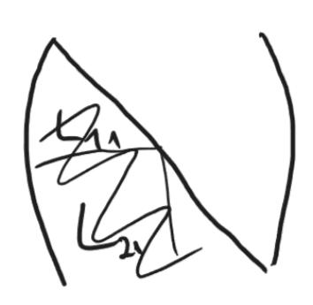

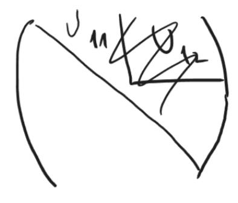

- 3)  $A_{21}=L_{21}U_{11} \to$  слау XU=B
- 4)  $A_{22} = \widetilde{A} + L_{21}U_{12} \Rightarrow \widetilde{A} = A_{22} L_{21}U_{12}$

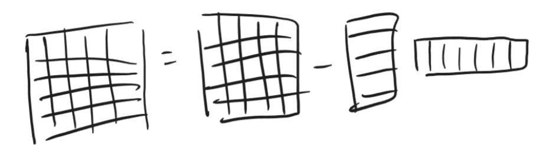

5) Примем  $A=\widetilde{A}$ , пока матрица не кончится

#### Алгоритм II (Fortran алгоритм):

1) Производим LU разложение матрицы A через дахру **столбцовое**, но не полностью, а r первых шагов

 $U_{11}, L_{11}, L_{21}$ 

- 2) (бывший 2))
- 3) (бывший 4))
- 4) (бывший 5))

#### Алгоритм III:

1) Производим r первых шагов LU разложения матрицы A, через модификацию матрицы внешним произведением (не затрагивая блок  $A_{22}$ )

$$L_{11}, U_{11}, L_{21}, U_{12}$$

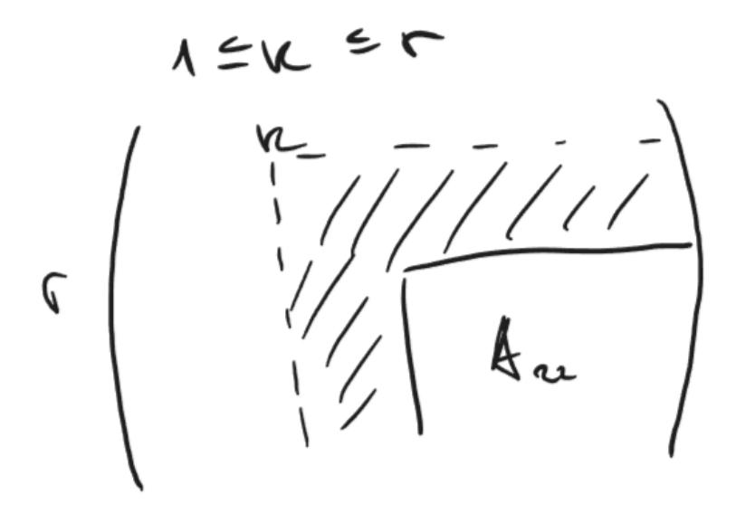

- 2) (бывший 4) )
- 3) (бывший 5))

#### Алгоритм IV (С алгоритм):

- 1) Производим r шагов LU разложения матрицы A, но через gaxpy **строчное** r строк L и  $U, L_{11}, U_{11}, U_{12}$ 
  - 2) (бывший 3) )
  - 3) (бывший 4) )
  - 4) (бывший 5) )

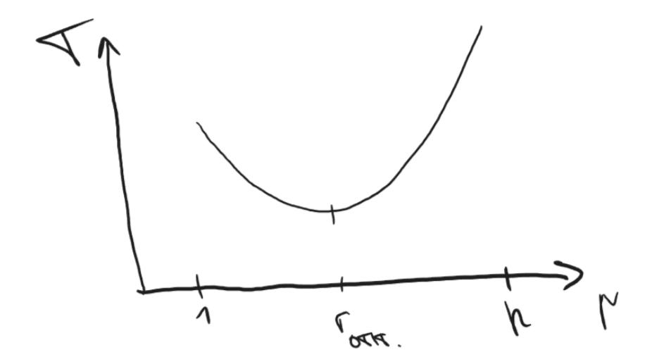

#### Параграф 3.3 Разложение Холецкого

$$A = LU$$

$$A = L \cdot L^T$$

$$A = G \cdot G^T$$

### Пункт 3.3.1 Разложение Холецкого через модификацию матрицы внешним произведением $\ \ \ \ \ \ \ \ \ \ \ \ \ \ \ \ \ \ \$

$$A = \begin{pmatrix} \alpha & v^T \\ v & B \end{pmatrix} = \begin{pmatrix} \beta & \text{нули} \\ \frac{v}{\beta} & I_{n-1} \end{pmatrix} \begin{pmatrix} 1 & \text{нули} \\ \text{нули} & B - \frac{v \cdot v^T}{\alpha} \end{pmatrix} \begin{pmatrix} \beta & \frac{v^T}{\beta} \\ \frac{v}{\beta} & I_{n-1} \end{pmatrix}$$

$$\alpha \in \mathbb{R}$$

$$\alpha = a_{11}; \beta = \sqrt{\alpha}$$

$$v = A(2:n,1)$$

$$v \in \mathbb{R}^{(n-1)\times 1}$$

$$B = A(2:n,2:n)$$

$$B \in \mathbb{R}^{(n-1)\times (n-1)}$$

$$B - \frac{v \cdot v^T}{\alpha}$$
 — модификация матрицы внешним произведением

$$B - \frac{v \cdot v^T}{\alpha} = G_1 \cdot G_1^T = \begin{pmatrix} \beta & \text{нули} \ \frac{v}{\beta} & G_1 \end{pmatrix} \begin{pmatrix} \beta & \frac{v^T}{\beta} \ \text{нули} & G_1^T \end{pmatrix}$$

 $G_1 \in \mathbb{R}^{(n-1)\times (n-1)}$ 

$$G = \begin{pmatrix} \beta & \text{нули} \ \frac{v}{\beta} & G_1 \end{pmatrix}$$

#### Матричный вид:

```
for k=1:n  A(k:n,k) = A(k:n,k)(sqrt(A(k,k)))   A(k+1:n,k+1:n) = A(k+1:n,k+1:n) - A(k+1:n,k)[A(k+1:n,k)]^T  endfor
```

#### Векторный вид:

```
for k=1:n
```


#### Таблица для Холецкого:

| Название  | Векторная           | Матричная операция                        | Доступ к       |
|-----------|---------------------|-------------------------------------------|----------------|
| алгоритма | операция            |                                           | памяти         |
| kji       | столбцовый<br>saxpy | модификацию матрицы внешним произведением | по<br>столбцам |
| kij       | строчный            | модификацию матрицы                       | по             |
|           | saxpy               | внешним произведением                     | строчкам       |

#### Лекция 10 (11.04.26)

#### Пункт 3.3.2 Разложение Холецкого через дахру

Пусть к j-ому шагу алгоритма первые j-1-ый столбцов матрицы J найдены, отыщем j-ий.

$$A = G \ast G^T \ A(:,j) = G \ast G^T(:,j)$$

1) 
$$A(1:j-1,j) = G(1:j-1,j)G^T(:,j)$$
  $A(1:j-1,j) = G(1:j-1,1:j-1)G^T(1:j-1:j)$ 

2) 
$$A(j:n,j) = G(j:n,j)G^{T}(:,j)$$

$$A(j:n,j) = G(j:n,1:j)G^{T}(1:j,j)$$

$$A(j:n,j) = \sum_{k=1}^{J} G(j:n,k)G^{T}(k,j)$$

$$A(j:n,j) = \sum_{k=1}^{j-1} G(j:n,k) G^T(k,j) + G(j:n,j) G^T(j,:)$$

$$A(j:n,j) = G(j:n,1:j-1)G^T(1:j-1,j) + G(j:n,j)G^T(j,j)$$

$$G(j:n,j)G^T(j,j)$$
  $\;\;\;$  (не знаем, назовём -  $V(j:n)$ )

$$V(j:n) = A(j:n,j) - G(j:n,1:j-1)G^T(1:j-1,j)$$

$$V(j:n) = G(j:n,j)G^{T}(j,j)$$

$$V(j:n) = G(j,j)G(j,j)$$

$$G(j,j) = \sqrt{V(j)}$$

$$G(j+1:n,j) = V(j+1:n)G(j,j)$$

#### **Алгоритм:**

for j=1:n 
$$A(j:n,j) = A(j:n,j) - A(j:n,1:j-1) * [A(j,1:j-1)]^T # gaxpy #V(j,n) #A(j:n,j) #G(j:n,1:j-1) #G^T(1:j-1,j)$$
 
$$A(j:n,j) = A(j:n,j) / sqrt(A(j,j))$$
 endfor 
$$\pi peoбразуем операцию gaxpy через скалярное произведение (Алгоритм jik)  $\Longrightarrow$ : for i=j:n 
$$A(i,j) = A(i,j) - A(i,1:j-1) * [A(j,1:j-1)]^T$$
 endfor$$

преобразуем операцию gaxpy через столбцовое saxpy (Алгоритм jki) ⟹ :

for 
$$k=1:j-1$$
  
 $A(j:n,j) = A(j:n,j) - A(j:n,k) A(j,k)$   
\nendfor

|               | Название<br>алгоритма | Векторная<br>операция            | Матричная<br>операция        | Доступ к<br>памяти |
|---------------|-----------------------|----------------------------------|------------------------------|--------------------|
| С             | jik                   | Скалярное                        | Столбцовое                   | Строчный           |
| С/Fortran jki |                       | произведение<br>Столбцовое saxpy | gaxpy<br>Столбцовое<br>gaxpy | Столбцовый         |

#### **Пункт 3.3.3 Блочные алгоритмы метода Холецкого**

Юрий Магнел

**Пункт I Блочный алгоритм Холецкого на основе ???**

$$\begin{split} G_{ij} &\in \mathbb{R}^{\alpha \times \alpha} \\ 1 &\leq i, j \leq N; \quad N = \frac{n}{\alpha} \\ A_{ij} &= \sum_{k=1}^{N} G_{ik} G_{kj}^T = \sum_{k=1}^{j} G_{ik} G_{kj}^T \\ A_{ij} &= \sum_{k=1}^{j-1} G_{ik} G_{kj}^T + G_{ij} G_{jj}^T \\ S_{ij} &= A_{ij} - \sum_{k=1}^{j-1} G_{ik} G_{kj}^T \end{split}$$

При поиске блока  $G_{ij}$  будем обходить матрицу G в первом цикле слева направо по блочным столбцам, во втором цикле сверху вниз по блокам выделенного столбца.

```
for j=1:N
   for i=j:N
        S_{ij} = A_{ij} - sum_{k=1}^{j-1}G_{ik}G^T_{kj}
        if i=j then
            S_{jj} = G_{jj}G^T_{jj} #
            S_{ij} = G_{ij}G^T_{ij} #
        endif
    endfor
endfor
```

( ), G\_{jj} -

 $XU=B (X - G_{ij}, U - G^T_{ij}, B - S_{ij})$ 

 $\begin{array}{c} \text{1)} \ \ G_{i1}G_{i2}\dots G_{ij-1} \\ \text{2)} \ \ G_{j1}G_{j2}\dots G_{jj-1} \end{array}$ 

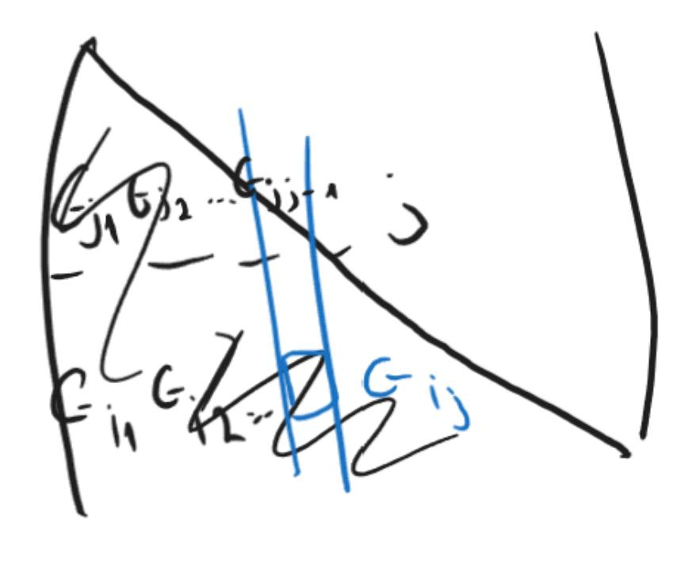

# 16) EN

Пункт Па

$$\begin{pmatrix} A_{11} & [A_{21}]^T \\ A_{21} & A_{22} \end{pmatrix} =$$

$$= \begin{pmatrix} G_{11} & \text{нули} \\ G_{21} & I_{n-\alpha} \end{pmatrix} \times \begin{pmatrix} I_{\alpha} & \text{нули} \\ \text{нули} & A \end{pmatrix} \times \begin{pmatrix} [G_{11}]^T & [G_{21}]^T \\ \text{нули} & I_{n-1} \end{pmatrix} =$$

$$= \begin{pmatrix} G_{11}[G_{11}]^T & G_{11}[G_{21}]^T \\ G_{21}[G_{11}]^T & \hat{A} + G_{21}[G_{21}]^T \end{pmatrix}$$

- 1)  $A_{11} = G_{11}[G_{11}]^T$  разложение Холецкого  $A_{11}$
- 2)  $\,A_{21} = G_{21}[G_{11}]^T$  СЛАУ вида XU = B
- 3)  $\hat{A}=A_{22}-G_{21}[G_{21}]^T$   $n=n-\alpha, A=\hat{A}$

#### Пункт Пб

1)  $\alpha$  шагов Холецкого через дахру

находим  $G_{11}$  и  $G_{21}$ 

2) 
$$\hat{A} = A_{22} - G_{21}[G_{21}]^T$$
 -  $n = n - \alpha, A = \hat{A}$ 

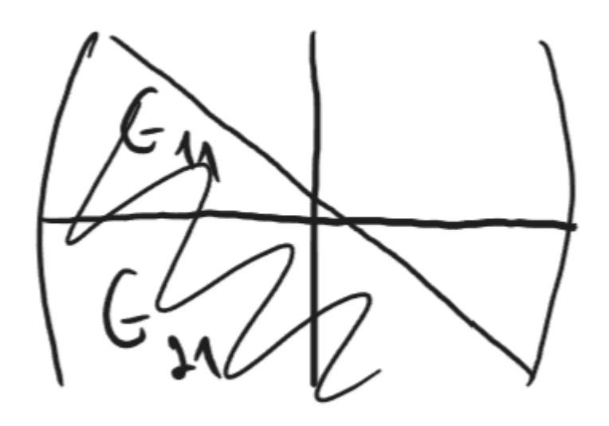

####

Пункт IIc

- 1)  $\alpha$  шагов Холецкого через модификацию матрицы внешним произведением не трогая блок  $A_{22}$
- 2)  $\hat{A} = A_{22} G_{21}[G_{21}]^T$   $n = n \alpha, A = \hat{A}$