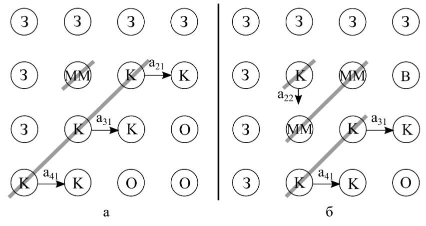

# LU-разложение

**LU-разложение** — представление плотной матрицы $A \in \mathbb{R}^{n \times n}$ в виде
произведения $A = LU$, где $L$ — нижняя **унитреугольная** (единицы на диагонали),
$U$ — верхняя треугольная. Тесно связано с методом исключения Гаусса решения СЛАУ:
после разложения $Ax=b$ распадается на две [[треугольные-СЛАУ]] $Ly=b$ и $Ux=y$.

## Матрица преобразования Гаусса

Стержень всех вариантов — **матрица преобразования Гаусса** $M_k$, обнуляющая в
столбце элементы ниже $k$-й позиции. Для вектора множителей Гаусса $\tau^{(k)}$:

$$M_k = I - \tau^{(k)} l_k^T, \qquad \tau_i^{(k)} = \frac{a_{ik}}{a_{kk}} \;\;(k+1 \le i \le n),$$

где $l_k = e_k$ — канонический вектор-столбец с единицей на $k$-й позиции
([[Лекции]] §3.2.2; в [[Векторные алгоритмы]] §2.2 та же матрица записана как
$M_k = E - \tau^{(k)} e_k^T$). Воздействие $M_k$ на матрицу — это в точности
[[модификация-матрицы-внешним-произведением]]:

$$M_k A = \left(I - \tau^{(k)} l_k^T\right) A = A - \tau^{(k)} A(k,:).$$

Последовательное умножение приводит $A$ к верхнему треугольному виду:

$$M_{n-1}\dots M_2 M_1 A = U. \tag{9}$$

Обратные матрицы обладают замечательным свойством $M_k^{-1} = I + \tau^{(k)} l_k^T$,
причём их произведение не требует дополнительных вычислений:

$$L = M_1^{-1} \dots M_{n-1}^{-1} = I + \sum_{k=1}^{n-1} \tau^{(k)} l_k^T. \tag{10}$$

Множители Гаусса, уже найденные при вычислении $U$, записываются в нижний
треугольник $A$ — они и образуют $L$. Главную диагональ $L$ (единицы) хранить
не нужно. [[Векторные алгоритмы]] §2.2


## Векторные варианты

### Через модификацию матрицы внешним произведением (kji)

Основная матричная операция — [[модификация-матрицы-внешним-произведением]],
основная векторная — столбцовое [[gaxpy-и-saxpy|saxpy]]; доступ к $A$ — строго по
столбцам. [[Векторные алгоритмы]] §2.2, [[Лекции]] §3.2.2

```
Алгоритм 30 (матричный вид):
for k=1:n-1
  A(k+1:n,k)     = A(k+1:n,k)/A(k,k)                            % k-й столбец L
  A(k+1:n,k+1:n) = A(k+1:n,k+1:n) - A(k+1:n,k)·A(k,k+1:n)       % мм.
end for
```

На $k$-й итерации отыскиваются $k$-й столбец $L$ и $(k{+}1)$-я строка $U$; подматрица
$A(k{+}2{:}n,\,k{+}1{:}n)$ ещё «недоварена» и нуждается в дальнейшей модификации
(рис. 6). Векторный (Алг. 31) и скалярный (Алг. 32) виды получаются раскрытием
мм. через столбцовое saxpy.


### Через gaxpy / дахру (jki)

Здесь оставшаяся часть $A$ в вычислениях не участвует — вовлекаются уже найденные
элементы $L$ и $U$. На $j$-м шаге сначала из соотношения
$A(1{:}j{-}1,j) = L(1{:}j{-}1,1{:}j{-}1)\,U(1{:}j{-}1,j)$ решается **треугольная
подсистема** (нижняя унитреугольная, [[треугольные-СЛАУ]], Алг. 27) для отыскания
$U(1{:}j{-}1,j)$. Затем выполняется [[gaxpy-и-saxpy|дахру]]:

$$v(j:n) = A(j:n,j) - L(j:n,1:j-1)\,U(1:j-1,j), \tag{17}$$

откуда $U(j,j)=v(j)$ (т.к. $L(j,j)=1$) и $L(j{+}1{:}n,j)=v(j{+}1{:}n)/U(j,j)$.
[[Векторные алгоритмы]] §2.3, [[Лекции]] §3.2.3

```
Алгоритм 34 (с замещением, jki):
for j=1:n
  for k=1:j-2                                       % решение СЛАУ (13) по Алг. 27
    A(k+1:j-1,j) = A(k+1:j-1,j) - A(k+1:j-1,k)·A(k,j)
  end for
  A(j:n,j)   = A(j:n,j) - A(j:n,1:j-1)·A(1:j-1,j)   % дахру по (17)
  A(j+1:n,j) = A(j+1:n,j)/A(j,j)                    % j-й столбец L
end for
```

Главное отличие от Холецкого ([[разложение-Холецкого]]) — именно решение
треугольной подсистемы; в методе Холецкого никаких систем не решается, чем и
объясняется его меньшая вычислительная сложность. [[Векторные алгоритмы]] §2.3

### Блочный вариант

Разбивая $A$, $L$, $U$ на блоки размера $\alpha = n/N$:

$$\begin{pmatrix} A_{11} & A_{12} \\ A_{21} & A_{22} \end{pmatrix}
= \begin{pmatrix} L_{11} & \\ L_{21} & I_{n-\alpha} \end{pmatrix}
  \begin{pmatrix} I_{\alpha} & \\ & A' \end{pmatrix}
  \begin{pmatrix} U_{11} & U_{12} \\ & I_{n-\alpha} \end{pmatrix}. \tag{18}$$

Блочные алгоритмы насыщены умножениями матриц (по Голубу — это и обеспечивает
интенсивное использование «быстрой» памяти ЭВМ); размер блока $N$ подбирается под
её объём. [[Векторные алгоритмы]] §2.4. См. [[блочные-алгоритмы]].

## Параллельные варианты

### На процессорном кольце (Алгоритм 12)

Основан на векторном варианте через мм. (а не через gaxpy: параллельное решение
треугольной СЛАУ малоэффективно). Матрица $A$ декомпозируется **циклически по
столбцам** между $p$ задачами ($col=\mu{:}p{:}n$), что обеспечивает балансировку
с учётом треугольного вида. По кольцу пересылается только что вычисленный $k$-й
столбец $L$ — вектор множителей Гаусса; принявшая задача модифицирует свои ещё не
найденные столбцы операцией мм. [[Параллельные алгоритмы]] §2.2

```
Алгоритм 12 (на кольце):
while s ≤ L
  if k = col(s) then                       % задача хранит столбец k
    if k < n then
      A_loc(k+1:n,s) = A_loc(k+1:n,s)/A_loc(k,s)   % L(:,k)
      send(A_loc(k+1:n,s), right)
      for q=s+1:L
        A_loc(k+1:n,q) = A_loc(k+1:n,q) - A_loc(k+1:n,s)·A_loc(k,q)  % мм.
      end for
      k=k+1
    end if
    s=s+1
  else
    recv(g(k+1:n), left)
    if (α≠right) and (β≥k) then send(g(k+1:n), right) end if
    for q=s:L
      A_loc(k+1:n,q) = A_loc(k+1:n,q) - g(k+1:n)·A_loc(k,q)          % мм.
    end for
    k=k+1
  end if
end while
```

Элементы $U(k{+}1,\cdot)$ формируются в задачах, в последний раз модифицирующих
$(k{+}1)$-ю строку. Передача $k$-го столбца ограничена условием $\beta \ge k$
(где $\beta$ — глобальный индекс последнего столбца у правого соседа), чтобы не
слать данные задачам, которым они не нужны. Порядок столбцов на кольце сохраняется
(«первый вошёл — первый вышел»), поэтому при `recv` всегда приходит нужный столбец.
Алгоритм сбалансирован, простои незначительны и наступают лишь в конце.
[[Параллельные алгоритмы]] §2.2

### На процессорной решётке (Алгоритм 13)

Сложнее кольцевого. В простейшем виде задаче $(i,j)$ соответствует один элемент
$A(i,j)$, поверх которого формируется $L(i,j)$ ($i \gt j$) либо $U(i,j)$ ($i \le j$).
Задача $(i,j)$ выполняет мм. $\min\{i,j\}-1$ раз. По решётке движутся два потока:
строки $U$ — с **севера на юг** (меридионально), столбцы $L$ — с **запада на восток**
(широтно); по достижении границ движение прекращается. [[Параллельные алгоритмы]] §2.3

```
Алгоритм 13 (на решётке):
k=1
while k ≤ min{i,j}                       % модификации внешним произведением
  recv(a_north, north); if i≠n then send(a_north, south) end if  % A(k,j)
  recv(a_west,  west);  if j≠n then send(a_west,  east)  end if  % A(i,k)
  a = a - a_west·a_north
  k=k+1
end while
if (i≤j) and (i≠n) then send(a, south) end if                    % строка U на юг
if i>j then                                                      % задачи с L
  recv(a_north, north); if i≠n then send(a_north, south) end if  % A(j,j)
  a = a/a_north                                                  % множитель Гаусса
  send(a, east)
end if
```

Вычисления **волновые**: чередуются три волны с фронтом под $45^\circ$ — пересылка
строки $U$ на юг, столбца $L$ на восток, производство мм. (исключение — первая строка
$U$ идёт волной с горизонтальным фронтом).



## Простои и декомпозиция

- При **поэлементной** декомпозиции (один элемент = одна задача) бо́льшая часть
  задач простаивает: либо уже завершили, либо ещё не начали. На решётке одной
  арифметической операции соответствуют две коммуникационные → низкая эффективность.
- **Укрупнение задач** (блок вместо элемента, размер $q$): на одну мм. приходится
  $2q^2$ арифметических операций; пересылаются векторы, а не скаляры (пакетная
  передача почти не дорожает). [[Параллельные алгоритмы]] §2.3
- **Циклическая декомпозиция** столбцов (кольцо) или блочных диагоналей (решётка,
  задача $\mu$ → диагонали $\mu$ и $-(N-\mu+1)$) откладывает простои почти до конца
  и резко улучшает балансировку. [[Параллельные алгоритмы]] §2.2, §2.3

## Расхождения

- **OCR-опечатка ([[Лекции]] §3.2.2):** в Алгоритме LU деление записано как
  `A(k+1:n,k) = A(k+1:n,k)A(k,k)` — должно быть деление на `A(k,k)` (ср.
  Алгоритм 30 в [[Векторные алгоритмы]] §2.2). Приоритет у методички.
- В [[Лекции]] §3.2.2 множитель определён как $\tau_i^{(k)} = 0$ «при $i \le j$»;
  по смыслу — при $i \le k$ (опечатка индекса).

## Связи
- Базовые операции: [[gaxpy-и-saxpy]], [[модификация-матрицы-внешним-произведением]].
- Решаемая после разложения: [[треугольные-СЛАУ]] (и решается *внутри* gaxpy-варианта).
- Родственное разложение симметричных матриц: [[разложение-Холецкого]].
- Топологии: [[топологии-сетей]] (кольцо, решётка).
- Блочный подход: [[блочные-алгоритмы]].
- Метод Гаусса и персоналии: [[Гаусс]], [[Голуб]].

## Источники
- [[Векторные алгоритмы]] §2.2 (через внешнее произведение), §2.3 (через gaxpy/дахру), §2.4 (блочный).
- [[Параллельные алгоритмы]] §2.2 (кольцо, Алг. 12), §2.3 (решётка, Алг. 13).
- [[Лекции]] §3.2.2, §3.2.3.
