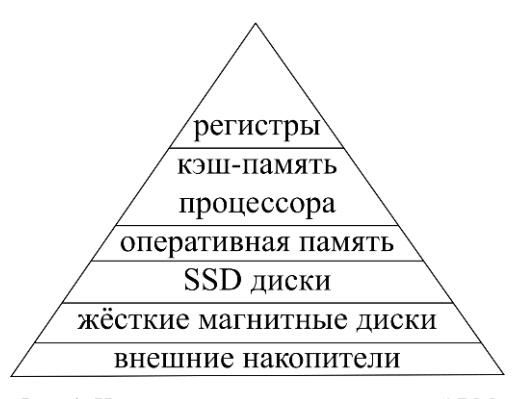
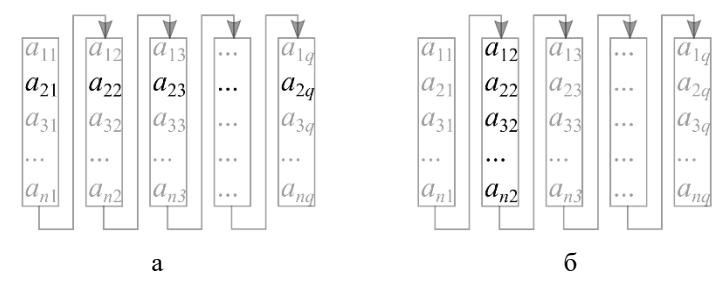

# gaxpy и saxpy

Фундаментальные операции вычислительной линейной алгебры. На них через выражение
более сложных операций строится почти всё в этой вики: [[умножение-матриц]],
[[модификация-матрицы-внешним-произведением]], [[LU-разложение]],
[[разложение-Холецкого]]. Эта страница — базовая, сюда ссылаются отовсюду.

## Уровни операций

Головашкин (вслед за Голубом) делит операции по «уровням»:

- **первый уровень** — операции над векторами (часто реализованы аппаратно через
  SSE-инструкции или на GPGPU);
- **второй уровень** — операции вида «матрица + векторы» ([[модификация-матрицы-внешним-произведением|внешнее произведение]] и gaxpy);
- **третий уровень** — операции «матрица × матрица» ([[умножение-матриц]]),
  ключевые для [[блочные-алгоритмы|блочных алгоритмов]].

[[Векторные алгоритмы]] §1.1

## Операции первого уровня (над векторами)

Здесь $x,y,z\in\mathbb{R}^{n\times 1}$, $\alpha\in\mathbb{R}$.

| № | операция | формула | смысл | скалярных операций |
|---|----------|---------|-------|--------------------|
| 1 | сложение векторов | $z=x+y$ | — | $n$ |
| 2 | умножение на скаляр | $z=\alpha x$ | — | $n$ |
| 3 | скалярное произведение | $\alpha=x^{T}y$ | свёртка | $2n-1$ |
| 4 | покомпонентное произведение | $z=x.\!*y$ | поэлементное | $n$ |
| 5 | **saxpy** | $z=\alpha x+y$ | scalar **a**lpha **x** **p**lus **y** | $2n$ |

Наиболее «нагруженные» (по числу арифметических действий) операции — saxpy и
скалярное произведение. [[Векторные алгоритмы]] §1.1; [[Лекции]] §3.1

### Почему saxpy предпочтительнее

При оценке вычислительной сложности различают **арифметическую** составляющую
(число операций с плавающей точкой, флопов) и **коммуникационную** (число/объём
пересылок данных между [[иерархия-памяти|уровнями памяти ЭВМ]]). Часто именно
коммуникационная составляющая определяет общую длительность расчётов.

Сравнение saxpy с эквивалентной парой «умножение на скаляр + сложение»:

- пара $z=\alpha x$, затем $z=z+y$: из памяти забираются **три** вектора,
  возвращаются **два**;
- одна saxpy: забираются **два** вектора, возвращается **один**.

Более «нагруженная» операция позволяет произвести больше арифметики «на месте»,
сократив объём пересылок. [[Векторные алгоритмы]] §1.1

## Операции второго уровня (с матрицами)

Здесь $A\in\mathbb{R}^{n\times m}$, $x\in\mathbb{R}^{m\times 1}$, $z,y\in\mathbb{R}^{n\times 1}$.

1. **Модификация матрицы внешним произведением** (сокращённо м.м.):
   $$A=A+xy^{T},\qquad x\in\mathbb{R}^{n\times 1},\ y\in\mathbb{R}^{m\times 1}.$$
   Подробно — на странице [[модификация-матрицы-внешним-произведением]].

2. **gaxpy / дахру** (general **A** **x** **p**lus **y**):
   $$z=Ax+y.$$

Оба слова — «gaxpy» и «дахру» — обозначают одну операцию (дахру — транслитерация
произношения). Ключевой факт: все алгоритмы вычислительной линейной алгебры на
матричном уровне можно представить как набор либо gaxpy, либо модификаций
внешним произведением. [[Векторные алгоритмы]] §1.1

### gaxpy через скалярное произведение

По определению умножения матрицы на столбец каждая компонента результата —
скалярное произведение строки $A$ на $x$:
$$z(i)=A(i,:)\,x+y(i),\qquad i=1:n.$$
Этот путь обладает **смешанным доступом к памяти** (см. ниже) и потому, как
правило, менее удачен. [[Векторные алгоритмы]] §1.1; [[Лекции]] §3.1

### gaxpy через saxpy (предпочтительно)

Столбцовый gaxpy выражается через **столбцовое** saxpy как линейная комбинация
столбцов матрицы (с замещением $z$ вектором $y$ для экономии памяти):

```
Алгоритм 3. Столбцовое gaxpy через saxpy
for j = 1:m
    y = y + A(:,j)·x(j)      % столбцовое saxpy
end for
```

Строчный gaxpy $z=xA+y$ ($z,y\in\mathbb{R}^{1\times m}$, $x\in\mathbb{R}^{1\times n}$)
выражается через **строчное** saxpy:

```
Алгоритм 4. Строчное gaxpy через saxpy
for i = 1:n
    y = y + x(i)·A(i,:)      % строчное saxpy
end for
```

Столбцовая и строчная saxpy имеют одну нотацию $z=\alpha x+y$ и различаются лишь
тем, что все участвующие векторы — столбцы либо строки. [[Векторные алгоритмы]] §1.1

### Замечания о дахру

- gaxpy схож с умножением матрицы на столбец; реализовывался аппаратно в матричных
  процессорах (например, опто-электронный EnLight256 фирмы Lenslet перемножает
  матрицу $256\times256$ на вектор за один такт).
- gaxpy напоминает простые итерационные методы решения [[СЛАУ]], что повышает
  интерес к нему самому по себе.
- По сравнению с [[модификация-матрицы-внешним-произведением|модификацией внешним произведением]]
  gaxpy выигрывает по коммуникациям: арифметика одинакова ($2nm$ флопов), но
  модификация требует ещё и **возврата** матрицы $A$ в память — коммуникации
  возрастают вдвое. [[Векторные алгоритмы]] §1.1

## Шаг выборки и хранение матриц

Матрица хранится в памяти линейно — либо **по столбцам** (как в Фортране), либо
**по строкам** (как в Си). Извлечение вектора, лежащего «поперёк» схемы хранения,
требует **неединичного шага выборки**: вектор приходится «собирать» из разных
областей памяти.



*Рис. 1. Иерархическая структура памяти ЭВМ.*



*Рис. 2. Извлечение из матрицы, хранящейся по столбцам: а — строки (шаг выборки $n$);
б — столбца (единичный шаг).*

- **Скалярное произведение** при умножении матриц обычно даёт **смешанный доступ**
  (первый сомножитель — строка, второй — столбец), что замедляет вычисления, если
  обе матрицы хранятся одинаково.
- **saxpy / gaxpy** позволяют работать с **единичным шагом выборки**: при той же
  арифметике коммуникации меньше, ведь элементы уже лежат рядом. Именно поэтому
  алгоритмы предпочитают записывать через набор операций дахру.

**Критерий длины вектора.** При прочих равных предпочтительны операции над более
длинными векторами. Для мощных векторных процессоров (GPU, Intel Xeon Phi) нужны
векторы в тысячи элементов; когда строки/столбцы слишком коротки, матрицу
«разворачивают» в один длинный вектор — это **алгоритмы с «длинными» векторами**
(в отличие от традиционных с «короткими»). [[Векторные алгоритмы]] §1.1

## Связи

- [[модификация-матрицы-внешним-произведением]] — вторая операция второго уровня;
  сравнивается с gaxpy по коммуникациям.
- [[умножение-матриц]] — операция третьего уровня; её скалярная/векторная/матричная
  формы строятся на скалярном произведении, saxpy и gaxpy.
- [[блочные-алгоритмы]] — выводят на третий уровень ради иерархии памяти.
- [[LU-разложение]], [[разложение-Холецкого]] — выражаются через эти базовые операции.
- [[рекуррентные-выражения]] — параллельная схема также сводится к умножению (матриц).

## Источники

- [[Векторные алгоритмы]] §1.1 «Основные операции с векторами и матрицами»
  (Алгоритмы 1–4; рис. 1, 2).
- [[Лекции]] §3.1 «Основные векторные операции» — совпадает с методичкой;
  OCR-расшифровки «ganed A x plus y» — опечатка вместо *general A x plus y*.
