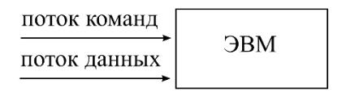
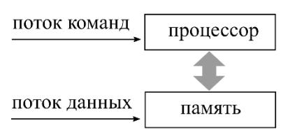
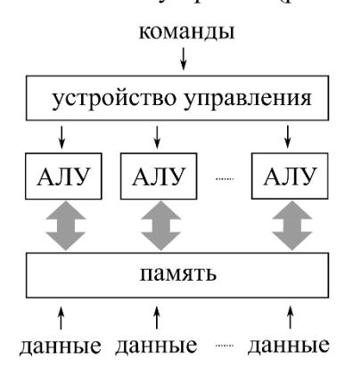
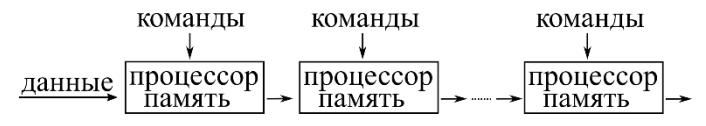

# Классификация Флинна

Первая широко применяемая классификация ЭВМ, предложенная М. Флинном (M. Flynn)
в 1966 г. [[Модели]] §1.1.1. В её основе — приём «чёрного ящика»: исследуемое
явление (здесь — ЭВМ) изучается сопоставлением входных и выходных сигналов. На вход
ЭВМ подаются **поток команд** и **поток данных**. Сочетая случаи единственности и
множественности каждого из потоков, получают четыре модели архитектур.

## Таблица классификации

|                       | один поток команд      | множество потоков команд |
|-----------------------|------------------------|--------------------------|
| **один поток данных** | однопроцессорная (SISD) | конвейерная (MISD)       |
| **множество потоков данных** | векторная (SIMD) | многопроцессорная (MIMD) |

Цит. по [[Модели]] §1.1.1, табл. 1.1; [[Лекции]] §1.1.

## Расшифровка классов

### SISD — Single Instruction stream / Single Data stream
Модель **однопроцессорной ЭВМ**: один поток команд, один поток данных. В модели
различают *процессор* (исполнительное устройство, производящее операции над данными)
и *память* (где данные хранятся). Команды исполняются последовательно: данные
извлекаются из памяти и результаты помещаются обратно. Классическое изложение
численных методов (пошаговое, в виде последовательности операторов) ориентировано
именно на эту модель [[Модели]] §1.1.1.

### SIMD — Single Instruction stream / Multiple Data stream
Модель **векторной ЭВМ**: одна команда исполняется над разными участками данных
одновременно (например, над элементами векторов или матриц). Процессор разделяется
на одно устройство управления и множество **АЛУ** (арифметико-логических устройств).
Производительность растёт с увеличением числа АЛУ; использование преимущества связано
с успешностью **векторизации** численного метода — представления его в виде операций
над векторами и матрицами [[Модели]] §1.1.1.

### MISD — Multiple Instruction stream / Single Data stream
Модель **конвейерной ЭВМ**: одновременное исполнение разных команд над различными
фрагментами одного потока данных. Процессоров несколько, каждый со своей памятью.
Сам Флинн не предоставил доказательств существования MISD-ЭВМ, но поскольку речь идёт
о моделях, это несущественно. Производительность растёт с числом процессоров, однако
не всякий метод допускает разбиение на фрагменты одинаковой сложности; иначе наименее
загруженные процессоры конвейера простаивают [[Модели]] §1.1.1.

### MIMD — Multiple Instruction stream / Multiple Data stream
Модель **многопроцессорной ЭВМ**: множество потоков команд и данных. Этот класс
подробно детализируется в [[классификация-Хокни]].

## Замечание о современных ЭВМ
С учётом глубокой гибридности архитектуры современных ЭВМ привязка конкретной машины
к одному классу имеет лишь историческую ценность: один процессор аппаратно
поддерживает конвейеризацию, векторизацию (SSE — Streaming SIMD Extensions) и
многопоточность над общей памятью одновременно. Обзор приведён в русле задачи Г. И.
Марчука об отображении численных методов на архитектуру вычислительных систем
[[Модели]] §1.1.2.

## Связи
- Персона: [[Флинн]].
- Детализация класса MIMD — [[классификация-Хокни]].
- Память в модели SISD детализируется в [[иерархия-памяти]] (см. [[топологии-сетей]]).
- Векторизация как способ использования SIMD — фундамент [[gaxpy-и-saxpy]].
- Модель архитектуры → модель алгоритма [[модель-задача-канал]].

## Источники
- [[Модели]] §1.1.1 «Классификация Флинна» (рис. 1.1–1.4).
- [[Лекции]] §1.1.
