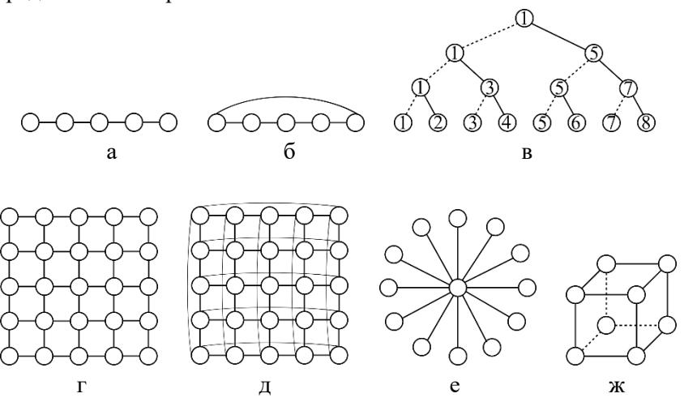

# Классификация Хокни

Классификация Р. Хокни (R. Hockney) детализирует класс **MIMD** (многопроцессорные
ЭВМ) из [[классификация-Флинна]] [[Модели]] §1.1.2. Конвейерные ЭВМ Хокни отнёс к
многопроцессорным (на модели конвейера действительно много процессоров, а общий
поток данных можно разбить на локальные), оставив класс MISD пустым.

Многопроцессорные ЭВМ классифицируются по конфигурации соединения процессоров.

## Дерево классов

1. **Конвейерные** ЭВМ.
   *(В лекциях помечено восклицанием: проблема взаимного исключения.)*
2. **Переключаемые** — все процессоры соединены со всеми через особое устройство —
   *переключатель*:
   - с **общей памятью** — процессоры работают над общей памятью, коммуникации
     идут через неё; необходимо регулировать очерёдность доступа к общим данным;
   - с **распределённой памятью** — память у всех процессоров локальная, проблемы
     доступа нет, но технически обеспечить *полносвязную* топологию при большом
     числе процессоров сложно.
3. **Сети** — процессор соединяется с определённым количеством соседей. Многообразие
   сетевых конфигураций (линия, кольцо, решётка, тор, гиперкуб, дерево, звезда)
   подробно разобрано в [[топологии-сетей]].

## Связь общей/распределённой памяти и коммуникаций
- При **общей памяти** ключевая трудность — взаимное исключение доступа к общим
  данным (мониторы, критические интервалы; см. нотацию в [[модель-задача-канал]]).
- При **распределённой памяти** обмен данными ведётся явными пересылками; стремление
  к полносвязности при росте числа процессоров и приводит к идее сетевого соединения
  (третий класс).

## Расхождения
- **Бинарное дерево.** В [[Лекции]] §1.1 бинарное дерево помечено как «частный случай
  гиперкуба», а процессорная линия — как «частный случай конвейерного». В [[Модели]]
  §1.1.2 дерево и линия описаны как самостоятельные сетевые конфигурации, при этом
  отмечается, что из гиперкуба *можно получить* линию, кольцо и бинарное дерево
  игнорированием одних связей и задействованием других. Приоритет — у методички:
  это отношения «может быть построено из», а не строгая иерархия классов.

## Связи
- Персона: [[Хокни]].
- Детализирует класс MIMD из [[классификация-Флинна]].
- Сетевые конфигурации — [[топологии-сетей]].
- Иерархия памяти ЭВМ — см. [[топологии-сетей]] (раздел об иерархии памяти).
- Общая память и взаимное исключение, распределённая память и пересылки —
  [[модель-задача-канал]].

## Источники
- [[Модели]] §1.1.2 «Классификация Хокни» (рис. 1.5).
- [[Лекции]] §1.1.
