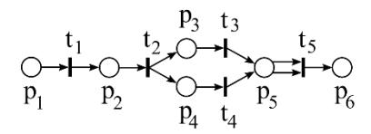
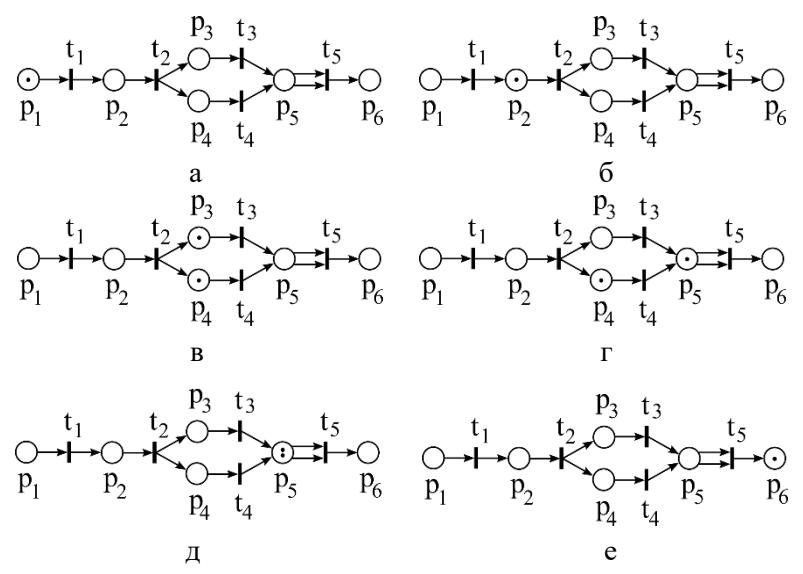

# Сети и сети Петри

Модель **вычислительных процессов**, позволяющая, в отличие от
[[ПВД-и-графы-следования]], не только описывать состоявшуюся реализацию, но и
**моделировать протекание** процесса [[Модели]] §1.3.3. Изобретены К. А. Петри
(см. персону [[Петри]]).

## Сеть $N = (P, T, F)$

Сетью называют тройку объектов [[Модели]] §1.3.3.1, [[Лекции]] §1.3:

- $P$ — непустое конечное множество **мест** (окружности); связывают с *условиями*
  производства действий;
- $T$ — непустое конечное множество **переходов** (отрезки); связывают с *действиями*
  вычислительного процесса;
- $F$ — **функция инцидентности** (дуги) с областью определения
  $P \times T \cup T \times P$ и областью значений — множеством натуральных чисел с
  нулём: $F : P \times T \cup T \times P \to \mathbb{N}$.

Сеть — ориентированный граф с двумя типами вершин и дугами, соединяющими вершины
разных типов.

### Свойства сети

1. $P \cap T = \varnothing$ — места и переходы не пересекаются (разные множества).
2. $\forall p \in P\; \exists t \in T:\; F(p,t) \ne 0$ или $F(t,p) \ne 0$ — любое
   место связано хотя бы с одним переходом.
3. $\forall t \in T\; \exists p \in P:\; F(t,p) \ne 0$ или $F(p,t) \ne 0$ — любой
   переход связан хотя бы с одним местом.
4. $\forall p_1, p_2 \in P$: если $({}^{*}p_1 = {}^{*}p_2)$ и $(p_1^{*} = p_2^{*})$,
   то $p_1 = p_2$. Здесь ${}^{*}p$ — множество входных переходов места $p$ (откуда
   ведут дуги в место), $p^{*}$ — множество выходных переходов. Не может быть двух
   разных мест, одинаково инцидентных одним и тем же переходам. *Для переходов
   аналогичное свойство не формулируется.*

## Сеть Петри $PN = (P, T, F, M)$

Сеть Петри — четвёрка, где $M$ — **разметка**: функция $M : P \to \mathbb{N}$.
Графически значения разметки изображаются **фишками** внутри мест; в векторной форме
$M = (M(p_1), M(p_2), \ldots, M(p_n))^{\top}$. В отличие от $F$, разметка меняется,
«оживляя» сеть [[Модели]] §1.3.3.1.

### Условие срабатывания перехода

Переход $t \in T$ **может** (но не должен!) сработать, если для всех входных мест
выполнено неравенство:

$$\forall p \in {}^{*}t:\; M(p) \ge F(p,t), \qquad \text{в векторной форме } M \ge {}^{*}F(t).$$

Здесь ${}^{*}t$ — множество входных мест перехода (откуда ведут дуги в $t$), $t^{*}$ —
выходных. Вектор ${}^{*}F(t) = (F(p_1,t), F(p_2,t), \ldots)$ сравнивается с $M$
покомпонентно. Графически — число фишек в каждом входном месте не меньше числа дуг,
ведущих из него в переход [[Модели]] §1.3.3.1.

### Смена разметки при срабатывании

За срабатыванием $t$ следует смена разметки $M \to M'$:

$$\forall p \in {}^{*}t \cup t^{*}:\; M'(p) = M(p) - F(p,t) + F(t,p);$$
$$\forall p \notin {}^{*}t \cup t^{*}:\; M'(p) = M(p);$$
$$M' = M - {}^{*}F(t) + F^{*}(t) \quad \text{(векторная форма)}.$$

Из входных мест исчезает столько фишек, сколько дуг ведёт к переходу; в выходные
добавляется столько, сколько дуг ведёт из него. Если ${}^{*}t \cap t^{*} \ne
\varnothing$, разметка такого места меняется на $F(t,p) - F(p,t)$ [[Модели]]
§1.3.3.2.

### Нет «закона сохранения фишек»

Распространённое заблуждение. При срабатывании одни переходы сохраняют число фишек
(1 исчезает, 1 появляется), но другие — нет: переход может уничтожить одну фишку и
породить две, или поглотить две и породить одну. **«Закона сохранения фишек» нет**
[[Модели]] §1.3.3.2, [[Лекции]] §1.3.

## Описание работы сети

Работу сети Петри описывают два строго упорядоченных множества [[Модели]] §1.3.3.2:

1. Множество **сработавших переходов** $\tau = \{t_1, t_2, \ldots\}$ (одновременно
   сработавшие заключаются в круглые скобки).
2. Множество **достижимых** от начальной $M_0$ **разметок** $R(M_0)$.

**Достижимость.** Разметка $M'$ непосредственно следует за $M$ (пишут $M[t\gt M'$),
если $\exists t \in T$: $(M \ge {}^{*}F(t))$ и $(M' = M - {}^{*}F(t) + F^{*}(t))$ —
переход при $M$ мог сработать и сработал. Процесс описывается цепочкой
$M_0[t_1\gt M_1[t_2\gt M_2 \ldots$, на множестве разметок которой вводится бинарное
отношение непосредственного следования (ср. с [[ПВД-и-графы-следования]]).

При разметке, допускающей срабатывание сразу нескольких переходов, рассматриваются
все варианты течения процесса (последовательные и параллельные), поскольку сеть Петри
моделирует процесс, а не управляет им. Так одна сеть может описывать несколько
эквивалентных процессов (например, $Q_1, Q_2, Q_3$ алгоритма решения квадратного
уравнения из [[ПВД-и-графы-следования]]).

## Связи
- Персона: [[Петри]].
- Соседняя модель процессов — [[ПВД-и-графы-следования]] (отношение непосредственного
  следования переносится с действий на разметки).
- Переходы = действия по инструкциям [[модель-задача-канал]].
- Сети Петри моделируют циклические конструкции численных методов (связь с
  [[ЯПФ-и-параллельный-алгоритм]]).

## Источники
- [[Модели]] §1.3.3 «Сети Петри» (рис. 1.12 — пример сети, 1.13 — разметки;
  табл. 1.3 — значения $F$).
- [[Лекции]] §1.3.
