# Ответы на вопросы по курсу «Основы параллельных вычислений»

> Источники: методички Д.Л. Головашкина «Модели в теории параллельных вычислений», «Векторные алгоритмы вычислительной линейной алгебры», «Параллельные алгоритмы вычислительной линейной алгебры» и конспект лекций. Ссылки даны в формате `[Книга, §X.Y]`. Рисунки взяты из соответствующих методичек (папка `markdown/`).


---

## Оглавление

- **[Раздел I. Быстрые алгоритмы](#раздел-i-быстрые-алгоритмы)**
  - [1. Умножение матриц по Винограду.](#1-умножение-матриц-по-винограду)
  - ~~[2. Умножение матриц по Штрассену.](#2-умножение-матриц-по-штрассену)~~ *(на экзамене не спрашивают)*
- **[Раздел II. Модели в теории параллельных вычислений](#раздел-ii-модели-в-теории-параллельных-вычислений)**
  - [3. Классификация параллельных вычислительных систем по Флинну.](#3-классификация-параллельных-вычислительных-систем-по-флинну)
  - [4. Классификация параллельных вычислительных систем по Хокни.](#4-классификация-параллельных-вычислительных-систем-по-хокни)
  - [5. Модели представления параллельных алгоритмов.](#5-модели-представления-параллельных-алгоритмов)
  - ~~[6. Формы представления параллельных процессов (ПВД, графы).](#6-формы-представления-параллельных-процессов-пвд-графы)~~ *(на экзамене не спрашивают)*
  - [7. Сети как модели вычислительных процессов (определение, свойства).](#7-сети-как-модели-вычислительных-процессов-определение-свойства)
  - [8. Сети Петри как модели вычислительных процессов (определения, формализм).](#8-сети-петри-как-модели-вычислительных-процессов-определения-формализм)
- **[Раздел III. Автоматическое распараллеливание](#раздел-iii-автоматическое-распараллеливание)**
  - [9. Автоматическое распараллеливание ациклических фрагментов последовательных программ (построение стандартного графа и графа зависимостей).](#9-автоматическое-распараллеливание-ациклических-фрагментов-последовательных-программ-построение-стандартного-графа-и-графа-зависимостей)
  - [10. Автоматическое распараллеливание ациклических фрагментов последовательных программ (построение ЯПФ и параллельного алгоритма).](#10-автоматическое-распараллеливание-ациклических-фрагментов-последовательных-программ-построение-япф-и-параллельного-алгоритма)
  - [11. Автоматическое распараллеливание ациклических фрагментов последовательных программ (формализм определения функции «c»).](#11-автоматическое-распараллеливание-ациклических-фрагментов-последовательных-программ-формализм-определения-функции-c)
  - [12. Распараллеливание циклических фрагментов программ (пространство итераций, ускорение, метод пирамид).](#12-распараллеливание-циклических-фрагментов-программ-пространство-итераций-ускорение-метод-пирамид)
  - [13. Распараллеливание циклических фрагментов программ (пространство итераций, ускорение, метод параллелепипедов).](#13-распараллеливание-циклических-фрагментов-программ-пространство-итераций-ускорение-метод-параллелепипедов)
  - [14. Распараллеливание циклических фрагментов программ (синтетический алгоритм, объединяющий метод параллелепипедов и пирамид).](#14-распараллеливание-циклических-фрагментов-программ-синтетический-алгоритм-объединяющий-метод-параллелепипедов-и-пирамид)
- **[Раздел IV. Векторные алгоритмы](#раздел-iv-векторные-алгоритмы)**
  - [15. Основные операции с векторами и матрицами. Векторные алгоритмы умножения матриц.](#15-основные-операции-с-векторами-и-матрицами-векторные-алгоритмы-умножения-матриц)
  - [16. Векторные алгоритмы решения СЛАУ с матрицей треугольного вида.](#16-векторные-алгоритмы-решения-слау-с-матрицей-треугольного-вида)
  - [17. Векторные алгоритмы LU-разложения через модификацию матрицы внешним произведением.](#17-векторные-алгоритмы-lu-разложения-через-модификацию-матрицы-внешним-произведением)
  - [18. Векторные алгоритмы LU-разложения через gaxpy.](#18-векторные-алгоритмы-lu-разложения-через-gaxpy)
  - [19. Векторные алгоритмы разложения Холецкого через модификацию матрицы внешним произведением.](#19-векторные-алгоритмы-разложения-холецкого-через-модификацию-матрицы-внешним-произведением)
  - [20. Векторные алгоритмы разложения Холецкого через gaxpy.](#20-векторные-алгоритмы-разложения-холецкого-через-gaxpy)
- **[Раздел V. Параллельные алгоритмы](#раздел-v-параллельные-алгоритмы)**
  - [21. Рассылка данных по бинарному дереву.](#21-рассылка-данных-по-бинарному-дереву)
  - [22. Параллельная реализация рекуррентных выражений.](#22-параллельная-реализация-рекуррентных-выражений)
  - [23. Систолический алгоритм gaxpy на процессорном кольце с декомпозицией матрицы на блочные строки.](#23-систолический-алгоритм-gaxpy-на-процессорном-кольце-с-декомпозицией-матрицы-на-блочные-строки)
  - [24. Систолический алгоритм gaxpy на процессорном кольце с декомпозицией матрицы на блочные столбцы.](#24-систолический-алгоритм-gaxpy-на-процессорном-кольце-с-декомпозицией-матрицы-на-блочные-столбцы)
  - [25. Столбцово-ориентированные алгоритмы умножения матриц на кольце.](#25-столбцово-ориентированные-алгоритмы-умножения-матриц-на-кольце)
  - [26. Строчно-ориентированные алгоритмы умножения матриц на кольце.](#26-строчно-ориентированные-алгоритмы-умножения-матриц-на-кольце)
  - [27. Систолический алгоритм умножения матриц на торе.](#27-систолический-алгоритм-умножения-матриц-на-торе)
  - [28. Параллельный алгоритм разложения Холецкого на кольце](#28-параллельный-алгоритм-разложения-холецкого-на-кольце)
  - [29. Параллельный алгоритм LU-разложения на кольце](#29-параллельный-алгоритм-lu-разложения-на-кольце)
  - ~~[30. Параллельный алгоритм разложения Холецкого на решетке](#30-параллельный-алгоритм-разложения-холецкого-на-решетке)~~ *(на экзамене не спрашивают)*
  - ~~[31. Параллельный алгоритм LU-разложения на решетке](#31-параллельный-алгоритм-lu-разложения-на-решетке)~~ *(на экзамене не спрашивают)*
  - [32. Параллельный алгоритм метода прогонки](#32-параллельный-алгоритм-метода-прогонки)
  - ~~[33. Параллельный алгоритм метода циклической редукции](#33-параллельный-алгоритм-метода-циклической-редукции)~~ *(на экзамене не спрашивают)*
  - ~~[34. Параллельный алгоритм решения СЛАУ с матрицей треугольного вида](#34-параллельный-алгоритм-решения-слау-с-матрицей-треугольного-вида)~~ *(на экзамене не спрашивают)*
  - ~~[35. Параллельный алгоритм декомпозиции области](#35-параллельный-алгоритм-декомпозиции-области)~~ *(на экзамене не спрашивают)*
- **[Раздел VI. Характеристики параллельных алгоритмов](#раздел-vi-характеристики-параллельных-алгоритмов)**
  - [36. Ускорение, эффективность, масштабируемость, закон Амдала.](#36-ускорение-эффективность-масштабируемость-закон-амдала)
  - [37. Ускорение, эффективность, масштабируемость, учёт коммуникаций при оценке эффективности, коэффициент сетевой деградации.](#37-ускорение-эффективность-масштабируемость-учёт-коммуникаций-при-оценке-эффективности-коэффициент-сетевой-деградации)
  - [38. Правила постановки вычислительных экспериментов и анализа их результатов.](#38-правила-постановки-вычислительных-экспериментов-и-анализа-их-результатов)

---


# Раздел I. Быстрые алгоритмы


## 1. Умножение матриц по Винограду.

**Идея метода.** Метод предложен Шмуэлем Виноградом в начале 60-х годов. В нём количество скалярных операций *умножения* снижается вдвое по сравнению с классическим методом — правда, за счёт полуторакратного роста числа сложений. Общий объём арифметических операций даже немного возрастает, однако за счёт того, что умножение дороже сложения, метод действительно несколько ускоряет перемножение матриц [Векторные алгоритмы, §1.3].

**Преобразование скалярного произведения.** Пусть матрицы $A$, $B$, $C$ прямоугольные согласованных размеров ($A$ размера $n\times q$, $B$ размера $q\times m$, $C$ размера $n\times m$). Скалярное произведение строки $A$ на столбец $B$ Виноград предложил вычислять иначе:

$$c_{ij} = \sum_{k=1}^{q/2} \left( a_{i,2k-1} + b_{2k,j} \right) \left( a_{i,2k} + b_{2k-1,j} \right) - \sum_{k=1}^{q/2} a_{i,2k-1} a_{i,2k} - \sum_{k=1}^{q/2} b_{2k-1,j} b_{2k,j}.$$

Формула (3) [Векторные алгоритмы, §1.3].

**Ключевой приём — предвычисление.** Само по себе выражение (3) увеличило бы число операций. Но второе и третье слагаемые вычисляются заранее:

- для каждой строки $i$ матрицы $A$ значение $\sum_{k=1}^{q/2} a_{i,2k-1} a_{i,2k}$ считается единожды и затем используется $m$ раз (для всех $j$, $1\le j\le m$);
- для каждого столбца $j$ матрицы $B$ значение $\sum_{k=1}^{q/2} b_{2k-1,j} b_{2k,j}$ считается единожды и используется $n$ раз (для всех $i$, $1\le i\le n$).

Эти величины хранятся в двух вспомогательных векторах: $row(1{:}n)$ и $col(1{:}m)$ [Векторные алгоритмы, §1.3].

**Скалярный алгоритм** разбивается на два подготовительных фрагмента и один основной.

*Подготовка матрицы $A$ (Алгоритм 16):*
```
for i=1:n
  row(i)=A(i,1)·A(i,2)
  for k=2:q/2
    row(i)=row(i)+A(i,2k-1)·A(i,2k)
  end for
end for
```

*Подготовка матрицы $B$ (Алгоритм 17):*
```
for j=1:m
  col(j)=B(1,j)·B(2,j)
  for k=2:q/2
    col(j)=col(j)+B(2k-1,j)·B(2k,j)
  end for
end for
```

*Умножение матриц (Алгоритм 18):*
```
for i=1:n
  for j=1:m
    C(i,j) = -row(i) - col(j)
    for k=1:q/2
      C(i,j)=C(i,j)+(A(i,2k-1)+B(2k,j))·(A(i,2k)+B(2k-1,j))
    end for
  end for
end for
```

Инициализация элементов векторов выполняется первыми слагаемыми рядов (вторые строки Алгоритмов 16 и 17), поэтому внутренние циклы стартуют с $k=2$. В Алгоритме 18 векторы $row$ и $col$ используются для инициализации элементов $C$ [Векторные алгоритмы, §1.3].

**Вычислительная сложность (умножения).** Число скалярных умножений:

$$\underbrace{n\cdot q/2}_{\text{Алг.16}} + \underbrace{m\cdot q/2}_{\text{Алг.17}} + \underbrace{n\cdot m\cdot q/2}_{\text{Алг.18}} = q\left(\frac{n}{2}+\frac{m}{2}+\frac{n\cdot m}{2}\right),$$

тогда как классический метод требует $q\cdot n\cdot m$ умножений. Для квадратных матриц, отбрасывая младшие степени, получаем **двукратный выигрыш** по числу умножений [Векторные алгоритмы, §1.3].

**Векторизация.** В книге строятся векторные варианты метода:

- через **скалярное произведение векторов** (Алгоритмы 19–21): строки/столбцы свёртываются в скалярные произведения, например
$$row(i)=A(i,1{:}2{:}q)\cdot A(i,2{:}2{:}q)^{T},\qquad col(j)=B(1{:}2{:}q,j)^{T}\cdot B(2{:}2{:}q,j),$$
$$C(i,j)=\big(A(i,1{:}2{:}q)+B(2{:}2{:}q,j)^{T}\big)\cdot\big(A(i,2{:}2{:}q)^{T}+B(1{:}2{:}q,j)\big)-row(i)-col(j).$$
Нотация `1:2:q` — индексы от 1 до $q$ с шагом 2 (нечётные), `2:2:q` — чётные. Недостаток — смешанный доступ к памяти (из $A$ берутся строки, из $B$ — столбцы), что замедляет вычисления [Векторные алгоритмы, §1.3];

- через **покомпонентное произведение и сложение векторов** (Алгоритмы 22–25): перестановка циклов даёт `ikj`-вариант (работа со строками длины $m$) и `jki`-вариант (со столбцами длины $n$). Здесь вводится вектор $w_l$ из единиц для корректного сложения векторов, например $col=B(1,:).\!*B(2,:)$, $\;col=col+B(2k{-}1,:).\!*B(2k,:)$ [Векторные алгоритмы, §1.3].

**Вывод.** Метод Винограда даёт двукратное сокращение числа умножений; выбор конкретного векторного варианта определяется способом доступа к матрицам (по строкам — Алгоритмы 19, 23, 24; по столбцам — 22, 20, 25) либо критерием наибольшей длины вектора [Векторные алгоритмы, §1.3].

---

## 2. Умножение матриц по Штрассену.

> [!warning] На экзамене не спрашивают


**Историческая справка.** Прорыв в снижении сложности умножения матриц произошёл в конце 60-х годов с появлением метода Фолькера Штрассена, арифметическая составляющая вычислительной сложности которого равна $O(n^{2{,}807})$ операций [Векторные алгоритмы, §1.3].

В развитие этого направления Дон Копперсмит и Виноград в 1987 г. опубликовали метод сложности $O(n^{2{,}376})$, улучшенный в 2011 г. до $O(n^{2{,}373})$; однако метод Копперсмита—Винограда имеет лишь теоретическую ценность из-за гигантской константы перед $n^{2{,}373}$ [Векторные алгоритмы, §1.3].

**Гипотеза Штрассена:** при достаточно большом $n$ существует метод умножения матриц со сложностью $O(n^{2+\varepsilon})$, где $\varepsilon$ — сколь угодно малое положительное число [Векторные алгоритмы, §1.3].

> *(В методичке метод Штрассена освещён лишь упоминанием — историческая справка и сложность. Дальнейшая детализация — общеизвестный факт.)*

**Суть метода (детализация — общеизвестный факт).** Метод рекурсивный и блочный. Квадратные матрицы $A$, $B$ порядка $n$ (при необходимости дополненные нулями до порядка — степени двойки) разбиваются на четыре блока размера $n/2\times n/2$:

$$A=\begin{pmatrix}A_{11}&A_{12}\\ A_{21}&A_{22}\end{pmatrix},\quad
B=\begin{pmatrix}B_{11}&B_{12}\\ B_{21}&B_{22}\end{pmatrix},\quad
C=\begin{pmatrix}C_{11}&C_{12}\\ C_{21}&C_{22}\end{pmatrix}.$$

Классическое блочное умножение $2\times 2$ требует **8** перемножений блоков. Штрассен показал, что достаточно **7**, вычислив семь вспомогательных произведений:

$$
\begin{aligned}
M_1 &= (A_{11}+A_{22})(B_{11}+B_{22}),\\
M_2 &= (A_{21}+A_{22})\,B_{11},\\
M_3 &= A_{11}\,(B_{12}-B_{22}),\\
M_4 &= A_{22}\,(B_{21}-B_{11}),\\
M_5 &= (A_{11}+A_{12})\,B_{22},\\
M_6 &= (A_{21}-A_{11})(B_{11}+B_{12}),\\
M_7 &= (A_{12}-A_{22})(B_{21}+B_{22}).
\end{aligned}
$$

Блоки результата выражаются через $M_1,\dots,M_7$ только сложениями и вычитаниями:

$$
\begin{aligned}
C_{11} &= M_1 + M_4 - M_5 + M_7,\\
C_{12} &= M_3 + M_5,\\
C_{21} &= M_2 + M_4,\\
C_{22} &= M_1 - M_2 + M_3 + M_6.
\end{aligned}
$$

Каждое из семи произведений блоков вычисляется тем же методом рекурсивно [детализация — общеизвестный факт].

**Сложность.** Замена 8 умножений на 7 (ценой большего числа сложений) даёт рекуррентное соотношение для числа арифметических операций:

$$T(n)=7\,T\!\left(\tfrac{n}{2}\right)+\Theta(n^2).$$

По основной теореме о рекуррентах ($a=7$, $b=2$, $\log_2 7\approx 2{,}807 \gt  2$):

$$T(n)=\Theta\!\left(n^{\log_2 7}\right)=O\!\left(n^{2{,}807}\right),$$

что согласуется с приведённой в книге оценкой $O(n^{2{,}807})$ [Векторные алгоритмы, §1.3].

**Вывод.** Метод Штрассена за счёт рекурсивного блочного умножения $2\times2$ через 7 произведений вместо 8 снижает асимптотическую сложность с $O(n^3)$ до $O(n^{2{,}807})$. На практике он эффективен лишь для достаточно больших матриц (велика константа и накладные расходы на рекурсию и сложения), а ещё более «быстрые» методы (Копперсмита—Винограда) имеют преимущественно теоретическое значение [Векторные алгоритмы, §1.3].


# Раздел II. Модели в теории параллельных вычислений


## 3. Классификация параллельных вычислительных систем по Флинну.

Первая классификация ЭВМ предложена М. Флинном (M. Flynn) в 1966 г. В её основе — представление ЭВМ в виде «чёрного ящика», на вход которого подаются **поток команд** и **поток данных**; содержимое изучается сопоставлением входных и выходных сигналов [Модели, §1.1.1].


Сочетая случаи единственности и множественности каждого из двух потоков, различают **четыре модели архитектур** [Модели, §1.1.1]:

| | один поток команд | множество потоков команд |
|---|---|---|
| **один поток данных** | однопроцессорная ЭВМ (SISD) | конвейерная ЭВМ (MISD) |
| **множество потоков данных** | векторная ЭВМ (SIMD) | многопроцессорная ЭВМ (MIMD) |

**SISD** (Single Instruction stream / Single Data stream) — модель **однопроцессорной ЭВМ**. Процессор (исполнительное устройство) выполняет операции над данными из памяти; предполагается последовательное исполнение команд с извлечением данных из памяти и помещением результатов обратно. На эту модель ориентировано классическое изложение численных методов в виде последовательности операторов [Модели, §1.1.1].


**SIMD** (Single Instruction stream / Multiple Data stream) — модель **векторной ЭВМ**: одна команда исполняется одновременно над разными участками данных (элементами векторов, матриц). Процессор разделяется на одно устройство управления и **множество АЛУ** (арифметико-логических устройств). Производительность растёт с числом АЛУ; эффект зависит от успешности **векторизации** численного метода [Модели, §1.1.1].


**MISD** (Multiple Instruction stream / Single Data stream) — модель **конвейерной ЭВМ**: одновременное исполнение разных команд над различными фрагментами одного потока данных. Процессоров несколько, каждый со своей памятью. Сам Флинн не доказал существования MISD-ЭВМ, но в рамках моделей это несущественно. Производительность растёт с числом процессоров, однако требует разбиения метода на фрагменты одинаковой вычислительной сложности — иначе наименее загруженные процессоры конвейера простаивают [Модели, §1.1.1].


**MIMD** (Multiple Instruction stream / Multiple Data stream) — модель **многопроцессорной ЭВМ**; детально классифицируется по Хокни (см. вопрос 4) [Модели, §1.1.1].

**Замечание.** Современная архитектура ЭВМ глубоко гибридна: процессоры аппаратно поддерживают конвейеризацию, векторизацию (SSE) и многопоточные вычисления над общей памятью, поэтому отнесение конкретной ЭВМ к одному классу сегодня имеет в основном историческую ценность [Модели, §1.1.2].

---

## 4. Классификация параллельных вычислительных систем по Хокни.

Классификация Р. Хокни (R. Hockney) **детализирует класс MIMD** (многопроцессорные ЭВМ) Флинна. Конвейерные ЭВМ Хокни отнёс к многопроцессорным (на изображении конвейера действительно много процессоров, а общий поток данных можно разбить на локальные), оставив класс **MISD пустым** [Модели, §1.1.2].

Многопроцессорные ЭВМ классифицируются по **конфигурации соединения процессоров** [Модели, §1.1.2]:

- **Переключаемые** — все процессоры соединены со всеми через особое устройство-**переключатель** (полносвязная топология). Делятся на:
  - ЭВМ **с общей памятью** — процессоры работают над общей памятью, коммуникации через неё; необходимо регулировать очерёдность доступа к общим данным;
  - ЭВМ **с распределённой памятью** — память у каждого процессора локальная (проблемы доступа нет), но технически сложно обеспечить полносвязную топологию при большом числе процессоров.
- **Сети** — процессор соединяется с определённым количеством соседей (третий класс Хокни), что снимает сложность полносвязности.

**Сетевые конфигурации** [Модели, §1.1.2]:


- **процессорная линия** — все процессоры, кроме крайних, соединены с двумя соседями;
- **процессорное кольцо** — линия с дополнительной связью между крайними процессорами;
- **процессорная решётка** — двумерная топология (номер процессора — вектор); четыре соседа у внутренних процессоров;
- **тор** — решётка с соединёнными противоположными краями: у любого процессора по четыре соседа;
- **звезда** — выделен центральный процессор (manager), связанный с каждым из периферийных (workers); недостаток — маршрутизация через единственный узел;
- **бинарное дерево** — пригодно для рассылки/сбора данных по стратегии «разделяй и властвуй»: вместо $p-1$ коммуникаций на звезде требуется $\log_2 p$ коммуникаций ($p$ — число процессоров);
- **гиперкуб** — размерности $m$ с числом процессоров $p = 2^m$, каждый связан с $m$ соседями. При $m=0$ — однопроцессорная ЭВМ; $m=1$ — линия из двух процессоров; $m=2$ — кольцо из четырёх; $m=3$ — куб. Из гиперкуба игнорированием одних связей и задействованием других можно получить линию, кольцо, бинарное дерево; при $p=16$ гиперкуб совпадает с тором. Это обусловило его широкое распространение [Модели, §1.1.2].

---

## 5. Модели представления параллельных алгоритмов.

По А. А. Маркову **алгоритм** — точное предписание, определяющее вычислительный процесс, ведущий от варьируемых исходных данных к искомому результату. Свойства алгоритма: **определённость** (точность предписания, общепонятность), **массовость** (варьируемость исходных данных в известных пределах), **результативность** (направленность на получение результата) [Модели, §1.2].

Классические модели теории алгоритмов (машины Тьюринга, Поста) для параллельных вычислений неудобны, поэтому используются собственные модели.

### Модель задача/канал [Модели, §1.2.1]

Ориентированный граф, в котором:
- **задачи** (окружности) содержат наборы инструкций и данных; внутри одной задачи инструкции исполняются строго последовательно;
- **каналы** (дуги) служат для пересылки данных между задачами.


Одновременное исполнение инструкций в нескольких задачах обуславливает параллельность алгоритма. Задачи могут порождаться и упраздняться в ходе работы. Канал **ориентирован** (для обратной пересылки нужен отдельный канал), отправления идут по принципу «первый вошёл — первый вышел».

**Типы коммуникаций**, характеризующих алгоритм [Модели, §1.2.1]:
- **локальные / глобальные** — слабая (не выше логарифмической) или сильная зависимость числа соседей задачи от общего числа задач (линия, кольцо, решётка, тор, дерево, гиперкуб — локальные; полносвязная и звезда — глобальные);
- **синхронные / асинхронные** — согласование действий при отправке и приёме данных (синхронные блокируют задачу до окончания приёма, асинхронные — нет);
- **статические / динамические** — зависимость топологии коммуникаций от данных/промежуточных результатов;
- **регулярные / нерегулярные** — совпадение или несовпадение топологии коммуникаций с доступной сетевой конфигурацией (нерегулярные требуют дополнительной маршрутизации).

### Нотация Джина Голуба [Модели, §1.2.2]

Дополняет модель задача/канал, **конкретизируя содержание задач**. Каждой задаче ставится свой набор инструкций, но для лаконичности пишут **один набор для всех задач**: в зависимости от номера задачи фрагменты исполняются или пропускаются (значительная часть — одновременно несколькими задачами). Синтаксис близок к MATLAB: вектор `a(1:n)`, нечётные элементы `a(1:2:n)`, блок матрицы $A(n_1:n_2, n_3:n_4)$.

Описание делится на две части:
- **Инициализация** — общее число задач $p$, номер задачи $\mu$, распределение начальных данных, соседи $\mu$-й задачи;
- **собственно алгоритм**.

Соседи: одномерная топология — `left` $=\mu-1$, `right` $=\mu+1$; двумерная — `east`, `west`, `north`, `south`.

Средства организации вычислений:
- **сетевые коммуникации**: `send(<что>,<кому>)`, `recv(<что>,<от кого>)` (второй аргумент `recv` не обязателен);
- **общая память**: `put(<локальные>,<общие>)`, `get(<общие>,<локальные>)`; локальные данные помечаются индексом `loc`;
- **критический интервал** (`begin/end critical section`) — внутри исключено одновременное исполнение несколькими задачами;
- **барьерная синхронизация** (`barrier`) — задача ждёт, пока все подойдут к барьеру.

**Распределение данных** между $p$ задачами ($r=n/p$):
- **линейное**: задаче $\mu$ — фрагмент $a((\mu-1)r+1:\mu r)$ (соседние элементы);
- **циклическое**: $a(\mu:p:n)$ — элементы с шагом $p$.

Для матриц распределение зависит от способа хранения (строчное / столбцовое); важно понятие **шага выборки** — предпочтительны операции с единичным шагом (лучшая конвейеризация). Правила «хорошего тона»: пересылаемые данные располагать в памяти без разрывов; оценивать выгоду объединения мелких коммуникаций (ступенчатая модель: при $V\lt V_\text{п}$ всё равно отправляется целый пакет) [Модели, §1.2.2].


---

## 6. Формы представления параллельных процессов (ПВД, графы).

> [!warning] На экзамене не спрашивают


**Вычислительный процесс** отличается от алгоритма: алгоритм — «платоновская идея», процесс — набор реальных действий, характеризующихся **хронологически** (начало, окончание, длительность) и **пространственно** (локализован в части вычислительной системы). По алгоритму **определяется** процесс, протекающий на выбранной архитектуре [Модели, §1.3].

Два процесса **эквивалентны**, если при одинаковых входных данных дают один результат; сравнивают только эквивалентные процессы [Модели, §1.3.1].

### Пространственно-временные диаграммы (ПВД) [Модели, §1.3.1]

ПВД связывает **инструкции** алгоритма (ось ординат) и **время** их исполнения (ось абсцисс, секунды или такты). Исполнение инструкции обозначается отрезком. Для алгоритма решения квадратного уравнения (инструкции А, Б, В, Г, Д) возможны эквивалентные процессы: $Q_1$ (А,Б,В,Г,Д), $Q_2$ (А,Б,Г,В,Д) и $Q_3$, в котором В и Г исполняются **параллельно**.


ПВД даёт **исчерпывающую** информацию о процессе, но для длительных процессов громоздка; тогда инструкции объединяют в блоки и выделяют ветви.

### Графы следования [Модели, §1.3.2]

Более развитая модель — **ориентированный граф**: множество вершин (действий по исполнению инструкций) и бинарное отношение на нём.

**Граф непосредственного следования.** Действие $d_2$ **непосредственно следует** за $d_1$, если $d_2$ начинается после завершения $d_1$ и нет действия $d_3$, стартующего после $d_1$ и финиширующего перед $d_2$. Это отношение задаёт дуги графа. В $Q_1$ Г непосредственно следует за В, в $Q_2$ — В за Г, в $Q_3$ В и Г в это отношение не вступают.


**Граф следования** строится **транзитивным замыканием** отношения непосредственного следования (то же множество вершин; добавляются дуги между вершинами, ранее связанными через посредников).


**Формализм сравнения** на отношении следования [Модели, §1.3.2]:
- процесс $Q$ **не менее параллелен**, чем эквивалентный $Q'$, если для любой пары $d_1,d_2$, такой что в $Q$ $d_2$ следует за $d_1$, в $Q'$ $d_2$ также следует за $d_1$;
- **максимально параллельный** процесс — не менее параллельный, чем все эквивалентные ему; в нём пар «следования» меньше всего, больше действий выполняется одновременно, поэтому его длительность наименьшая. В примере таков $Q_3$; $Q_1$ и $Q_2$ несравнимы между собой.

Аналогично для алгоритмов: алгоритм $A$ **не менее параллелен**, чем $B$, если множество процессов, определяемых $A$, содержит множество процессов $B$ как подмножество; **максимально параллельный алгоритм** определяет наиболее мощное множество эквивалентных процессов [Модели, §1.3.2].

---

## 7. Сети как модели вычислительных процессов (определение, свойства).

ПВД и графы следования описывают **уже состоявшуюся** реализацию процесса и не позволяют **моделировать** его протекание. Моделирование процессов связывают с сетями (и сетями Петри) [Модели, §1.3.3].

**Определение.** Сетью $N$ называют тройку объектов $N=(P,T,F)$, где [Модели, §1.3.3.1; Лекции, §1.3]:
- $P$ — непустое конечное множество **мест** (графически — окружности); связываются с условиями производства действий;
- $T$ — непустое конечное множество **переходов** (графически — отрезки); связываются с действиями вычислительного процесса;
- $F$ — **функция инцидентности** (графически — дуги) с областью определения $P\times T \cup T\times P$ и областью значений — множеством натуральных чисел с нулём: $F: P\times T \cup T\times P \to \mathbb{N}_0$.

Таким образом, сеть — это **ориентированный граф с двумя типами вершин** (места и переходы) и дугами, соединяющими вершины **разных** типов [Модели, §1.3.3.1].


**Свойства сети** [Модели, §1.3.3.1; Лекции, §1.3]:

1. $P \cap T = \emptyset$ — множества мест и переходов не пересекаются (разные по сути).
2. $\forall p \in P\ \exists t \in T$ такой, что $F(p,t)\neq 0$ или $F(t,p)\neq 0$ — любое место связано хотя бы с одним переходом.
3. $\forall t \in T\ \exists p \in P$ такое, что $F(t,p)\neq 0$ или $F(p,t)\neq 0$ — любой переход связан хотя бы с одним местом.
4. $\forall p_1, p_2 \in P$: при условии $({}^*p_1 = {}^*p_2)$ и $(p_1^* = p_2^*)$ верно, что $p_1 = p_2$, где ${}^*p$ — множество **входных** переходов места $p$ (переходов, из которых ведут дуги в $p$), $p^*$ — множество **выходных** переходов места $p$. То есть не существует двух разных мест, одинаково инцидентных одним и тем же переходам. Для переходов аналогичное свойство **не формулируется**.

Пример (рис. 1.12): для места $p_5$ множество входных переходов ${}^*p_5=\{t_3,t_4\}$, выходных — $p_5^*=\{t_5\}$ [Модели, §1.3.3.1].

---

## 8. Сети Петри как модели вычислительных процессов (определения, формализм).

Сети предложены К. А. Петри (докторская диссертация 1962 г.) для моделирования процессов. Сеть Петри добавляет к сети $N=(P,T,F)$ (см. вопрос 7) изменяемую **разметку**, «оживляющую» сеть [Модели, §1.3.3].

**Определение.** Сетью Петри $PN$ называют четвёрку $PN=(P,T,F,M)$, где $M$ — **разметка** сети [Модели, §1.3.3.1; Лекции, §1.3].

**Разметка** — функция с областью определения $P$ (места) и областью значений $\mathbb{N}_0$: $M: P \to \mathbb{N}_0$. Графически значения изображаются **фишками** внутри мест; записывается в векторной форме $M=(M(p_1),\dots,M(p_n))$. В отличие от функции инцидентности, разметка **меняется** — смене предшествует **срабатывание переходов** [Модели, §1.3.3.1].

**Условие срабатывания перехода.** Переход $t\in T$ **может (но не должен)** сработать, если для каждого входного места выполняется неравенство:
$$\forall p \in {}^*t \quad M(p) \ge F(p,t),$$
в векторной форме $M \ge {}^*F(t)$, где ${}^*t$ — множество **входных мест** перехода $t$, $t^*$ — множество **выходных мест**; вектор ${}^*F(t)=(F(p_1,t),F(p_2,t),\dots)$. Графически: для каждого места, из которого в переход ведут дуги, число фишек не меньше числа этих дуг [Модели, §1.3.3.1]. Например, для $t_2$ (рис. 1.12): ${}^*t_2=\{p_2\}$, $t_2^*=\{p_3,p_4\}$.

**Правило смены разметки** ($M \to M'$ после срабатывания $t$) [Модели, §1.3.3.2]:
$$\forall p \in {}^*t \cup t^* \quad M'(p) = M(p) - F(p,t) + F(t,p);$$
$$\forall p \notin {}^*t \cup t^* \quad M'(p) = M(p);$$
в векторной форме $M' = M - {}^*F(t) + F^*(t)$.

То есть из входных мест исчезает столько фишек, сколько дуг ведёт в переход, в выходные добавляется столько, сколько дуг ведёт из перехода; для мест, не инцидентных переходу, разметка не меняется. **«Закона сохранения фишек» нет** (при срабатывании $t_2$ исчезает 1 фишка, появляются 2; при $t_5$ исчезают 2, появляется 1) [Модели, §1.3.3.2; Лекции, §1.3].


**Начальная разметка** $M_0$ — та, при которой выполнено условие срабатывания первого перехода. При разметке, когда условие выполнено сразу для нескольких переходов (например, $t_3$ и $t_4$), возможны варианты: не срабатывает ни один; срабатывает один; срабатывают вместе — сеть моделирует **все** варианты протекания процесса (исследователь не управляет, а изучает явление) [Модели, §1.3.3.2].

**Описание работы сети в целом** двумя строго упорядоченными множествами [Модели, §1.3.3.2; Лекции, §1.3]:
1. множество **сработавших переходов** $\tau=\{t_1,t_2,\dots\}$ (порядок согласован с порядком срабатывания; одновременные переходы — в круглых скобках);
2. множество **достижимых от $M_0$ разметок** $R(M_0)$.

На множестве разметок вводится **бинарное отношение непосредственного следования**: разметка $M'$ непосредственно следует за $M$ (запись $M[t\gt M'$), если $\exists t\in T$, такой что $(M \ge {}^*F(t))$ и $(M' = M - {}^*F(t) + F^*(t))$, — переход мог сработать и сработал [Модели, §1.3.3.2; Лекции, §1.3].

Пример (связь с процессами $Q_1,Q_2,Q_3$ Алгоритма 1.3):
$$Q_1:\ M_0[t_1\gt M_1[t_2\gt M_2[t_3\gt M_3[t_4\gt M_4[t_5\gt M_5;$$
$$Q_3:\ M_0[t_1\gt M_1[t_2\gt M_2[(t_3,t_4)\gt M_4[t_5\gt M_5,$$
с $\tau_3=\{t_1,t_2,(t_3,t_4),t_5\}$ и $R_3(M_0)=\{M_1,M_2,M_4,M_5\}$ [Модели, §1.3.3.2].

**Моделирование конструкций алгоритмов** [Модели, §1.3.3.3]:
- **цикл** на $n$ итераций задаётся значением функции инцидентности $F=n$ на дуге (число дуг, требуемое для срабатывания перехода после цикла); индикатор завершения — оговорённая «чистая» разметка;
- **условные переходы** требуют регулярных сетей Петри; учёт времени — **темпоральные** сети (длительность срабатывания перехода); фишки разных цветов — **цветные (раскрашенные)** сети; вложение сетей и перекрытие инструкций по времени — **иерархические** сети с составным переходом.

**Задача о пяти философах** [Модели, §1.3.3.4] иллюстрирует моделирование **общих ресурсов**: под общий ресурс (вилку) выделяется дополнительное место, в которое при начальной разметке кладётся число фишек, равное числу процессов, которым позволено одновременно пользоваться ресурсом. На этой модели выявляют две характерные ошибки параллельных вычислений:
- **блокировка** (deadlock) — процесс останавливается, так как подпроцессы взаимно воспрещают друг другу доступ к критически нужному общему ресурсу (все философы взяли левые вилки);
- **отталкивание** (starvation / livelock) — процесс в целом идёт, но один или несколько подпроцессов не могут получить доступ к ресурсу из-за действий других (философы-«заговорщики»). Отталкивание трудно заметить, для его выявления и применяют моделирование на сетях Петри.


Обнаружение блокировки при моделировании — не ошибка построения сети, а успех её использования: причину следует устранять в реальном процессе [Модели, §1.3.3.4].


# Раздел III. Автоматическое распараллеливание


## 9. Автоматическое распараллеливание ациклических фрагментов последовательных программ (построение стандартного графа и графа зависимостей).

### Общая постановка

Последовательную программу рассматривают как пошаговое предписание действий над участками памяти. Для простоты допускают лишь два вида инструкций: **присваивание** и **условный переход** (остальные выражают через них) [Модели, §2.1]. Автоматическое распараллеливание ациклического фрагмента проходит в четыре этапа: стандартный граф → граф зависимостей → ЯПФ → параллельный алгоритм [Лекции, §2.1].

### Этап I. Стандартный граф

Стандартный граф характеризуется двумя типами вершин и дугами [Модели, §2.1.1]:

- **Преобразователь** — соответствует одному или нескольким подряд идущим операторам присваивания; изображается **прямоугольником**. Один преобразователь может объединять несколько операторов присваивания, но один оператор соотносится строго с одной вершиной.
- **Распознаватель** — соответствует строго одному оператору условного перехода; изображается **окружностью** (взаимно однозначно).

**Дуги** задаются бинарным отношением **непосредственного следования** на множестве вершин, которое определяется порядком расположения операторов в тексте программы и условными переходами [Модели, §2.1.1].

Свойства:
- из преобразователя выходит **не более одной** дуги;
- из распознавателя — **не более двух**: дуга, соответствующая истинности условия, маркируется **1**, ложности — **0**;
- **входная вершина** — та, в которую не входит ни одна дуга; **выходная** — та, из которой не выходит ни одна дуга.

### Этап II. Граф зависимостей

Вершины графа зависимостей совпадают с вершинами стандартного графа (переносятся без изменений), различаются лишь функции инцидентности (дуги). Дуги задаются **общим транзитивным замыканием** трёх бинарных отношений (без различия типа) [Модели, §2.1.2].

Обозначения: $Out(A)$ — переменные в левых частях присваиваний вершины $A$; $In(A')$ — переменные правых частей присваиваний (или переменные условия, если $A'$ — распознаватель).

**1. Информационная зависимость.** $A'$ информационно зависит от $A$, если они лежат на одном пути стандартного графа из входной в выходную вершину, $A$ предшествует $A'$, и хотя бы один оператор $A$ изменяет значение переменной, которую $A'$ использует, но не перезаписывает:
$$Out(A)\cap\big(In(A')\setminus Out(A')\big)\neq\varnothing,$$
причём на этом пути между $A$ и $A'$ нет вершины $A''$, заново меняющей эту переменную. Источник зависимости — всегда преобразователь; зависимая вершина — преобразователь или распознаватель. Отношение **антирефлексивно** [Модели, §2.1.2].

**2. Логическая зависимость.** $A'$ логически зависит от $A$, если они на одном пути ($A$ предшествует $A'$) и существует другой путь из входной в выходную вершину, совпадающий с первым вплоть до $A$ включительно, далее отличающийся и **не содержащий** $A'$. Источник — всегда распознаватель [Модели, §2.1.2].

**3. Конкуренционная зависимость.** $A'$ конкуренционно зависит от $A$, если они на одном пути ($A$ предшествует $A'$) и оба оператора модифицируют общую переменную:
$$Out(A)\cap Out(A')\neq\varnothing.$$
В конкуренционную зависимость вступают исключительно преобразователи [Модели, §2.1.2].

**Завершение.** Различение типов нужно только при построении; затем производится **транзитивное замыкание**, дающее итоговые дуги. Зависимость записывают как $dep(A,A')$ (читают по графу зависимостей); о путях говорят применительно к стандартному графу [Модели, §2.1.2].


*Рис. Стандартный граф (а) и граф зависимостей (б) для примера (решение квадратного уравнения).* На примере Программы 2.1: на стандартном графе $C$ следует за $B$, а на графе зависимостей $C$ от $B$ не зависит (зависит от $A$); транзитивное замыкание добавляет, например, зависимость $H$ от $C$ (не логическую, но возникающую через замыкание) [Модели, §2.1.2].

---

## 10. Автоматическое распараллеливание ациклических фрагментов последовательных программ (построение ЯПФ и параллельного алгоритма).

### Этап III. Ярусно-параллельная форма (ЯПФ)

ЯПФ строится по графу зависимостей: первый ярус — вершины, не зависящие ни от какой другой; каждый следующий ярус — вершины, зависящие **исключительно** от вершин предыдущих ярусов. Построение завершается с исчерпанием вершин [Модели, §2.1.3].

Формализованная процедура [Модели, §2.1.3]:

- **Шаг 1.** В первый ярус помещаются вершины $A$ такие, что $\nexists A':\ dep(A',A)$ (ни от кого не зависят). Вершины маркируются парой индексов $A_{1,1};A_{1,2};\dots;A_{1,n_1}$ (ярус, номер в ярусе).
- **Шаг 2.** Пусть $k$ ярусов построено. Если каждая вершина графа уже распределена ($\forall A\ \exists i\le k,\ \exists j\le n_i:\ A=A_{i,j}$) — ЯПФ построена; иначе шаг 3.
- **Шаг 3.** Ярус $k{+}1$ заполняется вершинами $A$, для которых из $dep(A',A)$ следует, что $A'$ принадлежит одному из предыдущих ярусов ($\exists i\le k,\ \exists j\le n_i:\ A_{i,j}=A'$). Увеличиваем $k$, переход на шаг 2.

**Ключевое свойство:** вершины одного яруса независимы, поэтому связанные с ними операторы можно исполнять **параллельно**. Это и служит основой синтеза параллельного алгоритма [Модели, §2.1.3].

Пример ЯПФ для Программы 2.1: ярус 1 — $A$; ярус 2 — $B,C$; ярус 3 — $D,E,F$; ярус 4 — $G$; ярус 5 — $H$.

### Этап IV. Параллельный алгоритм

Пусть задано число задач $p$, номер задачи $1\le\mu\le p$. Вершины ЯПФ распределяют по задачам **циклически** (с шагом $p$), оговаривая для каждой задачи последовательность исполнения и коммуникации [Модели, §2.1.4].

- **Шаг 1.** К задаче $\mu$ относят вершины первого яруса:
$$A_{1,\mu};\ A_{1,\mu+p};\ A_{1,\mu+2p};\ \dots;\ A_{1,\mu+rp},$$
где $\mu+rp\le n_1\lt \mu+(r{+}1)p$ (ярус исчерпан).
- **Шаг 2.** Пусть $q$ ярусов распределено. Если $q=k$ — алгоритм построен; иначе шаг 3.
- **Шаг 3.** К задаче $\mu$ дописывают вершины яруса $q$ в последовательности, где **каждой** вершине предшествует функция синхронизации $c(\cdot)$:
$$c(A_{q,\mu});A_{q,\mu};\ c(A_{q,\mu+p});A_{q,\mu+p};\ \dots;\ c(A_{q,\mu+rp});A_{q,\mu+rp}.$$
Увеличиваем $q$, переход на шаг 2.

**Поведение $c(A)$** [Модели, §2.1.4; Лекции, §2.1]:
- $c(A)=1$ — операторы следующей вершины $A$ исполняются;
- $c(A)=0$ — операторы $A$ не исполняются, процесс переходит к проверке $c(\cdot)$ следующей вершины;
- $c(A)$ не определена — задача $\mu$ **простаивает** до определения значения.

На практике $c(A)$ соответствует приёму данных, нужных для $A$ и сформированных в других задачах (там организуется отправка). Вершине $A$ первого яруса (ни от кого не зависит) $c(\cdot)$ не предшествует. Распределение с шагом $p$ при малом числе вершин на ярусах ведёт к несбалансированности (задачам с меньшими номерами достаётся больше) — тогда уместнее уменьшить $p$ [Модели, §2.1.4].


**Вывод:** последовательная цепочка «стандартный граф → граф зависимостей → ЯПФ → распределение по задачам с синхронизацией $c(\cdot)$» полностью формализует распараллеливание ациклического фрагмента. На практике к одной вершине следует относить блок с большим числом операторов, иначе выигрыш съедается коммуникационными издержками [Модели, §2.1.4].

---

## 11. Автоматическое распараллеливание ациклических фрагментов последовательных программ (формализм определения функции «c»).

Функция $c(A)$ задаёт **синхронизацию** и **коммуникации** параллельного алгоритма. Она не является функцией в строгом математическом смысле: её значение разворачивается во времени по ходу вычислительного процесса [Модели, §2.1.4]. Три возможных состояния (см. В10): $1$ (исполнять), $0$ (не исполнять, идти дальше), не определено (приостановить задачу).

### Построение через пути

Если далее идёт речь о **пути** — имеется в виду стандартный граф; о **зависимости** — граф зависимостей [Лекции, §2.1].

Пусть из входной вершины стандартного графа в вершину $A$ ведёт $n$ (в книге — $S$) различных путей $\xi^1,\xi^2,\dots,\xi^n$. Каждому пути сопоставляют функцию $c^s$ ($1\le s\le n$) [Модели, §2.1.4; Лекции, §2.1]:

- $c^s=1$ («истина»), если в ходе (уже параллельного) процесса исполнились все операторы вершин выбранного пути, от которых $A$ зависит, причём так, что зависимости **удовлетворены** (процесс дошёл до $A$ этим путём);
- $c^s=0$ («ложь»), если хотя бы один оператор вершины пути, от которой $A$ зависит, заведомо **не** исполнится удовлетворяющим образом (процесс пошёл/пойдёт другим путём, не содержащим $A$);
- $c^s$ не определена, если ход процесса ещё не позволяет судить.

**Итог по путям:**
$$c(A)=c^1\ \lor\ c^2\ \lor\ \dots\ \lor\ c^n \quad(\text{в лекциях: }c(A)=c^1\cup c^2\cup\dots\cup c^n).$$
Смысл: если процесс **любым** из путей дошёл до действий вершины $A$ — их надо исполнить; если ни один путь не реализовался и уже не реализуется — не исполнять [Модели, §2.1.4].

### Раскрытие отдельного пути

Выпишем вершины пути $s$, от которых $A$ зависит, в порядке следования: $A^1,A^2,\dots,A^I$. Тогда
$$c^s=c^1\wedge c^2\wedge\dots\wedge c^I,$$
где для $1\le i\le I$ [Модели, §2.1.4; Лекции, §2.1]:

- $c^i=c(A^i)$, если $A^i$ — **преобразователь**;
- $c^i=c(A^i{=}1)$, если $A^i$ — **распознаватель** и для реализации пути нужна **истинность** его условия (при таком значении $c^i=1$, иначе $0$);
- $c^i=c(A^i{=}0)$, если $A^i$ — распознаватель и для реализации пути нужна **ложность** условия (при таком значении $c^i=1$, иначе $0$).

**Удовлетворение зависимости:** для оператора присваивания — его исполнение (формирование нужной переменной); для условного перехода — его исполнение **и** такое значение условия, при котором процесс пойдёт по пути, содержащему $A$ [Модели, §2.1.4].

### Упрощение

$c(A)$ — дизъюнкция конъюнкций, выражение громоздко, но упрощается практическими соображениями [Модели, §2.1.4]:
- не нужно проверять $c(A^i)$, если $A^i$ отнесена к **той же задаче** и её операторы работали над общей с $A$ областью памяти (синхронизация и коммуникация не нужны);
- если $c(A^i)$ уже проверялась перед $A^j$, а теперь подлежит проверке наряду с $c(A^j)$, достаточно проверить только последнюю.

**Пример (Программа 2.1, $p=2$):** $c(B)=c(A)$ (приём $a,b,c$ во второй задаче); $c(C)=c(A)=1$ (та же задача, общая память); $c(D)=c(A)\wedge c(C{=}1)=c(C{=}1)$; $c(E)=c(A)\wedge c(B)\wedge c(C{=}0)=c(B)\wedge c(C{=}0)$; для $H$ — два пути: $c(H)=[c(A)\wedge c(B)\wedge c(C{=}1)\wedge c(D)]\ \lor\ [c(A)\wedge c(B)\wedge c(C{=}0)\wedge c(E)\wedge c(F)\wedge c(G)]=c(D)\lor c(G)=1$ [Модели, §2.1.4]. Зависимость от вершины-распознавателя на практике реализуется помещением оператора в нужную ветку условного перехода, информационная — операторами `send`/`recv`.

---

## 12. Распараллеливание циклических фрагментов программ (пространство итераций, ускорение, метод пирамид).

### Пространство итераций

Рассматривается вложенная циклическая конструкция (Программа 2.2):
```
for i_1 = 1:n_1
  for i_2 = 1:n_2
    ...
      for i_K = 1:n_K
        T(i_1,i_2,...,i_K)   % тело
```
Каждой итерации взаимно однозначно сопоставляется вектор $(i_1,\dots,i_K)$. **Пространство итераций** [Модели, §2.2.1]:
$$I=\{(i_1,i_2,\dots,i_K):\ 1\le i_k\le n_k,\ 1\le k\le K\}.$$

Циклическую конструкцию «разворачивают» в ациклическую $T(1,\dots,1);\ T(1,\dots,2);\dots;\ T(n_1,\dots,n_K)$ и по ней строят стандартный граф и граф зависимостей (см. В9). На пространстве вводят два бинарных отношения [Модели, §2.2.1]:
- **Следование:** $\mathbf{i}'$ следует за $\mathbf{i}$, если в стандартном графе **любая** вершина фрагмента $T'$ следует за любой вершиной $T$.
- **Зависимость:** $\mathbf{i}'$ зависит от $\mathbf{i}$, если в графе зависимостей существует вершина $T'$, зависящая от любой вершины $T$.

**Цель:** найти покрытие $\{I_q\}_{q=1}^{Q}$, $I=\bigcup_{q=1}^{Q}I_q$, такое, что каждое подмножество $I_q$ содержит **только независимые** друг от друга вектора. Итерации одного $I_q$ исполняются параллельно; одной задаче поручают по одному вектору из $I_q$, число задач — мощность наибольшего подмножества [Модели, §2.2.1].

### Ускорение

$$S=\frac{\prod_{k=1}^{K}n_k}{Q}=\frac{I_{\text{посл}}}{I_{\text{паралл}}}\ \to\ \max.$$
При равной длительности итераций и без учёта коммуникаций время параллельной программы пропорционально числу подмножеств $Q$ (каждое исполняется как одна итерация), последовательной — общему числу итераций $\prod_k n_k$. Лучшее покрытие — с максимальным $S$; окончательный критерий — эксперимент [Модели, §2.2.1].

**Общие ограничения:** параметры цикла не меняются в теле; нет условного перехода за тело цикла [Модели, §2.2.1]. (Для метода пирамид допускается использование параметров цикла в нелинейных выражениях.)

### Метод пирамид

Не годится для простых циклов, но допускает **нелинейные** выражения с параметрами цикла в теле; главное достоинство — **полное отсутствие коммуникаций** между задачами [Модели, §2.2.3].

Этапы [Модели, §2.2.3; Лекции, §2.2]:
- **Шаг 1.** Строится пространство итераций с отношениями следования и зависимости (декартово представление необязательно).
- **Шаг 2.** Выделяются **результирующие** векторы — от которых не зависит ни один другой вектор пространства. Каждому ставится в соответствие одна задача.
- **Шаг 3.** К каждой задаче добавляются **все** векторы, от которых результирующий зависит; внутри задачи их упорядочивают по отношению следования. Алгоритм построен.

**Особенности:** покрытие единственно (нет оптимизации) и обычно **не является разбиением** — часть векторов **дублируется** в разных задачах (повторные вычисления — недостаток). Зато последний вектор задачи (результирующий) зависит от всех предыдущих этой же задачи, поэтому ни один вектор задачи не зависит от вектора чужой задачи (если он не продублирован) — коммуникации не нужны. Метод не соответствует общему формализму §2.2.1 (внутри $I_q$ векторы зависимы) [Модели, §2.2.3].

**Пример (трёхслойный явный шаблон, Программа 2.5):** результирующие — последний слой $\{(i_1,i_2):i_1=n_1\}$, всего $n_2$ задач. К задаче $\mu$ относят треугольник («пирамиду» в 3D), ограниченный прямыми $h$, $m$ и осью $i_2$. Параллельный алгоритм:
```
for i_1 = 1:n_1
  for i_2 = max{1, μ-(n_1-i_1)tg(α)} : min{n_2, μ+(n_1-i_1)tg(β)}
    x(i_1,i_2) = f(...)
```
Операции $\max\{1,\dots\}$, $\min\{n_2,\dots\}$ не дают выйти за пространство, неравенства с $tg$ — за треугольник задачи; нецелые значения округляют вниз. Углы $\alpha,\beta$ задаются шаблоном (в примере $tg\alpha=\tfrac12$, $tg\beta=1$) [Модели, §2.2.3].


Применять имеет смысл при $n_2\gg n_1$, иначе дублирование чрезмерно. Область применения — системы с медленной/ненадёжной сетью [Модели, §2.2.3].

---

## 13. Распараллеливание циклических фрагментов программ (пространство итераций, ускорение, метод параллелепипедов).

### Пространство итераций и ускорение

(См. В12.) Пространство итераций $I=\{(i_1,\dots,i_K):1\le i_k\le n_k\}$, на нём — отношения следования и зависимости, полученные по «развёрнутой» ациклической конструкции [Модели, §2.2.1]. Цель — покрытие $\{I_q\}$ с независимыми векторами в каждом $I_q$. Ускорение:
$$S=\frac{\prod_{k=1}^{K}n_k}{Q}\ \to\ \max.$$

### Метод параллелепипедов

В отличие от прочих методов, **работает и с простыми циклами**. Покрытие складывается из $k$-мерных параллелепипедов (в 1D — отрезки, в 2D — параллелограммы) [Модели, §2.2.2].

Этапы [Модели, §2.2.2; Лекции, §2.2.2]:
- **Шаг 1.** В декартовом виде строится пространство итераций с отношениями зависимости и следования.
- **Шаг 2.** Ищутся **разбиения** на параллелепипеды размерности $\le K$, каждый из независимых векторов. Шаги 3–4 выполняются для каждого разбиения отдельно.
- **Шаг 3.** Выбирается параллелепипед **максимального объёма** со сторонами $p_1,\dots,p_K$ (к декартовой длине прибавляется 1). Каждому вектору $\mathbf{i}$ внутри него сопоставляется задача с номером $(g_1,\dots,g_K)$ — координатами $\mathbf{i}$ в новой системе на рёбрах параллелепипеда (с началом $(1,\dots,1)$). Если размерность параллелепипеда меньше $K$, неизменные координаты $g_k$ и фиктивные стороны $p_k$ берут равными 1. Общее число задач (для прямоугольного параллелепипеда):
$$p=\prod_{k=1}^{K}p_k.$$
- **Шаг 4.** Все векторы распределяются по задачам: к одной задаче — **не более одного** вектора из каждого параллелепипеда разбиения; внутри задачи — по отношению следования. При необходимости оговаривается синхронизация (`send`/`recv` в нотации Голуба). Общая форма параллельного алгоритма:
```
for i_1 = g_1:p_1:n_1
  for i_2 = g_2:p_2:n_2
    ...
      for i_K = g_K:p_K:n_K
        T(i_1,...,i_K)
        <синхронизация>
```
- **Шаг 5.** Построенные алгоритмы сравниваются, выбирается лучший по ускорению.


**Пример (простой цикл, Программа 2.3):** `for i=1:10  x(i)=f(x(i-4))`. Пространство $I=\{(i):1\le i\le10\}$, зависимость $i\to i{-}4$. Разные разбиения дают разное $S$:
- по парам $\{1,2\}\cup\dots\cup\{9,10\}$ — двухзадачный `for i=μ:2:10`, $S=10/5=2$, коммуникаций нет (чётные зависят от чётных, нечётные от нечётных);
- $\{1,2,3,4\}\cup\{5,6,7,8\}\cup\{9,10\}$ — четырёхзадачный `for i=μ:4:10`, $S=10/3$, синхронизация не нужна.


**Двумерный пример (Программа 2.4):** `for i_1=1:7  for i_2=1:3  x(i_1,i_2)=f(x(i_1-2,i_2-1))`. Три разбиения дают три алгоритма [Модели, §2.2.2]:
- разбиение (а): параллелепипед $p_1{=}2,p_2{=}1$ → 2 задачи, синхронизации нет, $S=21/12\approx1{,}75$;
- разбиение (б): $p_1{=}7,p_2{=}1$ → 7 задач, нужна синхронизация (задачи $g_1\le2$ только отправляют, $g_1\ge6$ только принимают), коммуникации — две линии, $S=21/3=7$;
- разбиение (в): $p_1{=}2,p_2{=}3$ → 6 задач, $S=21/4=5{,}25$.

Условные переходы внутри тела (для корректного приёма/отправки на границах) увеличивают время; их по возможности избегают. Отношение зависимости (а значит условия коммуникаций) не зависит от выбора покрытия [Модели, §2.2.2]. Метод даёт **множество** покрытий, что позволяет оптимизацию — преимущество перед методом пирамид.

---

## 14. Распараллеливание циклических фрагментов программ (синтетический алгоритм, объединяющий метод параллелепипедов и пирамид).

> В методичке отдельного заголовка «синтетический алгоритм» нет; ниже синтез идей **модифицированного метода пирамид с укрупнением задач** (§2.2.3, строки ~1206–1222), который объединяет блочное (параллелепипедное) разбиение пространства итераций с пирамидальным формированием подобластей. Дополнительные детали не выдумываются.

### Мотивация объединения

Чистый **метод пирамид** даёт нулевые коммуникации, но при $n_2$, сопоставимом с $n_1$, страдает от чрезмерного **дублирования** векторов (повторные вычисления). Чистый **метод параллелепипедов** не дублирует векторы, но требует **коммуникаций** между задачами. К тому же в реальных задачах число узлов сетки по направлению многократно превосходит число вычислительных потоков, поэтому задачи всё равно приходится **укрупнять** (агломерация, этап «Agglomeration» методики Фостера) [Модели, §2.2.3].

### Синтетический (модифицированный пирамидальный) алгоритм

Идея: пространство итераций делят на **блоки-полосы** (как в методе параллелепипедов — разбиение пространства, без дублирования основных подобластей), но внутри блока вычисления ведут **пирамидами** (как в методе пирамид), допуская коммуникации **через определённое число итераций внешнего цикла** [Модели, §2.2.3].

Ключевые элементы:
- задачи получаются **объединением** нескольких результирующих векторов: каждой задаче соответствует группа из $n_2/Q$ результирующих векторов (для $Q$ задач);
- каждой задаче выделяется **основная подобласть** (полоса-параллелепипед); основные подобласти всех задач **составляют разбиение** пространства итераций;
- к основной добавляются **дополнительные** подобласти, которые **дублируются** в соседней задаче и выходят за основную (пирамидальные «скосы»); все подобласти вместе образуют **покрытие**;
- вводится новый параметр — **высота пирамиды** (на рис. 2.7 равна $n_1/2$), управляющий компромиссом «дублирование ↔ коммуникации».


### Коммуникации и баланс параметров

Коммуникации: каждая задача **отправляет** значения сеточной функции с участков, помеченных литерой $s$, и **принимает** значения с участков $r$ (сформированные соседней задачей). Топология коммуникаций — **линия** [Модели, §2.2.3].

Роль высоты пирамиды $H$:
- $H=n_1$ — коммуникации внутри циклической конструкции исключены полностью (обмен крайними участками $s,r$ выносится в формирование начального условия до всех циклов), но **дублирование векторов максимально** — поведение приближается к чистому методу пирамид;
- $H=1$ — дублирования нет, но коммуникации сопровождают **каждую** итерацию внешнего цикла — поведение приближается к методу параллелепипедов;
- промежуточные $H$ задают плавный переход между двумя методами.

Оптимальную высоту подбирают **экспериментально** на конкретной системе [Модели, §2.2.3].

### Вывод

Синтетический алгоритм — это агломерированный метод пирамид, в котором:
- от **метода параллелепипедов** взяты блочное разбиение пространства итераций на полосы и допущение коммуникаций между соседними задачами (линейная топология);
- от **метода пирамид** — пирамидальная форма подобластей с дублированием на границах, устраняющая часть коммуникаций.

Варьируя высоту пирамиды, объединённый метод позволяет управлять балансом между объёмом дублируемых вычислений и интенсивностью обменов, адаптируя алгоритм под пропускную способность сети целевой вычислительной системы [Модели, §2.2.3].


# Раздел IV. Векторные алгоритмы


## 15. Основные операции с векторами и матрицами. Векторные алгоритмы умножения матриц.

### Основные векторные операции (операции первого уровня)

Современные процессоры аппаратно (SSE, GPGPU) поддерживают одновременное (SIMD) производство операций над компонентами вектора — векторизацию. Базовый набор операций над векторами $x,y,z\in\mathbb{R}^{n\times 1}$, $\alpha\in\mathbb{R}$ [Векторные алгоритмы, §1.1]:

1. $z=x+y$ — сложение векторов ($n$ скалярных операций);
2. $z=\alpha x$ — умножение вектора на скаляр ($n$);
3. $\alpha = x^{T}y$ — скалярное произведение ($2n-1$);
4. $z=x.*y$ — покомпонентное умножение ($n$);
5. $z=\alpha x+y$ — **saxpy** (scalar alpha x plus y), $2n$ операций.

Наиболее «нагруженные» (больше арифметики на единицу пересылки) — saxpy и скалярное произведение.

### Основные матричные операции (второго уровня)

1. $A=A+xy^{T}$ — **модификация матрицы внешним произведением** (мм.), где $x\in\mathbb{R}^{n}$, $y\in\mathbb{R}^{m}$, $A\in\mathbb{R}^{n\times m}$;
2. $z=Ax+y$ — **gaxpy / дахру** (general A x plus y), где $z,y\in\mathbb{R}^{n}$, $x\in\mathbb{R}^{m}$.

Обе выражаются через saxpy и обе имеют одинаковую арифметическую сложность $2nm$ флопов. Все алгоритмы линейной алгебры на матричном уровне можно записать как набор либо мм., либо gaxpy [Векторные алгоритмы, §1.1].

Выражение **дахру через saxpy** (столбцовый вариант — линейная комбинация столбцов матрицы):
```
for j=1:m
   y = y + A(:,j)x(j)     % столбцовое saxpy
end for
```
Выражение **мм. через saxpy** (строчный и столбцовый варианты):
```
for i=1:n  A(i,:) = A(i,:) + x(i)y^T  end for   % строчное saxpy
for j=1:m  A(:,j) = A(:,j) + xy(j)    end for   % столбцовое saxpy
```

### Критерии сравнения операций

- **Шаг выборки и схема хранения.** Скалярное произведение строки на столбец характеризуется *смешанным* доступом к памяти: если матрицы хранятся одинаково (по столбцам — как в Фортране, по строкам — как в Си), то один из векторов извлекается с неединичным шагом и его приходится «собирать» из разных областей памяти. saxpy/дахру допускают извлечение с *единичным* шагом — это быстрее. Отсюда стремление записывать алгоритмы через дахру [Векторные алгоритмы, §1.1].


- **Коммуникации.** При дахру матрица $A$ лишь пересылается «снизу вверх»; при мм. её ещё надо вернуть как результат — коммуникационные издержки вдвое выше. По этому критерию дахру неизменно выигрывает [Векторные алгоритмы, §1.1].
- **Длина векторов.** Предпочтительны операции над более длинными векторами (для загрузки GPU/Xeon Phi нужны векторы в тысячи элементов — отсюда алгоритмы с «длинными» векторами, где матрица «разворачивается» в один вектор).

### Векторные алгоритмы умножения матриц

Умножение $C=AB$ по определению (ф. 2): $c_{ij}=\sum_{k=1}^{q} A(i,k)B(k,j)=A(i,:)\cdot B(:,j)$. Тройной цикл по $i,j,k$ даёт 6 алгоритмов (по порядку циклов — классификация Ортеги). Векторизация — «сворачивание» внутреннего цикла с заменой индекса свёрнутого цикла на двоеточие [Векторные алгоритмы, §1.2; Лекции, §3.1].

Правило «свёртки циклов»:
- **внутренний цикл** задаёт векторную операцию и доступ к памяти: по $k$ — скалярное произведение (смешанный доступ); по $i$ — столбцовое saxpy (по столбцам); по $j$ — строчное saxpy (по строкам);
- **внешний цикл** задаёт матричную операцию: по $i$ — строчное дахру; по $j$ — столбцовое дахру; по $k$ — модификация матрицы внешним произведением.

Пример — **ijk-алгоритм** (скалярный → векторный → матричный вид):
```
for i=1:n for j=1:m for k=1:q  C(i,j)=C(i,j)+A(i,k)B(k,j)  ... % скаляр
for i=1:n for j=1:m  C(i,j)=A(i,:)B(:,j)  ...                    % скал. произв.
for i=1:n  C(i,:)=A(i,:)B  end for                              % строчное дахру
```
Пример — **kij-алгоритм** (свёртка до мм.):
```
for k=1:q  C=C+A(:,k)B(k,:)  end for     % модификация матрицы внешним произв.
```

**Таблица 1** (выбор лучших): ijk и jik отсеиваются (смешанный доступ); kij и kji — содержат мм. (двойные коммуникации). Остаются **jki** (столбцовое saxpy / столбцовое gaxpy, хранение по столбцам) и **ikj** (строчное saxpy / строчное дахру, хранение по строкам) [Векторные алгоритмы, §1.2].

### Блочный алгоритм (Алгоритм 14)

Лучшими признаются блочные алгоритмы: они основаны на операции **третьего уровня** (умножение блоков $2k^3$ флопов на $2k^2$ данных), что максимизирует число арифметических действий над однажды загруженными в «быструю» память данными.
```
for i_b=1:N   i=(i_b-1)α+1 : i_b·α
 for j_b=1:N  j=(j_b-1)α+1 : j_b·α   {блок C(i,j) := 0}
  for k_b=1:N k=(k_b-1)α+1 : k_b·α
     {считать A(i,k), B(k,j) из «медленной» памяти}
     C(i,j)=C(i,j)+A(i,k)B(k,j)
  end for  {записать C(i,j) в «медленную» память}
 end for
end for
```


Объём коммуникаций $=n^2(2N+1)$; ограничение на кэш $3(n/N)^2\le M$. Оптимум $N_{opt}\approx n\sqrt{3/M}$ — при полном заполнении кэша он используется наиболее интенсивно. Алгоритмы с третьим циклом по $k_b$ оптимальны [Векторные алгоритмы, §1.2].

---

## 16. Векторные алгоритмы решения СЛАУ с матрицей треугольного вида.

Пусть требуется решить $Lx=b$, $x,b\in\mathbb{R}^{n}$, $L\in\mathbb{R}^{n\times n}$ — нижняя треугольная. Прямая подстановка: $x_1=b_1/l_{11}$, $x_i=\left(b_i-\sum_{k=1}^{i-1}l_{ik}x_k\right)/l_{ii}$ [Векторные алгоритмы, §2.1; Лекции, §3.2.1].


### Алгоритм 26 — через скалярное произведение (выборка по строкам)

В сумме узнаётся скалярное произведение $L(i,1:i-1)\cdot x(1:i-1)$. Результат записывается поверх $b$ (замещение):
```
b(1)=b(1)/L(1,1)
for i=2:n
   b(i)=(b(i) - L(i,1:i-1)·b(1:i-1)) / L(i,i)   % скалярное произведение
end for
```
Недостаток: выборка из $L$ по строкам, доступ к строке (при столбцовом хранении — неединичный шаг).

### Алгоритм 27 — через saxpy (выборка по столбцам)

Идея: найденное $x_1$ сразу подставляется в систему, которая редуцируется. При этом первый столбец $L$ под диагональю переносится вправо и умножается на $x_1$ — это операция saxpy:
$$\begin{pmatrix} l_{22}&\dots\\ \vdots&\ddots\\ l_{n2}&\dots&l_{nn}\end{pmatrix}\!\begin{pmatrix}x_2\\ \vdots\\ x_n\end{pmatrix}=\begin{pmatrix}b_2\\ \vdots\\ b_n\end{pmatrix}-\begin{pmatrix}l_{12}\\ \vdots\\ l_{1n}\end{pmatrix}x_1.$$
Оставшаяся матрица снова нижняя треугольная — процедура повторяется:
```
for j=1:n-1
   b(j)=b(j)/L(j,j)
   b(j+1:n)=b(j+1:n) - L(j+1:n,j)·b(j)   % столбцовое saxpy
end for
b(n)=b(n)/L(n,n)
```
Характеристика: выборка из $L$ по столбцам, основная операция — saxpy. Это предпочтительный алгоритм. Арифметическая сложность обоих $\approx n^2$ флопов [Векторные алгоритмы, §2.1].

### Системы $LX=B$ и блочный Алгоритм 28

Система $LX=B$ ($X,B\in\mathbb{R}^{n\times q}$) — это $q$ систем вида (4) с одной матрицей и разными правыми частями. Применять $q$ раз Алгоритм 26 неудачно (смешанный доступ: из $L$ строки, из $B$ столбцы). Лучше — блочный алгоритм (на базе Алгоритма 27; диагональные блоки $L_{jj}$ — нижние треугольные):
```
for j=1:N-1
   решить L_{jj}X_j=B_j, результат поверх B_j
   for i=j+1:N  B_i=B_i - L_{ij}B_j  end for   % умножение матриц
end for
решить L_{NN}X_N=B_N
```
Здесь основная масса флопов — в умножениях матриц (свойство блочности), $N$ подбирается под размер «быстрой» памяти [Векторные алгоритмы, §2.1].

---

## 17. Векторные алгоритмы LU-разложения через модификацию матрицы внешним произведением.

LU-разложение $A=LU$ ($A$ плотная, $L$ — нижняя унитреугольная, $U$ — верхняя треугольная) тесно связано с методом исключения Гаусса [Векторные алгоритмы, §2.2; Лекции, §3.2.2].

### Матрица преобразования Гаусса

Для обнуления элементов $x_i$ ($i\gt k$) с множителями $\tau_i^{(k)}=x_i/x_k$ строится
$$M_k = E - \tau^{(k)} e_k^T,\qquad \tau^{(k)}=(0,\dots,0,\tau_{k+1}^{(k)},\dots,\tau_n^{(k)})^T,$$
где $e_k$ — канонический вектор. Действие на матрицу (а не столбец):
$$M_kA=\left(E-\tau^{(k)}e_k^T\right)A=A-\tau^{(k)}\,e_k^TA=A-\tau^{(k)}A(k,:),$$
так как $e_k^TA=A(k,:)$. Здесь $\tau^{(k)}A(k,:)$ — **внешнее произведение** столбца на строку; запись результата поверх $A$ — это модификация матрицы внешним произведением [Векторные алгоритмы, §2.2].


При выборе $\tau_i^{(k)}=a_{ik}/a_{kk}$ умножение $M_kA$ обнуляет $k$-й столбец под диагональю и не меняет первые $k$ строк. Последовательно применяя $M_1,M_2,\dots,M_{n-1}$ (каждый раз поверх $A$), сводим $A$ к верхнему треугольному виду:
$$M_{n-1}\dots M_2 M_1 A = U.\tag{9}$$

### Получение L

Из (9): $A=M_1^{-1}\dots M_{n-1}^{-1}U$, то есть $L=M_1^{-1}\dots M_{n-1}^{-1}$. Используя $M_k^{-1}=E+\tau^{(k)}e_k^T$ и свойство $\tau^{(k)}e_k^T\cdot\tau^{(k+1)}e_{k+1}^T=0$, получаем без дополнительных вычислений:
$$L = E + \sum_{k=1}^{n-1}\tau^{(k)}e_k^T.\tag{10}$$
Все векторы множителей уже найдены при отыскании $U$ — их достаточно записать в нижний треугольник $A$ (диагональ $L$ единичная, хранения не требует).

### Алгоритм 30 (матричный вид)

```
for k=1:n-1
   A(k+1:n,k)=A(k+1:n,k)/A(k,k)                          % вектор множителей Гаусса
   A(k+1:n,k+1:n)=A(k+1:n,k+1:n) - A(k+1:n,k)A(k,k+1:n)  % мм. (внешнее произв.)
end for
```
На $k$-й итерации формируются $k$-й столбец $L$ и $(k+1)$-я строка $U$; подматрица $A(k+2:n,k+1:n)$ — «недоваренные» элементы.


### Векторный (Алгоритм 31) и скалярный (Алгоритм 32) виды — kji-алгоритм

Выражая мм. через **столбцовое saxpy**:
```
for k=1:n-1
   A(k+1:n,k)=A(k+1:n,k)/A(k,k)
   for j=k+1:n
      A(k+1:n,j)=A(k+1:n,j) - A(k+1:n,k)A(k,j)   % столбцовое saxpy
   end for
end for
```
Характеристика **kji-алгоритма**: доступ исключительно по столбцам; матричная операция — модификация матрицы внешним произведением; основная векторная — столбцовое saxpy (плюс редкое умножение вектора на скаляр) [Векторные алгоритмы, §2.2; Лекции, §3.2.2]. Аналогично через строчное saxpy получается kij-алгоритм (доступ по строкам).

---

## 18. Векторные алгоритмы LU-разложения через gaxpy.

Мотивация: дахру имеет вдвое меньшие коммуникационные издержки, чем модификация матрицы внешним произведением. В отличие от §2.2, здесь оставшаяся часть $A$ не модифицируется, а используются уже найденные элементы $L$ и $U$ [Векторные алгоритмы, §2.3; Лекции, §3.2.3].

### Вывод

Пусть к $j$-му шагу найдены первые $j-1$ столбцов $L$ и $U$. Из $A(:,j)=LU(:,j)$ рассматриваем две части.

**Верхняя часть** ($A(1:j-1,j)$). С учётом нулей в $L(1:j-1,j:n)$:
$$A(1:j-1,j)=L(1:j-1,1:j-1)\,U(1:j-1,j).\tag{13}$$
Это **СЛАУ с нижней унитреугольной матрицей**: $L(1:j-1,1:j-1)$ известна, $A(1:j-1,j)$ — правая часть, $U(1:j-1,j)$ — неизвестные. Решается по Алгоритму 27 (по столбцам).

**Нижняя часть** ($A(j:n,j)$). С учётом нулей в $U(j+1:n,j)$ и выделения последнего слагаемого:
$$A(j:n,j)=L(j:n,1:j-1)\,U(1:j-1,j)+L(j:n,j)\,U(j,j).\tag{15}$$
Вводя неизвестный вектор $v(j:n)=L(j:n,j)U(j,j)$ и перенося известное вправо:
$$v(j:n)=A(j:n,j)-L(j:n,1:j-1)\,U(1:j-1,j).\tag{17}$$
Это и есть операция **gaxpy / дахру**. Далее, поскольку $L(j,j)=1$: $U(j,j)=v(j)$, $L(j+1:n,j)=v(j+1:n)/U(j,j)$ — $j$-й столбец $U$ и $L$ найдены [Векторные алгоритмы, §2.3].

### Алгоритм 33 — LU через gaxpy без замещения

```
for j=1:n                          % за итерацию находятся j-е столбцы L и U
   for k=1:j-2                      % решение СЛАУ (13) по Алгоритму 27 -> U(1:j-1,j)
      U(k,j)=A(k,j)/L(k,k)
      A(k+1:j-1,j)=A(k+1:j-1,j) - L(k+1:j-1,k)U(k,j)
   end for
   U(j-1,j)=A(j-1,j)/L(j-1,j-1)
   v(j:n)=A(j:n,j) - L(j:n,1:j-1)U(1:j-1,j)   % дахру по (17)
   U(j,j)=v(j)
   L(j+1:n,j)=v(j+1:n)/U(j,j)
end for
```

### Алгоритм 34 — с замещением (L и U поверх A)

Учитывая унитреугольность $L$ ($L(k,k)=1$) и храня $v$ поверх $A(j:n,j)$, получаем втрое меньший расход памяти и компактный текст:
```
for j=1:n
   for k=1:j-2
      A(k+1:j-1,j)=A(k+1:j-1,j) - A(k+1:j-1,k)A(k,j)
   end for
   A(j:n,j)=A(j:n,j) - A(j:n,1:j-1)A(1:j-1,j)   % gaxpy
   A(j+1:n,j)=A(j+1:n,j)/A(j,j)
end for
```

### Векторный вид — jki-алгоритм (Алгоритм 35)

Реализуя дахру через столбцовое saxpy (Алгоритм 3), задаём jki-алгоритм; в нём столбцовое saxpy появляется и при решении СЛАУ (13), и при производстве дахру:
```
for j=1:n
   for k=1:j-2
      A(k+1:j-1,j)=A(k+1:j-1,j) - A(k+1:j-1,k)A(k,j)   % saxpy (решение СЛАУ 13)
   end for
   for k=1:j-1
      A(j:n,j)=A(j:n,j) - A(j:n,k)A(k,j)               % столбцовое saxpy (дахру)
   end for
   A(j+1:n,j)=A(j+1:n,j)/A(j,j)
end for
```
Характеристика **jki-алгоритма**: доступ по столбцам, матричная операция — столбцовое gaxpy, основная векторная — столбцовое saxpy. Выражение gaxpy через скалярное произведение даёт jik-алгоритм (смешанный доступ) [Векторные алгоритмы, §2.3; Лекции, §3.2.3].

---

## 19. Векторные алгоритмы разложения Холецкого через модификацию матрицы внешним произведением.

Для симметричной положительно определённой $A$ ищется $A=GG^T$, $G$ — нижняя треугольная. Представляем $A$ квазиблочно с разложением на три сомножителя [Векторные алгоритмы, §3.2; Лекции, §3.3.1]:
$$\begin{pmatrix}\gamma & v^T\\ v & B\end{pmatrix}=\begin{pmatrix}\beta &\\ v/\beta & E_{n-1}\end{pmatrix}\begin{pmatrix}1 &\\ & B-\dfrac{v\,v^T}{\gamma}\end{pmatrix}\begin{pmatrix}\beta & v^T/\beta\\ & E_{n-1}\end{pmatrix},\tag{24}$$
где $\gamma=a_{11}$, $\beta=\sqrt{\gamma}$, $v=A(2:n,1)$, $B=A(2:n,2:n)$.

Подматрица $B-\dfrac{v\,v^T}{\gamma}$ снова симметрична и положительно определена, значит допускает разложение Холецкого $B-\dfrac{v\,v^T}{\gamma}=G_1G_1^T$ (25). Сопоставляя (24) и (25):
$$G=\begin{pmatrix}\beta &\\ v/\beta & G_1\end{pmatrix}.\tag{26}$$
Матричная операция в (25), $B-\dfrac{v\,v^T}{\gamma}$, — это **модификация матрицы внешним произведением**. На каждом шаге сначала находится столбец $G$ по (26), затем модифицируется оставшаяся подматрица [Векторные алгоритмы, §3.2].

### Алгоритм 41 (матричный вид)

```
for k=1:n
   A(k:n,k)=A(k:n,k)/sqrt(A(k,k))                                   % столбец G по (26)
   A(k+1:n,k+1:n)=A(k+1:n,k+1:n) - A(k+1:n,k)[A(k+1:n,k)]^T          % мм. (внешнее произв.)
end for
```
$G$ формируется в нижнем треугольнике $A$. Алгоритм сходен с LU-разложением через мм. (Алгоритм 30), в т.ч. по числу арифметических операций (в мм. вовлекаются и элементы выше диагонали, хотя $G$ туда не распространяется) [Векторные алгоритмы, §3.2].

### Векторный (Алгоритм 42) и скалярный (Алгоритм 43) виды — kji-алгоритм

Мм. через **столбцовое saxpy**; выход за диагональ предотвращается варьированием длины векторов:
```
for k=1:n
   A(k:n,k)=A(k:n,k)/sqrt(A(k,k))
   for j=k+1:n
      A(j:n,j)=A(j:n,j) - A(j:n,k)A(j,k)   % столбцовое saxpy
   end for
end for
```
Характеристика **kji-алгоритма**: доступ по столбцам, матричная операция — модификация матрицы внешним произведением, векторная — столбцовое saxpy. Через строчное saxpy получается kij-алгоритм (доступ по строкам) [Векторные алгоритмы, §3.2; Лекции, §3.3.1].

---

## 20. Векторные алгоритмы разложения Холецкого через gaxpy.

Ищется $A=GG^T$, $G$ — нижняя треугольная. Пусть к $j$-му шагу найдены первые $j-1$ столбцов $G$; отыскиваем $j$-й [Векторные алгоритмы, §3.1; Лекции, §3.3.2].

### Вывод

Из $A(:,j)=GG^T(:,j)=\sum_{k=1}^{n}G(:,k)G^T(k,j)$. С учётом верхнего треугольного вида $G^T$ (нули в $j$-м столбце ниже диагонали) и интересуясь только ненулевыми элементами $j$-го столбца $G$:
$$A(j:n,j)=G(j:n,1:j-1)\,G^T(1:j-1,j)+G(j:n,j)\,G^T(j,j).\tag{20}$$
Здесь $G^T(1:j-1,j)=[G(j,1:j-1)]^T$ — найдено ранее. Вводя неизвестный вектор $v(j:n)=G(j:n,j)\,G^T(j,j)$ и перенося известное вправо:
$$v(j:n)=A(j:n,j)-G(j:n,1:j-1)\,G^T(1:j-1,j).\tag{22}$$
Это операция **gaxpy / дахру**. Затем из (21):
$$G(j,j)=\sqrt{v(j)},\qquad G(j+1:n,j)=v(j+1:n)/G(j,j).\tag{23}$$

### Алгоритм 38 (матричный вид, с замещением)

Вектор $v$, а затем столбец $G$ пишутся поверх $A(j:n,j)$; вычисление диагонали совмещено с остальными элементами ($G(j,j)=v(j)/\sqrt{v(j)}=\sqrt{v(j)}$):
```
for j=1:n                                                  % проход по столбцам
   A(j:n,j)=A(j:n,j) - A(j:n,1:j-1)·[A(j,1:j-1)]^T          % дахру по (22)
   A(j:n,j)=A(j:n,j)/sqrt(A(j,j))                           % по (23)
end for
```
В отличие от LU через gaxpy (Алгоритм 34) здесь **не решается треугольная система** — этим и объясняется меньшая вычислительная сложность разложения Холецкого по сравнению с LU [Векторные алгоритмы, §3.1].

### Векторный вид — jki-алгоритм (Алгоритм 39)

Реализуя столбцовое gaxpy через столбцовое saxpy:
```
for j=1:n
   for k=1:j-1
      A(j:n,j)=A(j:n,j) - A(j:n,k)A(j,k)   % столбцовое saxpy (дахру)
   end for
   A(j:n,j)=A(j:n,j)/sqrt(A(j,j))
end for
```
Характеристика **jki-алгоритма**: доступ по столбцам, матричная операция — столбцовое gaxpy, векторная — столбцовое saxpy. Выражение gaxpy через скалярное произведение даёт jik-алгоритм (строчная выборка, смешанный доступ) [Векторные алгоритмы, §3.1; Лекции, §3.3.2].


# Раздел V. Параллельные алгоритмы


## 21. Рассылка данных по бинарному дереву.

**Задача.** Перед началом вычислений вектор $a(1:n)$ целиком хранится в памяти первой задачи, в остальных задачах $(2\le\mu\le p)$ элементы отсутствуют. По завершении в задаче $\mu$ находится её часть $a((\mu-1)r+1:\mu r)$ (локально под именем $a(1:r)$), где $r=n/p$ — для простоты целое. Алгоритм полезен для начального распределения данных перед основными вычислениями [Модели, §1.2.3].

**Наивный вариант — топология «звезда».** Первая задача в цикле $i=2:p$ последовательно отсылает каждой задаче её фрагмент ($send(a((i-1)r+1:i\cdot r),i)$), остальные принимают ($recv(a(1:r),1)$). Недостатки: действия первой задачи последовательны (алгоритм не параллельный), а топологию «звезда» при большом $p$ трудно отобразить на реальную сеть без дополнительной маршрутизации [Модели, §1.2.3, Алгоритм 1.1].

**Рассылка по бинарному дереву.** Задачи связываются бинарным деревом, $\log_2 p$ полагается целым. Для $p=8$ выделяют 4 уровня (нумеруются сверху вниз 3,2,1,0). Идея — каскадное удвоение числа задач, владеющих данными: на каждом уровне задача, уже имеющая фрагмент, отсылает его **вторую половину** новой задаче, после чего работают обе. Так за $\log_2 p$ уровней данные доходят до всех задач (на нижнем уровне чётные задачи принимают свою долю).

Пример при $p=8$: задача 1 шлёт задаче 5 правую половину $a(n/2+1:n)$; затем 1$\to$3 четверть $a(n/4+1:n/2)$, 5$\to$7 четверть $a(3/4\,n+1:n)$; затем 1$\to$2, 3$\to$4, 5$\to$6, 7$\to$8 соответствующие восьмушки [Модели, §1.2.3].

**Алгоритм 1.2 (структура).** Задачи делятся на три группы:
- **первая задача** — в цикле по уровням $i=\log_2 p:-1:1$ отсылает вторую половину оставшегося вектора задаче $1+2^{i-1}$, после каждой отправки вектор сокращается вдвое ($n=n/2$);
- **чётные задачи** — один раз принимают свой фрагмент $recv(a(1:r),\mu-1)$ от задачи с номером на единицу меньше;
- **остальные (нечётные, кроме первой)** — сначала по процедуре из теории графов вычисляют уровень дерева $k$, на котором принимают ($k=0,\ q=\mu$; пока $\mathrm{mod}(q,2)\ne0$: $q=(q+1)/2,\ k=k{+}1$), определяют размер $n=n/2^{\log_2 p-k}$, принимают от задачи $\mu-2^k$, а затем сами рассылают по дереву (как первая задача).

```
01 if μ=1 then              % первая задача
02   k=log_2 p
03   for i=k:-1:1
04     send(a(n/2+1:n), 1+2^{i-1})
05     n=n/2
06   end for
07 else
08   if μ чётное then
09     recv(a(1:r), μ-1)
   else                      % остальные
11-15  вычислить уровень k
16     n = n/2^{log2 p - k}
17     recv(a(1:n), μ-2^k)
18     for i=k:-1:1
19       send(a(n/2+1:n), μ+2^{i-1})
20       n=n/2
21     end for
   end if
23 end if
```

**Оценки.** Число уровней (шагов) — $\log_2 p$ против $p-1$ последовательных отправок у «звезды»: рассылка по дереву существенно эффективнее и хорошо ложится на реальные сети. Существует вариант без вычисления $k$ в строках 11–16: уровень и размер фрагмента передаются вместе с данными (например, за последним элементом). Аналогичная рассылка реализована готовой процедурой в MPI [Модели, §1.2.3].


---

## 22. Параллельная реализация рекуррентных выражений.

**Постановка.** Рассмотрим простейшее рекуррентное выражение $x_i=a_i\cdot x_{i-1}$ $(1\le i\le n)$, надо найти $x_n$. На пространстве итераций $I=\{(i):1\le i\le n\}$ каждый вектор зависит от всех предыдущих, независимых пар нет. Поэтому **никакой** метод автоматического распараллеливания (для ациклических или циклических конструкций) параллельного алгоритма не построит [Модели, §2.2.4].

**Приём «развёртывания» (сдваивание).** Запишем выражение в развёрнутом виде
$$x_n = a_n\cdot a_{n-1}\cdot a_{n-2}\cdot\ldots\cdot a_3\cdot a_2\cdot a_1\cdot x_0.$$
Поставим задаче $\mu$ ($1\le\mu\le n/2$) операцию $a_{2\mu}\,a_{2\mu-1}$. Все $n/2$ таких произведений выполняются **одновременно** на первом шаге. Далее параллельно выполняются $n/4,\ n/8,\ \ldots,\ 2$ умножений — всего за $\log_2(n)-1$ шагов; на завершающем шаге результат домножается на $x_0$. Это схема сдваивания (бинарное дерево умножений).

**Ускорение** оценивается величиной
$$S\approx\frac{n}{\log_2(n)}.$$
Пример показывает превосходство «живого воображения» над шаблонным подходом и потребность в формализации распараллеливания рекуррентных выражений [Модели, §2.2.4].

**Усложнение: матричная (Голуба) нотация.** Для $x_i=a_i\cdot x_{i-1}+b_i$ приём с развёртыванием напрямую не работает из-за свободного члена. Переходим к матричной форме: пусть
$$\mathbf{x}_i=\begin{pmatrix}x_i\\1\end{pmatrix},\qquad A_i=\begin{pmatrix}a_i & b_i\\0 & 1\end{pmatrix}.$$
Тогда $\mathbf{x}_i=A_i\mathbf{x}_{i-1}$ и после развёртывания
$$\mathbf{x}_n=A_n\cdot A_{n-1}\cdot\ldots\cdot A_2\cdot A_1\cdot\mathbf{x}_0.$$
Произведение матриц вычисляется параллельно по той же схеме сдваивания. Структура матрицы (вторая строка $(0\ 1)$) при умножении **воспроизводится**, поэтому лишних арифметических операций не возникает [Модели, §2.2.4].

**Случай двух предыдущих членов** $x_i=a_i\cdot x_{i-1}+b_i\cdot x_{i-2}$:
$$\mathbf{x}_i=\begin{pmatrix}x_i\\x_{i-1}\end{pmatrix},\qquad A_i=\begin{pmatrix}a_i & b_i\\1 & 0\end{pmatrix},\qquad \mathbf{x}_i=A_i\mathbf{x}_{i-1}.$$

**Общий случай** $x_i=a_i x_{i-1}+b_i x_{i-2}+\ldots+d_i x_{i-k}+e_i$ — размерность вектора и матрицы повышается до $(k+1)$:
$$\mathbf{x}_i=\begin{pmatrix}x_i\\x_{i-1}\\\vdots\\x_{i-k}\\1\end{pmatrix},\qquad
A_i=\begin{pmatrix}a_i & b_i & \cdots & d_i & e_i\\1 & 0 & \cdots & 0 & 0\\ \vdots & & & & \vdots\\0 & 0 & 1 & 0 & 0\\0 & 0 & \cdots & 0 & 1\end{pmatrix}.$$

**Вывод.** Линейные рекуррентные выражения сводятся к произведению матриц $A_i$, которое распараллеливается схемой сдваивания за $O(\log_2 n)$ шагов с ускорением порядка $n/\log_2 n$, несмотря на то что исходная циклическая запись формально нераспараллеливаема [Модели, §2.2.4].


---

## 23. Систолический алгоритм gaxpy на процессорном кольце с декомпозицией матрицы на блочные строки.

**Операция gaxpy** (general $\underline{A}\,x\,\underline{p}lus\,\underline{y}$): $z=Ax+y$, где $z,y\in\mathbb{R}^{n\times1}$, $x\in\mathbb{R}^{m\times1}$, $A\in\mathbb{R}^{n\times m}$. Матрица и векторы разбиты на блоки: $z_i,y_i\in\mathbb{R}^{\alpha\times1}$, $x_j\in\mathbb{R}^{\beta\times1}$, $A_{ij}\in\mathbb{R}^{\alpha\times\beta}$, $\alpha=n/p$, $\beta=m/p$, $p$ — число задач [Параллельные алгоритмы, §1.1].

**Декомпозиция по блочным строкам.** Задача $\mu$ вычисляет $\mu$-й блок результата $z_\mu=A_\mu x+y_\mu$, где $A_\mu\in\mathbb{R}^{\alpha\times m}$ — $\mu$-я блочная строка. Через блочное скалярное произведение:
$$z_\mu=\sum_{j=1}^{p}A_{\mu j}x_j+y_\mu.\tag{1}$$

**Алгоритм 1 (без коммуникаций).** В памяти задачи $\mu$ размещают всю блочную строку $A_\mu$, весь вектор $x$ (дублируется!) и $y_\mu$. Результат $z_\mu$ формируется поверх $y_\mu$ (замещение). Коммуникаций нет — платой служит дублирование $x$ во всех задачах. На итерации $j$ все задачи одновременно умножают $j$-й блочный столбец $A$ на $x_j$ [Параллельные алгоритмы, §1.1].

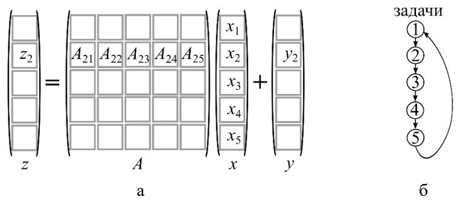

**Алгоритм 2 (систолический, на кольце).** Отказываемся от дублирования: задаче $\mu$ достаётся только блок $x_\mu$. Чтобы вычислить (1), нужно, чтобы через память каждой задачи прошли все блоки $x$. Это обеспечивает кольцо: блоки $x_{loc}$ потактово продвигаются по кольцу от соседа к соседу. Соседи: $left=\mu-1$, $right=\mu+1$ (у первой задачи левый сосед — $p$, у последней правый — 1).

```
Инициализация{row=(μ-1)α+1:μα; A_loc=A(row,:);
              x_loc=x((μ-1)β+1:μβ); y_loc=y(row); left, right}
for j=1:p
  send(x_loc, right)              % отсылка x_loc правому соседу
  recv(x_loc, left)              % приём x_loc от левого соседа
  τ=μ-j; if τ≤0 then τ=τ+p end if % индекс полученного блока
  a=(τ-1)β+1:τβ
  y_loc = y_loc + A_loc(:,a)·x_loc % слагаемое τ из (1)
end for
```

**Систолический принцип.** За $p$ итераций через задачу $\mu$ проходят все блоки $x$, продвигаясь по каналам кольца (отправка вправо, приём слева). Индекс $\tau=\mu-j$ (с поправкой $+p$ при $\tau\le0$ из-за перехода по кольцу между задачами $p$ и 1) указывает, какой блок $x_\tau$ сейчас в задаче, и какой блок $A_{\mu\tau}$ выбрать. Порядок суммирования в разных задачах различен (на 1-й итерации задаются $A_{1p}x_p,\ A_{21}x_1,\ \ldots$; на последней — $A_{11}x_1,\ldots,A_{pp}x_p$), но результат корректен в силу коммутативности сложения [Параллельные алгоритмы, §1.1].

**Оценки и недостатки.** $p$ пар коммуникаций (отправка-приём) объёмом $\beta$ каждая. Систоличность жёстко требует: приём всегда после отправки (нельзя вынести последнюю итерацию вперёд, нельзя чередовать приём/отправку по чётности задач, чтобы разгрузить сеть). При кодировании эти недостатки исправляются (число коммуникаций можно сократить до $p-1$).

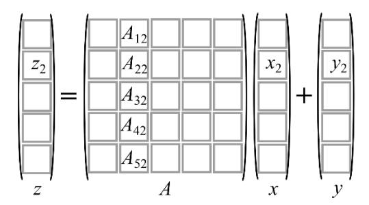

---

## 24. Систолический алгоритм gaxpy на процессорном кольце с декомпозицией матрицы на блочные столбцы.

**Декомпозиция по блочным столбцам.** Меняется математический формализм: вместо блочного скалярного произведения — **линейная комбинация блочных столбцов** $A$:
$$z=\sum_{j=1}^{p}A_j x_j+y,$$
где блочный столбец $A_j\in\mathbb{R}^{n\times\beta}$. К задаче $\mu$ относится вычисление блока $z_\mu$. Введём $\omega_j=A_j x_j$ ($\omega_j\in\mathbb{R}^{n\times1}$), тогда
$$z_\mu=\sum_{j=1}^{p}\omega_j(row)+y_\mu,\qquad row=(\mu-1)\alpha+1:\mu\alpha.\tag{2}$$

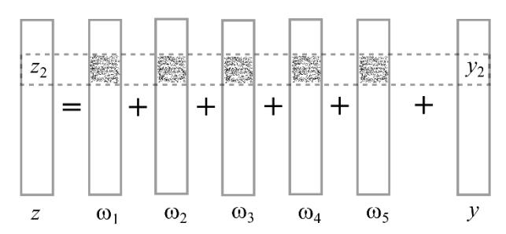

**Алгоритм 3 (систолический, на кольце).** После инициализации в памяти задачи $\mu$ — блочный столбец $A_\mu$ и блок $x_\mu$. Их сразу перемножают, получая $\omega_\mu=A_\mu x_\mu$, и затем продвигают полученный вектор $\omega$ по кольцу. За $p$ итераций через все задачи пройдут все векторы $\omega_j$.

```
Инициализация{row=(μ-1)α+1:μα; col=(μ-1)β+1:μβ;
   A_loc=A(:,col); x_loc=x(col); y_loc=y(row); left, right}
ω = A_loc·x_loc                  % формирование ω_μ
for j=1:p
  send(ω, right)                 % отсылка ω правому соседу
  recv(ω, left)                 % приём ω от левого соседа
  y_loc = y_loc + ω(row)         % сложение по ф. (2)
end for
```

**Систолический принцип и упрощение.** Каждая задача потактово пересылает $\omega$ правому соседу и принимает чужой $\omega$ от левого, прибавляя нужный фрагмент $\omega(row)$ к $y_{loc}$. В отличие от Алгоритма 2, **номер задачи-источника учитывать не нужно**: со всеми принятыми $\omega$ делается одно и то же (берётся фрагмент $row$ и складывается). Это значительно упрощает алгоритм — нет вычисления индекса $\tau$ и условного перехода. Порядок сложений в задачах разный, но в силу коммутативности это несущественно [Параллельные алгоритмы, §1.1].

**Оценки.** Количество коммуникаций прежнее — $p$ пар, но **объём каждой коммуникации больше в $n/\beta$ раз**: по кольцу идут векторы $\omega$ из $n$ компонент вместо блоков $x_{loc}$ из $\beta$ элементов. Таким образом, столбцовая декомпозиция проще в реализации, но дороже по трафику; выбор между Алгоритмами 2 и 3 зависит от размеров данных и схемы хранения матрицы [Параллельные алгоритмы, §1.1].

---

## 25. Столбцово-ориентированные алгоритмы умножения матриц на кольце.

**Операция.** $D=C+AB$, где $D,C\in\mathbb{R}^{n\times m}$, $A\in\mathbb{R}^{n\times q}$, $B\in\mathbb{R}^{q\times m}$; блоки $D_{ij},C_{ij}\in\mathbb{R}^{\alpha\times\beta}$, $A_{ij}\in\mathbb{R}^{\alpha\times\gamma}$, $B_{ij}\in\mathbb{R}^{\gamma\times\beta}$, $\alpha=n/p$, $\beta=m/p$, $\gamma=q/p$ [Параллельные алгоритмы, §1.2].

**Столбцовый формализм.** Задача $\mu$ вычисляет $\mu$-й **блочный столбец** $D_\mu$ как линейную комбинацию блочных столбцов $A$:
$$D_\mu=C_\mu+AB_\mu=C_\mu+\sum_{j=1}^{p}A_j B_{j\mu},\tag{4}$$
где $D_\mu,C_\mu\in\mathbb{R}^{n\times\beta}$, $B_\mu\in\mathbb{R}^{q\times\beta}$, $A_j\in\mathbb{R}^{n\times\gamma}$. Из (4) видно: матрица $A$ целиком нужна всем задачам.

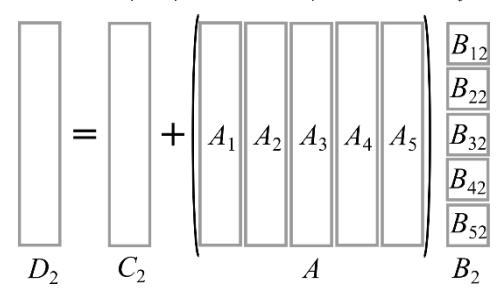

**Алгоритм 4 (без коммуникаций).** Матрица $A$ дублируется в памяти всех задач; $B$ и $C$ распределены по блочным столбцам. Каждая задача накапливает $C_{loc}=C_{loc}+A_{loc}(:,a)B_{loc}(a,:)$ по $j=1:p$. По завершении в $C_{loc}$ задачи $\mu$ сформирован $D_\mu$. Плата — полное дублирование $A$, что недопустимо при больших матрицах [Параллельные алгоритмы, §1.2].

**Алгоритм 5 (систолический, на кольце, пересылка блочных столбцов $A$).** Чтобы не дублировать $A$, её распределяют по блочным столбцам $A_\mu$, а сами столбцы потактово продвигают по кольцу. Структурно близок к Алгоритму 2 gaxpy.

```
Инициализация{col=(μ-1)β+1:μβ; col2=(μ-1)γ+1:μγ;
   A_loc=A(:,col2); B_loc=B(:,col); C_loc=C(:,col); left, right}
for j=1:p
  send(A_loc, right)             % отсылка блочного столбца A вправо
  recv(A_loc, left)             % приём блочного столбца A слева
  τ=μ-j; if τ≤0 then τ=τ+p end if
  a=(τ-1)γ+1:τγ
  C_loc = C_loc + A_loc·B_loc(a,:) % слагаемое τ из (4)
end for
```

**Систолический принцип.** Блочные столбцы $A_\tau$ ($\tau=\mu-j$, $+p$ при $\tau\le0$) кружат по кольцу; каждая задача умножает пришедший $A_\tau$ на свой $B_{\tau\mu}$ и накапливает $C_{loc}$. Блоки $A$ и $B$ имеют разную ширину ($\gamma$ и $\beta$ столбцов). Применять Алгоритм 5 уместно при $n\gt m$ (когда $A$ «шире»/предпочтительнее распределить и пересылать $A$). При столбцовом хранении матриц выгоден язык со столбцовой схемой массивов (например, Fortran) [Параллельные алгоритмы, §1.2].

**Оценки.** $p$ пар коммуникаций; объём — блочный столбец $A$ за итерацию (фактически матрица $A$ целиком за весь проход). Число коммуникаций можно сократить до $p-1$, пренебрегая систоличностью.

---

## 26. Строчно-ориентированные алгоритмы умножения матриц на кольце.

**Мотивация.** При $n\gg m$ элементов в $A$ значительно больше, чем в $B$; тогда для сокращения трафика по кольцу выгоднее пересылать блоки **матрицы $B$**, а не $A$ [Параллельные алгоритмы, §1.2].

**Строчный формализм.** Задача $\mu$ вычисляет $\mu$-ю **блочную строку** $D_\mu$ как линейную комбинацию блочных строк $B$:
$$D_\mu=C_\mu+A_\mu B=C_\mu+\sum_{i=1}^{p}A_{\mu i}B_i,\tag{5}$$
где $D_\mu,C_\mu\in\mathbb{R}^{\alpha\times m}$, $A_\mu\in\mathbb{R}^{\alpha\times q}$, $B_i\in\mathbb{R}^{\gamma\times m}$.

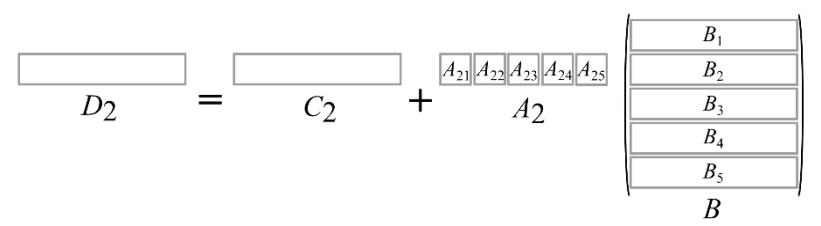

**Алгоритм 6 (систолический, на кольце, пересылка блочных строк $B$).** Отличается от Алгоритма 5 незначительно: каждая задача хранит блочную строку $A_\mu$ (целиком, она не пересылается) и блочную строку $B_\mu$, которую продвигает по кольцу.

```
Инициализация{row=(μ-1)α+1:μα; row2=(μ-1)γ+1:μγ;
   A_loc=A(row,:); B_loc=B(row2,:); C_loc=C(row,:); left, right}
for i=1:p
  send(B_loc, right)             % отсылка блочной строки B вправо
  recv(B_loc, left)             % приём блочной строки B слева
  τ=μ-i; if τ≤0 then τ=τ+p end if
  a=(τ-1)γ+1:τγ
  C_loc = C_loc + A_loc(:,a)·B_loc % слагаемое τ из (5)
end for
```

**Систолический принцип.** Блочные строки $B_\tau$ ($\tau=\mu-i$, с поправкой $+p$) потактово обходят кольцо; задача $\mu$ умножает свой блок $A_{\mu\tau}$ ($=A_{loc}(:,a)$) на пришедшую строку $B_\tau$ и накапливает $C_{loc}$. По завершении $C_{loc}$ задачи $\mu$ содержит блочную строку $D_\mu$ [Параллельные алгоритмы, §1.2].

**Сравнение со столбцовым (В25).** Имеем два алгоритма умножения, различающихся способом распределения ($A$ по столбцам — В25 / $B$... строки $A$ по строкам, $B$ по строкам — В26) и тем, что пересылается ($A$ или $B$):
- Алгоритм 5 (столбцовый) уместен при $n\gt m$;
- Алгоритм 6 (строчный) — в обратном случае $n\lt m$.

При хранении по блочным строкам разумнее язык со строчной схемой хранения (например, C). Соотношение размеров умножаемых матриц влияет и на выбор алгоритма, и на выбор языка. На практике пользуются готовыми библиотечными процедурами. Оба алгоритма требуют $p$ пар коммуникаций (можно сократить до $p-1$) [Параллельные алгоритмы, §1.2].

---

## 27. Систолический алгоритм умножения матриц на торе.

**Блочное скалярное произведение на торе.** $p$ задач располагают двумерной сеткой (тор) с двузначными номерами $(\mu,\lambda)$, $1\le\mu,\lambda\le N$, $N=\sqrt{p}$. Каждая задача вычисляет один блок $D_{\mu,\lambda}$:
$$D_{\mu,\lambda}=C_{\mu,\lambda}+A_\mu B_\lambda=C_{\mu,\lambda}+\sum_{k=1}^{N}A_{\mu,k}B_{k,\lambda},\tag{6}$$
где $D_{\mu,\lambda},C_{\mu,\lambda}\in\mathbb{R}^{\alpha\times\beta}$, $A_{\mu,k}\in\mathbb{R}^{\alpha\times\gamma}$, $B_{k,\lambda}\in\mathbb{R}^{\gamma\times\beta}$, $\alpha=n/N$, $\beta=m/N$, $\gamma=q/N$ [Параллельные алгоритмы, §1.3].

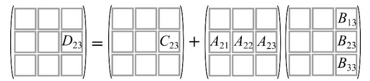

**Алгоритм 7 (без коммуникаций).** В задаче $(\mu,\lambda)$ хранят $\mu$-ю блочную строку $A_\mu$ и $\lambda$-й блочный столбец $B_\lambda$; накапливают $C_{loc}$ по $k=1:N$ строго по формуле (6). Объём данных меньше, чем у Алгоритма 4, но каждая блочная строка $A$ и столбец $B$ дублируются $N$ раз (строка $A_2$ — в задачах $(2,1),(2,2),(2,3)$ и т.д.) [Параллельные алгоритмы, §1.3].

**Топология коммуникаций (тор).** Чтобы исключить дублирование, блоки продвигают по двум направлениям: блоки $A$ — горизонтально с **востока на запад**, блоки $B$ — вертикально с **юга на север** (рис. 7,а). Тор замкнут: западный край связан с восточным, северный с южным. Соседи задачи $(\mu,\lambda)$: западный $(\mu,\lambda-1)$ (при $\lambda=1\to(\mu,N)$); северный $(\mu-1,\lambda)$ (при $\mu=1\to(N,\lambda)$); восточный $(\mu,\lambda+1)$; южный $(\mu+1,\lambda)$.

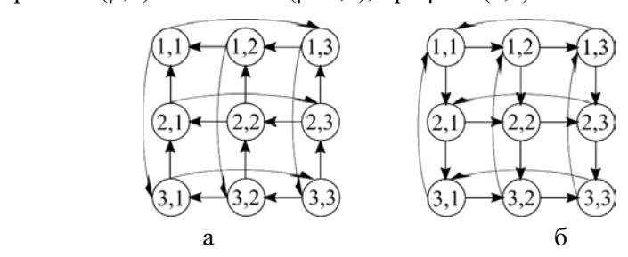

**Начальное распределение (предварительный скос).** Перед умножением в памяти $(\mu,\lambda)$ должны быть блоки $C_{\mu,\lambda}$, $A_{\mu,\rho}$ и $B_{\rho,\lambda}$, где $\rho=\langle\lambda+\mu-1\rangle_N$ (остаток от деления $\lambda+\mu-1$ на $N$; при нулевом остатке $\rho=N$). Если изначально задаче $(\mu,\lambda)$ даны «естественные» блоки $A_{\mu,\lambda},B_{\mu,\lambda}$ (рис. 8,а/б — неправильно), их нужно скосить: $\mu$-ю блочную строку $A$ сдвинуть циклически на $\mu-1$ позицию влево, $\lambda$-й блочный столбец $B$ — на $\lambda-1$ позицию вверх (рис. 8,в/г). Это делает **Алгоритм 8** (циклические сдвиги send/recv по строке и столбцу). Алгоритм 8 имеет лишь методическую ценность — данные следует распределять правильно изначально.

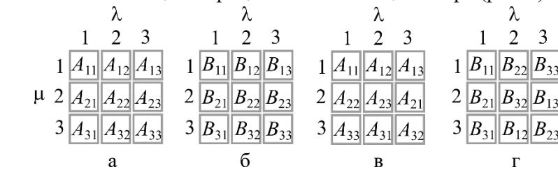

**Алгоритм 9 (систолический, умножение на торе).**

```
Инициализация{row=(μ-1)α+1:μα; col=(λ-1)β+1:λβ;
  row2=(ρ-1)γ+1:ργ; col2=(ρ-1)γ+1:ργ;
  C_loc=C(row,col); A_loc=A(row,col2); B_loc=B(row2,col);
  east, west, north, south}
for k=1:N
  send(A_loc, west)     % блок A — западному соседу
  send(B_loc, north)    % блок B — северному соседу
  recv(A_loc, east)     % блок A — от восточного соседа
  recv(B_loc, south)    % блок B — от южного соседа
  C_loc = C_loc + A_loc·B_loc   % слагаемое из (6)
end for
```

**Систолический принцип.** На каждом такте каждая задача синхронно сдвигает свой блок $A$ на запад и блок $B$ на север, принимает новые блоки $A$ (с востока) и $B$ (с юга) и сразу их перемножает, накапливая в $C_{loc}$. Благодаря правильному начальному скосу в задаче в каждый такт встречаются «согласованные» сомножители $A_{\mu,k}B_{k,\lambda}$. Пример для $(2,3)$: $C_{2,3}+A_{2,2}B_{2,3}+A_{2,3}B_{3,3}+A_{2,1}B_{1,3}$ — за $N$ тактов блоки делают полный оборот по широте и меридиану. Номер источника блока определять не нужно (в отличие от кольца) — он задан геометрией тора и начальным распределением [Параллельные алгоритмы, §1.3].

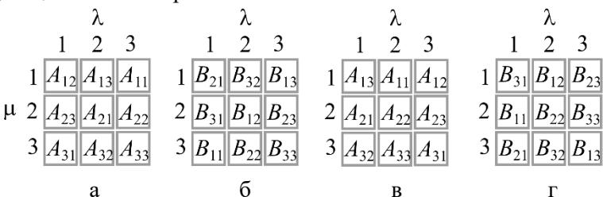

**Сравнение с кольцом (В25, В26).** При том же числе арифметических операций тор выигрывает по коммуникациям:
- число коммуникаций: $p$ пар отправка-приём на кольце против $2\sqrt{p}$ пар на торе;
- объём: на кольце пересылается матрица $A$ либо $B$ целиком, на торе — лишь блочная строка $A$ и блочный столбец $B$.

Вывод: предпочтение следует отдать умножению матриц на торе — оно даёт меньшие коммуникационные издержки при одинаковом объёме вычислений [Параллельные алгоритмы, §1.3].


## 28. Параллельный алгоритм разложения Холецкого на кольце

**Идея.** Строится разложение симметричной положительно определённой матрицы $A=GG^T$, где $G$ — нижняя треугольная. За основу взят векторный алгоритм на базе операции gaxpy: $j$-й столбец $G$ вычисляется в два шага [Параллельные алгоритмы, §2.1]:

1. $v(j:n)=A(j:n,j)-G(j:n,1:j-1)\,G^{T}(1:j-1,j)$;
2. $G(j:n,j)=v(j:n)/\sqrt{v(j)}$.

Здесь gaxpy раскрывается как линейная комбинация ранее найденных столбцов:
$$G(\mu:n,1:\mu-1)\,G^{T}(1:\mu-1,\mu)=\sum_{j=1}^{\mu-1}G(\mu:n,j)\,G(\mu,j).\qquad(7)$$

**Топология и декомпозиция.** Топология — процессорное кольцо. Декомпозиция матрицы — по столбцам. В простейшем случае $p=n$: задача $\mu$ хранит столбец $A(:,\mu)$ и вычисляет $G(\mu:n,\mu)$. По кольцу слева направо передаётся каждый вычисленный столбец $G$; первая задача только отправляет (в ней сумма (7) пуста), последняя — только принимает. Алгоритм НЕ систоличен: данные сначала принимаются, затем сразу пересылаются дальше, и лишь потом используются — это уменьшает синхронизацию и ускоряет старт соседей [Параллельные алгоритмы, §2.1].

**Псевдокод (p=n, Алгоритм 10):**
```
Инициализация {A_loc = A(:,μ); left, right}
for j = 1 : μ-1                          % слагаемые суммы (7)
    recv(g(j:n), left)                   % приём столбца G(j:n,j)
    if μ < n then send(g(j:n), right)    % передача дальше
    A_loc(μ:n) = A_loc(μ:n) - g(μ:n)·g(μ)
end for
A_loc(μ:n) = A_loc(μ:n)/√(A_loc(μ))      % шаг 2
if μ < n then send(A_loc(μ:n), right)    % отправка G(μ:n,μ)
```

**Простои и их сокращение.** В Алгоритме 10 много простоев (задачи с малыми номерами уже закончили, с большими — ждут данных), задачи несбалансированы, а арифметика сопоставима по времени с коммуникациями — алгоритм неэффективен. Поэтому переходят к общему случаю $p\ll n$, $n/p\gt 1$ столбцов на задачу, и применяют **циклическую** декомпозицию: задаче $\mu$ отнесены столбцы $col=\mu:p:n$ (рис. 10б). Тогда каждый столбец $G$ (кроме последних $p-1$) делает полный оборот по кольцу, простои сдвигаются в самый конец процесса, балансировка хорошая [Параллельные алгоритмы, §2.1].

**Общий случай (Алгоритм 11, суть):** во внешнем цикле `while k≤L` ровно одна задача, для которой $j=col(k)$, вычисляет столбец $G(:,j)=A_{loc}(j:n,k)/\sqrt{A_{loc}(j,k)}$, отправляет его правому соседу и обновляет свои невычисленные столбцы; остальные задачи принимают столбец, при необходимости (если $\alpha\neq right$ и $\beta\gt j$) передают дальше и вычисляют по одному слагаемому из (7) для своих столбцов.

**Выводы.** За одну коммуникацию вектора $g(j:n)$ следует $L-k+1$ операций типа saxpy, поэтому доля арифметики высока, а Алгоритм 11 эффективен и хорошо масштабируем [Параллельные алгоритмы, §2.1].

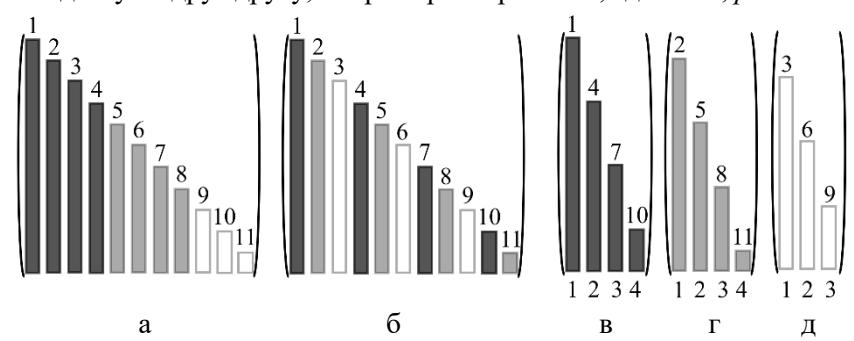

---

## 29. Параллельный алгоритм LU-разложения на кольце

**Идея.** Строится $A=LU$ ($L$ — нижняя унитреугольная, $U$ — верхняя). За основу взят векторный алгоритм через **модификацию матрицы внешним произведением (мм)**, выполняемую в цикле по $k$ от $1$ до $n-1$ [Параллельные алгоритмы, §2.2]:

1. столбец $L$: $\;A(k+1:n,k)=A(k+1:n,k)/A(k,k)$ (вектор множителей Гаусса);
2. мм.: $\;A(k+1:n,k+1:n)=A(k+1:n,k+1:n)-A(k+1:n,k)\,A(k,k+1:n)$.

$L$ формируется ниже диагонали $A$, $U$ — в верхнем треугольнике.

**Топология и декомпозиция.** Кольцо; циклическая декомпозиция столбцов $col=\mu:p:n$ (как в В28). По кольцу передаётся только что вычисленный $k$-й столбец $L$ (вектор множителей Гаусса), а вместо слагаемого из (7) для невычисленных столбцов выполняется модификация внешним произведением нижнего правого квадратного блока $A(k+1:n,k+1:n)$ [Параллельные алгоритмы, §2.2].

**Псевдокод (Алгоритм 12, суть):**
```
Инициализация {col=μ:p:n; L=length(col); A_loc(:,1:L)=A(:,col); left, right}
k=1; s=1
while s ≤ L
  if k = col(s) then                         % здесь вычисляется L(:,k)
     if k < n then
        A_loc(k+1:n,s) = A_loc(k+1:n,s)/A_loc(k,s)   % столбец L
        send(A_loc(k+1:n,s), right)
        for q = s+1:L
           A_loc(k+1:n,q) -= A_loc(k+1:n,s)·A_loc(k,q)  % мм.
        end for
        k=k+1
     end if
     s=s+1
  else
     recv(g(k+1:n), left)                     % приём столбца L
     if (α≠right) and (β≥k) then send(g(k+1:n), right)
     for q = s:L
        A_loc(k+1:n,q) -= g(k+1:n)·A_loc(k,q) % мм.
     end for
     k=k+1
  end if
end while
```

**Отличия от Холецкого (Алгоритм 11).** Передаваемый столбец начинается под главной диагональю (унитреугольность $L$); модифицируется не нижний треугольник, а нижний правый квадратный блок (поэтому нет операции $r=col(k)$); строки $U(k+1,\cdot)$ образуются «попутно» — на последней мм. над данной строкой. Порядок «первый вошёл — первый вышел» в кольце гарантирует, что `recv` принимает именно нужный $k$-й столбец [Параллельные алгоритмы, §2.2].

**Простои/коммуникации, выводы.** Декомпозиция циклическая, поэтому Алгоритм 12 сбалансирован, простои начинаются лишь на завершающем участке; за одну коммуникацию следует много операций saxpy, что обеспечивает высокую эффективность [Параллельные алгоритмы, §2.2].

---

## 30. Параллельный алгоритм разложения Холецкого на решетке

> [!warning] На экзамене не спрашивают


**Идея.** Для максимальной преемственности с LU-разложением на решётке берут векторный алгоритм Холецкого не через gaxpy, а через **модификацию матрицы внешним произведением**; в нижнем треугольнике $A$ формируют $G$, в верхнем — $G^{T}$. Векторный алгоритм (цикл по $k=1..n$) [Параллельные алгоритмы, §2.4]:

1. $A(k,k)=\sqrt{A(k,k)}$ (диагональ $G$);
2. столбец $G$: $A(k+1:n,k)=A(k+1:n,k)/A(k,k)$;
3. строка $G^{T}$: $A(k,k+1:n)=A(k,k+1:n)/A(k,k)$;
4. мм.: $A(k+1:n,k+1:n)=A(k+1:n,k+1:n)-A(k+1:n,k)\,A(k,k+1:n)$.

**Топология и декомпозиция.** Процессорная решётка $n\times n$ (общий случай — блочная). Задача $(i,j)$ хранит $A(i,j)$, формируя поверх него $G(i,j)$ при $i\ge j$ или $G^{T}(i,j)$ при $i\lt j$. По решётке распространяются: элементы строки $G^{T}$ — на юг, элементы столбца $G$ (множители) — на восток. По сравнению с LU добавлены каналы от задач первой строки ($i=1$): для шага 3 им нужен элемент диагонали $G$ от задачи $(1,1)$ [Параллельные алгоритмы, §2.4].

**Псевдокод (Алгоритм 14, суть; строки 01–09 совпадают с Алгоритмом 13):**
```
Инициализация {a=A(i,j); north, south, west, east}
k=1
while k ≤ min{i,j}                       % модификации внешним произв.
   recv(a_north, north); if i≠n then send(a_north, south)
   recv(a_west,  west);  if j≠n then send(a_west,  east)
   a = a - a_west·a_north
   k=k+1
end while
if i = j then                            % диагональ G
   a = √a
   if i≠n then send(a,south); send(a,east)
end if
... строки по нахождению столбца G (как в Алг.13) ...
if i ≤ j then                            % строка G^T
   recv(a_west, west); if j≠n then send(a_west, east)
   a = a / a_west
   send(a, south)
end if
```

**Волновые вычисления.** Процесс представляет собой чередование трёх «волн» с фронтом под $45^\circ$: пересылка строки $U/G^T$ на юг, столбца $L/G$ на восток и производство мм. Принятые данные сначала пересылаются дальше и лишь затем используются — это сокращает простои [Параллельные алгоритмы, §2.3–2.4].

**Простои/эффективность, выводы.** При $p=n^2$ большинство задач простаивает, а на одну арифметическую операцию приходится две коммуникации — низкая эффективность. Лечение то же, что и для LU: укрупнение задач до блоков размера $q$ (на одну мм. — $2q^2$ арифметических операций против 2 коммуникаций) и циклическая декомпозиция блоков. При учёте симметрии $A$ верхний треугольник не обрабатывается, топология упрощается (рис. 14б) [Параллельные алгоритмы, §2.4].

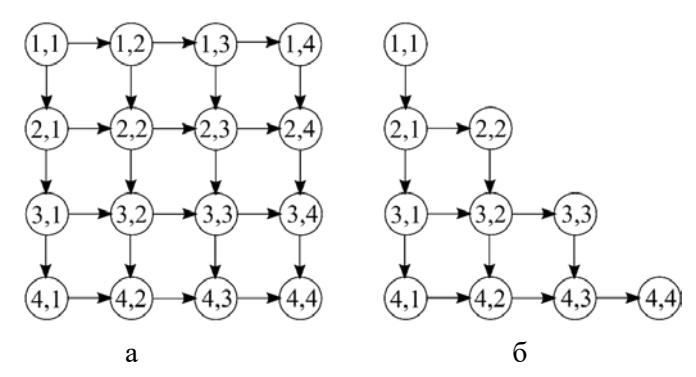

---

## 31. Параллельный алгоритм LU-разложения на решетке

> [!warning] На экзамене не спрашивают


**Идея.** Базовый векторный алгоритм — LU через **модификацию матрицы внешним произведением** (см. В29). Ключевая характеристика задачи $(i,j)$ — число мм., в которых участвует её элемент: элементы первых строки/столбца — 0 раз, вторых — 1 раз, третьих — 2 раза и т.д., всего $\min\{i,j\}-1$ модификаций [Параллельные алгоритмы, §2.3].

**Топология и декомпозиция.** Решётка $n\times n$; задача $(i,j)$ хранит $A(i,j)$, формируя $L(i,j)$ при $i\gt j$ или $U(i,j)$ при $i\le j$. Коммуникации: множитель Гаусса $A(i,k)$ идёт с запада на восток, элемент строки $U$ — $A(k,j)$ — с севера на юг; по достижении восточной/южной границы движение прекращается. Элемент $A(j,j)$ задача $(j,j)$ отправляет на юг для нахождения множителей [Параллельные алгоритмы, §2.3].

**Псевдокод (Алгоритм 13):**
```
Инициализация {a=A(i,j); north, south, west, east}
k=1
while k ≤ min{i,j}                          % модификации мм.
   recv(a_north, north); if i≠n then send(a_north, south)  % A(k,j)
   recv(a_west,  west);  if j≠n then send(a_west,  east)   % A(i,k)
   a = a - a_west·a_north
   k=k+1
end while
if (i ≤ j) and (i ≠ n) then send(a, south)  % строки U на юг
if i > j then                               % формирование L
   recv(a_north, north); if i≠n then send(a_north, south)  % A(j,j)
   a = a / a_north                          % множитель Гаусса
   send(a, east)
end if
```

**Волновой фронт.** Алгоритм волновой: на шаге 1 первая волна (строка $U$) идёт горизонтальным фронтом с севера на юг; затем чередуются три волны с фронтом под $45^\circ$ — пересылка строки $U$ на юг, столбца $L$ на восток, производство мм. (рис. 11, 12). Принятые данные сразу пересылаются дальше, потом используются [Параллельные алгоритмы, §2.3].

**Простои/эффективность.** При $p=n^2$ большая часть задач простаивает; на одну арифметическую операцию — две коммуникации (низкая эффективность). Устранение: укрупнение в блоки $q$ ($2q^2$ арифметики на 2 коммуникации) и циклическая декомпозиция блоков (рис. 13б): задаче $\mu$ — блочные диагонали $\mu$ и $-(N-\mu+1)$, $N=n/q$. Тогда простои сдвигаются к концу и нарастают постепенно; пересылаются векторы, а не скаляры [Параллельные алгоритмы, §2.3].


---

## 32. Параллельный алгоритм метода прогонки

**Идея.** Для трёхдиагональной СЛАУ применяется параллельный **метод встречных прогонок** в двухзадачном варианте. Система делится пополам: первую половину уравнений ведёт первая задача, вторую — вторая; навстречу друг другу выполняются правая и левая прогонки [Параллельные алгоритмы, §3.3].

**Три шага алгоритма** [Параллельные алгоритмы, §3.3]:

1. **Прямые ходы прогонок (параллельно).** В первой задаче — прямой ход *правой* прогонки для уравнений первой половины системы; во второй — прямой ход *левой* прогонки для второй половины. Оба прямых хода идут одновременно, навстречу друг другу.
2. **Обмен прогоночными коэффициентами.** Две соседние задачи обмениваются прогоночными коэффициентами двух соседних уравнений из середины системы (отнесённых к разным задачам) и находят два принадлежащих этим уравнениям неизвестных (третье после прямого хода исключается). Это единственная коммуникация алгоритма; каждая задача отсылает и принимает пару коэффициентов, длительность обмена не зависит от $n$.
3. **Обратные ходы (параллельно).** В первой задаче — обратный ход правой прогонки для первой половины уравнений, во второй — обратный ход левой прогонки для второй половины.

**Коммуникации и эффективность.** Коммуникация всего одна (шаг 2), $t_k=\mathrm{const}$, а $t_a=t_a(n)$ растёт с размерностью. По модели сетевой деградации ($w=t_k/t_a$):
$$S=\frac{p\,t_a}{t_a+t_k}=\frac{2}{1+t_k/t_a(n)}.\qquad(21)$$
При малых $n$, когда $t_k\gt t_a(n)$, ускорение $S\lt 1$ (параллельный счёт медленнее последовательного); с ростом $n$ ускорение проходит через $1$ и стремится к $2$ [Параллельные алгоритмы, §3.3].

**Вывод.** Метод встречных прогонок даёт максимальное ускорение $2$ на двух задачах; он плохо масштабируется (распараллеливание ограничено двумя задачами), но прост и эффективен при достаточно больших $n$ [Параллельные алгоритмы, §3.3].

---

## 33. Параллельный алгоритм метода циклической редукции

> [!warning] На экзамене не спрашивают


> **Замечание.** В выданных методичках и лекциях тема не освещена; ответ приведён по общим источникам.

**Назначение.** Метод циклической редукции (cyclic reduction) — прямой параллельный метод решения трёхдиагональных СЛАУ
$$a_i x_{i-1} + b_i x_i + c_i x_{i+1} = d_i,\qquad i=1,\dots,n,$$
с числом шагов $\log_2 n$ вместо $O(n)$ в последовательной прогонке.

**Идея (прямой ход — редукция).** На каждом шаге исключают неизвестные с нечётными индексами, выражая для каждого чётного уравнения $x_{i-1}$ и $x_{i+1}$ через соседей. Линейная комбинация трёх подряд идущих уравнений ($i-1$, $i$, $i+1$) даёт новое уравнение, связывающее только $x_{i-2}$, $x_i$, $x_{i+2}$:
$$a_i' x_{i-2} + b_i' x_i + c_i' x_{i+2} = d_i'.$$
Полученная система снова трёхдиагональна, но содержит вдвое меньше неизвестных (только чётные). Процесс повторяется: после $\log_2 n$ шагов остаётся одно уравнение с одним неизвестным.

**Параллелизм.** Пересчёт новых коэффициентов $a_i',b_i',c_i',d_i'$ для всех чётных уравнений на каждом шаге независим и выполняется параллельно. На шаге $s$ активно $\approx n/2^s$ уравнений.

**Обратный ход (подстановка).** Найденное на последнем шаге неизвестное подставляется обратно; на каждом обратном шаге восстанавливаются неизвестные с индексами предыдущего уровня, причём подстановки тоже независимы и распараллеливаются. Всего ещё $\log_2 n$ шагов.

**Свойства.** Общая глубина (число параллельных шагов) — $O(\log_2 n)$; общее число арифметических операций $O(n)$ (при варианте полной редукции — $O(n\log n)$). Существует модификация «редукция–размножение» (cyclic reduction / PCR — parallel cyclic reduction), где все неизвестные находятся за $\log_2 n$ шагов без обратного хода. Метод хорошо отображается на параллельные архитектуры, но требует устойчивости (диагональное преобладание) для корректности исключений.

---

## 34. Параллельный алгоритм решения СЛАУ с матрицей треугольного вида

> [!warning] На экзамене не спрашивают


**Идея.** Решается система $Lx=b$ с нижней унитреугольной $L$. Базовый векторный алгоритм — на основе saxpy $b(j+1:n)=b(j+1:n)-b(j)\,L(j+1:n,j)$ в цикле по $j$; неизвестные пишутся поверх $b$. В доработанном варианте (Алгоритм 15) вводится накопительный вектор $z$: на шаге $j$ находится $x(j)=b(j)-z(j)$, затем $z(j+1:n)\mathrel{+}=L(j+1:n,j)\,b(j)$ [Параллельные алгоритмы, §2.5].

**Топология и декомпозиция.** Кольцо; циклическое разбиение столбцов $L$ и компонент $b$: $col=\mu:p:n$, что обеспечивает балансировку при треугольной матрице [Параллельные алгоритмы, §2.5].

**Распределённый, но последовательный вариант (Алгоритм 16).** По кольцу передаётся весь вектор $z$ длины $n$; задача, получив $z$, находит очередную неизвестную, модифицирует $z$ и шлёт дальше. Недостаток: актуальный $z$ в каждый момент только в одной задаче — вычисления идут последовательно [Параллельные алгоритмы, §2.5].

**Параллельный вариант (Алгоритм 17).** Ключевое наблюдение: для вычисления $x(j)$ не нужен весь $z$. Скалярное произведение разбивают на части по задачам:
$$x(j)=b(j)-\sum_{l=1}^{\min\{p,\,j-1\}} L(j,\,l:p:j-1)\cdot x(l:p:j-1).\qquad(9)$$
Каждая задача накапливает свой локальный $z_l^{(k)}$:
$$z_l^{(k)}=z_l^{(k-1)}+L(:,\,l+(k-1)p)\,x(l+(k-1)p).\qquad(11)$$
По кольцу обращается короткий вектор $w$ длины $p$ (вместо $n$):
$$w(\mu)=\sum_{l=1}^{\mu-1} z_l^{(k)}(j)+\sum_{l=\mu+1}^{p} z_l^{(k-1)}(j),\qquad(13)$$
и тогда
$$x(j)=b(j)-w(\mu)-z_\mu^{(k-1)}(j).\qquad(14)$$

**Псевдокод (Алгоритм 17, суть):**
```
Инициализация {col=μ:p:n; L_loc=L(:,col); b_loc=b(col); z=0; w=0; left,right}
k=0
while k < r
   if (k≠0) and (μ≠1) then recv(w, left)
   k=k+1;  j=col(k)
   b_loc(k) = b_loc(k) - w(μ) - z(j)              % (14)
   if j < n then
      q = min{n, j+p-1}
      z(j+1:q) += L_loc(j+1:q,k)·b_loc(k)         % (11)
      if k < r then w(1:μ-1) += z(j+p-μ+1:j+p-1); w(μ)=0  % верхняя часть w
      w(μ+1:p) += z(j+1:j+p-μ)                    % нижняя часть w
      send(w, right)
      if q < n then z(q+1:n) += L_loc(q+1:n,k)·b_loc(k)   % остаток z
   end if
end while
```
Образ — поезд по кольцевой дороге: на каждой станции (задаче) «освобождается» свой вагон (элемент $w(\mu)$, затем обнуляется), остальные догружаются [Параллельные алгоритмы, §2.5].

**Простои/эффективность, выводы.** Формирование $w$ последовательно, но вектор короткий ($p$ вместо $n$), а модификация $z(q+1:n)$ идёт по задачам независимо (параллельная часть). По мере нахождения неизвестных арифметики на оборот линейно убывает, а объём пересылок ($p$ чисел) постоянен, поэтому к концу эффективность падает. Лечение: разбить процесс на основную часть (Алгоритм 17 до оборота $r_0$) и заключительную (последовательный Алгоритм 15 с $j=r_0p+1$); при переходе все $z$ суммируются в выделенной задаче [Параллельные алгоритмы, §2.5].

---

## 35. Параллельный алгоритм декомпозиции области

> [!warning] На экзамене не спрашивают


> **Замечание.** Метод декомпозиции области (domain decomposition) в выданных материалах не освещён. В книге под «декомпозицией» понимается распределение данных матрицы (столбцов/блоков) между задачами параллельного алгоритма (например, циклическая декомпозиция блоков на рис. 13б) `[Параллельные алгоритмы, §2.3]`, а не разбиение расчётной области. Ответ ниже приведён по общим источникам.

**Назначение.** Метод декомпозиции области — подход к параллельному решению краевых задач для уравнений в частных производных (после дискретизации — больших разреженных СЛАУ). Расчётная область $\Omega$ разбивается на подобласти $\Omega_1,\dots,\Omega_p$, которые распределяются между задачами/процессорами.

**Идея.** В каждой подобласти $\Omega_i$ задача решается независимо (параллельно), а на границах (интерфейсах) между подобластями значения согласовываются итерационно или напрямую. Различают:

- **Декомпозицию с перекрытием** (методы Шварца). Подобласти налегают друг на друга; реализуется итерационный процесс, где решение в каждой подобласти использует значения соседей с границы перекрытия как граничные условия. Варианты:
  - *аддитивный метод Шварца* — все подобласти на итерации решаются одновременно (хорошо параллелится), затем обновляются граничные данные;
  - *мультипликативный метод Шварца* — подобласти обрабатываются последовательно (аналог Гаусса–Зейделя), сходимость лучше, параллелизм хуже.
- **Декомпозицию без перекрытия** (substructuring, метод Шура). Неизвестные делятся на внутренние (по подобластям) и интерфейсные. Внутренние исключаются параллельно, для интерфейсных решается дополнение Шура; затем восстанавливаются внутренние решения.

**Параллелизм и коммуникации.** Основная вычислительная работа (решение в подобластях) выполняется независимо и хорошо масштабируется; коммуникации сосредоточены на границах/интерфейсе (обмен граничными значениями каждую итерацию). Эффективность определяется отношением объёма внутренней работы к размеру интерфейса (отношение «объём/поверхность»), поэтому укрупнение подобластей повышает эффективность.

**Выводы.** Метод декомпозиции области — естественный способ распараллеливания сеточных задач: он сводит одну большую СЛАУ к набору меньших независимых подзадач плюс согласование на границах. Для ускорения сходимости итерационных вариантов (методов Шварца) применяют грубосеточную (coarse-grid) коррекцию, делающую число итераций слабо зависящим от числа подобластей.


# Раздел VI. Характеристики параллельных алгоритмов


## 36. Ускорение, эффективность, масштабируемость, закон Амдала.

### Характеристики параллельного алгоритма (§3.1)

На основе характеристик вычислительного процесса (объём памяти, число ветвей, количество и время арифметических и коммуникационных операций, длительность вычислений) получают три главные характеристики *алгоритма* — ускорение, эффективность и масштабируемость [Параллельные алгоритмы, §3.1].

**Ускорение** — отношение длительности расчётов по последовательному алгоритму $T^1$ ко времени расчётов по параллельному алгоритму того же численного метода $T^p$:

$$S = \frac{T^1}{T^p},$$

где $p$ — число задач алгоритма (упрощённо принимается равным числу потоков выполнения). Показывает, во сколько раз быстрее считает параллельный алгоритм [Параллельные алгоритмы, §3.1, ф.(16)].

**Эффективность** — безразмерная величина

$$E = \frac{S}{p} = \frac{T^1}{T^p \cdot p}.$$

Показывает, насколько независимо (параллельно) идут расчёты и насколько полно используются аппаратные возможности. Идеал $E=1$ (100%) [Параллельные алгоритмы, §3.1, ф.(17)].

**Масштабируемость** — свойство алгоритма наращивать объём расчётов при росте числа задач без изменения длительности вычислений. Количественно:

$$M = \frac{V^p}{V^1} \quad \text{при} \quad T^p = T^1,$$

где $V^p$, $V^1$ — объёмы памяти, занимаемые параллельным и последовательным процессами. Хорошо масштабируемый алгоритм позволяет решать более объёмную задачу за то же время, лишь добавляя исполнительные устройства [Параллельные алгоритмы, §3.1, ф.(18)].

### Закон Амдала (§3.2)

Простейший теоретический метод оценки: применим даже без самого параллельного алгоритма, по одному лишь последовательному. Пусть $f$ — доля операций последовательного алгоритма, которые не могут исполняться параллельно (информационно, логически или конкуренционно зависимые). Тогда

$$T^p = f \cdot T^1 + (1-f)\frac{T^1}{p},$$

где $f\cdot T^1$ — длительность последовательного фрагмента, $(1-f)T^1/p$ — параллельного, распределённого между $p$ задачами. Подставляя в $S=T^1/T^p$:

$$S \le \frac{1}{f + \dfrac{1-f}{p}}.$$

Это **закон Амдала** (закон Амдала–Уэра, 1967). Неравенство — потому что не учтены дополнительные коммуникационные издержки параллельного алгоритма [Параллельные алгоритмы, §3.2, ф.(19)].

**Предельные случаи:**

- $p \to \infty$: $S \le \dfrac{1}{f}$ — предельное ускорение определяется только последовательной долей. Например, при $f=0{,}2$ ускорение не превысит 5 при любом числе устройств; «лишние» устройства простаивают или дублируют вычисления. Этот барьер не преодолеть мастерством программирования — нужен другой алгоритм или численный метод.
- $f = 0$: $S \le p$ — ускорение ограничено лишь числом задач.

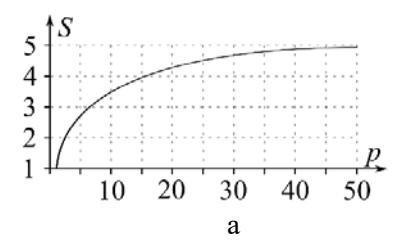
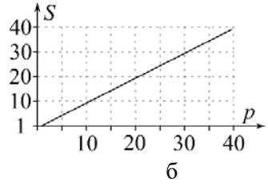

*Рис. 15. Иллюстрации к закону Амдала: а — случай $f=0{,}2$; б — $f=0$.*

Закон Амдала полезен на начальной стадии для оценки потенциала распараллеливания, но не объясняет эффектов, связанных с параметрами, не входящими в ф.(19), — например, влияния коммуникаций между ветвями и иерархическими уровнями памяти. На рис. 16 показан случай нарушения условия $S \le p$ (метод встречных прогонок, $S$ достигает 2,4 при $p=2$) из-за эффектов кэш-памяти [Параллельные алгоритмы, §3.2].

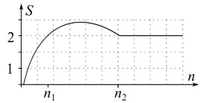

*Рис. 16. Нарушение условия $S \le p$ при $p=2$ ($n$ — размерность матрицы).*

---

## 37. Ускорение, эффективность, масштабируемость, учёт коммуникаций при оценке эффективности, коэффициент сетевой деградации.

### Базовые характеристики (§3.1)

**Ускорение** $S = \dfrac{T^1}{T^p}$ — во сколько раз параллельный алгоритм быстрее последовательного [Параллельные алгоритмы, §3.1, ф.(16)].

**Эффективность** $E = \dfrac{S}{p} = \dfrac{T^1}{T^p \cdot p}$ — насколько полно используются аппаратные возможности, идеал $E=1$ [Параллельные алгоритмы, §3.1, ф.(17)].

**Масштабируемость** $M = \dfrac{V^p}{V^1}$ при $T^p=T^1$ — способность наращивать объём расчётов при росте числа задач без роста времени [Параллельные алгоритмы, §3.1, ф.(18)].

### Учёт коммуникационных издержек (§3.3)

Закон Амдала не учитывает обмены данными между ветвями процесса. Рассмотрим **хорошо сбалансированный** алгоритм: во всех задачах одинаковое количество арифметических и коммуникационных операций, простои несущественны. Тогда длительность параллельных вычислений складывается из времени арифметики и времени коммуникаций:

$$T^p = t_a + t_k,$$

где в идеализированном случае $t_a = T^1/p$. Подставляя в ф.(16) и (17):

$$S = \frac{p\,t_a}{t_a + t_k} = \frac{p}{1 + w}, \qquad E = \frac{1}{1 + w},$$

где $p\,t_a = T^1$ [Параллельные алгоритмы, §3.3, ф.(20)].

**Коэффициент сетевой деградации**

$$\boxed{\,w = \frac{t_k}{t_a}\,}$$

— отношение времени коммуникаций к времени арифметических операций. Именно он определяет влияние коммуникационных издержек на эффективность. При отсутствии зависимостей между задачами обмен не нужен, $t_k=0$, и тогда $w=0$, $E=1$ (100%) [Параллельные алгоритмы, §3.3, ф.(20)].

**Разложение коэффициента** на алгоритмическую и техническую части:

$$w = \frac{t_k}{t_a} = \frac{q}{Q} \cdot \frac{\tau_k}{\tau_a},$$

где $q$, $Q$ — количество коммуникаций и арифметических операций; $\tau_k$, $\tau_a$ — длительности одного обмена и одной арифметической операции.
- $\dfrac{q}{Q}$ — **алгоритмическая часть** (определяется самим алгоритмом);
- $\dfrac{\tau_k}{\tau_a}$ — **техническая часть** (зависит от конкретной вычислительной системы).

При задании $\tau_k$ учитывают, что время одной коммуникации = время латентности (установки) + число пакетов × время пересылки одного пакета; оно зависит от маршрутизации и часто определяется экспериментально [Параллельные алгоритмы, §3.3].

**Пример (метод встречных прогонок, $p=2$):** одна коммуникация на обмен прогоночными коэффициентами, её время не зависит от размерности, а $t_a = t_a(n)$:

$$S = \frac{2}{1 + t_k/t_a(n)}.$$

При малых $n$ ($t_k \gt  t_a(n)$) ускорение $S\lt 1$ (параллельный медленнее последовательного); с ростом $n$ ускорение растёт, проходит через 1 и стремится к 2 [Параллельные алгоритмы, §3.3, ф.(21)].

**Ограничения модели (20):** не учитывает пересылки между иерархическими уровнями памяти внутри ветви; коммуникации, идущие одновременно с арифметикой, ставят под сомнение допущение $T^p = t_a + t_k$. Более точные модели (например, темпоральные сети Петри) строятся для реализации на конкретной системе. Вывод: наиболее достоверные значения характеристик получают только в натурном эксперименте [Параллельные алгоритмы, §3.3].

---

## 38. Правила постановки вычислительных экспериментов и анализа их результатов.

Различают **натурный** эксперимент (величины измеряются) и **вычислительный** (рассчитываются); один эксперимент может быть и тем, и другим. Поскольку алгоритмы исследуются с точки зрения времени вычислений, их экспериментальное изучение — это натурный эксперимент. Ниже — последовательность из 9 этапов исследования [Параллельные алгоритмы, §3.4].

**Этап 1. Постановка цели эксперимента.** Чёткое понимание цели и задач до начала: для чего ставится эксперимент, какую проблему он решит, что делали другие исследователи в аналогичной ситуации.

**Этап 2. Выбор инструментальных средств.** Средства делятся на программные (реализация алгоритма, язык программирования — должен соответствовать схеме хранения данных алгоритма), системные (ОС и компилятор — влияют на переносимость и воспроизводимость; Linux даёт более стабильные результаты, чем Windows) и аппаратные (наличие нужной архитектуры: многоядерность, SSE, GPU).

**Этап 3. Выбор параметров эксперимента.** Параметры — размерности матриц и блоков, точность (одинарная/двойная), число задач. Часть варьируется в заданных пределах с шагом. Параметры должны соответствовать цели и обеспечивать достоверность: не слишком малые (чувствительность к случайным системным событиям) и не слишком большие (ограничения по времени и стоимости); шаг — не слишком мелкий и не слишком крупный.

**Этап 4. Теоретическое предсказание результатов.** Заранее оценить ожидаемый исход, применяя теоретические методы из §3.2 (закон Амдала) и §3.3 (учёт коммуникаций). Предсказание носит оценочный характер и затем уточняется.

**Этап 5. Проведение эксперимента.** Необходима дисциплина и **лабораторный журнал**, где фиксируются этапы 1–4 и все результаты с обстоятельствами их получения. При столкновении с препятствием сохранять выдержку, не паниковать и не повторять бессмысленно одни и те же действия.

**Этап 6. Представление результатов.** Зависимости характеристик (прежде всего длительности расчётов) от средств и параметров. Два способа: **табличный** (полнота) и **графический** (наглядность); данные следует сохранять максимально подробно для последующего перестроения графиков.

**Этап 7. Описание результатов.** Словесное (лучше письменное) описание наблюдаемых закономерностей — отвечает на вопрос **как** меняются результаты. Не «сглаживать» мысленно неудобные особенности графиков, фиксировать все странности, оставаясь честным.

**Этап 8. Анализ результатов.** Отвечает на вопрос **почему** результаты меняются именно так. Главное средство — сопоставление теоретических предсказаний (этап 4) с экспериментом; при расхождении возврат к предыдущим этапам и повторные проверки. Итог — один из трёх исходов: а) модель подтверждена (качественное соответствие), данные ею верифицированы; б) разработана новая/уточнённая модель (сильный теоретический результат, как с CUDA); в) согласование не удалось — применяется феноменологический подход (описание результатов «как есть»).

**Этап 9. Составление заключения.** Выводы прежде всего связаны с целью (этап 1): она достигнута, модифицирована и достигнута, либо признана неуместной (с аргументацией). Затем — значимые результаты анализа. Удачный эксперимент должен порождать новые, более глубокие вопросы (концепция расширяющегося круга знаний Анаксимена); появление новых проблем — признак успеха.

[Параллельные алгоритмы, §3.4, этапы 1–9]
