# Ответы на вопросы по курсу «Основы параллельных вычислений» (по конспекту лекций)

> Источник — **только конспект лекций** («Лекции. Основы параллельных вычислений»). Методички Д.Л. Головашкина не использовались. Ссылки даны в формате `[Лекции, §X.Y]`. Рисунки взяты из конспекта (папка `markdown/Лекции_Основы_параллельных_вычислений_2/`).
>
> **Важно о покрытии.** Конспект охватывает только Главы 1–3 (Модели; Автоматическое распараллеливание; Векторные алгоритмы), то есть вопросы **3–13 и 15–20**. Темы №1–2 (быстрые алгоритмы), №14 (синтетический метод), №21–38 (параллельные алгоритмы на кольце/торе/решётке, характеристики) в конспекте **не освещены** — это отмечено в соответствующих пунктах.

---

# Раздел I. Быстрые алгоритмы

## 1. Умножение матриц по Винограду.

> **В конспекте лекций тема не освещена.** Метод Винограда в лекциях не упоминается (соответствующий материал есть только в методичке «Векторные алгоритмы», §1.3).

## 2. Умножение матриц по Штрассену.

> **В конспекте лекций тема не освещена.** Метод Штрассена в лекциях не упоминается.

---

# Раздел II. Модели в теории параллельных вычислений

## 3. Классификация параллельных вычислительных систем по Флинну.

Классификация М. Флинна (1966 г.) рассматривает ЭВМ как преобразователь, на вход которого подаются **поток команд** и **поток данных**. Сочетая единственность/множественность каждого из двух потоков, получают четыре класса архитектур [Лекции, §1.1]:

| | одна команда | много команд |
|---|---|---|
| **один поток данных** | однопроцессорная ЭВМ (**SISD**) | конвейерная ЭВМ (**MISD**) |
| **много потоков данных** | векторная ЭВМ (**SIMD**) | многопроцессорная ЭВМ (**MIMD**) |

- **SISD** — классическая однопроцессорная ЭВМ, последовательное исполнение команд;
- **SIMD** — векторная ЭВМ: одна команда применяется одновременно к множеству данных;
- **MISD** — конвейерная ЭВМ: разные команды над одним потоком данных;
- **MIMD** — многопроцессорная ЭВМ; детализируется классификацией Хокни (см. вопрос 4).

[Лекции, §1.1]

## 4. Классификация параллельных вычислительных систем по Хокни.

Классификация Р. Хокни **детализирует класс MIMD** Флинна [Лекции, §1.1]:

- **1. Конвейерные** (характерна проблема взаимного исключения);
- **2. Переключаемые** — процессоры соединены через переключатель:
  - с **одной (общей) памятью**;
  - с **распределённой памятью**;
- **3. Сети** — каждый процессор соединён с фиксированным числом соседей:
  - процессорная **линия** (частный случай конвейера);
  - процессорное **кольцо**;
  - процессорная **решётка**;
  - **тор** («бублик»);
  - **гиперкуб** размерности $k$ содержит $p=2^{k}$ вершин;
  - **бинарное дерево** (частный случай гиперкуба);
  - **звезда**.

[Лекции, §1.1]

## 5. Модели представления параллельных алгоритмов.

**Алгоритм** (по Маркову) — ясное предписание, задающее вычислительный процесс от варьируемых начальных данных к результату. Свойства: **детерминированность (результативность)**, **дискретность**, **массовость**, **однозначность** [Лекции, §1.2].

**Модель «задача/канал»** [Лекции, §1.2]:
- **задача** — последовательный набор инструкций и данных (на графе — кружок); параллельность возникает за счёт одновременного исполнения нескольких задач;
- **канал** — средство коммуникации между задачами (стрелка).

**Два правила каналов:** данные движутся по каналу только в одну сторону; передача по правилу «первый вошёл — первый вышел». Задачи могут появляться и упраздняться в ходе работы [Лекции, §1.2].

**Свойства коммуникаций** [Лекции, §1.2]:
- **синхронные / асинхронные** — при синхронной следующая инструкция не выполняется до окончания коммуникации, при асинхронной — сразу после её начала;
- **локальные / глобальные** — коммуникация локальна, если число соседей задачи $\le \lceil\log_2 p\rceil$ ($p$ — число задач);
- **статические / динамические** — меняется ли топология коммуникаций по ходу выполнения;
- **регулярные / нерегулярные** — отображается ли топология на стандартную сетевую конфигурацию.

**Нотация Джина Голуба** (аннотация языка Маркова + операторы коммуникации) [Лекции, §1.2]:
- операторы `send(A, кому)`, `recv(A, от кого)`;
- алгоритму предшествует **инициализация**: число задач $p$, номер задачи $\mu$, локальные данные, соседи;
- соседи: линия/кольцо — `left` $=\mu-1$, `right` $=\mu+1$; решётка/тор — `north` $(\mu-1,\lambda)$, `south` $(\mu+1,\lambda)$, `west` $(\mu,\lambda-1)$, `east` $(\mu,\lambda+1)$;
- **распределение данных** ($r=n/p$): **линейное** — задаче $\mu$ фрагмент $a((\mu-1)r+1:\mu r)$; **циклическое** — $a(\mu:p:n)$.

[Лекции, §1.2]

## 6. Формы представления параллельных процессов (ПВД, графы).

**Вычислительный процесс** — действия по алгоритму на конкретной вычислительной системе в течение некоторого времени [Лекции, §1.3].

> В конспекте форма представления вычислительных процессов даётся через **сети и сети Петри** (§1.3, см. вопросы 7–8). Пространственно-временные диаграммы (ПВД) и графы следования как отдельные модели в лекциях **отдельно не выделены** (этот материал есть в методичке «Модели»). В лекциях встречается лишь **бинарное отношение непосредственного следования** — на множестве разметок сети Петри: разметки $M_0,M_1$ вступают в него, если $M_0\ge {}^{*}F(t_1)$ и $M_1=M_0-{}^{*}F(t_1)+F^{*}(t_1)$ [Лекции, §1.3].

## 7. Сети как модели вычислительных процессов (определение, свойства).

**Определение.** Сеть — тройка $N=(P,T,F)$ [Лекции, §1.3]:
- $P$ — непустое конечное множество **мест** (круги на графе);
- $T$ — непустое конечное множество **переходов** (отрезки на графе);
- $F$ — **функция инцидентности** с областью определения $P\times T \cup T\times P$ и значениями в $\mathbb{N}_0$: $F: P\times T \cup T\times P \to \mathbb{N}$.

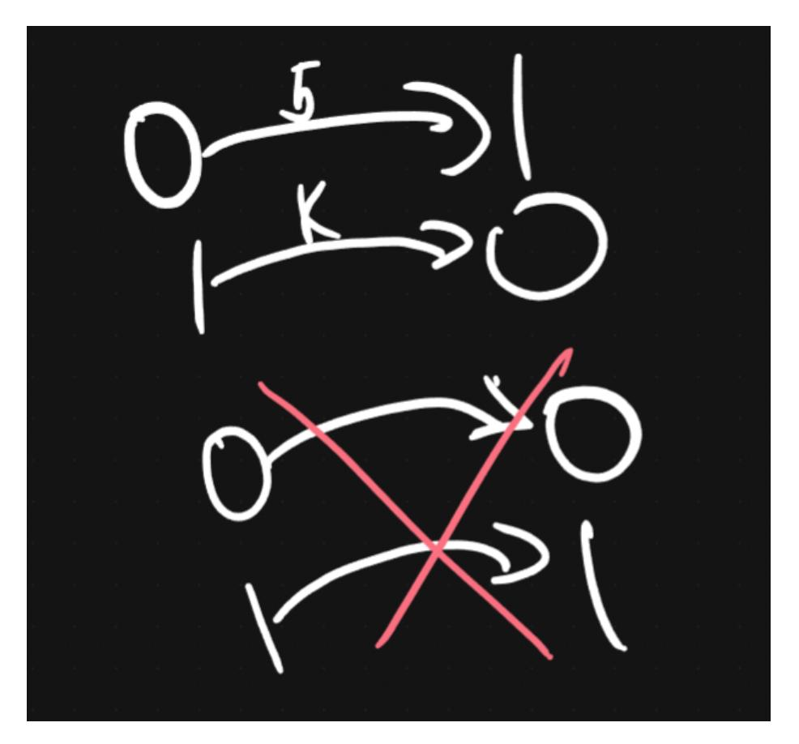

**Свойства сети** [Лекции, §1.3]:
1. множества мест и переходов не пересекаются: $P\cap T=\varnothing$;
2. каждое место инцидентно хотя бы одному переходу: $\forall p\in P\ \exists t\in T:\ F(p,t)\neq 0$ или $F(t,p)\neq 0$;
3. каждый переход инцидентен хотя бы одному месту: $\forall t\in T\ \exists p\in P:\ F(p,t)\neq 0$ или $F(t,p)\neq 0$;
4. нет двух разных мест, одинаково инцидентных одним переходам: если $({}^{*}p_1={}^{*}p_2)$ и $(p_1^{*}=p_2^{*})$, то $p_1=p_2$, где ${}^{*}p$ — множество входных, $p^{*}$ — выходных переходов места $p$.

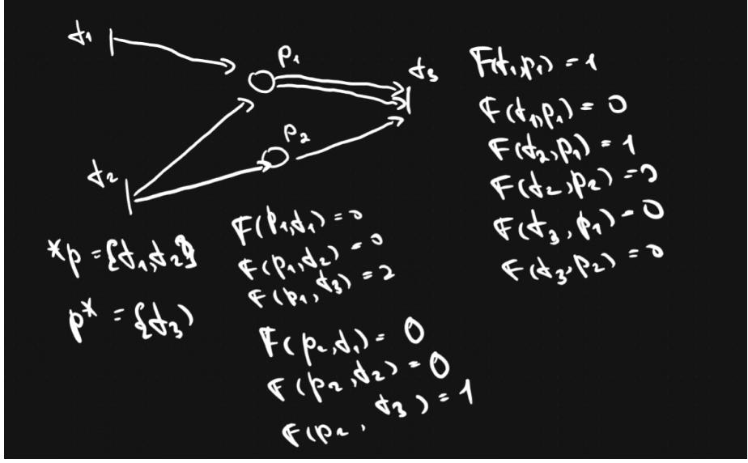

[Лекции, §1.3]

## 8. Сети Петри как модели вычислительных процессов (определения, формализм).

**Сеть Петри** добавляет к сети разметку: $PN=(P,T,F,M)$, где $M:P\to\mathbb{N}$ — **разметка** (число фишек в местах), записываемая вектором $M=(M(p_1),\dots,M(p_n))^{T}$. Разметка меняется после срабатывания переходов [Лекции, §1.3].

**Условия срабатывания переходов** [Лекции, §1.3]:
1. переход $t$ **может** (но не обязан) сработать, если во всех его входных местах достаточно фишек: $\forall p\in {}^{*}t\ \ M(p)\ge F(p,t)$, в векторном виде $M\ge {}^{*}F(t)$;
2. при срабатывании разметка меняется: $\forall p\ \ M'(p)=M(p)-F(p,t)+F(t,p)$, в векторном виде
$$M' = M - {}^{*}F(t) + F^{*}(t).$$

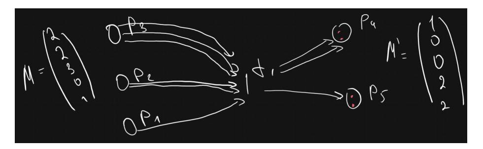

**Закона сохранения фишек нет** (их общее число может меняться) [Лекции, §1.3].

**Работа всей сети Петри** описывается [Лекции, §1.3]:
1. множеством срабатывающих переходов $\tau=\{t_1,t_2,\dots\}$;
2. множеством достижимых разметок: последовательность $M_0[t_1\rangle M_1[t_2\rangle M_2\dots M_N$, где $M_0[t_1\rangle M_1$ — бинарное отношение непосредственного следования на множестве разметок.

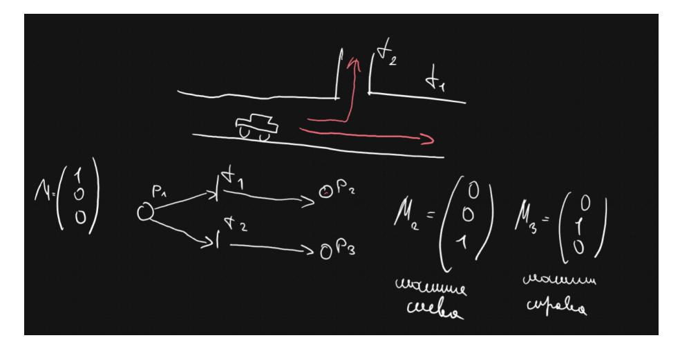

[Лекции, §1.3]

---

# Раздел III. Автоматическое распараллеливание

## 9. Автоматическое распараллеливание ациклических фрагментов последовательных программ (построение стандартного графа и графа зависимостей).

Ациклический фрагмент записывается операторами двух видов: **присваивание** и **условный переход** [Лекции, §2.1].

**Этап I — построение стандартного графа.** Два типа вершин [Лекции, §2.1]:
- **преобразователь** — один или несколько подряд идущих операторов присваивания (на графе — **прямоугольник**); из него выходит не более одной дуги;
- **распознаватель** — ровно один оператор условного перехода (на графе — **окружность**); из него выходит не более двух дуг, маркируемых **1** (истина) и **0** (ложь).

Дуги задаются отношением непосредственного следования. **Входная** вершина — в которую не входит ни одна дуга; **выходная** — из которой не выходит ни одна.

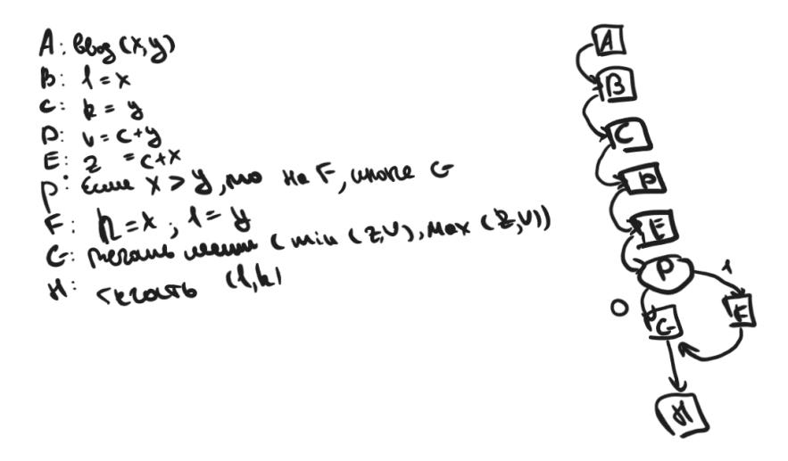

**Этап II — построение графа зависимостей.** Вершины переносятся без изменений; различают три типа зависимости вершины $B$ от $A$ (когда $A$, $B$ на одном пути из входной в выходную вершину, и $A$ предшествует $B$) [Лекции, §2.1]:
- **информационная** — оператор из $B$ использует значение переменной, формируемой оператором из $A$ (и между ними нет переопределения этой переменной);
- **логическая** — существует другой путь, совпадающий с первым до $A$ включительно, далее отличающийся и не содержащий $B$;
- **конкуренционная** — в $A$ и в $B$ есть операторы присваивания, меняющие значение одной общей переменной.

Тип зависимости далее не различают; построение завершается **транзитивным замыканием** зависимостей.

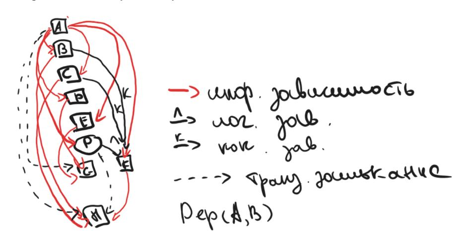

[Лекции, §2.1]

## 10. Автоматическое распараллеливание ациклических фрагментов последовательных программ (построение ЯПФ и параллельного алгоритма).

**Этап III — ярусно-параллельная форма (ЯПФ).** Алгоритм построения [Лекции, §2.1]:
- **Шаг 1.** В первый ярус помещаются вершины $A$, не зависящие ни от одной другой ($\nexists B:\ Dep(A,B)$).
- **Шаг 2.** Если все вершины размещены — ЯПФ построена, иначе шаг 3.
- **Шаг 3.** В ярус $k+1$ помещаются вершины $A$, **все** предки которых (вершины $B$, от которых $A$ зависит) уже размещены в ярусах $\le k$; переход к шагу 2.

В итоге на каждом ярусе — независимые вершины, их операторы можно выполнять одновременно.

**Этап IV — построение параллельного алгоритма** ($p$ задач, номер $1\le\mu\le p$) [Лекции, §2.1]:
- **Шаг 1.** Вершины первого яруса распределяются по задачам: $\mu \sim A_{1,\mu};\ A_{1,\mu+p};\ A_{1,\mu+2p};\dots$
- **Шаг 3.** Вершины яруса $k+1$ распределяются с функцией синхронизации $c(A)$:
$$\mu \sim c(A_{k+1,\mu});\ A_{k+1,\mu};\ c(A_{k+1,\mu+p});\ A_{k+1,\mu+p};\dots$$
  Если $c(A)$ — **истина**, операторы вершины исполняются; если **ложь** — пропускаются; если **не определено** — задача $\mu$ простаивает, пока значение не определится.

[Лекции, §2.1]

## 11. Автоматическое распараллеливание ациклических фрагментов последовательных программ (формализм определения функции «c»).

Функция $c(A)$ задаёт синхронизацию: исполнять ли операторы вершины $A$ [Лекции, §2.1].

Пусть через вершину $A$ проходит $n$ путей из входной вершины в выходную: $\xi^1,\xi^2,\dots,\xi^n$. Каждому пути сопоставляется $c^i$:
- **истина**, если вычислительный процесс, идущий по этому пути, дошёл до $A$;
- **ложь**, если заведомо известно, что процесс пошёл (или пойдёт) другим путём, не содержащим $A$;
- **не определено**, если ни то, ни другое пока не установлено.

Тогда
$$c(A) = c^1 \cup c^2 \cup \dots \cup c^n.$$

Для каждого пути: выделяя на нём вершины $A_1,\dots,A_K$, от которых $A$ зависит,
$$c^i = c(A_1) \cap c(A_2) \cap \dots \cap c(A_K).$$
Если $A_k$ — **распознаватель**, то $c(A_k{=}1)$ берётся, когда для реализации пути $\xi^i$ условие должно быть истинным, а $c(A_k{=}0)$ — когда ложным [Лекции, §2.1].

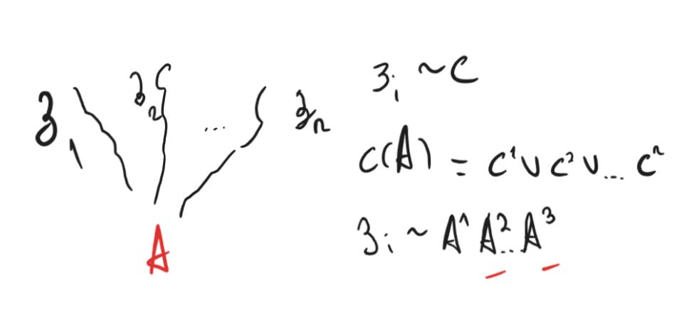

[Лекции, §2.1]

## 12. Распараллеливание циклических фрагментов программ (пространство итераций, ускорение, метод пирамид).

**Пространство итераций.** Для гнезда циклов $(*)$ по $i_1,\dots,i_k$ ($1\le i_g\le n_g$):
$$I=\{(i_1,i_2,\dots,i_k): 1\le i_g\le n_g,\ 1\le g\le k\}.$$
Каждый вектор $(i_1,\dots,i_k)\in I$ соответствует телу цикла $T$ (биекция). На $I$ вводят **отношение следования** (через развёртку $(\wedge)$ и транзитивное замыкание) и **отношение зависимости** [Лекции, §2.2].

**Цель** — найти **покрытие** $\{I_q\}_{q=1}^{Q}$: $I=\bigcup_q I_q$, $I_i\cap I_q=\varnothing$, такое, что в каждом подмножестве — только **независимые** векторы (их итерации можно выполнять одновременно). **Ускорение**:
$$S=\frac{\prod_{j=1}^{k} n_j}{Q}=\frac{I_{\text{посл}}}{I_{\text{паралл}}}\to\max.$$

**Условия применимости** [Лекции, §2.2]: параметры цикла не меняются в теле; нет переходов за пределы цикла; параметры цикла входят в тело только в линейных операциях.

**Метод пирамид** [Лекции, §2.2.1]:
- **Шаг 1.** Строится пространство итераций с отношениями следования и зависимости; выделяются **результирующие** векторы — не зависящие ни от какого другого.
- **Шаг 2.** Каждому результирующему вектору сопоставляется одна задача; к ней относят также все векторы, от которых он зависит.
- **Шаг 3.** Внутри задачи векторы упорядочивают по отношению следования.

Ключевое свойство: метод пирамид **не требует коммуникаций** (каждая задача самодостаточна); допускает нелинейное использование параметров цикла. Недостаток — дублирование вычислений; на практике задачи с близкими номерами объединяют.

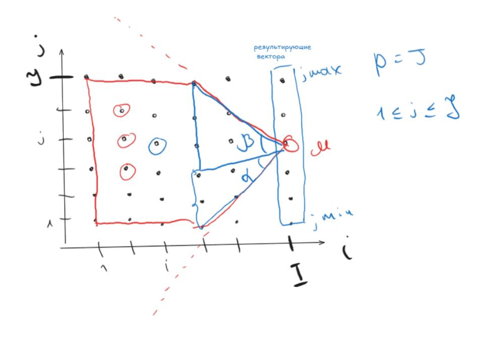

[Лекции, §2.2, §2.2.1]

## 13. Распараллеливание циклических фрагментов программ (пространство итераций, ускорение, метод параллелепипедов).

Пространство итераций, отношения следования/зависимости и ускорение $S=\prod n_j/Q$ — как в вопросе 12 [Лекции, §2.2]. В отличие от прочих методов, **метод параллелепипедов** позволяет работать и с простыми циклами.

**Метод параллелепипедов** [Лекции, §2.2.2]:
- **Шаг 1.** Строится пространство итераций с отношениями следования и зависимости.
- **Шаг 2.** Ищутся покрытия пространства наборами $k$-мерных **параллелепипедов**.
- **Шаг 3.** Выбирается параллелепипед **максимального объёма**, на его рёбрах строится новая система координат. Число задач равно числу векторов в нём: при сторонах $p_1,\dots,p_k$ — $p=\prod_{i=1}^{k} p_i$. Номер задачи — координата $(g_1,\dots,g_k)$ в новой системе. Если размерность параллелепипеда меньше размерности пространства, соответствующие $p_i$ полагают равными 1.
- **Шаг 4.** К каждой задаче относят не более одного вектора из каждого подмножества покрытия; внутри задачи векторы упорядочены по следованию:
$$\texttt{for } i_1=g_1\!:\!p_1\!:\!n_1\ \dots\ \texttt{for } i_k=g_k\!:\!p_k\!:\!n_k\ \ T(i_1,\dots,i_k).$$

Коммуникации между соседними задачами реализуются через `send`/`recv` (например, при зависимости $x(i,j)=f(x(i-2,j-1))$). Для примера $x(i)=f(x(i-4))$ получаются ускорения $S=2$ (вариант 1) и $S=10/3$ (вариант 2). Как и в методе пирамид, число задач обычно много больше числа устройств, поэтому задачи объединяют.

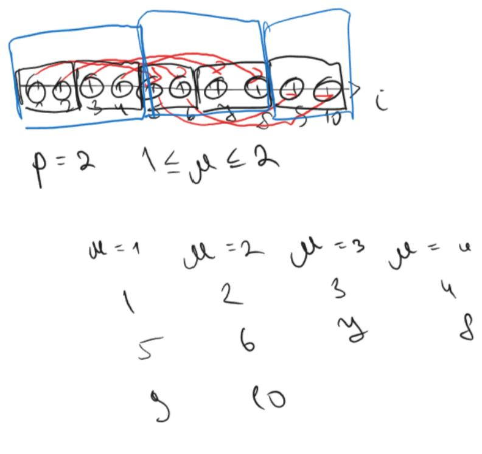

[Лекции, §2.2.2]

## 14. Распараллеливание циклических фрагментов программ (синтетический алгоритм, объединяющий метод параллелепипедов и пирамид).

> **В конспекте лекций тема не освещена.** Методы пирамид (§2.2.1) и параллелепипедов (§2.2.2) изложены по отдельности; синтетического алгоритма, объединяющего их, в лекциях нет.

---

# Раздел IV. Векторные алгоритмы

## 15. Основные операции с векторами и матрицами. Векторные алгоритмы умножения матриц.

**Основные векторные операции** (аппаратные) [Лекции, §3.1]:
1. сложение $z=x+y$;
2. умножение на скаляр $z=\alpha x$;
3. скалярное произведение $a=x^{T}y$;
4. покомпонентное произведение $z=x*y$;
5. **saxpy**: $z=\alpha x+y$ (scalar $\alpha x$ plus $y$).

**Операции с матрицами** [Лекции, §3.1]:
- **gaxpy**: $z=Ax+y$, $A\in R^{n\times m}$ (можно выразить через скалярное произведение или через saxpy: `for j=1:m  y=y+A(:,j)x(j)`);
- **модификация матрицы внешним произведением**: $A=A+xy^{T}$, $x\in R^{n\times 1},\ y\in R^{m\times 1}$.

**Векторные алгоритмы умножения матриц** $C=AB$. Тройной цикл «по определению» сворачивается в векторные операции — отсюда разные алгоритмы [Лекции, §3.1]:
- $\overline{ijk}$: свёртка цикла $k$ → **скалярное произведение** $c(i,j)=A(i,:)B(:,j)$; свёртка цикла $j$ → **строчное gaxpy/дахру** $c(i,:)=A(i,:)B$;
- $\underline{kij}$: свёртка цикла $j$ → **строчное saxpy** $c(i,:)=c(i,:)+A(i,k)B(k,:)$; свёртка цикла $i$ → **модификация матрицы** $c=c+A(:,k)B(k,:)$;
- **блочный алгоритм**: матрицы разбиваются на блоки $\alpha\times\alpha$ ($\alpha=n/N$), умножение ведётся по блокам (учёт иерархии памяти / блочности).

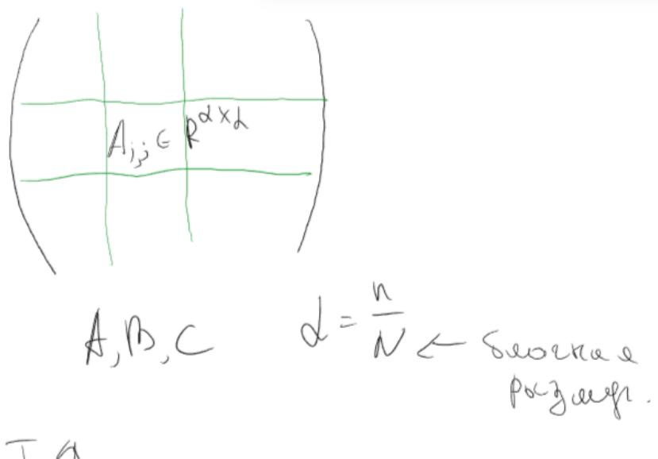

[Лекции, §3.1]

## 16. Векторные алгоритмы решения СЛАУ с матрицей треугольного вида.

Система $Lx=b$ с нижней треугольной $L$ решается прямой подстановкой [Лекции, §3.2.1]:
$$x_1=\frac{b_1}{l_{11}},\quad x_2=\frac{b_2-l_{21}x_1}{l_{22}},\quad\dots,\quad x_i=\frac{b_i-\sum_{j=1}^{i-1} l_{ij}x_j}{l_{ii}}.$$

**Строчный алгоритм (через скалярное произведение).** Сумма $\sum l_{ij}x_j$ — это скалярное произведение $L(i,1:i-1)\cdot b(1:i-1)$ (неизвестные пишутся поверх $b$):
```
for i = 2:n
    b(i) = ( b(i) - L(i,1:i-1)·b(1:i-1) ) / L(i,i)
endfor
```

**Столбцовый алгоритм (через saxpy).** Найдя $x_j$, сразу вычитаем его вклад из всех нижележащих уравнений:
```
for j = 1:n-1
    b(j)      = b(j) / L(j,j)
    b(j+1:n)  = b(j+1:n) - L(j+1:n,j)·b(j)      % saxpy
endfor
b(n) = b(n) / L(n,n)
```
Для **унитреугольной** $L$ ($l_{ii}=1$) деления опускаются. Блочный вариант: $LX=B$ с блоками $L_{i_b,j_b}\in R^{\alpha\times\alpha}$, $\alpha=n/N$ [Лекции, §3.2.1].

[Лекции, §3.2.1]

## 17. Векторные алгоритмы LU-разложения через модификацию матрицы внешним произведением.

В основе — **матрица преобразования Гаусса**, обнуляющая поддиагональ $k$-го столбца [Лекции, §3.2.2]:
$$M_k=I-\tau^{(k)} l_k^{T},\qquad \tau_i^{(k)}=\begin{cases}0,& i\le k\\[2pt] \dfrac{a_{ik}}{a_{kk}},& i\gt k\end{cases}$$
где $l_k$ — $k$-й единичный орт. Тогда $M_kA=A-\tau^{(k)}A(k,:)$, и последовательное применение даёт верхнюю треугольную $U$:
$$M_{n-1}\dots M_2 M_1 A = U.$$
Поскольку $M_k^{-1}=I+\tau^{(k)}l_k^{T}$, нижняя треугольная
$$L=\prod_{k=1}^{n-1} M_k^{-1}=I+\sum_{k=1}^{n-1}\tau^{(k)} l_k^{T},\qquad A=LU.$$

**Алгоритм** (с замещением $A$ множителями $L$ и элементами $U$) [Лекции, §3.2.2]:
```
for k = 1:n-1
    A(k+1:n,k)     = A(k+1:n,k) / A(k,k)                          % столбец L (τ)
    A(k+1:n,k+1:n) = A(k+1:n,k+1:n) - A(k+1:n,k)·A(k,k+1:n)       % модификация
endfor                                                            % внешним произведением
```
Варианты по способу свёртки/доступу к памяти: **kji** (столбцовый saxpy), **kij** (строчный saxpy) — оба реализуют модификацию матрицы внешним произведением.

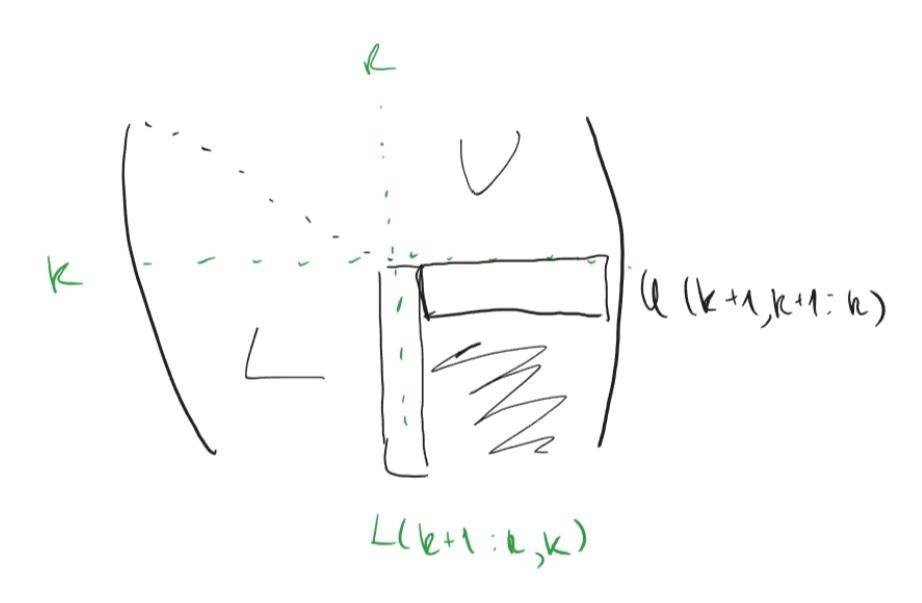

[Лекции, §3.2.2]

## 18. Векторные алгоритмы LU-разложения через gaxpy.

Идея «отложенных модификаций»: на $j$-м шаге уже известны первые $j-1$ столбцов $L$ и $U$; находим $j$-й столбец из $A(:,j)=LU(:,j)$ [Лекции, §3.2.3].

**Часть 1 — верхняя часть столбца (нахождение $U(1:j-1,j)$).** Из $A(1:j-1,j)=L(1:j-1,1:j-1)\,U(1:j-1,j)$ — это треугольная СЛАУ $Lx=b$ с $b=A(1:j-1,j)$, $x=U(1:j-1,j)$ (решается алгоритмом из вопроса 16).

**Часть 2 — нижняя часть столбца (нахождение $L(j:n,j)$).** Из
$$A(j:n,j)=L(j:n,1:j-1)\,U(1:j-1,j)+L(j:n,j)\,U(j,j)$$
вычисляем **gaxpy**
$$V(j:n)=A(j:n,j)-L(j:n,1:j-1)\,U(1:j-1,j),$$
затем $U(j,j)=V(j)$ и $L(j:n,j)=V(j:n)/U(j,j)$.

Главное вычислительное ядро — операция **gaxpy** (отсюда название). При выборе между реализацией через модификацию матрицы и через дахру предпочитают **дахру**: оно даёт вдвое меньший объём коммуникаций между кэш-памятью и регистрами [Лекции, §3.2.3].

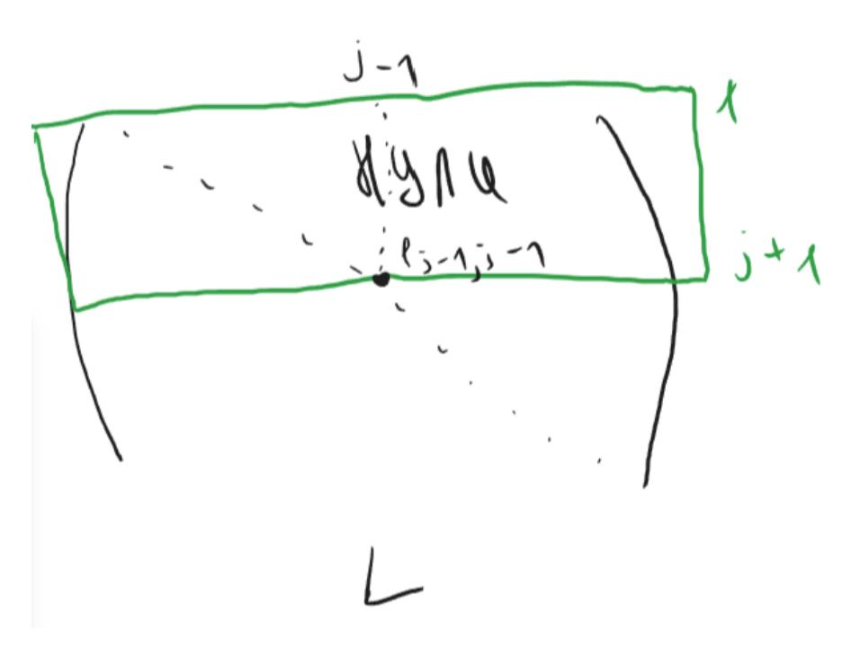

[Лекции, §3.2.3]

## 19. Векторные алгоритмы разложения Холецкого через модификацию матрицы внешним произведением.

Для симметричной положительно определённой $A$ ищется $A=G\,G^{T}$ ($G$ — нижняя треугольная). Рекуррентный вывод через блок $1{\times}1$ [Лекции, §3.3.1]:
$$A=\begin{pmatrix}\alpha & v^{T}\\ v & B\end{pmatrix},\quad \alpha=a_{11},\ \beta=\sqrt{\alpha},\ v=A(2{:}n,1),$$
$$A=\begin{pmatrix}\beta & 0\\ \tfrac{v}{\beta} & I\end{pmatrix}\begin{pmatrix}1 & 0\\ 0 & B-\tfrac{v v^{T}}{\alpha}\end{pmatrix}\begin{pmatrix}\beta & \tfrac{v^{T}}{\beta}\\ 0 & I\end{pmatrix}.$$
Здесь $B-\dfrac{v v^{T}}{\alpha}$ — **модификация матрицы внешним произведением**; для неё рекурсивно ищется $G_1 G_1^{T}$, и
$$G=\begin{pmatrix}\beta & 0\\ \tfrac{v}{\beta} & G_1\end{pmatrix}.$$

**Алгоритм (матричный вид)** [Лекции, §3.3.1]:
```
for k = 1:n
    A(k:n,k)       = A(k:n,k) / sqrt(A(k,k))
    A(k+1:n,k+1:n) = A(k+1:n,k+1:n) - A(k+1:n,k)·A(k+1:n,k)^T   % модификация
endfor                                                          % внешним произведением
```
Варианты: **kji** (столбцовый saxpy), **kij** (строчный saxpy). По сравнению с LU экономит ~вдвое за счёт симметрии.

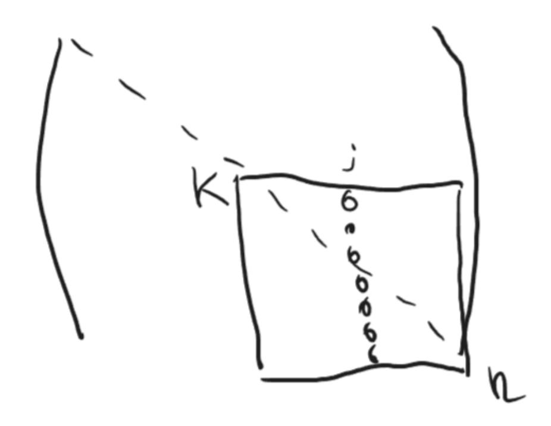

[Лекции, §3.3.1]

## 20. Векторные алгоритмы разложения Холецкого через gaxpy.

«Отложенный» (gaxpy-) вариант: на $j$-м шаге, зная первые $j-1$ столбцов $G$, находим $j$-й из $A(:,j)=G\,G^{T}(:,j)$ [Лекции, §3.3.2]. Для нижней части столбца:
$$A(j{:}n,j)=G(j{:}n,1{:}j-1)\,G^{T}(1{:}j-1,j)+G(j{:}n,j)\,G(j,j),$$
откуда **gaxpy**
$$V(j{:}n)=A(j{:}n,j)-G(j{:}n,1{:}j-1)\,G^{T}(1{:}j-1,j),$$
затем диагональ и столбец:
$$G(j,j)=\sqrt{V(j)},\qquad G(j+1{:}n,j)=\frac{V(j+1{:}n)}{G(j,j)}.$$

**Алгоритм** (с замещением, ядро — gaxpy) [Лекции, §3.3.2]:
```
for j = 1:n
    A(j:n,j) = A(j:n,j) - A(j:n,1:j-1)·[A(j,1:j-1)]^T     % gaxpy → V(j:n)
    A(j:n,j) = A(j:n,j) / sqrt(A(j,j))
endfor
```
Операцию gaxpy можно далее свернуть: через **скалярное произведение** (алгоритм **jik**) или через **столбцовое saxpy** (алгоритм **jki**) [Лекции, §3.3.2].

[Лекции, §3.3.2]

---

# Раздел V. Параллельные алгоритмы

> **Весь раздел (вопросы 21–35) в конспекте лекций не освещён.** Лекции завершаются Главой 3 (векторные алгоритмы) и не доходят до главы о параллельных алгоритмах матричных вычислений на процессорном кольце/торе/решётке. Топологии «кольцо», «решётка», «тор», «дерево» упоминаются только как **сетевые конфигурации** в классификации Хокни (§1.1), без построения соответствующих параллельных алгоритмов.

## 21. Рассылка данных по бинарному дереву.
> **В конспекте лекций тема не освещена** (бинарное дерево упомянуто лишь как топология сети, §1.1).

## 22. Параллельная реализация рекуррентных выражений.
> **В конспекте лекций тема не освещена.**

## 23. Систолический алгоритм gaxpy на процессорном кольце с декомпозицией матрицы на блочные строки.
> **В конспекте лекций тема не освещена.**

## 24. Систолический алгоритм gaxpy на процессорном кольце с декомпозицией матрицы на блочные столбцы.
> **В конспекте лекций тема не освещена.**

## 25. Столбцово-ориентированные алгоритмы умножения матриц на кольце.
> **В конспекте лекций тема не освещена.**

## 26. Строчно-ориентированные алгоритмы умножения матриц на кольце.
> **В конспекте лекций тема не освещена.**

## 27. Систолический алгоритм умножения матриц на торе.
> **В конспекте лекций тема не освещена.**

## 28. Параллельный алгоритм разложения Холецкого на кольце.
> **В конспекте лекций тема не освещена.**

## 29. Параллельный алгоритм LU-разложения на кольце.
> **В конспекте лекций тема не освещена.**

## 30. Параллельный алгоритм разложения Холецкого на решетке.
> **В конспекте лекций тема не освещена.**

## 31. Параллельный алгоритм LU-разложения на решетке.
> **В конспекте лекций тема не освещена.**

## 32. Параллельный алгоритм метода прогонки.
> **В конспекте лекций тема не освещена.**

## 33. Параллельный алгоритм метода циклической редукции.
> **В конспекте лекций тема не освещена.**

## 34. Параллельный алгоритм решения СЛАУ с матрицей треугольного вида.
> **В конспекте лекций тема не освещена.** (В лекциях есть только *векторный*, непараллельный алгоритм для треугольных СЛАУ — см. вопрос 16.)

## 35. Параллельный алгоритм декомпозиции области.
> **В конспекте лекций тема не освещена.**

---

# Раздел VI. Характеристики параллельных алгоритмов

> **Весь раздел (вопросы 36–38) в конспекте лекций не освещён.** Ускорение упоминается только как $S=\prod n_j/Q$ в контексте распараллеливания циклов (§2.2, см. вопросы 12–13); закон Амдала, эффективность, масштабируемость, коэффициент сетевой деградации и правила постановки экспериментов в лекциях отсутствуют.

## 36. Ускорение, эффективность, масштабируемость, закон Амдала.
> **В конспекте лекций тема не освещена** (кроме определения ускорения $S=I_{\text{посл}}/I_{\text{паралл}}$ для циклов, §2.2).

## 37. Ускорение, эффективность, масштабируемость, учёт коммуникаций при оценке эффективности, коэффициент сетевой деградации.
> **В конспекте лекций тема не освещена.**

## 38. Правила постановки вычислительных экспериментов и анализа их результатов.
> **В конспекте лекций тема не освещена.**
